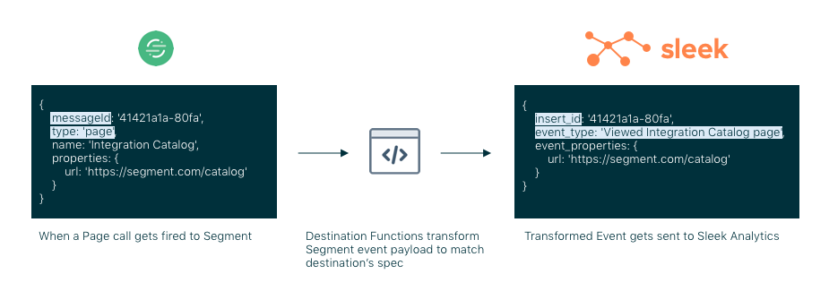
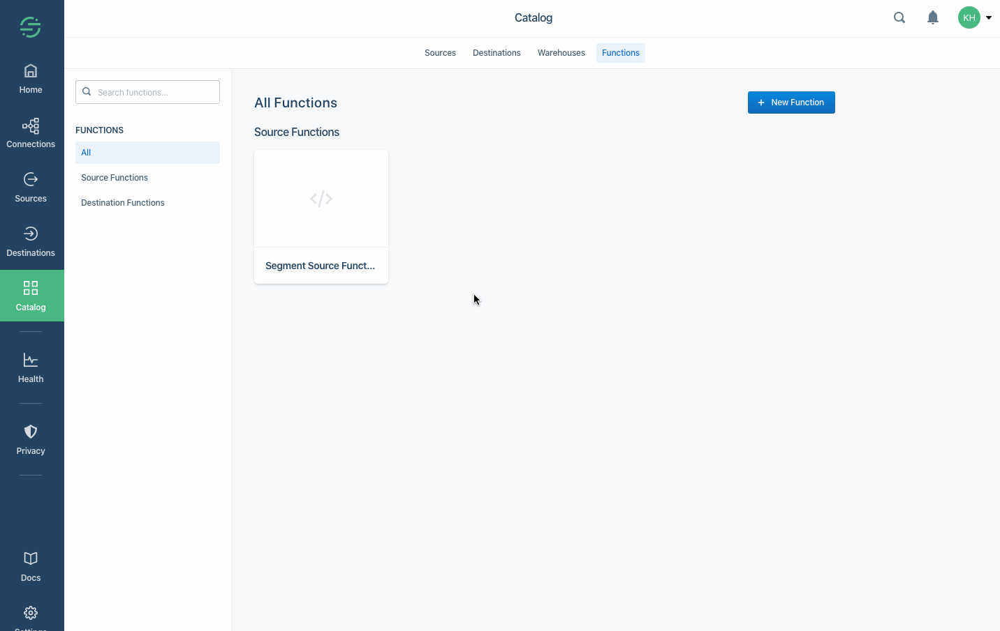

> note ""
> **NOTE:** Functions are currently in developer preview. If you are interested in joining the developer preview, navigate to the Build page in your catalog [here](https://app.segment.com/goto-my-workspace/build/catalog). The use is governed by [(1) Segment First Access](https://segment.com/docs/legal/first-access-beta-preview/) and Beta Terms and Conditions and [(2) Segment Acceptable Use Policy](https://segment.com/docs/legal/acceptable-use-policy/).

Destination Functions allow you to transform and annotate your Segment events and send them to any external tool or API with a few lines of JavaScript. You can even send Segment events to your internal APIs for further handling.

Here are some examples of Destination Functions are being used by early adopters:

- **Microsoft Teams** : trigger notifications/messages on a Teams workspace on important events like `Signed Up` or `Order Placed`.
- **ChargeBee** : sync subscription information by sending events like `Subscription Started`, `Subscription Updated`, `Subscription Removed` etc.
- **Typeform Surveys** : trigger a user dissatisfaction survey on Typeform when a user uninstalls your app, for example when an `App Uninstalled` event is fired.

The illustration below explains how you might use a Destination Function:


_When a page call is sent to Segment, Destination Functions transform the Segment event payload to match the destination's spec. The transformed Event is sent to the destination tool._

## Getting Started

### Creating your Destination Function

To create a Destination Function:
1. In your Segment Workspace, go to the Catalog, and click the [Functions tab](https://app.segment.com/goto-my-workspace/functions/catalog).
2. Click **New Function**.
3. Select **Destination Function** and click **Build**.

### Writing your function

When you click **Build** button, a code editor opens so you can configure your destination logic. Segment provides templates that make it simple to send data to a JSON API or other common use cases.

Start by replacing the generic endpoint provided with the API endpoint (URL) for your tool or internal service.


For each event sent to your Destination Function, Segment invokes your function based on the event type. (Unless prevented by [Destination Filters](https://segment.com/docs/connections/destinations/destination-filters/)).

You can define and export functions for each type in the [Segment Spec](https://segment.com/docs/connections/spec/) that you want to handle:

- `onIdentify`
- `onTrack`
- `onPage`
- `onScreen`
- `onGroup`
- `onAlias`
- `onDelete`

Two arguments are provided to the function: the `event payload` and the `settings`. All Destination Functions have an `apiKey` setting by default.

- The **Event** argument to the function is the [Segment Event Data](https://segment.com/docs/connections/spec/common/#structure) payload.
   > **Note** Only Event Sources are supported at this time. Object Source data is not supported.
- The `Settings` argument to the function contains user settings like `apiKey` and any custom settings and secrets that you add (coming soon!).

The Functions are ["async/await" style JavaScript](https://javascript.info/async-await), and use the [Fetch API](https://developer.mozilla.org/en-US/docs/Web/API/Fetch_API/Using_Fetch) in the pre-loaded `fetch` package for external requests. This ensures seamless integration with the Event Delivery tab in the Segment dashboard for your Destination.

Here's a basic example of a function that POSTs the event to a "request bin" for introspection. You can go to [RequestBin](https://requestbin.com/) to create your own `endpoint` to experiment with.

The JavaScript below builds a query string for the URL, sets a basic authentication header, and sends a JSON body:

```js
const endpoint = "https://REDACTED.x.example.com"

async function onTrack(event, settings) {
  const url = new URL(endpoint);
  url.searchParams.set("ts", event.timestamp);

  const res = await fetch(url.toString(), {
    body: JSON.stringify(event),
    headers: new Headers({
      "Authentication": 'Basic ' + btoa(`${settings.apiKey}:`),
      "Content-Type": "application/json",
    }),
    method: "post",
  })

  return await res.text() // or res.json() for JSON APIs
}
```

The function returns data to indicate a success. In the example above we simply return the request body.

You can also `throw` an error to indicate a failure. In the above example, try changing the endpoint to `https://foo` and you'll see it throws a `FetchError` with the message `request to https://foo/ failed, reason: getaddrinfo ENOTFOUND foo foo:443`

There are three pre-defined error types that you can `throw` to indicate that the function ran as expected, but data could not be delivered:

- `EventNotSupported`
- `InvalidEventPayload`
- `ValidationError`

Here are basic examples using these error types:

```js
async function onGroup(event, settings) {
  if (!event.company) {
    throw new InvalidEventPayload("company is required")
  }
}

async function onPage(event, settings) {
  if (!settings.accountId) {
    throw new ValidationError("Account ID is required")
  }
}

async function onAlias(event, settings) {
  throw new EventNotSupported("alias is not supported")
}
```

If you do not supply a function for an event type, Segment throws an implicit `EventNotSupported` error.


### Runtime and Dependencies

Destinations Functions are run using Node.js 10.x. The following dependencies are pre-installed in the function environment:

#### lodash

A modern JavaScript utility library delivering modularity, performance & extras. [See the lodash docs](https://lodash.com/docs/4.17.11).

#### AWS

The official Amazon Web Services SDK. [See the AWS docs](https://docs.aws.amazon.com/AWSJavaScriptSDK/latest/).

#### Crypto

The crypto module provides cryptographic functionality that includes a set of wrappers for OpenSSL's hash, HMAC, cipher, decipher, sign, and verify Functions. [See Crypto docs](https://nodejs.org/dist/latest-v10.x/docs/api/crypto.html).

#### Fetch API

The Fetch API provides a JavaScript interface for accessing and manipulating parts of the HTTP pipeline, such as requests and responses. It also provides a global `fetch()` method that provides an easy, logical way to fetch resources asynchronously across the network. [See the Fetch API docs](https://developer.mozilla.org/en-US/docs/Web/API/Fetch_API/Using_Fetch).

##### `fetch()`

The `fetch()` method starts the process of fetching a resource from the network, returning a promise which is fulfilled once the response is available. [See docs](https://developer.mozilla.org/en-US/docs/Web/API/WindowOrWorkerGlobalScope/fetch).

##### `Request`

The [`Request` interface](https://developer.mozilla.org/en-US/docs/Web/API/Request) of the Fetch API represents a resource request.

##### `Response`

The [`Response` interface](https://developer.mozilla.org/en-US/docs/Web/API/Response) of the Fetch API represents the response to a request.

##### `Headers`

The [`Headers` interface](https://developer.mozilla.org/en-US/docs/Web/API/Headers) of the Fetch API allows you to perform various actions on HTTP request and response headers. These actions include retrieving, setting, adding to, and removing. A Headers object has an associated header list, which is initially empty and consists of zero or more name and value pairs.

##### `URL`

The [`URL` interface](https://developer.mozilla.org/en-US/docs/Web/API/URL) is used to parse, construct, normalize, and encode URLs. It works by providing properties which allow you to easily read and modify the components of a URL.

##### `URLSearchParams`

The [`URLSearchParams` interface](https://developer.mozilla.org/en-US/docs/Web/API/URLSearchParams) defines utility methods to work with the query string of a URL.

##### `atob()`

The [`atob()` function](https://developer.mozilla.org/en-US/docs/Web/API/WindowOrWorkerGlobalScope/atob) decodes a string of data which has been encoded using base-64 encoding.

##### `btoa()`

The [`btoa()` method](https://developer.mozilla.org/en-US/docs/Web/API/WindowOrWorkerGlobalScope/btoa) creates a base-64 encoded ASCII string from a binary string.

### ️Settings and Secrets

Settings allow you to pass different variables to your function so that you can use it across multiple sources which might have different configurations.

For example, if we include an `settingKey` settings string, you can access this from your code using dot notation on the `settings` object as follows:

```js
async function onRequest(request, settings) {
  let settingValue = settings.settingKey;
}
```

You can include multiple setting types including strings, booleans, string arrays and string objects to support your use case. You can also mark a particular setting as being required and/or sensitive (encrypted), if needed.

Common use cases for using multiple settings include:

- **Configuration and dynamic mappings for user-configurable flow control in your Destination Function**. Create a Destination Function once and allow your users to configure instances of that function multiple times with custom settings.
- **Additional secrets**. This is for use cases like client credentials authentication models, or for when calling multiple external APIs, for example in enrichment workflows or when looking up stored user traits and identifiers by any `externalId` from Segment's Personas [Profile API](/docs/personas/profile-api).

## Testing

You can test your code directly from the Functions editor by entering a test event and clicking **Run** to make sure the function works as expected.

In the debugger panel, check the two outputs. The **Error Message** and the **Logs**.

- **Error Message** - This shows the error surfaced from your function.
- **Logs** - The raw log. Any messages to `console.log()` from the function appear here.

## Creation & Deployment

Once you've finished writing your Destination Function, click **Configure** to save and use the function. On the screen that appears, give the function a name, and optionally add useful details (these are displayed in your workspace). Click **Create Function** to finish and make your Destination Function available in your workspace.

If you're editing an existing function, you can **Save** changes without changing the behavior of your deployed function. Alternatively, you can also choose to **Save & Deploy** to push changes to an existing function.


## Logs and Errors

Your function may encounter errors that you missed during manual testing or you may intentionally throw your own errors in your code if, for example, the incoming event is missing required fields. If your function throws an error, execution is halted immediately and Segment captures the event, any outgoing requests/responses, any console logs you may have printed, as well as the error itself. Segment then displays the captured error information in the "Event Delivery" tab of your Destination in the Segment dashboard as a "Bad Request". You can use this tab to find and fix unexpected errors.

<!-- TODO ADD SCREENSHOT -->

You can throw [an Error or custom Error](https://developer.mozilla.org/en-US/docs/Web/JavaScript/Reference/Global_Objects/Error) and you can also add additional helpful context in logs using the [`console` API](https://developer.mozilla.org/en-US/docs/Web/API/console). For example:

```js
async function onTrack(event, settings) {
  const userId = event.userId

  console.log("userId:", userId)

  if (typeof userId != 'string' || userId.length < 8) {
    throw new Error("input user ID is invalid")
  }

  console.log("valid userId:", userId)

  // ...
}
```

> warning ""
> **Warning:** Do not log sensitive data, such as personally-identifying information (PII), authentication tokens, or other secrets. You should especially avoid logging entire request/response payloads. The "Function Logs" tab may be visible to other workspace members if they have the necessary permissions.

## Management

### Permissions

The permissions required to create and manage a Destination Function are separate from those required to enable it on a source.

Currently, you must be a **Workspace Owner** to create, edit or delete a function.

Once you create a Destination Function, you can connect it to any source in your workspace. You need to be a `Workspace Owner` or `Source Admin`.

### Editing & Deleting

If you are a **Workspace Owner**, you can manage your Destination Function from the [Functions tab](https://app.segment.com/goto-my-workspace/functions/catalog). Click the function to change, and the panel that appears allows you to connect, edit or delete your function.




### Monitoring your Destination Function.

You can use [Destination Event Delivery](https://segment.com/docs/guides/destinations/how-do-i-check-if-data-is-successfully-being-delivered-to-my-destination/) to understand if Segment encounters any issues delivering your source data to destinations. Errors that the Function throws appear here.

### Controlling what gets passed to your Destination Function.

You can use [Destination Filters](https://segment.com/docs/connections/destinations/destination-filters/) or Privacy Controls to manage what events and, of those events, which event properties are sent to your Destination Function.

## FAQs

**Does Segment retry events?**

Segment retries nine times over the course of four hours. This increases the number of attempts for messages, so we try to re-deliver them another 4 times after some backoff. Segment doesn't retry if your function returns a permanent error.

**Are the events guaranteed to send in order?**

No. Segment cannot guarantee the order in which the events are delivered to an endpoint.

**Can I create a device-mode Destination?**

Functions enable you to write and deploy Cloud-mode Destinations. We're in the early phases of exploration and discovery for supporting customer "web plugins" for custom device-mode destinations and other use cases, but this is unsupported today.

**How do I publish a destination to the Segment catalog instead of my own workspace?**

If you are a Partner, looking to publish your destination and distribute your App through Segment Catalog, visit the [Developer Center](https://segment.com/partners/developer-center/) and check out our [partner docs](/docs/partners).
