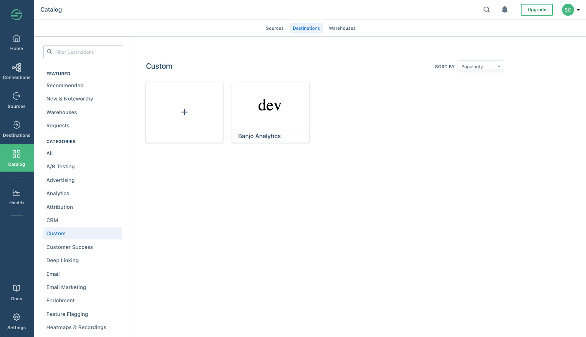

Functions are currently in developer preview. If you are interested in joining the developer preview, navigate to the Build page in your catalog [here](https://app.segment.com/goto-my-workspace/build/catalog). The use is governed by [(1) Segment First Access](https://segment.com/docs/legal/first-access-beta-preview/) and Beta Terms and Conditions and [(2) Segment Acceptable Use Policy](https://segment.com/docs/legal/acceptable-use-policy/).

Segment Custom Functions allows you to build and deploy Destination Functions on your workspace. By writing just a few lines of (serverless) code, you can transform your Segment events and send them to other APIs. Functions allow you to send your data into tools outside the Segment catalog, or to your own internal services.

Here are some examples of how early adopters are building Destination Functions:

- **Microsoft Teams Destination** : trigger notifications/messages on a Teams workspace on important events like `Signed Up` or `Order Placed`.
- **ChargeBee Integration** : sync subscription information by sending events like `Subscription Started`, `Subscription Updated`, `Subscription Removed` etc.
- **Typeform Surveys** : trigger a user dissatisfaction survey on Typeform when a user uninstalls your app, for example when an `App Uninstalled` event is fired.

The illustration below explains how Functions can be used to build Destination Functions.


## Requesting Access

To request access to Functions, navigate to the Build page of the catalog [here](https://app.segment.com/goto-my-workspace/build/catalog).


## Creating your Destination Function

To create a Destination Function:
1. [Go to the Segment Catalog](https://app.segment.com/goto-my-workspace/destinations/catalog) in the Segment App.
2. Click the **Custom** category.
3. Click the `+` button to create a Destination Function.
4. Give the new destination a name, and click **Create**.


## Writing your Function

The Code Editor page appears after you click **Create**. Here, you can take full control of your destination logic. Start by replacing the generic endpoint provided with the API Endpoint for your tool or internal service.

Segment provides templates that make it simple to send data to the API Endpoint. You can delete the example code and implement your own Functions.


Segment invokes your function once for every event it receives from configured sources (unless altered by [Destination Filters](https://segment.com/docs/connections/destinations/destination-filters/)). For each event, it invokes a handler corresponding to the Segment message type. You can define and export functions for every type in the [Segment Spec](https://segment.com/docs/connections/spec/) that you want to handle:

- `onIdentify`
- `onTrack`
- `onPage`
- `onScreen`
- `onGroup`
- `onAlias`
- `onDelete`

Two arguments are provided to the function: the **event payload** and the **settings**. All subscriptions have an **apiKey** setting by default.

- The **Event** argument to the function is the [Segment Event Data](https://segment.com/docs/connections/spec/common/#structure).
   > **Note** Only Event Sources are supported at this time. Object Source data is not supported.
- The **Settings** argument to the function contains user settings like **apiKey** and any custom settings and secrets that you added (coming soon!).

The Functions are ["async/await" style JavaScript](https://javascript.info/async-await), and should use the [Fetch API](https://developer.mozilla.org/en-US/docs/Web/API/Fetch_API/Using_Fetch) in the pre-loaded `fetch` package for any network requests. This ensures seamless integration with Event Delivery.

Here's a basic example of a function that POSTs the event to a "request bin" for introspection. You can go to [RequestBin](https://requestbin.com/) to create your own `endpoint` to experiment with.

The JavaScript below builds a query string for the URL, sets a basic auth header, and sends a JSON body.

```js
const endpoint = "https://REDACTED.x.pipedream.net"

async function onTrack(event, settings) {
  const url = new URL(endpoint);
  url.searchParams.set("ts", event.timestamp);

  const res = await fetch(url.toString(), {
    body: JSON.stringify(event),
    headers: new Headers({
      "Authentication": 'Basic ' + btoa(`${settings.apiKey}:`),
      "Content-Type": "application/json",
    }),
    method: "post",
  })

  return await res.text() // or res.json() for JSON APIs
}
```

The function should return data to indicate a success. In the example above we simply return the request body.

You can also `throw` an error to indicate a failure. In the above example, try changing the endpoint to `https://foo` and you'll see it throws a `FetchError` with the message `request to https://foo/ failed, reason: getaddrinfo ENOTFOUND foo foo:443`

There are three pre-defined error types that you can `throw` to indicate that the function ran as expected, but data could not be delivered:

- `EventNotSupported`
- `InvalidEventPayload`
- `ValidationError`

Here are basic examples using these error types:

```js
async function onGroup(event, settings) {
  if (!event.company) {
    throw new InvalidEventPayload("company is required")
  }
}

async function onPage(event, settings) {
  if (!settings.accountId) {
    throw new ValidationError("Account ID is required")
  }
}

async function onAlias(event, settings) {
  throw new EventNotSupported("alias is not supported")
}
```

If you do not supply a function for an event type, Segment throws an implicit `EventNotSupported` error.


## Built-in Dependencies

### lodash

A modern JavaScript utility library delivering modularity, performance & extras. [See the lodash docs](https://lodash.com/docs/4.17.11).

### AWS

The official Amazon Web Services SDK. [See the AWS docs](https://docs.aws.amazon.com/AWSJavaScriptSDK/latest/).

### Crypto

The crypto module provides cryptographic functionality that includes a set of wrappers for OpenSSL's hash, HMAC, cipher, decipher, sign, and verify Functions. [See Crypto docs](https://nodejs.org/dist/latest-v10.x/docs/api/crypto.html).

### Fetch API

The Fetch API provides a JavaScript interface for accessing and manipulating parts of the HTTP pipeline, such as requests and responses. It also provides a global `fetch()` method that provides an easy, logical way to fetch resources asynchronously across the network. [See the Fetch API docs](https://developer.mozilla.org/en-US/docs/Web/API/Fetch_API/Using_Fetch).

#### `fetch()`

The `fetch()` method starts the process of fetching a resource from the network, returning a promise which is fulfilled once the response is available. [See docs](https://developer.mozilla.org/en-US/docs/Web/API/WindowOrWorkerGlobalScope/fetch).

#### `Request`

The [`Request` interface](https://developer.mozilla.org/en-US/docs/Web/API/Request) of the Fetch API represents a resource request.

#### `Response`

The [`Response` interface](https://developer.mozilla.org/en-US/docs/Web/API/Response) of the Fetch API represents the response to a request.

#### `Headers`

The [`Headers` interface](https://developer.mozilla.org/en-US/docs/Web/API/Headers) of the Fetch API allows you to perform various actions on HTTP request and response headers. These actions include retrieving, setting, adding to, and removing. A Headers object has an associated header list, which is initially empty and consists of zero or more name and value pairs.

#### `URL`

The [`URL` interface](https://developer.mozilla.org/en-US/docs/Web/API/URL) is used to parse, construct, normalize, and encode URLs. It works by providing properties which allow you to easily read and modify the components of a URL.

#### `URLSearchParams`

The [`URLSearchParams` interface](https://developer.mozilla.org/en-US/docs/Web/API/URLSearchParams) defines utility methods to work with the query string of a URL.

#### `atob()`

The [`atob()` function](https://developer.mozilla.org/en-US/docs/Web/API/WindowOrWorkerGlobalScope/atob) decodes a string of data which has been encoded using base-64 encoding.

#### `btoa()`

The [`btoa()` method](https://developer.mozilla.org/en-US/docs/Web/API/WindowOrWorkerGlobalScope/btoa) creates a base-64 encoded ASCII string from a binary string.

## ️Settings and Secrets

Settings allow you to parameterize the function so that you can use it across multiple sources which may have different configurations.

Today, you're allocated a single secret setting when you create a function: `apiKey`. You can access this at `settings.apiKey`. You should **always** use this field for storing the destination API Key instead of putting the key in your function code.

**🚧 Coming Soon:** In the future, we plan to support multiple settings and additional settings types so you can further parameterize your function:

- Configuration and dynamic mappings for user-configurable flow control in your function. This will allow developers to empower business stakeholders to configure their Destination Functions on a per-source basis.

- Additional secrets. This is for use cases like client credentials authentication models, or for when calling multiple external APIs, for example in enrichment workflows or when looking up stored user traits and identifiers by any `externalId` from Segment's Personas [Profile API](/docs/personas/profile-api).

**⚠️ Note:** Until we provide a settings builder experience, do not store any secrets in source code for third party APIs.

## ️Logging

Segment captures and displays logs emitted by the `console.log()` method. You can use this for debugging, and to get an understanding of flow control during the function's execution.

**⚠️ Note:** Do _not_ log sensitive data, such as personally-identifying information (PII), authentication tokens, HTTP headers, and similar data. Segment stores these logs, and they may be available to workspace members in the Segment dashboard. Be especially careful about logging PII and Secrets.

**Golden Rule: never leave log statements that print entire events or settings payloads.**

## Testing your Destination Function

Test your code directly from the Functions editor. Use the `Send Test Event` button and review the test event to make sure the function works as expected.

In the debugger panel, check the two outputs. The **Callback Return** and the **Log Output**.


- **Callback Return** - This shows what data the function returned, or the error it threw.
- **Log Output** - The raw log. Any messages to `console.log()` from the function appear here.


## Saving and enabling your Destination Function

Once you have tested your Function, you can click `Save`. You can then click the tile to edit or configure the destination by connecting a source.



When you enable the destination, you get all of Segment's destinations infrastructure and features: reliable retries, transparency and visibility into delivery metrics, and the ability to filter and control what data is passed to the Function destination.

### Monitoring your Destination Function.

You can use [Destination Event Delivery](https://segment.com/docs/guides/destinations/how-do-i-check-if-data-is-successfully-being-delivered-to-my-destination/) to understand if Segment encounters any issues delivering your source data to destinations. Errors that the Function throws appear here.

### Controlling what gets passed to your Destination Function.

You can use [Destination Filters](https://segment.com/docs/connections/destinations/destination-filters/) or Privacy Controls to manage what events and, of those events, which event properties are sent to your Destination Function.

## Delivery Guarantees
Segment provides excellent data deliverability by employing API layer scalability and durability, data backup and replay, partner API monitoring, and library and cloud-mode destination retries. Segment's API processes 170B+ billion calls per month across over a billion of monthly tracked users, is rate performant (avg. load 100,000 msg/sec), fully automated and scalable, and can tolerate massive data spikes.

Segment monitors hundreds of partner APIs for 500s, success rate, and end-to-end latency to help our customers proactively achieve the best data deliverability possible.

You can subscribe to updates [here](https://status.segment.com/).

#### Does Segment retry data?
Segment retries nine times over the course of four hours. This increase the number of attempts for messages, so we'll try and re-deliver them another 4 times after some backoff.

We don't retry where there are signs of an expired API key or failed payment. However, if we push bad code that results in a malformed payload and a 400 or 422 response from an endpoint, we also won't retry given that the call would not ever succeed.

#### Are the events guaranteed to send in order?

No. Segment cannot guarantee the order in which the events are delivered to an endpoint.

## Permissions

The permissions required to create a Destination Function are separate from those required to enable it on a source.

#### Creating a Destination Function

Any `Workspace Member` can create or edit Destination Functions. However you need separate permissions to enable a Destination Function (meaning to get data flowing to the destination).

#### Enabling a Destination Function on a source

You need to be a `Workspace Owner` OR `Source Admin` in order to connect any destination (including Destination Functions) to a source.

## Destination Functions FAQs

**Can I create a Device-mode Destination?**

Functions enable you to write and deploy Cloud-mode Destinations. We're in the early phases of exploration and discovery for supporting customer "web plugins" for custom device-mode destinations and other use cases, but this is unsupported today.

**How do I publish a destination to the Segment catalog instead of my own workspace?**

If you are a Partner, looking to publish your destination and distribute your App through Segment Catalog, visit the [Developer Center](https://segment.com/partners/developer-center/) and check out our [partner docs](/docs/partners).

**How many destination functions can I create in a workspace?**

You can create up to 10 destination functions on your workspace. If you'd like to increase this limit, please reach out to us at beta@segment.com

**How do I see and configure Destination Functions created by other members on my workspace?**

This feature is coming soon. You can not yet view Destination Functions created by other members of your workspace. However, you can configure any Destination Function created by members of your workspace via the Destination Functions overview page by sharing the direct URL.


