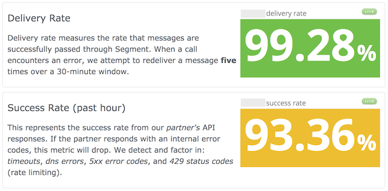

If you just want to explore the Segment destinations, check out the [Destinations catalog](/docs/connections/destinations/catalog/).

Select an item from the catalog to learn more about it. The documentation for each destination explains how the Segment Tracking API methods are implemented for that destination.

## Sources vs Destinations

Segment has [Sources](/docs/connections/sources/) and [Destinations](/docs/connections/destinations/). Sources send data _into_ Segment, while Destinations receive data _from_ Segment.

## Types of Sources

Segment has five types of sources: Web (Analytics.js), Mobile, Server, and Cloud App, plus a fifth type: User-created [Source Functions](/docs/connections/sources/source-functions/). Web, Mobile, and Server sources send first-party data from your digital properties. Cloud-app sources send data about your users from your connected web apps, for example a ticketing system such as [Zendesk](/docs/connections/sources/catalog/cloud-apps/zendesk/), a payments system such as [Stripe](/docs/connections/sources/catalog/cloud-apps/stripe/), or a marketing tool like [Braze](/docs/connections/sources/catalog/cloud-apps/braze/).

## Method Compatibility

Not all destinations can accept data from specific method types. Wondering which ones are which? Check out the [Destinations Methods matrix](/docs/connections/destinations/methods-compare/).

## Source Compatibility

Many destinations can accept data from all types of sources, but some are only compatible with specific source types (for example, web only, or server only). To find out which source types a specific destination can accept data from, check the documentation for that destination for a "Supported Sources and Connection Modes" section.



## Connection Modes



### When should I use Device-mode? When should I use Cloud-mode?

There are two main things we consider when we decide to build Device- or Cloud-Modes (or both!) for a destination partner

#### 1. Anonymous Attribution Methodology

##### Mobile Attribution

The anonymous identifiers used on mobile devices are usually static, which means we don't need to do additional resolution, and we can build Cloud-mode destinations by default. Because Segment uses native advertising identifiers on mobile devices, you don't need a full SDK on the device to reconcile or identify a user. For example, you might track users who viewed an advertisement in one app and installed another app as a result.

However, some mobile attribution tools do more advanced reconciliation based on more than the native identifier, which requires the SDK on the device to work properly. For those destinations, we offer device-mode which packages the tool's SDK with our client-side library, so that you can get the entire range of tool functionality.

##### Web Attribution**

Cross-domain identity resolution for websites requires that the attribution tool use a third-party cookie so it can track a user anonymously across domains. This is a critical component of attribution modeling. As a matter of principle Segment only uses first-party cookies and does not share cookies with partners, so Analytics.js and the data it collects aren't enough to generate view-through attribution in ad networks.

Customers can load their libraries and pixels in the context of the browser, and trigger requests to attribution providers from their device in response to Segment API calls to take advantage of advertising and attribution tools.

#### 2. Client-native Destination Features

Many of our destinations offer client-side features beyond data collection in their SDKs and libraries, for both mobile and web. In these cases, we offer Device-mode SDKs so that you can collect information on the device using Segment, but still get the destination's complete native functionality.

Some features that usually require a Device-mode include automatic A/B testing; displaying user surveys, live chat or in-app notifications; touch/hover heatmapping; and accessing rich device data such as CPU usage, network data, or raised exceptions.

### Choosing a Connection Mode

There are tradeoffs between using cloud-mode (sending through Segment) and device-mode (sending in parallel to Segment). In general, Cloud-mode is preferred because you then benefit from the Segment systems' features, like retries, Replay, Warehouses, Privacy blocking, filtering, and more.

However, you should consider using device-mode if you use destinations which record information directly on the user's device. These types of tools might lose functionality if they aren't loaded directly on the device.

#### Website source connection modes

Our website sources use a device-mode by default, because so many website-based destinations require that they be loaded on the page, and because size and page performance are less of a concern than on mobile. If your website source only collects information that you can instrument yourself, then you can use cloud-mode!

For example, a web-chat destination must be loaded to connect to the service and collect metrics efficiently - you don't expect it to route chat messages through Segment! This _does_ mean that Segment might not receive a small amount of the destination-specific information from your users. In the chat example, if the destination is calculating, for example, idle time between messages, that data would appear in the destination's tooling, but not necessarily in the Segment data.

#### Mobile source connection modes

By default, destinations configured on a mobile source send their data directly to the Segment servers, then translate it and use Cloud-mode to forward it to destinations. "Cloud-mode" means that we send the data directly from our servers, to their servers. This means you don't need to package third-party SDKs for destinations that can accept cloud-mode data. Some primarily web-based destinations also allow cloud-mode, which can help reduce app size, and improve load time and performance. You can read more about the [effects of mobile app size on downloads in our blog](https://segment.com/blog/mobile-app-size-effect-on-downloads/).

Before you turn on or opt-in for Cloud-mode for a mobile source, consider if your destinations have features that require interactions on the device or require device-specific data (see the examples above). For example, if you use cloud-mode for Mixpanel, you'll get your data on reporting and people, but won't be able to use their features for in-app surveys or auto-tracking. These can be really valuable, but might not be a priority for your team.

### How can I tell which Connection Modes and Platforms are supported for a Destination?

The first place to look is the individual destination documentation. Each one includes a matrix of supported Sources and Connection Modes. We also provide a list of [all destinations and their connection modes](/docs/connections/destinations/cmodes-compare/).

In order to override the default, check the destination settings pane in the Segment web App either for a **Connection Mode** toggle or instructions on bundling any additional mobile components required.

## Data Deliverability

Segment increases deliverability to destinations in two ways: [retries](#retries) and [replays](/docs/guides/what-is-replay/). Retries happen automatically for all customers, while replays are available on request for [Business](https://segment.com/pricing/) customers.

### Retries

#### Retries in our Client Libraries

Our client libraries ensure delivery of your data to our API reliably in the face of spotty connections, device failure, or network partitions in your data centers.

When you use our mobile SDK, we dispatch each event to a background thread where the event is then written to a queue. Later, our SDK batches together many requests in to one compressed request and sends it to our servers. Our SDKs minimize battery use and bandwidth use by powering up the radio less frequently and for shorter time periods.

If the delivery of the payload is not successfully sent due to connection issues, all of our SDKs will automatically retry the request until successful receipt of the payload according to the following policies. Note that retry policies are subject to change / tuning in the future.

<table>
  <tr>
    <td>Platform</td>
    <td><b>Initial Wait - </b>Sleep duration before the first retry</td>
    <td><b>Wait Growth - </b>Rate of growth of the sleep duration between each retry</td>
    <td><b>Max Wait - </b>Maximum sleep duration between retries</td>
    <td><b>Max Attempts - </b>Maximum number of individual retries</td>
  </tr>
  <tr>
    <td>**C++**</td>
    <td>1s</td>
    <td>None</td>
    <td>1s</td>
    <td>5</td>
  </tr>
  <tr>
    <td>**Clojure**</td>
    <td>15s</td>
    <td>Exponential</td>
    <td>1h</td>
    <td>50</td>
  </tr>
  <tr>
    <td>**Go**</td>
    <td>100ms</td>
    <td>Exponential</td>
    <td>10s</td>
    <td>10</td>
  </tr>
  <tr>
    <td>**Java**</td>
    <td>15s</td>
    <td>Exponential</td>
    <td>1h</td>
    <td>50</td>
  </tr>
  <tr>
    <td>**JavaScript**</td>
    <td>1s</td>
    <td>Exponential</td>
    <td>1h</td>
    <td>10</td>
  </tr>
  <tr>
    <td>**.Net**</td>
    <td>100ms</td>
    <td>Exponential</td>
    <td>6.4s</td>
    <td>7</td>
  </tr>
  <tr>
    <td>**Node.js**</td>
    <td>100ms</td>
    <td>Exponential</td>
    <td>400ms</td>
    <td>3</td>
  </tr>
  <tr>
    <td>**PHP**</td>
    <td>100ms</td>
    <td>Exponential</td>
    <td>6.4s</td>
    <td>7</td>
  </tr>
  <tr>
    <td>**Python**</td>
    <td>1s</td>
    <td>Exponential</td>
    <td>34m</td>
    <td>10</td>
  </tr>
  <tr>
    <td>**Ruby**</td>
    <td>100ms</td>
    <td>Exponential</td>
    <td>10s</td>
    <td>10</td>
  </tr>
</table>

#### Mobile Library Retries

All mobile libraries handle retries by periodically attempting to flush their internal queue of events to Segment. If the flush is unsuccessful, the library will wait until the next regularly-scheduled flush time to try again. The background queue of requests to Segment is bounded in size so if events are being queued faster than we can successfully flush them to Segment, some events may be dropped.

#### Retries between Segment and Destinations

The destination endpoint APIs we send data to have fluctuations in availability due to any number of issues ranging from network failures to bugs to overload. Segment's internal systems retry failed destination API calls for 4 hours with a randomize exponential backoff after each attempt. This substantially improves delivery rates.

Here's an example destination that was only successfully accepting 93.36% of all API requests but was achieving a 99.28% final deliverability rate due to Segment's retry functionality.

You can see the current destination endpoint API success rates and final delivery rates for Segment's server-side destinations on our [status page](https://status.segment.com).

### Replays

> info ""
> Replay is available to [Business tier](https://segment.com/pricing) customers. [Contacting us](https://segment.com/contact/sales) to learn more.

[Replays](/docs/guides/what-is-replay/) allow customers to load historical data from Segment's S3 logs into downstream destinations which accept cloud-mode data. So, for example, if you wanted to try out a new email or analytics tool, Segment can replay your historical data into that tool. This gives you a great testing environment and prevents data lock-in when vendors try to hold data hostage.

> warning ""
> If you submitted [`suppress_only` requests](https://segment.com/docs/privacy/user-deletion-and-suppression/#suppressed-users), Segment still retains historical events for those users, which can be replayed. If you do not want historical events replayed for suppressed users, submit `suppress_and_delete` requests instead.
