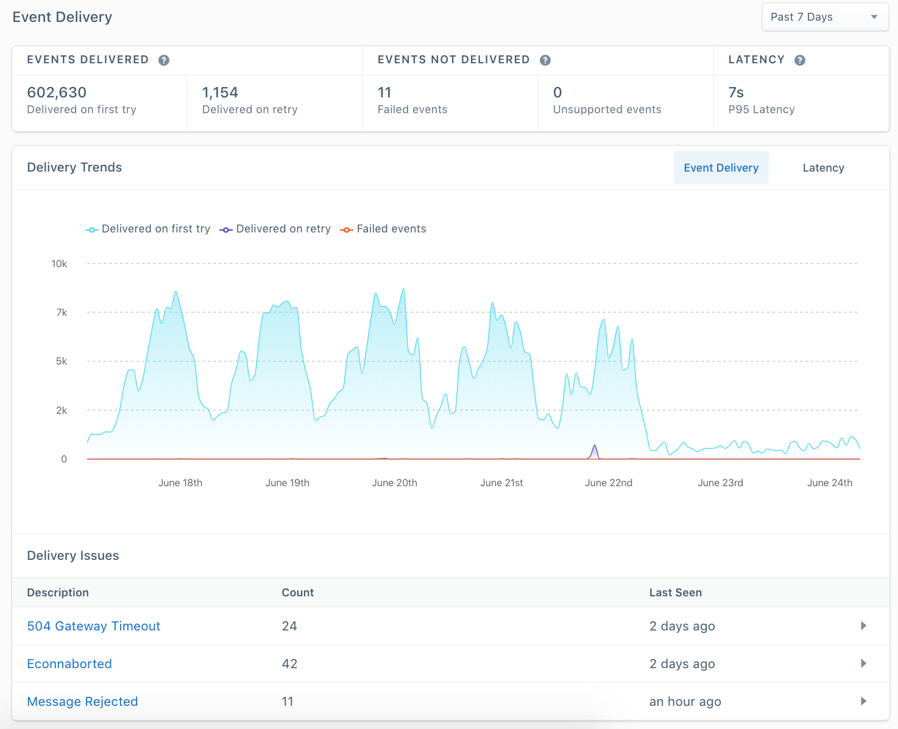
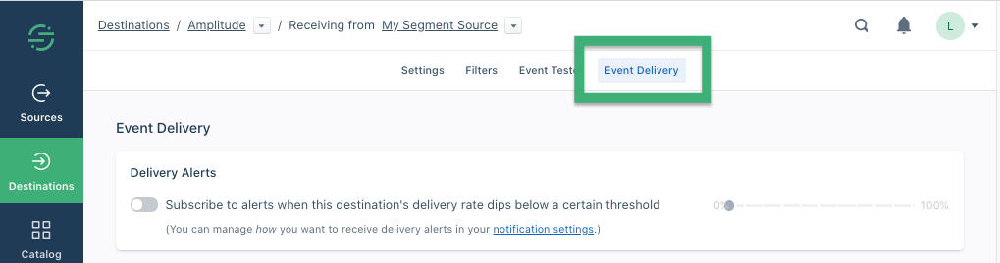
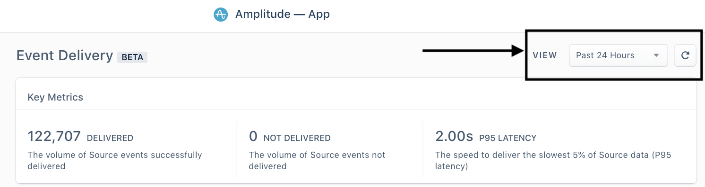
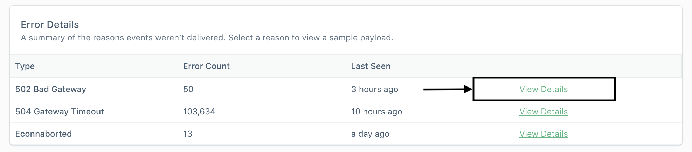
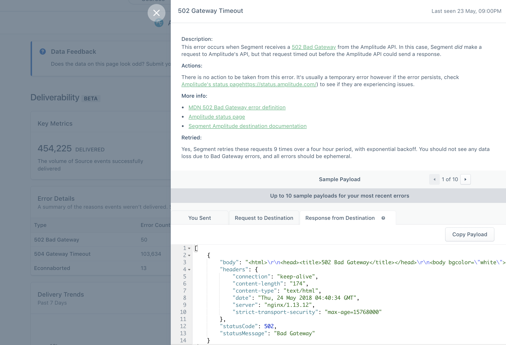
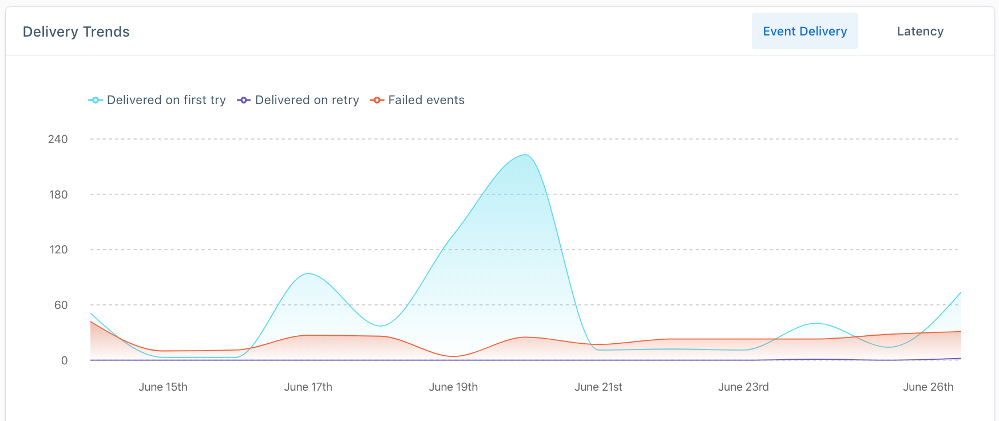

The Event Delivery tool exists to help customers understand if Segment has encountered any issues delivering your source data to destinations. 

Segment sends billions of events to destinations every week. If we encounter any errors when attempting to deliver your data, we report them in the Event Delivery tool.

Here is an example of what the Event Delivery tool looks like:

## When to use Event Delivery

Scenarios when this tool will be useful: 

- **When data seems to be missing in your destination.**
  For example, you have Google Analytics set up as a destination and your recent data looks incomplete
- **When setting up a destination for the first time.** 
  For example, you are connecting Google Analytics to your Node Source. Once you've entered your credentials and turned the destination on, you can use this feature to see whether events are successfully making it to GA in near realtime. 

## Important things to know

#### Available for server side event streaming destinations only

This feature is only available for server side integrations (also known as cloud-mode destinations). You will not be able to use this for client side / device-mode destinations as device-mode data is sent directly to the tool's API. To be report on deliverability, the data must be sent to Destinations using Segment's APIs. 

> warning ""
> **Not available for Warehouses or Amazon S3**. These destinations work differently to our other destinations, and aren't supported at this time.

## Where do I find it? 

Event Delivery can be accessed within any supported destination in the App. It's located on the tab under "Settings" for each destination. 

## How do I use Event Delivery?

The UI consists of 3 key parts that report on Segment's ability to deliver your source data - Key Metrics, Error Details and Delivery Trends. Reporting on core functionality from top to bottom: 

## 1. Time period

There is a drop down menu to select your time period. All of the UI is updated based on the time period you select. 

## 2. Key Metrics

From left to right in the above graphic:

- **Delivered:** This tells you the number of messages Segment successfully delivered to a destination in the time period you selected

- **Not Delivered:** This count tells you the number of messages Segment was unable to deliver. If this number is higher than zero, you will see the reasons for this failure in the errors table below. 

- **P95 Latency:** This is the time it takes for Segment to deliver the slowest 5% of your data (known as P95 latency). The latency reported is end-to-end: the event being received through the Segment API to the event being delivered to partner API. This helps tell you if there is a delay in your data and how bad it is.

## 3. Error details

The purpose of the table is to provide you a summary of the different errors we've seen in a given period and the most important information on them. All of the rows in the table are clickable and expand to give you more information. 

### Error detail view

When we see an error, we want to give you as much information to help you solve your problem. See below for an example of what this view looks like. 

This view includes: 

#### Description

The event delivery UI provides a human-friendly summary of the error, based on the payload we received back from the partner

#### Actions

These are actions we think you can take to solve the issue, based on what we know about the issue. 

#### More Info

Links to any documentation that we think could be helpful to you 

#### Sample payloads

To help you debug we provide sample payloads from every step of the data's journey through Segment

- **You Sent** - the data you sent to Segment's API

- **Request to Destination** - the request we made to the Partner API. This payload will likely be different from what you sent it because Segment is mapping your event to the partner's spec to ensure the message is successfully delivered. 

- **Response from Destination** - the response we received from the Partner API. This will have the raw partner error. If you need to troubleshoot an issue with a Partner's Success team, this is usually something they'll want to see. 

## 4. Trends

When debugging, it's helpful to see when issues start, stop and trend over time. 

#### Event Delivery

- **Delivered**: The number of events that were successfully delivered in the time period you selected. 

- **Not delivered**: The number of events that were not successfully delivered in the time period you selected. 

#### Latency

How P95 latency has trended over the time period you selected.
