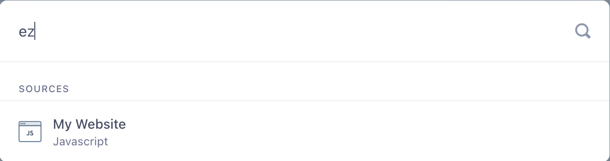

The write key is a unique identifier for each source. It lets Segment know which source is sending the data and which destinations should receive that data.

## Find the write key for a source

To find a write key, you first need to create an [event streams source](/docs/connections/sources/#event-streams-sources) like a website, server, or mobile source. ([Cloud-sources](/docs/connections/sources/about-cloud-sources/) do not have write keys, as they use a token or key from your account with that service.)

Then, in the Source, go to **Settings** and select **API Keys**.

Now you can add the source's write key to your app and begin sending data to Segment.

## Locate a source using your write key

To find the source given a write key within your workspace, open your workspace and select the search icon. Enter your write key into the search bar. If the write key exists in the workspace and is connected to a source, the source shows up in the list of results. 

> info "This method is only available to locate event streams sources"
> This method cannot be used to find a destination or cloud event source.
