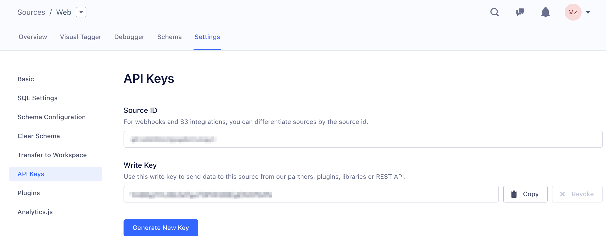

The write key is a unique identifier for each Source. It lets Segment know which Source is sending the data, and which destinations should receive that data.

To find a  write key, you first need to create a non-Cloud Source such as a website, server, or mobile source. ([Cloud-sources](/docs/connections/sources/about-cloud-sources/) do not have write keys, as they use a token or key from your account with that service.)

Then, in the Source, go to "Settings', and then go to "API Keys".

Now you can add the Source's write key in your app, and begin sending us data.
