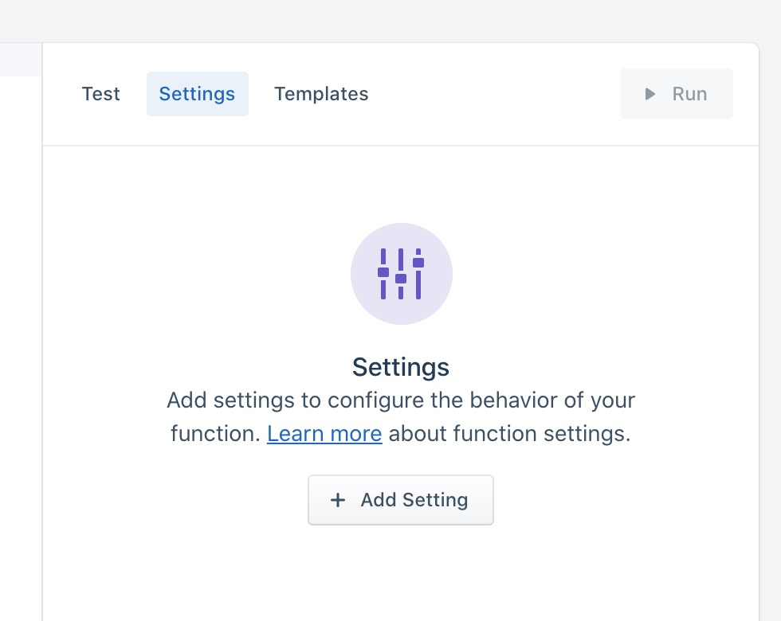
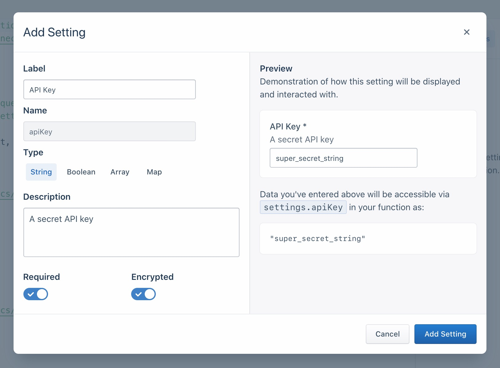
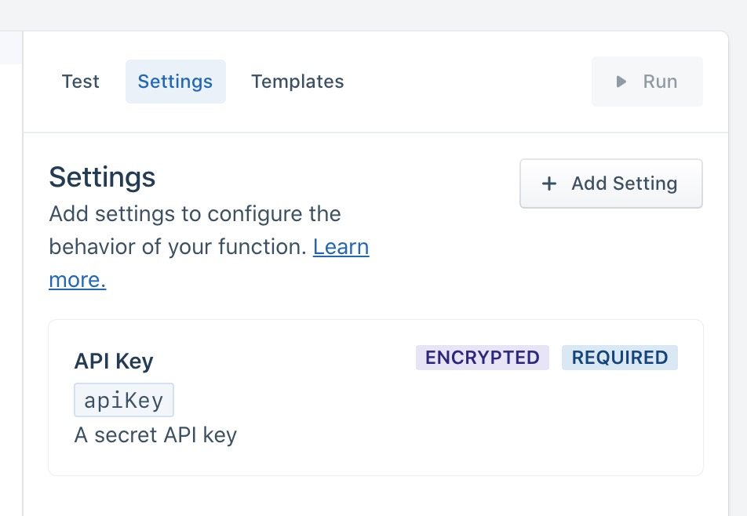
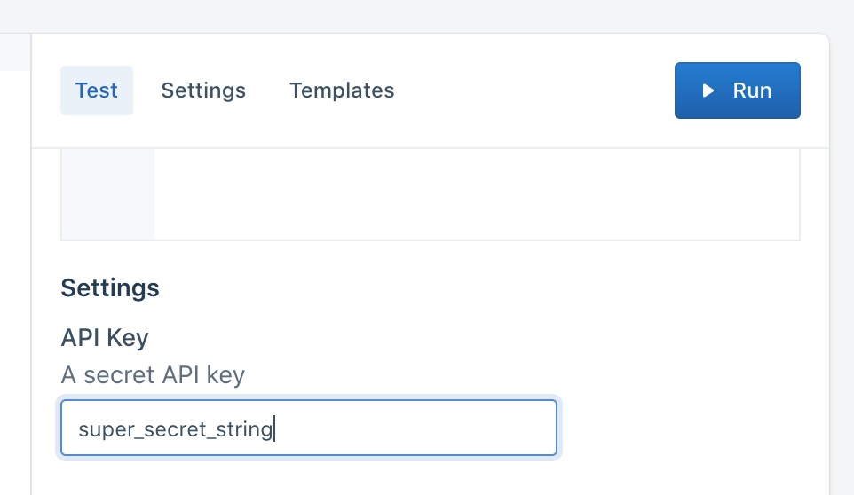

<!-- TOC depthFrom:1 depthTo:6 withLinks:1 updateOnSave:1 orderedList:0 -->

	- [Getting started](#getting-started)
		- [Creating your Destination Function](#creating-your-destination-function)
		- [Runtime and Dependencies](#runtime-and-dependencies)
		- [️Settings and Secrets](#settings-and-secrets)
	- [Testing your function](#testing-your-function)
		- [Use Sample Events for testing](#use-sample-events-for-testing)
		- [Manual input for testing functions](#manual-input-for-testing-functions)
	- [Creating and deploying functions](#creating-and-deploying-functions)
	- [Functions logs and errors](#functions-logs-and-errors)
		- [Functions error types](#functions-error-types)
		- [Functions logs](#functions-logs)
	- [Managing destination functions](#managing-destination-functions)
		- [Functions permissions](#functions-permissions)
		- [Editing and deleting functions](#editing-and-deleting-functions)
		- [Monitoring functions](#monitoring-functions)
		- [Data Control](#data-control)
	- [Destination function FAQs](#destination-function-faqs)
				- [Can I see who made changes to a function?](#can-i-see-who-made-changes-to-a-function)
				- [Does Segment retry failed function invocations?](#does-segment-retry-failed-function-invocations)
				- [Are events guaranteed to send data in order?](#are-events-guaranteed-to-send-data-in-order)
				- [Can I create a device-mode destination?](#can-i-create-a-device-mode-destination)
				- [How do I publish a destination to the public Segment catalog?](#how-do-i-publish-a-destination-to-the-public-segment-catalog)

<!-- /TOC -->cer


Destination functions allow you to transform and annotate your Segment events and send them to any external tool or API without worrying about setting up or maintaining any infrastructure.

All functions are scoped to your workspace, so members of other workspaces won't be able to view and use them.

**[VISUAL SHOWING DATA FLOW FROM SEGMENT SOURCE TO FN TO DESTINATION]**

> note ""
> Destination functions can't currently modify data coming from [Cloud-App sources](/docs/connections/sources/catalog/##cloud-apps).

## Getting started

### Creating your Destination Function

2. From your workspace, go to the Catalog and click the [Functions tab](https://app.segment.com/goto-my-workspace/functions/catalog).
3. Click **New Function**.
4. Select **Destination Function** and click **Build**.

> info ""
> **Tip:** Want to see some example functions? Check out the templates available in the Functions UI, or in the open-source [Segment Functions Library](https://github.com/segmentio/functions-library). (Contributions welcome!)

When you click **Build**, a code editor appears. Use the editor to write the code for your function, configure settings, and test the function's behavior.


 Segment invokes a separate function for each event type that you send to your destination function.

> info ""
> When [destination filters](/docs/connections/destinations/destination-filters/) are configured and an event doesn't pass the filter, your function won't be invoked.

The default source code template includes handlers for all event types. However, you do not need to implement all of them - just use the ones you need, and skip the ones you don't.

Destination functions can define handlers for each message type in the [Segment spec](/docs/connections/spec/):

- `onIdentify`
- `onTrack`
- `onPage`
- `onScreen`
- `onGroup`
- `onAlias`
- `onDelete`

Each of the functions above accepts two arguments:

- **event** - Segment event object, where fields and values depend on the type of event. For example, for "Identify" events, the object is formatted to match the [Identify spec](/docs/connections/spec/identify/).
- **settings** - Set of [settings](#settings-and-secrets) for this function.

We'll learn more about settings later, let's see how we can process Segment events with destination function first.

The example below shows a destination function that listens for "Track" events, and sends some details about them to an external service.

```js
async function onTrack(event) {
  await fetch('https://example-service.com/api', {
    method: 'POST',
    headers: {
      'Content-Type': 'application/json'
    },
    body: JSON.stringify({
      event_name: event.event,
      event_properties: event.properties,
      timestamp: event.timestamp
    })
  })
}
```

To change which type of event the handler listens to, you can rename it to the name of the message type. For example, if you rename this function `onIdentify`, it listens for "Identify" events instead.

> info ""
> Functions' runtime includes a `fetch()` polyfill using a `node-fetch` package. Check out the [node-fetch documentation](https://www.npmjs.com/package/node-fetch) for usage examples.


A function's execution is considered successful if it finishes without any errors. You can also `throw` an error to indicate a failure on purpose. You can use these errors as part of validating event data before processing it, to ensure your function works as expected.

There are three pre-defined error types that you can `throw` to indicate that the function ran as expected, but that data could not be delivered:

- `EventNotSupported`
- `InvalidEventPayload`
- `ValidationError`

The examples show basic uses of these error types.

```js
async function onGroup(event) {
  if (!event.company) {
    throw new InvalidEventPayload('Company name is required')
  }
}

async function onPage(event) {
  if (!event.pageName) {
    throw new ValidationError('Page name is required')
  }
}

async function onAlias(event) {
  throw new EventNotSupported('Alias event is not supported')
}
```

If you do not supply a function for an event type, Segment throws an `EventNotSupported` error by default.

You can read more about [error handling](#errors) below.

### Runtime and Dependencies

Destination functions are powered by Node.js 10.x.

We don't currently support importing your own dependencies, but you can [contact Segment Support](https://segment.com/help/contact/) to request that one be added.

The following dependencies are installed in the function environment by default.

- [`atob v2.1.2`](https://www.npmjs.com/package/atob) exposed as `atob`
- [`aws-sdk v2.488.0`](https://www.npmjs.com/package/aws-sdk) exposed as `AWS`
- [`btoa v1.2.1`](https://www.npmjs.com/package/btoa) exposed as `btoa`
- [`form-data v2.4.0`](https://www.npmjs.com/package/form-data) exposed as `FormData`
- [`lodash v4.17.15`](https://www.npmjs.com/package/lodash) exposed as `_`
- [`node-fetch v2.6.0`](https://www.npmjs.com/package/node-fetch) exposed as `fetch`
- [`oauth v0.9.15`](https://www.npmjs.com/package/oauth) exposed as `OAuth`
- [`xml v1.0.1`](https://www.npmjs.com/package/lodash) exposed as `xml`

Only the `crypto` Node.js module is included (exposed as `crypto` too). [Other Built-in Node.js modules](https://nodejs.org/api/modules.html) are not available.


### ️Settings and Secrets

Settings allow you to pass configurable variables to your function.

A common pattern is to add `settings` for an API endpoint and API key, so that you can use the same code with different settings for different purposes.

First, add a setting in **Settings** tab in the code editor:

{:width="500"}

Click **Add Setting** to add your new setting.



You can configure the details about this setting, which change how it's displayed to anyone using of your function:

- **Label** - Name of the setting, which users see when configuring the function.
- **Name** - Auto-generated name of the setting to use in function's source code.
- **Type** - Type of the setting's value.
- **Description** - Optional description, which appears below the setting name.
- **Required** - Enable this to ensure this setting always has a value.
- **Encrypted** - Enable to encrypt the value of this setting. Use this setting for sensitive data, like API keys.

As you change the values, a preview to the right displays how your setting will look and work.

After you add a setting it appears in the **Settings** tab, which is where you go to edit or delete it later.

{:width="500"}

Next, fill out this setting's value in the **Test** tab, so you can run the function and verify that the correct setting value is passed. (This value is only for testing your function.)

{:width="500"}

Now that we have our setting configured, and have entered a test value, we can add code to read its value and run the function, as in the example below:

```js
async function onTrack(request, settings) {
  const apiKey = settings.apiKey
  //=> "super_secret_string"
}
```

Once your destination function is deployed as an instance within your workspace, you can fill out the settings on the destination configuration page.


## Testing your function

You can test your code directly from the editor in two ways.

### Use Sample Events for testing

Click **Use Sample Event** and select the source to use events from.


Click **Run** to test your function with the event you selected.

### Manual input for testing functions

You can also manually include your own JSON payload of a Segment event, instead of fetching a sample from one of your workspace sources.


If your function fails, you can check the error details and logs in the **Output** section.

- **Error Message** - This shows the error surfaced from your function.
- **Logs** - This section displays any messages to `console.log()` from the function.

## Creating and deploying functions

Once you finish writing your function, click **Configure** to give it a name. Then, click **Create Function** to finish and make this function available in your workspace.

If you're editing an existing function, you can **Save** changes without changing the behavior of your deployed function. You can also choose to **Save & Deploy** to push changes to all, or specific functions in your workspace that are already deployed.


## Functions logs and errors

A function can throw errors, or Segment might encounter errors while invoking your function. You can view these errors in the [Event Delivery](/docs/connections/event-delivery/) tab for your Destination as in the example below.


### Functions error types

- **Bad Request** - Any error thrown by the function code that is not covered by the other errors.
- **Invalid Settings** - A configuration error prevented Segment from executing your code. If this error persists for more than an hour, [contact Segment Support](https://segment.com/help/contact/).
- **Message Rejected** - Your code threw `InvalidEventPayload` or `ValidationError` due to invalid input.
- **Unsupported Event Type** - Your code does not implement a specific event type (`onTrack()`, etc.) or threw a `EventNotSupported` error.

When these errors occur, Segment does not attempt to send that event to your destination function again.

### Functions logs

If your function throws an error, execution halts immediately. Segment captures the event, any outgoing requests/responses, any logs the function might have printed, as well as the error itself.

Segment then displays the captured error information in the [Event Delivery](/docs/connections/event-delivery/) page of your destination. You can use this information to find and fix unexpected errors.


You can throw [an error or a custom error](https://developer.mozilla.org/en-US/docs/Web/JavaScript/Reference/Global_Objects/Error) and you can also add helpful context in logs using the [`console` API](https://developer.mozilla.org/en-US/docs/Web/API/console). For example:

```js
async function onTrack(event, settings) {
  const userId = event.userId

  console.log('User ID is', userId)

  if (typeof userId !== 'string' || userId.length < 8) {
    throw new ValidationError('User ID is invalid')
  }

  console.log('User ID is valid')
}
```

> warning ""
> **Warning:** Do not log sensitive data, such as personally-identifying information (PII), authentication tokens, or other secrets. You should especially avoid logging entire request/response payloads. The **Function Logs** tab may be visible to other workspace members if they have the necessary permissions.


## Managing destination functions

### Functions permissions

Functions have specific roles which can be used for [access management](/docs/segment-app/iam/) in your Segment workspace.

Access to functions is controlled by two permissions [roles](/docs/segment-app/iam/roles/):

- **Functions Admin:** Create, edit and delete all functions, or a subset of specified functions.
- **Functions Read-only:** View all functions, or a subset of specified functions.

You also need additional **Source Admin** permissions to connect your destination function to a source, or to deploy changes to a functions that is already connected to a source.


### Editing and deleting functions

If you are a **Workspace Owner** or **Functions Admin**, you can manage your function from the [Functions](https://app.segment.com/goto-my-workspace/functions/catalog) page.


### Monitoring functions

You can use [Destination Event Delivery](/docs/guides/destinations/how-do-i-check-if-data-is-successfully-being-delivered-to-my-destination/) to understand if Segment encounters any issues delivering your source data to destinations. Errors that the Function throws appear here.

If any of your deployed function instances are failing consistently, they will also appear in [Connection Health](/docs/segment-app/#sts=Health).

### Data Control

You can use [Destination Filters](/docs/connections/destinations/destination-filters/) or Privacy Controls to manage what events and, of those events, which event properties are sent to your Destination Function.

## Destination function FAQs

##### Can I see who made changes to a function?

Yes, Functions is compatible with [Audit Trail](/docs/segment-app/iam/audit-trail/) and will display user activity relating to functions.

##### Does Segment retry failed function invocations?

Segment retries 9 times over the course of 4 hours. This increases the number of attempts for messages, so we try to re-deliver them another 4 times after some backoff. Segment doesn't retry if your function throws a [non-recoverable error](#functions-error-types).

##### Are events guaranteed to send data in order?

No, Segment can't guarantee the order in which the events are delivered to an endpoint.

##### Can I create a device-mode destination?

No, for now destination functions enable you to write and deploy cloud-mode destinations. We're in the early phases of exploration and discovery for supporting customer "web plugins" for custom device-mode destinations and other use cases, but this is unsupported today.

##### How do I publish a destination to the public Segment catalog?

If you are a partner, looking to publish your destination and distribute your app through Segment catalog, visit the [Developer Center](https://segment.com/partners/developer-center/) and check out our [partner docs](/docs/partners).
