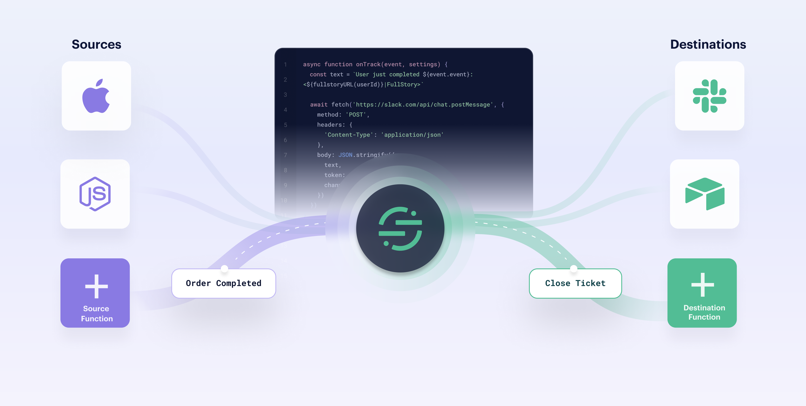

Functions let you create your own sources and destinations directly within your workspace to bring new types of data into Segment and send data to new tools with just a few lines of JavaScript - no additional infrastructure required.

> info ""
> Functions is available to all customer plan types with a free allotment of usage hours. Read more about [Functions usage limits](/docs/connections/functions/usage/), or see [your workspace's Functions usage stats](https://app.segment.com/goto-my-workspace/settings/usage?metric=functions).

## What can you do with Functions?
Functions can help you bring external data into Segment ([Source Functions](/docs/connections/functions/source-functions)) and send data in Segment out to external destinations ([Destination Functions](/docs/connections/functions/destination-functions)). Functions are scoped to your specific workspace. If you're a technology partner and want to build a new integration and publish it in Segment's catalog, see the [Developer Center documentation](/docs/partners/).

#### Source Functions
Source Functions receive external data from a webhook and can create Segment events, objects, or both. Source Functions have access to the full power of JavaScript so you can validate and transform the incoming data and even make external API requests to annotate your data.

Use cases:
- Ingest data into Segment from a source that's unavailable in the catalog
- Transform or reject data before it's received by Segment
- Enrich incoming data using external APIs

Learn more about [source functions](/docs/connections/functions/source-functions).

#### Destination Functions
Destination Functions can take events from a Segment source, transform the events, and deliver them to external APIs. Destination Functions can make arbitrary requests to annotate data, as well.

Use cases:
- Send data from Segment to a service that's unavailable in the catalog
- Transform data before sending it downstream
- Enrich outgoing data using external APIs

Learn more about [destination functions](/docs/connections/functions/destination-functions).
