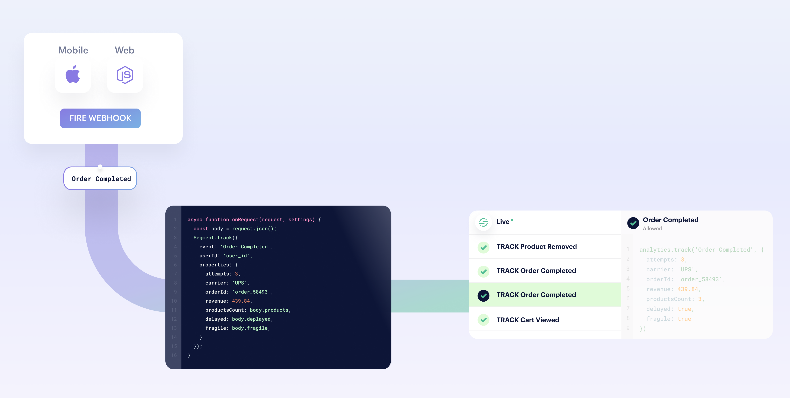
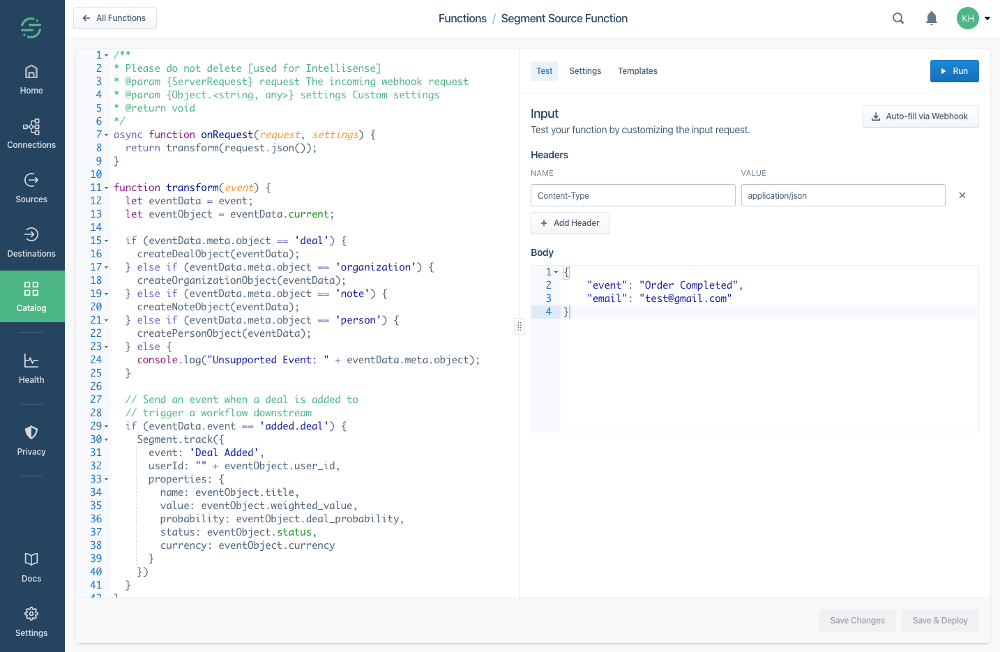
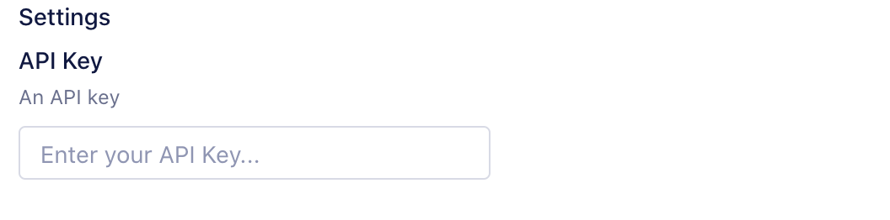
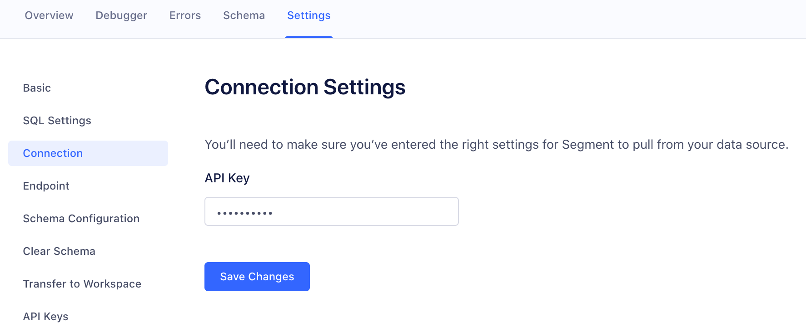
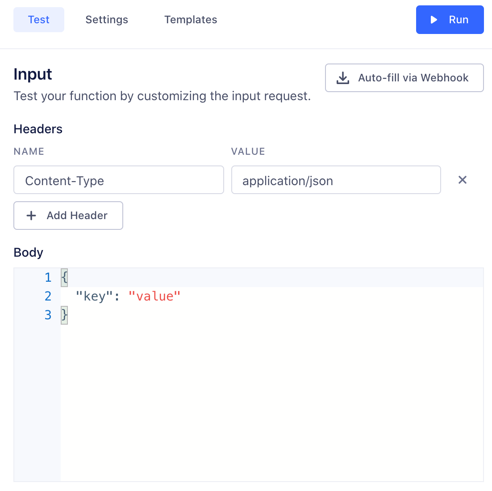
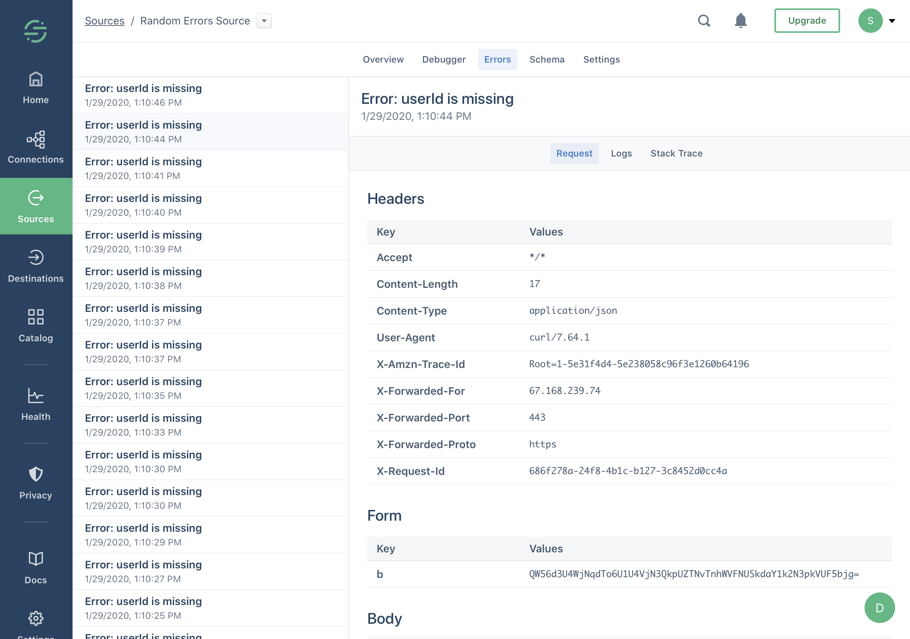

Source functions allow you to gather data from any third-party applications without worrying about setting up or maintaining any infrastructure.

All functions are scoped to your workspace, so members of other workspaces cannot view or use them.

> info ""
> Functions is available to all customer plan types with a free allotment of usage hours. Read more about [Functions usage limits](/docs/connections/functions/usage/), or see [your workspace's Functions usage stats](https://app.segment.com/goto-my-workspace/settings/usage?metric=functions){:target="_blank"}.




## Create a source function

1. From your workspace, go to the Catalog and click the [Functions tab](https://app.segment.com/goto-my-workspace/functions/catalog){:target="_blank"}.
2. Click **New Function**.
4. Select **Source Function** and click **Build**.


> success ""
> **Tip:** Want to see some example functions? Check out the templates available in the Functions UI, or in the open-source [Segment Functions Library](https://github.com/segmentio/functions-library){:target="_blank"}. (Contributions welcome!)

When you click **Build**, a code editor appears. Use the editor to write the code for your function, configure settings, and test the function's behavior.



## Code the source function

Source functions must have an `onRequest()` function defined.
This function is executed by Segment for each HTTPS request sent to this function's webhook.

```js
async function onRequest(request, settings) {
  // Process incoming data
}
```

The `onRequest()` function receives two arguments:

- `request` - an object describing the incoming HTTPS request.
- `settings` - set of [settings](#create-️settings-and-secrets) for this function.

### Request processing

To parse the JSON body of the request, use the `request.json()` method, as in the following example:

```js
async function onRequest(request) {
  const body = request.json()
  console.log('Hello', body.name)
}
```

Use the `request.headers` object to get values of request headers.
Since it's an instance of [`Headers`](https://developer.mozilla.org/en-US/docs/Web/API/Headers){:target="_blank"}, the API is the same in both the browser and in Node.js.

```js
async function onRequest(request) {
  const contentType = request.headers.get('Content-Type')
  const authorization = request.headers.get('Authorization')
}
```

To access the URL details, refer to `request.url` object, which is an instance of [`URL`](https://developer.mozilla.org/en-US/docs/Web/API/URL){:target="_blank"}.

```js
async function onRequest(request) {
  // Access a query parameter (e.g. `?name=Jane`)
  const name = request.url.searchParams.get('name')
}
```

#### Sending messages

You can send messages to the Segment API using the `Segment` object:

```js
async function onRequest(request) {
  Segment.identify({
    userId: 'user_id',
    traits: {
      name: 'Jane Hopper'
    }
  })

  Segment.track({
    event: 'Page Viewed',
    userId: 'user_id',
    properties: {
      page_name: 'Summer Collection 2020'
    }
  })

  Segment.group({
    groupId: 'group_id',
    traits: {
      name: 'Clearbit'
    }
  })

  Segment.set({
    collection: 'products',
    id: 'product_id',
    properties: {
      name: 'Nike Air Max'
    }
  })
}
```

##### Identify

Use [Identify calls](/docs/connections/spec/identify/) to connect users with their actions, and to record traits about them.


```js
Segment.identify({
  userId: 'user_id',
  traits: {
    name: 'Jane Hopper'
  }
})
```

The `Segment.identify()` method accepts an object with the following fields:

- `userId` - Unique identifier for the user in your database.
- `anonymousId` - A pseudo-unique substitute for a User ID, for cases when you don't have an absolutely unique identifier.
- `traits` - Object with data about or related to the user, like `name` or `email`.
- `context` - Object with extra information that provides useful context, like `locale` or `country`.

##### Track

[Track calls](/docs/connections/spec/track/) record actions that users perform, along with any properties that describe the action.


```js
Segment.track({
  event: 'Page Viewed',
  userId: 'user_id',
  properties: {
    page_name: 'Summer Collection 2020'
  }
})
```

The `Segment.track()` method accepts an object with the following fields:

- `userId` - Unique identifier for the user in your database.
- `anonymousId` - A pseudo-unique substitute for a User ID, for cases when you don't have an absolutely unique identifier.
- `properties` - Object with data that is relevant to the action, like `product_name` or `price`.
- `context` - Object with extra information that provides useful context, like `locale` or `country`.

##### Group

[Group calls](/docs/connections/spec/group/) associate users with a group, like a company, organization, account, project, or team.


```js
Segment.group({
  groupId: 'group_id',
  traits: {
    name: 'Clearbit'
  }
})
```

The `Segment.group()` method accepts an object with the following fields:

- `groupId` - Unique identifier for the group in your database.
- `traits` - Object with data that is relevant to the group, like `group_name` or `team_name`.
- `context` - Object with extra information that provides useful context, like `locale` or `country`.

##### Page

[Page calls](/docs/connections/spec/page/) record whenever a user sees a page of your website, along with any other properties about the page.

```js
Segment.page({
  name: 'Shoe Catalog',
  properties: {
    url: 'https://myshoeshop.com/catalog'
  }
})
```

The `Segment.page()` method accepts an object with the following fields:

- `userId` - Unique identifier for the user in your database.
- `anonymousId` - A pseudo-unique substitute for a User ID, for cases when you don't have an absolutely unique identifier.
- `name` - Name of the page.
- `properties` - Object with information about the page, like `page_name` or `page_url`.
- `context` - Object with extra information that provides useful context, like `locale` or `country`.

##### Screen

[Screen calls](/docs/connections/spec/screen/) record when a user sees a screen, the mobile equivalent of [Page](#page), in your mobile app.

```js
Segment.screen({
  name: 'Shoe Feed',
  properties: {
    feed_items: 5
  }
})
```

The `Segment.screen()` method accepts an object with the following fields:

- `userId` - Unique identifier for the user in your database.
- `anonymousId` - A pseudo-unique substitute for a User ID, for cases when you don't have an absolutely unique identifier.
- `name` - Name of the screen.
- `properties` - Object with data about the screen, like `screen_name`.
- `context` - Object with extra information that provides useful context, like `locale` or `country`.

##### Alias

The [Alias call](/docs/connections/spec/alias/) merges two user identities, effectively connecting two sets of user data as one.

```js
Segment.alias({
  previousId: 'old-email@example.com',
  userId: 'new-email@example.com'
})
```

The `Segment.alias()` method accepts an object with the following fields:

- `previousId` - Previous unique identifier for the user.
- `userId` - Unique identifier for the user in your database.
- `anonymousId` - A pseudo-unique substitute for a User ID, for cases when you don't have an absolutely unique identifier.

##### Set

The Set call uses [the object API](/docs/connections/sources/catalog/libraries/server/object-api/) to save object data to your Redshift, BigQuery, Snowflake or other data warehouses supported by Segment.

```js
Segment.set({
  collection: 'products',
  id: 'product_id',
  properties: {
    name: 'Nike Air Max 90',
    size: 11
  }
})
```

The `Segment.set()` method accepts an object with the following fields:

- `collection` - Collection name.
- `id` - Object's unique identifier.
- `properties` - Object with free-form data.

> warning ""
> When you use the `set()` method, you won't see events in the Source Debugger. Segment only sends events to connected warehouses.

### Runtime and dependencies



<!-- TODO - could also go into the `runtime.md` include above, if applied identically to both types of functions.
## Batching in functions   -->

## Create settings and secrets



Next, fill out this setting's value in **Test** tab, so that you can run the function and check the setting values being passed.

Note, this value is only for testing your function.

{:width="500"}

Now that you've configured a setting and filled in a test value, you can add code to read its value and run the function:

```js
async function onRequest(request, settings) {
  const apiKey = settings.apiKey
  //=> "super_secret_string"
}
```

When you deploy a source function in your workspace, you are prompted to fill out settings to configure the source. You can access these settings later by navigating to the Source Settings page for the source function.



## Test the source function

You can test your code directly from the editor in two ways: either by receiving real HTTPS requests through a webhook, or by manually constructing an HTTPS request from within the editor.

The advantage of testing your source function with webhooks is that all incoming data is real, so you can test behavior while closely mimicking the production conditions.

### Testing source functions with a webhook

You can use webhooks to test the source function either by sending requests manually (using any HTTP client such as cURL or Insomnia) or by pasting the webhook into an external server that supports webhooks (such as Slack).

From the source function editor, copy the webhook URL from the "Auto-fill via Webhook" dialog. To trigger the source function, send the request using the `POST` method, with the `Content-Type` header set to `application/json` or `application/x-www-form-urlencoded`.

### Testing source functions manually

You can also manually construct the headers and body of an HTTPS request right inside the editor and test with this data without using webhooks.

{:width="500"}

## Save and deploy the function

Once you finish building your source function, click **Configure** to name it, then click **Create Function** to save it.

Once you do that, the source function appears on the **Functions** page in your workspace's catalog.

If you're editing an existing function, you can **Save** changes without updating instances of the function that are already deployed and running.

You can also choose to **Save & Deploy** to save the changes, and then choose which already-deployed functions to update with your changes. You might need [additional permissions](#source-functions-permissions) to update existing functions.

## Source functions logs and errors

Your function might encounter errors that you missed during testing, or you might intentionally throw errors in your code (for example, if the incoming request is missing required fields).

If your function throws an error, execution halts immediately. Segment captures the incoming request, any console logs the function printed, and the error, and displays this information in the function's **Errors** tab. You can use this tab to find and fix unexpected errors.



Functions can throw [an Error or custom Error](https://developer.mozilla.org/en-US/docs/Web/JavaScript/Reference/Global_Objects/Error){:target="_blank"}, and you can also add additional helpful context in logs using the [`console` API](https://developer.mozilla.org/en-US/docs/Web/API/console){:target="_blank"}.
For example:

```js
async function onRequest(request, settings) {
  const body = request.json()
  const userId = body.userId

  console.log('User ID is', userId)

  if (typeof userId !== 'string' || userId.length < 8) {
    throw new Error('User ID is invalid')
  }

  console.log('User ID is valid')
}
```

> warning ""
> **Warning:** Do not log sensitive data, such as personally-identifying information (PII), authentication tokens, or other secrets. You should especially avoid logging entire request/response payloads. Segment only retains the 100 most recent errors and logs for up to 30 days but the **Errors** tab may be visible to other workspace members if they have the necessary permissions.

### Error types

- **Bad Request**: is any error thrown by your code not covered by the other errors.
- **Invalid Settings**: A configuration error prevented Segment from executing your code. If this error persists for more than an hour, [contact Segment Support](https://segment.com/help/contact/){:target="_blank"}.
- **Message Rejected**: Your code threw `InvalidEventPayload` or `ValidationError` due to invalid input.
- **Unsupported Event Type**: Your code does not implement a specific event type (`onTrack()`, etc.) or threw a `EventNotSupported` error.
- **Retry**: Your code threw `RetryError` indicating that the function should be retried.

Segment only attempts to run your source function again if a **Retry** error occurs.

## Managing source functions

### Source functions permissions





### Editing and deleting source functions

If you are a **Workspace Owner** or **Functions Admin**, you can manage your source function from the [Functions](https://app.segment.com/goto-my-workspace/functions/catalog){:target="_blank"} tab in the catalog.

### Connecting source functions

> note ""
> You must be a **Workspace Owner** or **Source Admin** to connect an instance of your function in your workspace.

From the [Functions tab](https://app.segment.com/goto-my-workspace/functions/catalog){:target="_blank"}, click **Connect Source** and follow the prompts to set it up in your workspace.

Once configured, find the webhook URL - either on the **Overview** or **Settings → Endpoint** page.

Copy and paste this URL into the upstream tool or service to send data to this source.

## Source function FAQs

##### What is the retry policy for a webhook payload?

The webhook payload retries up to six times with an exponential backoff for the function in the event of a failure with the function. After six attempts, the message is dropped.

##### What is the maximum payload size for the incoming webhook?

The maximum payload size for an incoming webhook payload is 512 KiB.

##### What is the timeout for a function to execute?

The execution time limit is five seconds, however Segment strongly recommends that you keep execution time as low as possible. If you are making multiple external requests you can use async / await to make them concurrently, which will help keep your execution time low.

#### Does Segment alter incoming payloads?

Segment alphabetizes payload fields that come in to **deployed** Source Functions. Segment doesn't alphabetize payloads in the Functions tester. If you need to verify the exact payload that hits a Source Function, alphabetize it first. You can then make sure it matches what the Source Function ingests.
