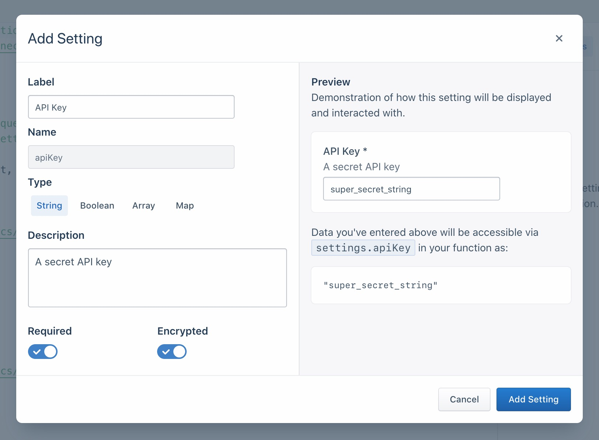
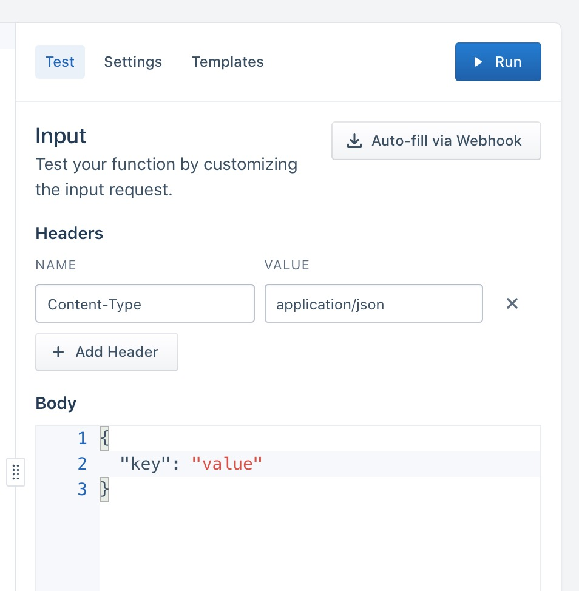

<!-- TOC depthFrom:1 depthTo:6 withLinks:1 updateOnSave:1 orderedList:0 -->

	- [Getting Started](#getting-started)
		- [Creating a source function](#creating-a-source-function)
			- [Sending Messages](#sending-messages)
				- [Identify](#identify)
				- [Track](#track)
				- [Group](#group)
				- [Page](#page)
				- [Screen](#screen)
				- [Alias](#alias)
				- [Set](#set)
		- [Runtime and Dependencies](#runtime-and-dependencies)
		- [Settings and Secrets](#settings-and-secrets)
	- [Testing](#testing)
		- [Webhook](#webhook)
		- [Manual Input](#manual-input)
	- [Creation and Deployment](#creation-and-deployment)
	- [Logs and Errors](#logs-and-errors)
		- [Error Types](#error-types)
	- [Managing source functions](#managing-source-functions)
		- [Permissions](#permissions)
		- [Editing and Deleting](#editing-and-deleting)
		- [Connecting](#connecting)
	- [Source function FAQs](#source-function-faqs)
				- [What is the maximum payload size for the incoming webhook?](#what-is-the-maximum-payload-size-for-the-incoming-webhook)
				- [Is there a function execution time limit?](#is-there-a-function-execution-time-limit)

<!-- /TOC -->

Source functions allow you to gather data from any third-party applications without worrying about setting up or maintaining any infrastructure.
All functions are scoped to your workspace, so members of other workspaces won't be able to view and use them.

**[VISUAL SHOWING DATA FLOW FROM UPSTREAM SOURCE TO FN TO SEGMENT]**

## Getting Started

### Creating a source function

1. Go to the Catalog and click the [Functions](https://app.segment.com/goto-my-workspace/functions/catalog) tab.
2. Click **New Function**.
3. Select **Source Function** and click **Build**

> info ""
> **Tip:** Get started easily by referencing the templates available in the UI or in this open-sourced [Functions Library](https://github.com/segmentio/functions-library) - you're welcome to contribute too!

After you click the **Build** button, a code editor will show up, where you can write the code for your function, configure settings and test its behavior.


Source functions must have an `onRequest()` function defined.
This function will be executed by Segment for each HTTP request that is sent to this function's webhook.

```js
async function onRequest(request, settings) {
  // Process incoming data
}
```

`onRequest()` function receives two arguments:

- `request` - an object describing the incoming HTTP request.
- `settings` - set of [settings](#settings-and-secrets) for this function.

We'll learn more about settings later, let's dive into how we can process the incoming request first.

To parse the JSON body of request, use `request.json()` method:

```js
async function onRequest(request) {
  const body = request.json()
  console.log('Hello', body.name)
}
```

Use `request.headers` object to get values of request headers.
Since it's an instance of [`Headers`](https://developer.mozilla.org/en-US/docs/Web/API/Headers), the API is the same as in browser and Node.js.

```js
async function onRequest(request) {
  const contentType = request.headers.get('Content-Type')
  const authorization = request.headers.get('Authorization')
}
```

To access the URL details, refer to `request.url` object, which is an instance of [`URL`](https://developer.mozilla.org/en-US/docs/Web/API/URL).

```js
async function onRequest(request) {
  // Access a query parameter (e.g. `?name=Jane`)
  const name = request.headers.searchParams.get('name')
}
```

#### Sending Messages

You can send messages to the Segment API using the `Segment` object:

```js
async function onRequest(request) {
  Segment.identify({
    userId: 'user_id',
    traits: {
      name: 'Jane Hopper'
    }
  })

  Segment.track({
    event: 'Page Viewed',
    userId: 'user_id',
    properties: {
      page_name: 'Summer Collection 2020'
    }
  })

  Segment.group({
    groupId: 'group_id',
    traits: {
      name: 'Clearbit'
    }
  })

  Segment.set({
    collection: 'products',
    id: 'product_id',
    properties: {
      name: 'Nike Air Max'
    }
  })
}
```

##### Identify

Connect user with their actions and record traits about them.
[Learn more.](/docs/connections/spec/identify/)

```js
Segment.identify({
  userId: 'user_id',
  traits: {
    name: 'Jane Hopper'
  }
})
```

`Segment.identify()` method accepts an object with the following fields:

- `userId` - Unique identifier for the user in your database.
- `anonymousId` - A pseudo-unique substitute for a User ID, for cases when you don’t have an absolutely unique identifier.
- `traits` - Object with data that is relevant to the user, like `name` or `email`.
- `context` - Object with extra information that provides useful context, like `locale` or `country`.

##### Track

Record any actions that users perform, along with any properties that describe the action.
[Learn more.](/docs/connections/spec/track/)

```js
Segment.track({
  event: 'Page Viewed',
  userId: 'user_id',
  properties: {
    page_name: 'Summer Collection 2020'
  }
})
```

`Segment.track()` method accepts an object with the following fields:

- `userId` - Unique identifier for the user in your database.
- `anonymousId` - A pseudo-unique substitute for a User ID, for cases when you don’t have an absolutely unique identifier.
- `properties` - Object with data that is relevant to the action, like `product_name` or `price`.
- `context` - Object with extra information that provides useful context, like `locale` or `country`.

##### Group

Associate user with a group - be it a company, organization, account, project, team or other.
[Learn more.](/docs/connections/spec/group/)

```js
Segment.group({
  groupId: 'group_id',
  traits: {
    name: 'Clearbit'
  }
})
```

`Segment.group()` method accepts an object with the following fields:

- `groupId` - Unique identifier for the group in your database.
- `traits` - Object with data that is relevant to the group, like `group_name` or `team_name`.
- `context` - Object with extra information that provides useful context, like `locale` or `country`.

##### Page

Record whenever a user sees a page of your website, along with any other properties about the page.
[Learn more.](/docs/connections/spec/page/)

```js
Segment.page({
  name: 'Shoe Catalog',
  properties: {
    url: 'https://myshoeshop.com/catalog'
  }
})
```

`Segment.page()` method accepts an object with the following fields:

- `userId` - Unique identifier for the user in your database.
- `anonymousId` - A pseudo-unique substitute for a User ID, for cases when you don’t have an absolutely unique identifier.
- `name` - Name of the page.
- `properties` - Object with data that is relevant to the page, like `page_name` or `page_url`.
- `context` - Object with extra information that provides useful context, like `locale` or `country`.

##### Screen

Record whenever a user sees a screen, the mobile equivalent of [Page](#page), in your mobile app.
[Learn more.](/docs/connections/spec/screen/)

```js
Segment.screen({
  name: 'Shoe Feed',
  properties: {
    feed_items: 5
  }
})
```

`Segment.screen()` method accepts an object with the following fields:

- `userId` - Unique identifier for the user in your database.
- `anonymousId` - A pseudo-unique substitute for a User ID, for cases when you don’t have an absolutely unique identifier.
- `name` - Name of the screen.
- `properties` - Object with data that is relevant to the page, like `screen_name`.
- `context` - Object with extra information that provides useful context, like `locale` or `country`.

##### Alias

Merge two user identities, effectively connecting two sets of user data as one.
[Learn more.](/docs/connections/spec/alias/)

```js
Segment.alias({
  previousId: 'old-email@gmail.com',
  userId: 'new-email@gmail.com'
})
```

`Segment.alias()` method accepts an object with the following fields:

- `previousId` - Previous unique identifier for the user.
- `userId` - Unique identifier for the user in your database.
- `anonymousId` - A pseudo-unique substitute for a User ID, for cases when you don’t have an absolutely unique identifier.

##### Set

Save object data into your Redshift, BigQuery, Snowflake and other data warehouses supported by Segment.
[Learn more.](/docs/connections/sources/catalog/libraries/server/object-api/)

```js
Segment.set({
  collection: 'products',
  id: 'product_id',
  properties: {
    name: 'Nike Air Max 90',
    size: 11
  }
})
```

`Segment.set()` method accepts an object with the following fields:

- `collection` - Collection name.
- `id` - Object's unique identifier.
- `properties` - Object with free-form data.

### Runtime and Dependencies

Source functions are powered by Node.js 10.x.
We don't currently support importing your own dependencies but please reach out to [our support team](https://segment.com/help/contact/) if you would like to request one to be added.
The following dependencies are pre-installed in the function environment.

- [`atob v2.1.2`](https://www.npmjs.com/package/atob) exposed as `atob`
- [`aws-sdk v2.488.0`](https://www.npmjs.com/package/aws-sdk) exposed as `AWS`
- [`btoa v1.2.1`](https://www.npmjs.com/package/btoa) exposed as `btoa`
- [`form-data v2.4.0`](https://www.npmjs.com/package/form-data) exposed as `FormData`
- [`lodash v4.17.15`](https://www.npmjs.com/package/lodash) exposed as `_`
- [`node-fetch v2.6.0`](https://www.npmjs.com/package/node-fetch) exposed as `fetch`
- [`oauth v0.9.15`](https://www.npmjs.com/package/oauth) exposed as `OAuth`
- [`xml v1.0.1`](https://www.npmjs.com/package/lodash) exposed as `xml`

Built-in Node.js modules are also unavailable, except `crypto` (exposed as `crypto` too).

### Settings and Secrets

Settings allow you to pass configurable variables to your function.

A common pattern is to add settings for an API endpoint and API key, so that you can use the same code with different settings for different purposes.

First, add a setting in **Settings** tab in the code editor:

{:width="500"}

Click the **Add Setting** button to add your new setting:



You can configure various details about this setting, which will affect how it's displayed to users of your function:

- **Label** - Name of your setting, which users will see when configuring this function.
- **Name** - Auto-generated name of this setting to use in function's source code.
- **Type** - Type of setting's value.
- **Description** - Optional description, which will be displayed below setting name.
- **Required** - Enable to ensure this setting is always filled out.
- **Encrypted** - Enable to encrypt value of this setting. Useful for sensitive data, like API keys.

As you change the values, you can see a preview of how your setting will look and work on the right.

After setting is added, it will appear in the **Settings** tab, where you can edit or delete it afterwards.

{:width="500"}

Next, fill out this setting's value in **Test** tab, so that we can run our function and verify correct setting value is being passed.
Note, this value is only for testing your function.

{:width="500"}

Now that we have our setting set up and test value filled in, we can add code to read its value and run our function:

```js
async function onRequest(request, settings) {
  const apiKey = settings.apiKey
  //=> "super_secret_string"
}
```

Once your source function is deployed as an instance within your workspace, settings can be filled out while you're setting up your source or be accessed afterwards in your source settings page under **Connection**.


## Testing

You can test your code directly from the editor in two ways, either by receiving real HTTP requests via a webhook or manually constructing an HTTP request within the editor itself.

### Webhook

Copy the webhook URL from the "Auto-fill via Webhook" dialog.
All `POST` requests sent to this URL will trigger your source function.
You can either send requests manually via any HTTP client like cURL or Insomnia, or you can paste it into an external service with support for webhooks, like Slack.

To trigger your source function, request must be sent via `POST` method and `Content-Type` header must equal `application/json` or `application/x-www-form-urlencoded`.

The advantage of testing your source function with webhooks is that all incoming data is real, so you can test behavior closely mimicking the production conditions.


### Manual Input

You can also manually construct headers and body of an HTTP request right inside the editor and test with this data, without using webhooks.

{:width="500"}

## Creation and Deployment

Once you finish building your source function, click **Configure** to name it and **Create Function** to save it.
After that, source function will become available on the **Functions** page in Segment's catalog.

If you're editing an existing function, you can **Save** changes without updating instances of this function that already exist.
You can also choose to **Save & Deploy** to save changes and specify which functions you'd like to update..

## Logs and Errors

Your function may encounter errors that you missed during testing or you may intentionally throw errors in your code if, for example, the incoming request is missing required fields.
If function throws an error, execution is halted immediately.
Segment captures the incoming request, any console logs function may have printed, as well as the error itself.
Segment then displays the captured error information in the **Errors** tab of your source in Segment's app.
You can use this tab to find and fix unexpected errors.


Functions can throw [an Error or custom Error](https://developer.mozilla.org/en-US/docs/Web/JavaScript/Reference/Global_Objects/Error), and you can also add additional helpful context in logs using the [`console` API](https://developer.mozilla.org/en-US/docs/Web/API/console).
For example:

```js
async function onRequest(request, settings) {
  const body = request.json()
  const userId = body.userId

  console.log('User ID is', userId)

  if (typeof userId !== 'string' || userId.length < 8) {
    throw new Error('User ID is invalid')
  }

  console.log('User ID is valid')
}
```

> warning ""
> **Warning:** Do not log sensitive data, such as personally-identifying information (PII), authentication tokens, or other secrets. You should especially avoid logging entire request/response payloads. Segment only retains the 100 most recent errors and logs for up to 30 days but the **Errors** tab may be visible to other workspace members if they have the necessary permissions.

### Error Types
* "Bad Request" is any error thrown by your code not covered by the other errors.
* "Invalid Settings": A configuration error prevented Segment from executing your code. If this error persists for more than an hour, [contact us for help](https://segment.com/help/contact/).
* "Message Rejected": Your code threw `InvalidEventPayload` or `ValidationError` due to invalid input.
* "Unsupported Event Type": Your code does not implement a specific event type (`onTrack()`, etc.) or threw a `EventNotSupported` error.

These errors are not retried.

## Managing source functions

### Permissions

Functions have specific roles which can be used for [access management](/docs/segment-app/iam/) in your Segment workspace.

Access to functions is controlled by two permissions [roles](/docs/segment-app/iam/roles/):

- **Functions Admin:** Create, edit and delete all functions, or a subset of specified functions.
- **Functions Read-only:** View all functions, or a subset of specified functions.

You also need additional **Source Admin** permissions to enable your source function or deploy changes to existing source functions.

### Editing and Deleting

If you are a **Workspace Owner** or **Functions Admin**, you can manage your source function from the [Functions](https://app.segment.com/goto-my-workspace/functions/catalog) tab in the catalog.


### Connecting

As with [editing and deleting](/docs/connections/sources/source-functions/#editing--deleting), you must be a **Workspace Owner** or **Source Admin** in order to connect an instance of your function within your workspace. From the [Functions tab](https://app.segment.com/goto-my-workspace/functions/catalog), click **Connect Source** and follow the flow to set it up in your workspace.

Next, you will see a webhook URL either on **Overview** or **Settings → Endpoint** page.
Copy and paste this URL into your upstream tool or service in order to receive data in this source.

## Source function FAQs

##### What is the maximum payload size for the incoming webhook?

2MB.

##### Is there a function execution time limit?

Yes, function should execute within 3 seconds.
