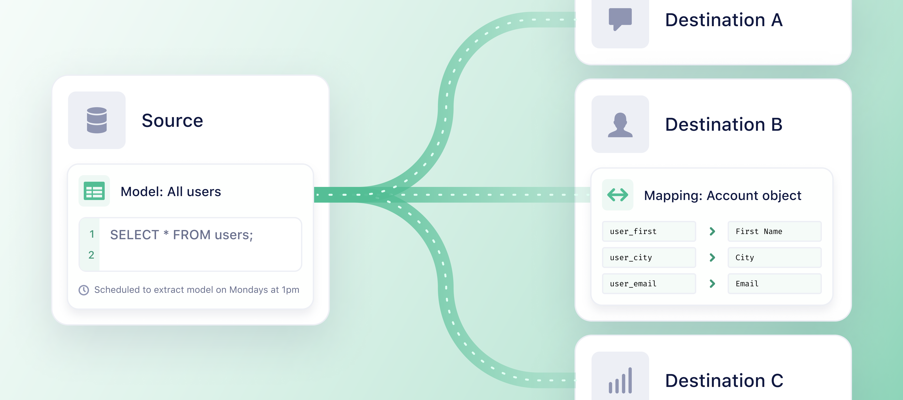

Reverse ETL (Extract, Transform, Load) extracts data from a data warehouse using a query you provide, and syncs the data to your 3rd party destinations. For example, with Reverse ETL, you can sync records from Snowflake to Mixpanel. Reverse ETL supports event and object data. This includes customer profile data, subscriptions, product tables, shopping cart tables, and more.

## Example use cases
Use Reverse ETL when you want to:
* Sync audiences and other data built in the warehouse to Braze, Hubspot, or Salesforce Marketing Cloud for personalized marketing campaigns.
* Sync enriched data to Mixpanel for a more complete view of the customer, or enrich Segment Unify with data from the warehouse.
* Send data in the warehouse back into Segment as events that can be activated in all supported destinations, including Twilio Engage and other platforms.
* Pass offline or enriched data to conversion APIs like Facebook, Google Ads, TikTok, or Snapchat.
* Connect Google Sheets to a view in the warehouse for other business teams to have access to up-to-date reports.

## Getting started
There are four components to Reverse ETL: Sources, Models, Destinations, and Mappings.

Follow these 4 steps to set up Reverse ETL and learn what each component is about:
1. [Add a Source](#step-1-add-a-source)
2. [Add a Model](#step-2-add-a-model)
3. [Add a Destination](#step-3-add-a-destination)
4. [Create Mappings](#step-4-create-mappings)

> info ""
> The UI navigation and interface will look different from what's presented in the docs until Reverse ETL rolls out to all users for GA.

### Step 1: Add a source
A source is where your data originates from. Traditionally in Segment, a [source](/docs/connections/sources/#what-is-a-source) is a website, server library, mobile SDK, or cloud application which can send data into Segment. In Reverse ETL, your data warehouse is the source.

To add your warehouse as a source:

> warning ""
> You need to be a user that has both read and write access to the warehouse.

1. Navigate to **Connections > Sources** and select the **Reverse ETL** tab in the Segment app.
2. Click **Add Reverse ETL source**.
3. Select the source you want to add. You can choose between BigQuery, Redshift, and Snowflake.
4. Follow the corresponding setup guide for your Reverse ETL source.
    * [BigQuery Reverse ETL setup guide](/docs/connections/reverse-etl/reverse-etl-source-setup-guides/bigquery-setup/)
    * [Redshift Reverse ETL setup guide](/docs/connections/reverse-etl/reverse-etl-source-setup-guides/redshift-setup/)
    * [Snowflake Reverse ETL setup guide](/docs/connections/reverse-etl/reverse-etl-source-setup-guides/snowflake-setup/)
5. Add the account information for your source.  
    * For Snowflake users: Learn more about the Snowflake Account ID [here](https://docs.snowflake.com/en/user-guide/admin-account-identifier.html){:target="_blank"}.
5. Click **Test Connection** to test to see if the connection works.
6. Click **Create Source** if the test connection is successful.

After you add your data warehouse as a source, you can [add a model](#step-2-add-a-model) to your source.

### Step 2: Add a model
Models are SQL queries that define sets of data you want to synchronize to your Reverse ETL destinations. After you add your source, you can add a model.

To add your first model:
1. Navigate to **Connections > Sources** and select the **Reverse ETL** tab. Select your source and click **Add Model**.
2. Click **SQL Editor** as your modeling method. (Segment will add more modeling methods in the future.)
3. Enter the SQL query that’ll define your model. Your model is used to map data to your Reverse ETL destinations.
4. Choose a column to use as the unique identifier for each record in the **Unique Identifier column** field.
    * The Unique Identifier should be a column with unique values per record to ensure checkpointing works as expected. It can potentially be a primary key. This column is used to detect new, updated, and deleted records.
5. Click **Preview** to see a preview of the results of your SQL query. The data from the preview is extracted from the first 10 records of your warehouse.
6. Click **Next**.
7. Enter your **Model Name**.
8. Select the Schedule type for the times you want the model’s data to be extracted from your warehouse. You can choose from:
    * **Interval**: Extractions perform based on a selected time cycle.
    * **Day and time**: Extractions perform at specific times on selected days of the week.
9. Select how often you want the schedule to sync in **Schedule configuration**.
    * For an **Interval** schedule type, you can choose from: 15 minutes, 30 minutes, 1 hour, 2 hours, 4 hours, 6 hours, 8 hours, 12 hours, 1 day.
        * 15 minutes is considered real-time for warehouse syncs
    * For a **Day and time** schedule type, you can choose the day(s) you’d like the schedule to sync as well as the time. You can only choose to sync the extraction at the top of the hour.
10. Click **Create Model**.

To add multiple models to your source, repeat steps 1-10 above.

### Step 3: Add a destination
Once you’ve added a model, you need to add a destination. In Reverse ETL, destinations are the business tools or apps you use that Segment syncs the data from your warehouse to.

If your destination is not listed in the Reverse ETL catalog, use the [Segment Connections Destination](#segment-connections-destination) to send data from your Reverse ETL warehouse to your destination.

> info ""
> Depending on the destination, you may need to know certain endpoints and have specific credentials to configure the destination.  

To add your first destination:
1. Navigate to **Connections > Destinations** and select the **Reverse ETL** tab.
2. Click **Add Reverse ETL destination**.
3. Select the destination you want to connect to and click **Configure**.
4. Select the Reverse ETL source you want to connect the destination to.
5. Enter the **Destination name** and click **Create Destination**.
6. Enter the required information on the **Settings** tab of the destination.
7. Navigate to the destination settings tab and enable the destination. If the destination is disabled, then Segment won't be able to start sync.

### Step 4: Create mappings
After you’ve added a destination, you can create mappings from your warehouse to the destination. Mappings enable you to map the data you extract from your warehouse to the fields in your destination.

To create a mapping:
1. Navigate to **Conections > Destinations** and select the **Reverse ETL** tab.
2. Select the destination that you want to create a mapping for.  
3. Click **Add Mapping**.
2. Select the model to sync from.
3. Select the **Action** you want to sync and click **Next**.
      * Actions determine the information sent to the destination. The list of Actions will be unique to each destination.
4. In the **Select record to map and send** section, select which records to send to your destination after Segment completes extracting data based on your model. You can choose from:
      * Added records
      * Updated records
      * Added or updated records
      * Deleted records
5. Select a test record to preview the fields that you can map to your destination in the **Add test record** field.
6. Define how to map the record columns from your model to your destination in the **Select Mappings** section.
      * You map the fields that come from your source, to fields that the destination expects to find. Fields on the destination side depend on the type of action selected.
7. Click **Create Mapping**.
8. Select the destination you’d like to enable on the **My Destinations** page under **Reverse ETL > Destinations**.
9. Turn the toggle on for the **Mapping Status**. Events that match the trigger condition in the mapping will be sent to the destination.
    * If you disable the mapping state to the destination, events that match the trigger condition in the mapping won’t be sent to the destination.

To add multiple mappings from your warehouse to your destination, repeat steps 1-9 above.

## Using Reverse ETL
After you've followed [all four steps](/docs/connections/reverse-etl/#getting-started) and set up your source, model, destination, and mappings for Reverse ETL, your data will extract and sync to your destination(s) right away if you chose an interval schedule. If you set your data to extract at a specific day and time, the extraction will take place then.

### Sync history and observability
Check the status of your data extractions and see details of your syncs. Click into failed records to view additional details on the error, sample payloads to help you debug the issue, and recommended actions.

To check the status of your extractions:
1. Navigate to **Connections > Destinations** and select the **Reverse ETL** tab.
2. Select the destination you want to view.
3. Select the mapping you want to view.  
4. Click the sync you want to view to get details of the sync. You can view:
    * The status of the sync.
    * Details of how long it took for the sync to complete.
    * How many total records were extracted, as well as a breakdown of the number of records added, updated, and deleted.
    * The load results - how many successful records were synced as well as how many records were updated, deleted, or are new.
5. If your sync failed, click the failed reason to get more details on the error and view sample payloads to help troubleshoot the issue.

### Edit your model

To edit your model:
1. Navigate to **Connections > Destinations** and select the **Reverse ETL** tab.
2. Select the source and the model you want to edit.
3. On the overview tab, click **Edit** to edit your query.
4. Click the **Settings** tab to edit the model name or change the schedule settings.  

### Edit your mapping

To edit your mapping:
1. Navigate to **Connections > Destinations** and select the **Reverse ETL** tab.
2. Select the destination and the mapping you want to edit.
3. Select the **...** three dots and click **Edit mapping**. If you want to delete your mapping, select **Delete**.

## Record diffing
Reverse ETL computes the incremental changes to your data directly within your data warehouse. The Unique Identifier column is used to detect the data changes, such as new, updated, and deleted records.

In order for Segment to compute the data changes within your warehouse, Segment needs to have both read and write permissions to the warehouse schema table. At a high level, the extract process requires read permissions for the query being executed. Segment keeps track of changes to the query results through tables that Segment manages in a dedicated schema (for example, `_segment_reverse_etl`), which requires some write permissions.

> warning ""
> There may be cost implications to having Segment query your warehouse tables.

## Segment Connections destination
If you don’t see your destination listed in the Reverse ETL catalog, use the [Segment Connections destination](/docs/connections/destinations/catalog/actions-segment/) to send data from your Reverse ETL warehouse to other destinations listed in the [catalog](/docs/connections/destinations/catalog/).  

The Segment Connections destination enables you to mold data extracted from your warehouse in [Segment Spec](/docs/connections/spec/) API calls that are then processed by [Segment’s HTTP Tracking API](/docs/connections/sources/catalog/libraries/server/http-api/). The requests hit Segment’s servers, and then Segment routes your data to any destination you want. Get started with the [Segment Connections destination](/docs/connections/destinations/catalog/actions-segment/). 	

> warning ""
>  The Segment Connections destination sends data to Segment’s Tracking API, which has cost implications. New users count as new MTUs and each call counts as an API call. For information on how Segment calculates MTUs and API calls, please see [MTUs, Throughput and Billing](/docs/guides/usage-and-billing/mtus-and-throughput/).

## Limits
To provide consistent performance and reliability at scale, Segment enforces default use and rate limits for Reverse ETL.

### Usage limits
Reverse ETL usage limits are measured based on the number of records processed to each destination – this includes both successful and failed records. For example, if you processed 50k records to Braze and 50k records to Mixpanel, then your total Reverse ETL usage is 100k records.

Processed records represents the number of records Segment attempts to send to each destination. Keep in mind that not all processed records are successfully delivered, for example, such as when the destination experiences an issue.

Your plan determines how many Reverse ETL records you can process in one monthly billing cycle. When your limit is reached before the end of your billing period, your syncs will pause and then resume on your next billing cycle. To see how many records you’ve processed using Reverse ETL, navigate to **Settings > Usage & billing** and select the **Reverse ETL** tab.

Plan | Number of Reverse ETL records you can process to destinations per month | How to increase your number of Reverse ETL records
---- | --------------------------------------------------------------------------- | ---------------------------------------------------
Free | 500K | Upgrade to the Teams plan in the Segment app by navigating to **Settings > Usage & billing**.
Teams | 1 million | Contact your sales representative to upgrade your plan to Business.
Business | 50 x the number of [MTUs](/docs/guides/usage-and-billing/mtus-and-throughput/#what-is-an-mtu)  or .25 x the number of monthly API calls | Contact your sales rep to upgrade your plan.

If you have a non-standard or high volume usage plan, you may have unique Reverse ETL limits or custom pricing.

### Configuration limits

Name | Details | Limit
--------- | ------- | ------
Model query length | The maximum length for the model SQL query. | 131,072 characters
Model identifier column name length | The maximum length for the ID column name. | 191 characters
Model timestamp column name length | The maximum length for the timestamp column name. | 191 characters
Sync frequency | The shortest possible duration Segment allows between syncs. | 15 minutes

### Extract limits
The extract phase is the time spent connecting to your database, executing the model query, updating internal state tables and staging the extracted records for loading.

Name | Details | Limit
----- | ------- | ------
Record count | The maximum number of records a single sync will process. Note: This is the number of records extracted from the warehouse not the limit for the number of records loaded to the destination (for example, new/update/deleted). | 30 million records
Column count | The maximum number of columns a single sync will process. | 512 columns
Column name length | The maximum length of a record column. | 128 characters
Record JSON size | The maximum size for a record when converted to JSON (some of this limit is used by Segment). | 512 KiB
Column JSON size | The maximum size of any single column value. | 128 KiB
