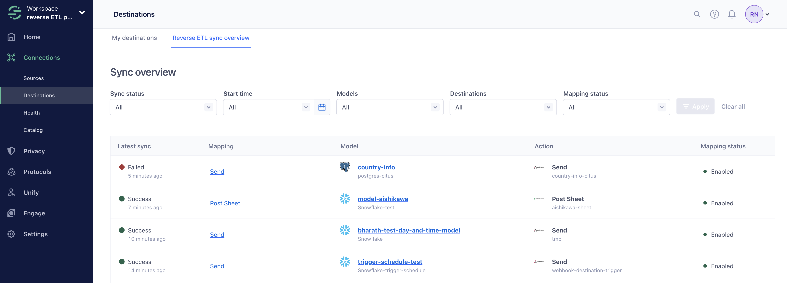
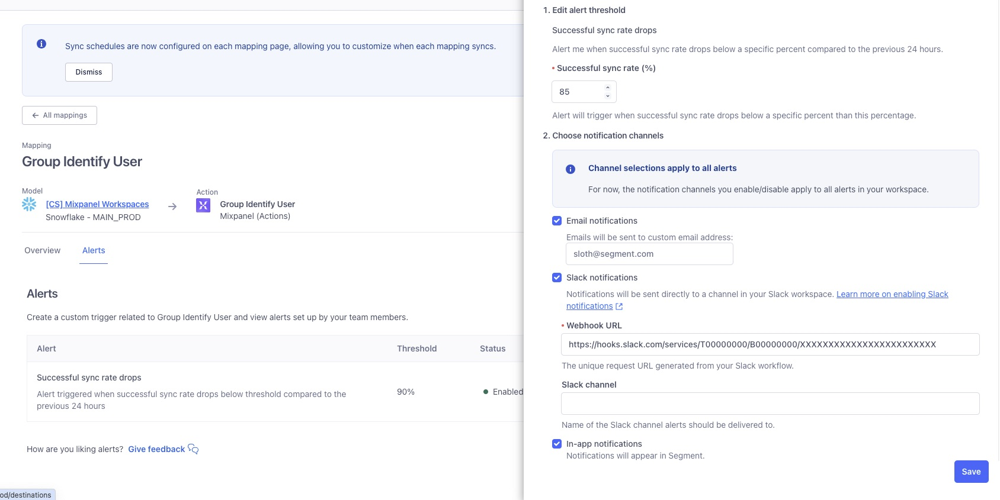

View your sync history, reset your syncs, or subscribe to alerts.

## Sync overview
The Reverse ETL sync overview tab, located under **Connections > Destinations**, gives you an overview of your latest Reverse ETL syncs. 

You can view the following information about each sync: 
- **Latest sync**: The status of your latest sync. Syncs can either be **In progress**, **Successful**, or **Failed**.
- **Mapping**: The named mapping. 
- **Model**: The model that extracts data from your warehouse.
- **Action**: The action that your destination uses to map information from your warehouse to your downstream destination. 
- **Mapping status**: The status of your mapping - either **Enabled** or **Disabled**. 

## Sync history
Check the status of your data extractions and see details of your syncs. Click into failed records to view additional details on the error, sample payloads to help you debug the issue, and recommended actions.

To check the status of your extractions:
1. Navigate to **Connections > Destinations** and select the **Reverse ETL** tab.
2. Select the destination you want to view.
3. Select the mapping you want to view.  
4. Click the sync you want to view to get details of the sync. You can view:
    * The status of the sync.
    * Details of how long it took for the sync to complete.
    * How many total records were extracted, as well as a breakdown of the number of records added, updated, and deleted.
    * The load results - how many successful records were synced as well as how many records were updated, deleted, or are new.
5. If your sync failed, click the failed reason to get more details on the error and view sample payloads to help troubleshoot the issue.

## Automatic retry handling

> info "Automatic retry handling might not yet be available in your workspace"
> To ensure overall system stability and performance, Segment is releasing automatic retry handling to all workspaces in a phased rollout program. Segment expects this feature to be available to all customers by January 31, 2025.

Segment automatically retries events that were extracted from your data warehouse but failed to load for up to 14 days or 5 syncs following a partially successful sync or a sync failure. 

Segment checks for the latest changes in your data before loading the failed records on a subsequent (automatically scheduled or manually triggered) sync to ensure the data loaded into Segment isn’t stale and only the latest version of the data is loaded to destination. If the error causing the load failure is coming from an upstream tool, you can fix the error in the upstream tool to resolve the load error on a subsequent sync.

> warning "Syncs with intervals less than or equal to two hours may not see failed events on the sync immediately following failed record"
> Syncs with intervals less than or equal to two hours may not see failed events right away, as Segment's internal systems take up to two hours to retry events that initially failed. 

## Reset syncs
Reverse ETL uses the Unique Identifier column to detect data changes, like new, updated, and deleted records. If you encounter an error, you can reset Segment’s tracking of this column and force Segment to manually add all records from your dataset. 

To reset a sync:
1. Select the three dots next to **Sync now**.
2. Select **Reset sync**. 
3. Click **I understand what happens when I reset a sync state**. 
4. Click **Reset sync**.

## Cancel syncs
You can cancel syncs when your sync is currently running during the extraction and load phase. 

To cancel a sync:
1. Navigate to **Connections > Destinations > Reverse ETL**.
2. Select the mapping with a sync that is in progress.
3. Select the sync that is in progress.
4. Click **Cancel sync** to cancel the sync. 
5. Select the reason for canceling the sync. 

Your canceled syncs with have a status as *Canceled,* and any syncs that are in the process of being canceled will have a status of *Canceling*. 

Once you cancel a sync, the record count under **Extraction Results** reflects the records already processed. These records won't be included in future syncs. To reprocess these records, you can reset or replay the sync.

## Replays
You can choose to replay syncs. To replay a specific sync, contact [friends@segment.com](mailto:friends@segment.com). Keep in mind that triggering a replay resyncs all records for a given sync.

## Alerting
You can opt in to receive email, Slack, and in-app alerts about Reverse ETL sync failures and fluctuations in the volume of events successfully delivered to your mapping. 

The notification channels that you select for one alert will apply to all alerts in your workspace. 

### Failed or partially successful syncs
To subscribe to alerts for a failed or partially successful sync: 
1. Navigate to **Settings > User Preferences**. 
2. Select **Reverse ETL** in the **Activity Notifications** section.
3. Click the Reverse ETL sync status that you'd like to receive notifications for. You can select one or more of the following sync statuses:
    - **Reverse ETL sync failed**: Receive a notification when your Reverse ETL sync fails.
    - **Reverse ETL sync partial success**: Receive a notification when your Reverse ETL sync is partially successful.
4. Select one or more of the following alert options: 
    - **Enable email notifications**: Enter an email address or alias that should receive alerts.
    - **Enable Slack notifications**: Enter a webhook URL and Slack channel name. You can post messages to your channel with either a [webhook](https://api.slack.com/messaging/webhooks){:target="_blank”} or a [workflow](https://slack.com/help/articles/360041352714-Build-a-workflow--Create-a-workflow-that-starts-outside-of-Slack){:target="_blank”}.
    - **Enable in-app notifications**: Select this option to see an in-app notification.
5. Click **Create alert**.

> success ""
> If you opted to receive notifications by email, you can click **View active email addresses** to see the email addresses that are currently signed up to receive notifications. 

<!--- IG 9/2024 - not yet working
### Model-level volume spike alerts

You can create an alert that notifies you when the volume of events received by your source in the last 24 hours changes beyond a set percentage. For example, if you set a change percentage of 4% and your source received 100 events over the first 24 hours, Segment would notify you the following day if your source ingested fewer than 96 or more than 104 events.

To receive a volume spike alert in a Slack channel, you must first create a Slack webhook. For more information about Slack webhooks, see the [Sending messages using incoming webhooks](https://api.slack.com/messaging/webhooks){:target="_blank”} documentation.

1. Navigate to the model you'd like to create an alert for and select the **Alerts** tab. 
2. Click **Create alert**. 
3. Set a *change in event volume* percentage, or the percentage of change in event volume from your source that would prompt an alert.
4. Select one or more of the following notification channels: 
    - **Email**: Enter an email address or alias that should receive alerts.
    - **Slack notification**: Enter a Webhook URL and a Slack channel name to receive alerts in a Slack channel. 
    - **In-app notifications**: Select this to receive notifications in the Segment app. To view your notifications, select the bell next to your user icon in the Segment app.
5. Toggle the **Enable alert** setting on and click **Create**. 

To edit or disable your alert, navigate to your model's Alerts tab and select the Actions menu for the model you'd like to edit.
--->

### Mapping-level successful delivery rate fluctuations

You can create an alert that notifies you when the volume of events successfully received by your mapping in the last 24 hours falls below a percentage you set. For example, if you set a percentage of 99%, Segment notifies you if your destination had a successful delivery rate of 98% or below. 

To receive a successful delivery rate fluctuation alert in a Slack channel, you must first create a Slack webhook. For more information about Slack webhooks, see Slack's [Sending messages using incoming webhooks](https://api.slack.com/messaging/webhooks){:target="_blank”} documentation.

To subscribe to alerts for successful delivery fluctuations at the mapping level: 
1. Navigate to your intended mapping and select the **Alerts** tab. 
2. Click **Create alert**. 
3. Set an *alert threshold*, or the percentage of successfully delivered events that would prompt an alert. 
4. Select one or more of the following notification channels: 
    - **Email**: Enter an email address or alias that should receive alerts.
    - **Slack notification**: Enter a Webhook URL and a Slack channel name to receive alerts in a Slack channel. You can post messages to your channel with either a [webhook](https://api.slack.com/messaging/webhooks){:target="_blank”} or a [workflow](https://slack.com/help/articles/360041352714-Build-a-workflow--Create-a-workflow-that-starts-outside-of-Slack){:target="_blank”}.
    - **In-app notifications**: Select this to receive notifications in the Segment app. To view your notifications, select the bell next to your user icon in the Segment app.
5. Toggle the **Enable alert** setting on and click **Create**. 

To edit or disable your alert, navigate to your mapping's Alerts tab and select the Actions menu for the alert you'd like to edit.  
