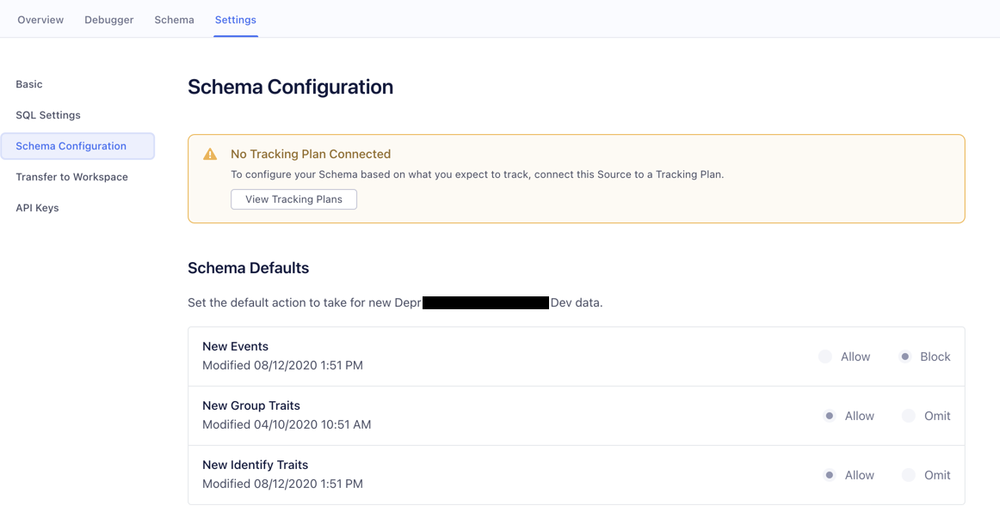
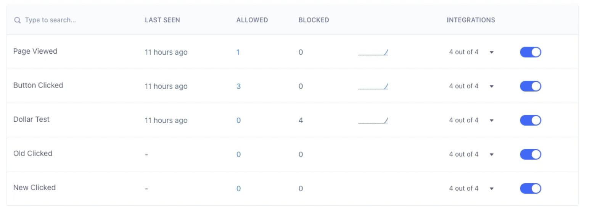
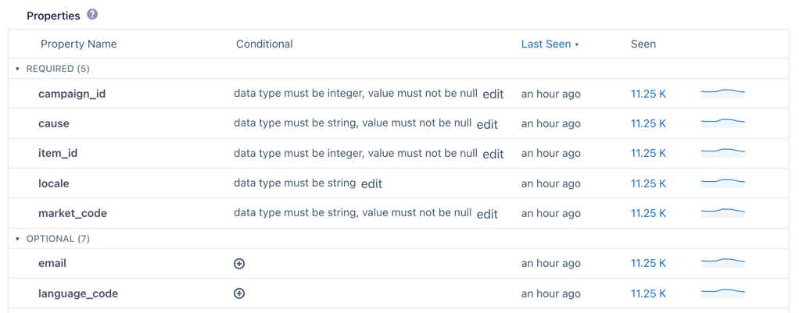

## Schema Defaults Removal FAQs

Schema Defaults allows you to block new events and traits by default. This feature was launched to Private Beta in 2017 as an exploration feature before the introduction of Protocols. It will be removed on August 11, 2021.

#### How do I know if I’m using Schema Defaults?
Navigate to **Connections** and choose your source. In the **Settings** tab under **Schema Configuration**, if you see the **Schema Defaults** section and have any events or traits that are marked **Block** or **Omit**, you have Schema Defaults enabled.

#### What happens after Schema Defaults is removed?
Any events and traits that were blocked by Schema Defaults will continue to be blocked. Any new events and traits will automatically be allowed.

Before they are removed, you can change your Source Schema settings to allow or block individual events, properties, and traits by following these steps:

1. Go to the **Schema** tab of your source.
2. Use the toggle to allow or block the different events, properties, and traits.

#### What happens if a source with Schema Defaults enabled has a Tracking Plan connected to it?
Tracking Plans _replace_ Schema Defaults, so these sources will continue to behave the same.

#### How should I prepare for the removal of Schema Defaults?
If you still want to block new events and traits by default, you can connect a [Protocols Tracking Plan](/docs/protocols/) to your source.

## Event Requirements Removal FAQs

Event Requirements allow you to define rules for an event property and block violating events. This feature was launched to Private Beta in 2017 as an exploratory feature before the introduction of Protocols. It will be removed on August 11, 2021.

#### How do I know if I’m using Event Requirements?
Navigate to **Connections** and choose your source. Go to the **Schema** tab and click on an event. If you’re able to click on an event and view the properties and rules for it, you’re using Event Requirements.

#### What happens after Event Requirements is removed?
Events that violate the rules set up in Event Requirements will no longer be blocked. The Event Requirements UI will be removed from the Segment web app, and you won’t be able to interact with the feature settings.

#### What happens if a source with Event Requirements enabled has a Tracking Plan connected to it?
[Tracking Plans](/docs/protocols/tracking-plan/) replace any Event Requirements, so these sources will continue to behave the same.

#### How should I prepare for the removal of Event Requirements?
If you still want to block the events that you set up in Event Requirements, you can connect a [Protocols Tracking Plan](/docs/protocols/tracking-plan/) to your source.
