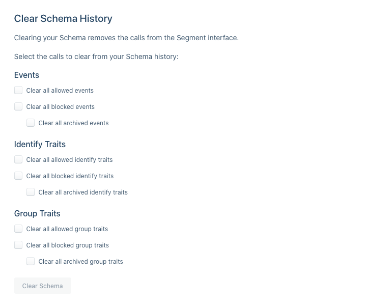

**How many unique events can be logged in my Segment Schema table?**

While you can technically track unlimited events with Segment, only the first 2,000 events will be visible on the Schema page for a given Source. After you hit the 2,000 event limit, all future events will still be tracked and sent to your Destinations. They will not, however, be logged in the Segment Schema table.

**How many unique event properties can be logged on the event details page?**

While you can track unlimited event properties with Segment, the event details page for a specific event can only show the first 300 properties. After you hit the 300 property limit, future properties are still tracked and sent to your Destinations, but they won't appear on the event details page. This limit includes nested properties in an event's `properties` object.

These limits can also affect the traits and properties that you can see in the Computed Trait and Audience builder tools in Personas. If expected traits or properties do not appear in these tools, contact the [Segment Support team](https://segment.com/help/contact/).

**How can I clear the Schema if I have hit the limits?**

If you hit any of the limits or would like to clear out old events or properties, you can clear the Schema data from your Source Settings. In your Source, navigate to Settings, then Schema Configuration. Scroll down to the **Clear Schema History** setting.

