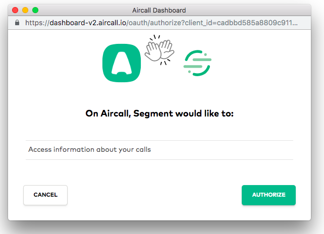
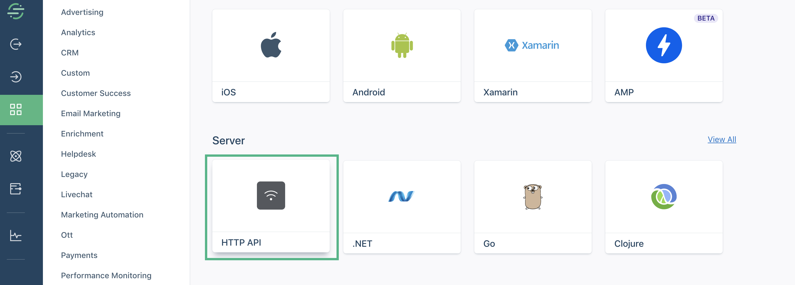
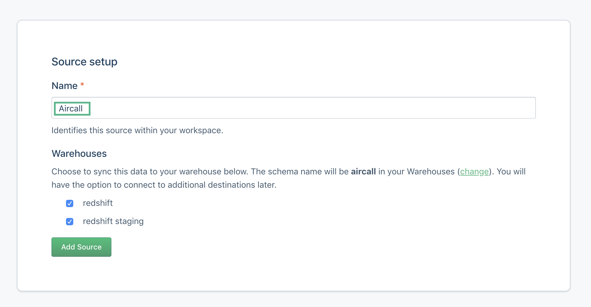
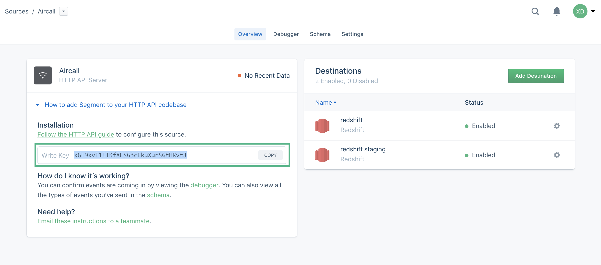
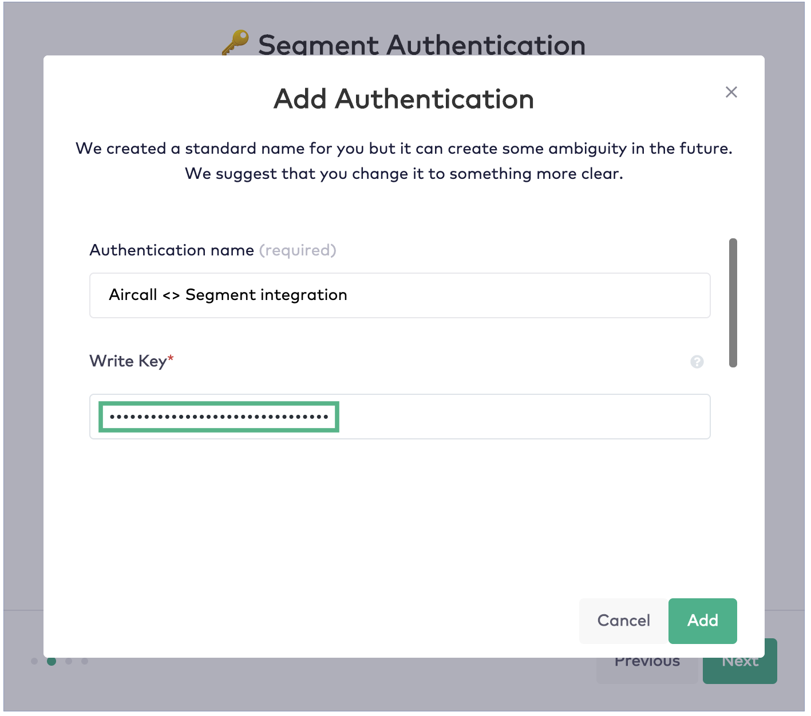
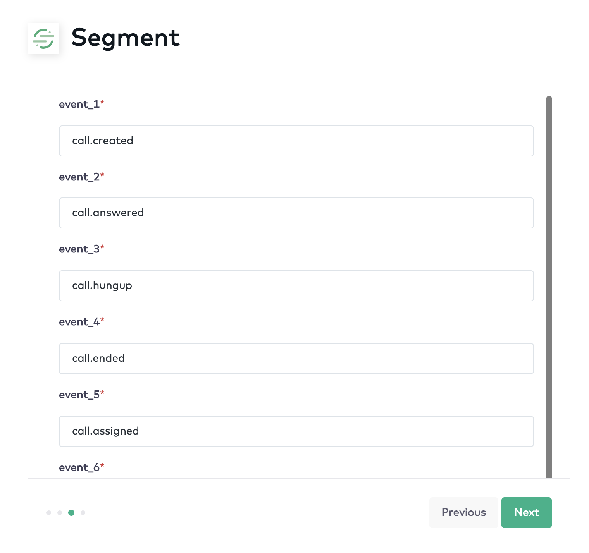



Connect [Aircall](https://aircall.io) with Segment to bring Aircall events and phone call data to your data warehouse. Improve your knowledge of customer touchpoints by leveraging call activity.

This source is maintained by Aircall. For any issues with the source, [contact the Aircall Support team](mailto:support@aircall.io).



## Getting Started

Before you start, make sure that you have admin rights in both Aircall and Segment.

To begin, [login](https://dashboard-v2.aircall.io/login) to your Aircall account.

From your Aircall **Dashboard**, select **Integrations** on the left sidebar menu.
* Select **Segment**
* Click on **Install**

Now you will be guided through three easy steps outlined below.

## **Step 1: Authenticate Aircall**
* Click on **Connect** to **Aircall**.
    * This will open a screen for you to add a required Authentication name. It will not be visible anywhere so any name can be used here -- either the suggested default or a name that you choose yourself.

* Click **Add** and a pop-up will appear.
    * From the pop-up, click on Authorize to allow this integration to access information about your calls in Aircall.

If the integration is successful, you will see a message that says "Authentication for Aircall successfully created." Once you see this, click on Next.

## **Step 2: Authenticate Segment**

Click on **Connect to Segment**
- This will open a screen for you to add a required **Authentication name**. You will see a default name already provided for you. While a name is required, it will not be visible anywhere -- either use the suggested default or a name that you choose yourself.

- A **Write Key** is required. This is a unique tracking key for your project. You can find this key from the Segment dashboard by following the steps below.
    * Login to your Segment account.
    * Go to Source from the left sidebar menu.
    * Click on Add Source and scroll to select HTTP API

    * Click on **Connect**

    * When creating a new Source setup, you will need to choose a name. We recommend that you choose an identifiable name such as "Aircall" for recognition. Then you may choose the warehouses or destination(s) where you'd like your data to be synced.

    * Once your source has been created, a **Write Key** will be generated. **Copy** this key and return to the configuration steps in Aircall to paste the key in the field as shown below.

        - Note: if you see a field to input a **Personas Key**, note that this field is not required and you can leave this field blank. We are working to remove it from the installation flow.

    * When finished, click on **Add**.

If the integration is successful, you will see a message that says "Authentication for Segment successfully created." Once you see this, click on **Next**.

## **Step 3: Select Aircall events to send to Segment**
- There are up to [26 Aircall events](https://developer.aircall.io/api-references/#events) that can be pushed to Segment. As such, you will see a list of 26 possible events pre-populated for you as the default setting is for all and every Aircall event to be pushed to Segment.

- **If there are events that you do not want to be sent to Segment**, delete the default value(s) shown in the list of 26 events (or write "null") if you determine that certain events should not be a source for Segment.

- Click on **Finish**.

Your integration is active! Now just connect the Aircall number(s) that you would like to be active for this integration and, that's it! You're all set and ready to get the most out of your Aircall-Help Segment integration.

Need a little more help? No problem! Just contact our [Support Team](mailto:support@aircall.io), we would be happy to help!

## Events

Below is a table of events that Aircall sends to Segment. These events will show up as tables in your warehouse, and as regular events in your other Destinations. Aircall will send through the `userId` if available.

<table>
  <tr>
   <td>Event Name</td>
   <td>Description</td>
  </tr>
  <tr>
   <td>number.created</td>
   <td>When a new number is created on your account</td>
  </tr>
  <tr>
   <td>number.opened</td>
   <td>When a number opens according to its opening hours</td>
  </tr>
  <tr>
   <td>number.closed</td>
   <td>When a number closes according to its opening hours</td>
  </tr>
  <tr>
   <td>number.deleted</td>
   <td>When a number is deleted on your account</td>
  </tr>
  <tr>
   <td>contact.created</td>
   <td>When a new contact is created on Aircall</td>
  </tr>
  <tr>
   <td>contact.updated</td>
   <td>When a contact is updated on Aircall</td>
  </tr>
  <tr>
   <td>contact.deleted</td>
   <td>When a contact is deleted on Aircall</td>
  </tr>
  <tr>
   <td>user.created</td>
   <td>When a new user is created on your account</td>
  </tr>
  <tr>
   <td>user.opened</td>
   <td>When an user becomes available according to its working hours</td>
  </tr>
  <tr>
   <td>user.connected</td>
   <td>When an user is logged in Aircall Phone</td>
  </tr>
  <tr>
   <td>user.closed</td>
   <td>When an user becomes unavailable according to its working hours</td>
  </tr>
  <tr>
   <td>user.disconnected</td>
   <td>When an user is logged out of Aircall Phone</td>
  </tr>
  <tr>
   <td>user.deleted</td>
   <td>When a user is deleted on your account</td>
  </tr>
  <tr>
   <td>call.created</td>
   <td>When a new call starts</td>
  </tr>
  <tr>
   <td>call.answered</td>
   <td>When a call is answered</td>
  </tr>
  <tr>
   <td>call.hungup</td>
   <td>When a call is hung up</td>
  </tr>
  <tr>
   <td>call.ended</td>
   <td>When a call ends on your account. It will be sent ~20sec after call is actually hung up, time to gather extra data like recording etc.</td>
  </tr>
  <tr>
   <td>call.assigned</td>
   <td>When a call is assigned to someone</td>
  </tr>
  <tr>
   <td>call.archived</td>
   <td>When a call is archived</td>
  </tr>
  <tr>
   <td>call.tagged</td>
   <td>When a call is tagged by someone</td>
  </tr>
  <tr>
   <td>call.untagged</td>
   <td>When a call is untagged by someone</td>
  </tr>
  <tr>
   <td>call.commented</td>
   <td>When a call is commented by someone</td>
  </tr>
  <tr>
   <td>call.transferred</td>
   <td>When a call is transferred to another person</td>
  </tr>
  <tr>
   <td>call.ringing_on_agent</td>
   <td>When a call starts ringing on an agent's app</td>
  </tr>
  <tr>
   <td>call.agent_declined</td>
   <td>When an agent declines an inbound call</td>
  </tr>
  <tr>
   <td>call.voicemail_left</td>
   <td>When a voicemail is left on a call</td>
  </tr>
</table>

## Adding Destinations

Now that your Source is set up, you can connect it with Destinations.

Log into your downstream tools and check to see that your events are populating and they contains all the properties you expect. If all your events and properties are not showing up, refer to the Destination docs for troubleshooting.

If you experience any issues with how the events arrive in Segment, [contact the Aircall team](mailto:support@aircall.io).
