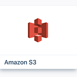
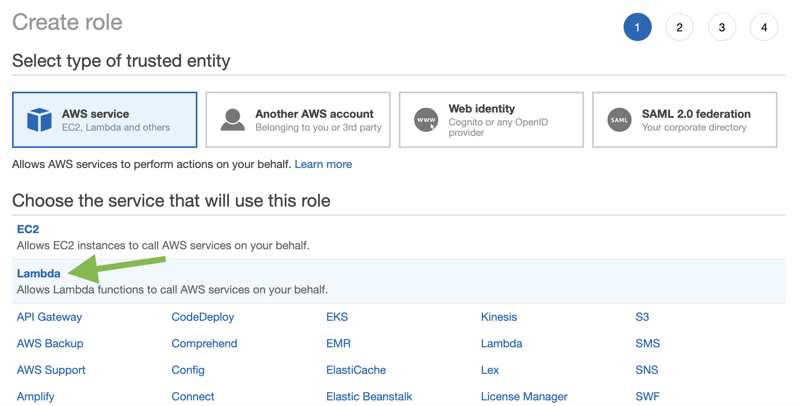
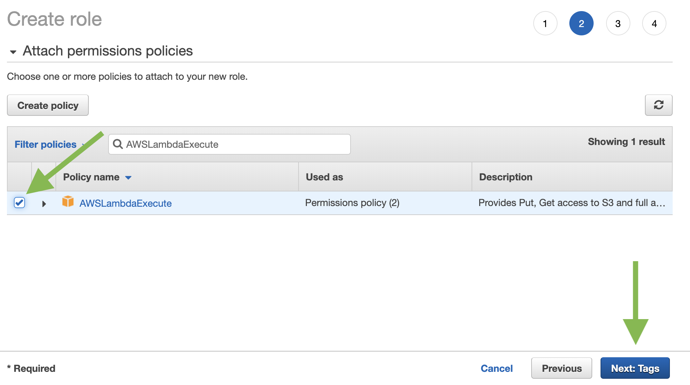
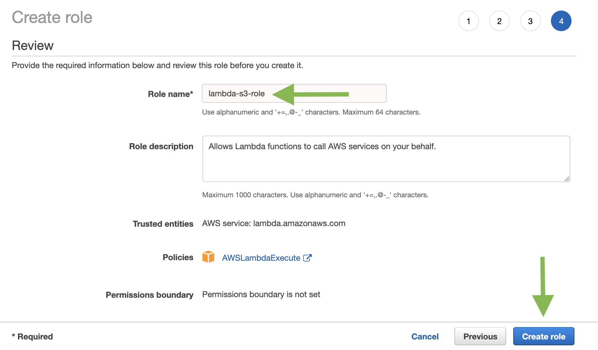
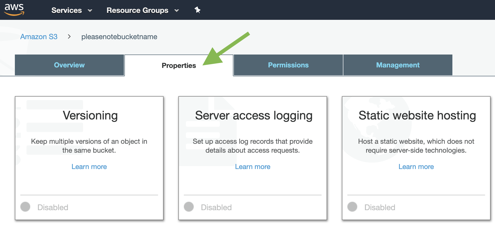
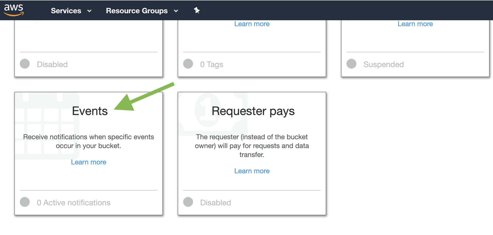
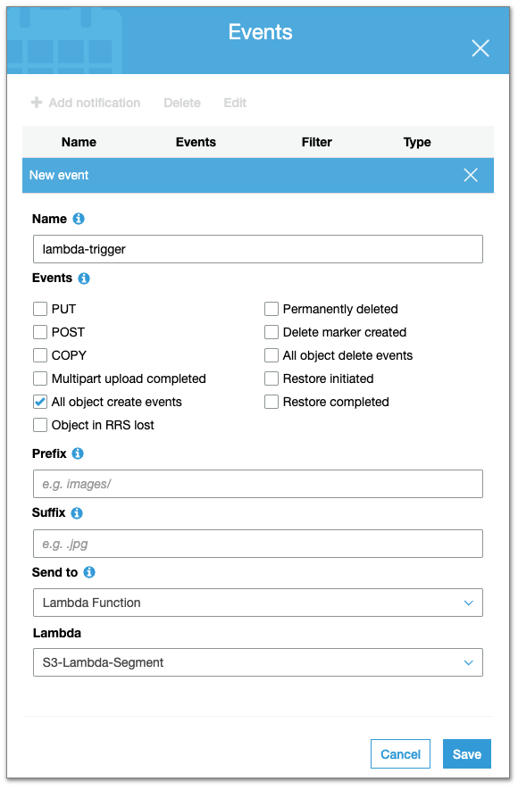



This document contains a procedure that enables you to upload a CSV file containing data to Amazon S3, where it uses Lambda to automatically parse, format, and upload the data to Segment.

You might have sources of data where you can't instrument Segment's SDKs, including other SaaS tools for which a Segment integration is not yet available. In many of these cases, you can extract data from these sources in CSV format, and then use our server-side SDKs or HTTP tracking API to push the data to Segment.

The goal of this walkthrough is to make this process easier by providing an automated process that ingests this data. Once you complete this walkthrough, you will have the following Segment, Amazon S3, Lambda, and IAM resources deployed:

- a Segment S3 source
- an AWS Lambda function
  - an access policy for the Lambda function that grants Amazon S3 permission to invoke it
- an AWS IAM execution role that grants the permissions your Lambda function needs through the permissions policy associated with this role
- an AWS S3 source bucket with a notification configuration that invokes the Lambda function


## Prerequisites

This tutorial assumes that you have some basic understanding of S3, Lambda and the `aws cli` tool. If you haven't already, follow the instructions in  [Getting Started with AWS Lambda](https://docs.aws.amazon.com/lambda/latest/dg/getting-started.html) to create your first Lambda function. If you're unfamiliar with `aws cli`, follow the instructions in [Setting up the AWS Command Line Interface](https://docs.aws.amazon.com/polly/latest/dg/setup-aws-cli.html) before you proceed.

This tutorial uses a command line terminal or shell to run commands. Commands appear preceded by a prompt symbol (`$`) and the name of the current directory, when appropriate.

On Linux and macOS, use your preferred shell and package manager. On macOS, you can use the Terminal application. On Windows 10, you can  [install the Windows Subsystem for Linux](https://docs.microsoft.com/en-us/windows/wsl/install-win10) to get a Windows-integrated version of Ubuntu and Bash.

[Install NPM](https://www.npmjs.com/get-npm) to manage the function's dependencies.

## Getting Started

### 1. Create an S3 source in Segment

- **Note your write key for this source** - we will need it later!

### 2. Create the Execution Role

Create the  [execution role](https://docs.aws.amazon.com/lambda/latest/dg/lambda-intro-execution-role.html) that gives your function permission to access AWS resources.

**To create an execution role**

1. Open the  [roles page](https://console.aws.amazon.com/iam/home#/roles)  in the IAM console.
2. Choose  **Create role**.
3. Create a role with the following properties:
    - Set the **Trusted entity** to **AWS Lambda**.
      
    - Set the **Permissions**  to **AWSLambdaExecute**.
       
    - You can skip creating a tag.
    - Set the **Role name** to **`lambda-s3-role`**.
      
4. Record the new created IAM role's `role id`! You're going to need it later!

The **AWSLambdaExecute** policy has the permissions that the function needs to manage objects in Amazon S3, and write logs to CloudWatch Logs.

### 3. Create Local Files, an S3 Bucket and Upload a Sample Object

Follow these steps to create your local files, S3 bucket and upload an object.

1. On your local machine, create a folder named `S3-Lambda-Segment`. In that folder create file named `track_1.csv` and paste the following contents into it:
    ```csv
    userId,name,event,properties.plan,properties.accountType,context.ip,context.device.id,timestamp
    1,Tyler Ortiz,test event,bronze,Facebook,175.154.50.123,1,2019-05-11T20:32:27.940Z
    2,Jacob Johnson,test event,silver,Twitter,40.110.228.56,2,2019-05-12T20:32:27.940Z
    3,Ally Sweeney,test event,gold,Instagram,175.155.243.133,3,2019-05-13T20:32:27.940Z
    4,Jasmin Christian,test event,platinum,Pinterest,112.252.20.73,4,2019-05-14T20:32:27.940Z
    ```

>When you invoke the Lambda function manually, before you connect to Amazon S3, you pass sample event data to the function that specifies the source bucket and `track_1.csv` as the newly created object.

2. Open the Amazon S3 console.
3.  Create your bucket. **Record your bucket name** - you'll need it later!
4.  In the source bucket, upload `track_1.csv`.

### 4. Create the Function

Next, create the Lambda function, install dependencies, and zip everything up so it can be deployed to AWS.

The example code template below receives an Amazon S3 event as input, and processes the message that it contains. It reads the newly uploaded `.csv` in the source bucket, transforms the data, then uploads it to Segment.

**Example index.js:**

```js
// dependencies
var async = require('async');
var AWS = require('aws-sdk');
// csvtojson quickly and easily parses and formats our CSV files
var csv = require('csvtojson');
// the following are Segment libraries
var Analytics = require('analytics-node');
var Objects = require('objects-node');

var analytics = new Analytics(process.env.write_key);
var objects = new Objects(process.env.write_key);
var s3 = new AWS.S3();

exports.handler = function(event, context, callback) {
    // Read options from the event.
    //console.log("Reading options from event:\n", util.inspect(event, {depth: 5}));
    var srcBucket = event.Records[0].s3.bucket.name;
    // File name may have spaces or unicode non-ASCII characters.
    var srcFileName    =
    decodeURIComponent(event.Records[0].s3.object.key.replace(/\+/g, " "));
    // Download the CSV from S3, transform, and upload to Segment.
    // More on async.waterfall here: https://caolan.github.io/async/docs.html#waterfall
    async.waterfall([
        function download(next) {
            // Download the CSV from S3 into a buffer.
            //console.log("download");
            s3.getObject({
                    Bucket: srcBucket,
                    Key: srcFileName
                },
                next);
        },
        function transform(response, next) {
            //console.log("transform");
            var csvString = response.Body.toString();
            // In colParser we ensure that our timestamps aren't strings, Segment APIs don't like strings here
            csv({
            	colParser:{
            		"createdAt":function(item){return new Date(item);},
                "timestamp":function(item){return new Date(item);},
            	}
            })
            .fromString(csvString)
            .then((formattedResults)=>{
              next(null,formattedResults);
            })
        },
        function upload(formattedResults, next) {
            //console.log("upload");
            //console.log(formattedResults);
            if(srcFileName.startsWith('identify_')){
              formattedResults.map(function(identifyObject){
                // More in the docs here: https://segment.com/docs/connections/spec/identify/
                analytics.identify(identifyObject);
              });
            }else if(srcFileName.startsWith('track_')){
              formattedResults.map(function(trackObject){
                // More in the docs here: https://segment.com/docs/connections/spec/track/
                analytics.track(trackObject);
              });
            }else if(srcFileName.startsWith('page_')){
              formattedResults.map(function(pageObject){
                // More in the docs here: https://segment.com/docs/connections/spec/page/
                analytics.page(pageObject);
              });
            }else if(srcFileName.startsWith('screen_')){
              formattedResults.map(function(screenObject){
                // More in the docs here: https://segment.com/docs/connections/spec/screen/
                analytics.screen(screenObject);
              });
            }else if(srcFileName.startsWith('group_')){
              formattedResults.map(function(groupObject){
                // More in the docs here: https://segment.com/docs/connections/spec/group/
                analytics.group(groupObject);
              });
            }else if(srcFileName.startsWith('alias_')){
              formattedResults.map(function(aliasObject){
                // More in the docs here: https://segment.com/docs/connections/spec/alias/
                analytics.alias(aliasObject);
              });
            }else if(srcFileName.startsWith('object_')){
              // Who doesn't love a variable named objectObject?! :(
              formattedResults.map(function(objectObject){
                // The Object API accepts a different format than the other APIs
                // More in the docs here: https://github.com/segmentio/objects-node
                // First, we get our collection name
                var objectCollection = srcFileName.split("_")[1];
                // Then, we get and delete our objectId from the object we pass into Segment
                var objectId = objectObject.id;
                delete objectObject.id;
                console.log("objectCollection: ",objectCollection);
                console.log("objectId: ", objectId);
                console.log("objectObject: ",objectObject);
                objects.set(objectCollection, objectId, objectObject);
              });
            }else{
              console.log("ERROR! No call type specified! Your CSV file in S3 should start with 'identify_', 'track_', 'page_', 'screen_', 'group_', 'alias_' or 'object_<collection>'");
              throw new Error;
            }
            // Now we make sure that all of our queued actions are flushed before moving on
            if(srcFileName.startsWith('object_')){
              var objectCollection = srcFileName.split("_")[1];
              objects.flush(objectCollection, function(err, batch){
                next(err,"Done");
              });
            }else{
              analytics.flush(function(err, batch){
                next(err,"Done");
              });
            }
        }
      ], function (err) {
            // Some pretty basic error handling
            if (err) {
                console.error(
                    'Unable to download ' + srcBucket + '/' + srcFileName +
                    ' and upload to Segment' +
                    ' due to an error: ' + err
                );
            } else {
                console.log(
                    'Successfully downloaded ' + srcBucket + '/' + srcFileName +
                    ' and uploaded to Segment!'
                );
            }
            callback(null, "Success!");
        }
    );
};
```

Review the code above and note the following:

-   The function knows the source bucket name and the key name (uploaded file name) of the object from the event data it receives as parameters.
- The `csvtojson` npm package parses the CSV and reformats it to JSON.
- The Segment Object API accepts a different format than the other APIs.

The deployment package is a .zip file that contains your Lambda function code and any dependencies.

**To create a deployment package**

1. Save the function code as `index.js` in the folder `S3-Lambda-Segment`.
2. Install dependencies
   ```bash
   $ cd S3-Lambda-Segment
   S3-Lambda-Segment$ npm install async csvtojson analytics-node objects-node
   ```
3. Zip everything up in preparation for deployment to AWS.
   ```
   S3-Lambda-Segment$ zip -r function.zip .
   ```

**To create the function**

-   Upload the Lambda function using the following (note that your Lambda function name doesn't exist yet, you're naming it here):

    ```bash
    S3-Lambda-Segment$ aws lambda create-function --function-name <!Your Lambda Name!> --zip-file fileb://function.zip --handler index.handler --runtime nodejs8.10 --timeout 90 --memory-size 1024 --role <!Your Role ARN!> --environment Variables={write_key=<!Your Segment Write Key!>}
    ```

**Record your Lambda function's name and region! You'll need them later**.

The command above sets a 90-second timeout value as the function configuration. Depending on the size of objects you upload, you might need to increase the timeout value using the following AWS CLI command.

```bash
S3-Lambda-Segment$ aws lambda update-function-configuration --function-name <!Your Lambda Name!> --timeout 180
```

### 5. Test the Lambda Function

In this step, you invoke the Lambda function manually using sample Amazon S3 event data.

**To test the Lambda function**

1. Create an empty file named `output.txt` in the `S3-Lambda-Segment` folder - the aws cli complains if it's not there.
   ```bash
   S3-Lambda-Segment$ touch output.txt
   ```
2. Run the command below to test.
   This command uses the `track_1.csv` file we created and uploaded to S3 as our data source, simulates that `track_1.csv` was just uploaded, and manually triggers our Lambda function.

    ```bash
    S3-Lambda-Segment$ aws lambda invoke --function-name <!Your Lambda Name!> --invocation-type Event --payload '{"Records":[ { "eventVersion":"2.0", "eventSource":"aws:s3", "awsRegion":"<!Your AWS Bucket Region!>", "eventTime":"1970-01-01T00:00:00.000Z", "eventName":"ObjectCreated:Put", "userIdentity":{ "principalId":"AIDAJDPLRKLG7UEXAMPLE" }, "requestParameters":{ "sourceIPAddress":"127.0.0.1" }, "responseElements":{ "x-amz-request-id":"C3D13FE58DE4C810", "x-amz-id-2":"FMyUVURIY8/IgAtTv8xRjskZQpcIZ9KG4V5Wp6S7S/JRWeUWerMUE5JgHvANOjpD" }, "s3":{ "s3SchemaVersion":"1.0", "configurationId":"testConfigRule", "bucket":{ "name":"<!Your Bucket Name!>", "ownerIdentity":{ "principalId":"A3NL1KOZZKExample" }, "arn":"arn:aws:s3:::<!Your Bucket Name!>" }, "object":{ "key":"track_1.csv", "eTag":"d41d8cd98f00b204e9800998ecf8427e", "versionId":"096fKKXTRTtl3on89fVO.nfljtsv6qko" } } } ] }' output.txt
    ```

3.  Review your Cloudwatch logs or Segment debugger to verify that the function ran as expected.

**Note**: Calls to Segment's Object API don't show up the Segment debugger.

### Configure Amazon S3 to Publish Events

In this step, you add the remaining configuration so that Amazon S3 can publish object-created events to AWS Lambda and invoke your Lambda function.
You'll do the following:

 - Add permissions to the Lambda function access policy so Amazon S3 can invoke the function.
 - Add notification configuration to your source bucket.
   In the notification configuration, provide the following:
   - The event type for which you want Amazon S3 to publish events. For this tutorial, specify the`s3:ObjectCreated:*` event type so Amazon S3 publishes events when objects are created.
   -   Lambda function to invoke.

**To add permissions to the function policy**

1. Run the following command to grant Amazon S3 service principal (`s3.amazonaws.com`) permissions to perform the `lambda:InvokeFunction` action.
   ```bash
   S3-Lambda-Segment$ aws lambda add-permission --function-name <!Your Lambda Name!> --principal s3.amazonaws.com --statement-id _some-unique-id_ --action "lambda:InvokeFunction" --source-arn arn:aws:s3:::<!Your Bucket Name!> --source-account <!Your Bucket Owner Account ID!>
   ```
>**Note:** This permission is granted to Amazon S3 to invoke the function _only_ if the following conditions are met:
>
>  -   An object-created event is detected on a specific bucket.
>  -   The bucket is owned by a specific AWS account. If a bucket owner deletes a bucket, some other AWS account can create a bucket with the same name. This condition ensures that only a specific AWS account can invoke your Lambda function. You can learn [how to find your account id here](https://www.apn-portal.com/knowledgebase/articles/FAQ/Where-Can-I-Find-My-AWS-Account-ID).

2. Verify the function's access policy by running the following command:

    ```bash
    S3-Lambda-Segment$ aws lambda get-policy --function-name <!Your Lambda Name!>
    ```

Next, we add notification configuration on the source bucket to request Amazon S3 to publish object-created events to Lambda.

**To configure notifications**

1. Open the  [Amazon S3 console](https://console.aws.amazon.com/s3).
2. Choose the source bucket.
3. Choose  **Properties**.
   
4. Scroll down, click **Events**, and configure a notification with the following settings.
   
    - Set **Name** to **`lambda-trigger`**.
    - Set **Events** to **`ObjectCreate (All)`**.
    - Set **Send to** to **`Lambda function`**.
    - Set **Lambda** to **Your Lambda Function Name**.
      

For more information on event configuration, see  [Enabling Event Notifications](https://docs.aws.amazon.com/AmazonS3/latest/user-guide/enable-event-notifications.html)  in the  _Amazon Simple Storage Service Console User Guide_.

## Test your system

Last, test your system to make sure it's working as expected:

1. Upload a .csv file to the source bucket.
   For example, create a file named `identify_1.csv`, put the following contents into `identify_1.csv` and upload it to your S3 bucket:
  ```csv
   userId,traits.name,traits.plan,traits.accountType,traits.email
   1,Tyler Ortiz,bronze,Facebook,TO@example.com
   2,Jacob Johnson,silver,Twitter,JJ@example.com
   3,Ally Sweeney,gold,Instagram,AS@example.com
   4,Jasmin Christian,platinum,Pinterest,JC@example.com
   ```
2. Check the Segment debugging console to verify that the data was uploaded to Segment.
3. Check your logs in the CloudWatch console.

## Good to know

### Timestamps
This script automatically transforms all CSV timestamp columns named `createdAt` and `timestamp` to timestamp objects, regardless of nesting, preparation for Segment ingestion. If your timestamps have a different name, search the example `index.js` code for the "colParser" function, and add your column names there for automatic transformation. If you make this modification, re-zip the package (using `zip -r function.zip .`) and upload the new zip to Lambda.

## CSV Formats

Define your CSV file structure based on the method you want to execute.

#### Identify Structure

An `identify_XXXXX` .csv file uses the following field names:

1. `userId` - Required
2. `anonymousId` - Optional
3. `traits.<name>` - Optional
4. `context.ip` - Optional
5. `context.device.id` - Optional
6. `timestamp` (Unix time) - Optional
7. `integrations.<integration>` - Optional

In the above structure, the `userId` is required, but all other items are optional. Start all traits with `traits.` and then the trait name, for example `traits.account_type`. Similarly, start context fields with `context.` followed by the canonical structure. The same structure applies to `integrations.` too.


#### Page/Screen Structure

For example a `screen_XXXXX` or `page_YYYY` file has the following field names:

1. `userId` - Required
2. `name` - Required
3. `anonymousId` - Optional
4. `properties.<name>` - Optional
5. `context.ip` - Optional
6. `context.device.id` - Optional
7. `timestamp` (Unix time) - Optional
8. `integrations.<integration>` - Optional

#### Track Structure

For example a `track_XXXXX` file has the following field names:

1. `userId` - Required
2. `event` - Required
3. `anonymousId` - Optional
4. `properties.<name>` - Optional
5. `context.ip` - Optional
6. `context.device.id` - Optional
7. `timestamp` (Unix time) - Optional
8. `integrations.<integration>` - Optional

The structure for `track` or `page` is almost identical to `identify` with the exception for where traits go. In this case the `traits` are nested under `context` just like `device` is.

#### Nested structures

For any of these methods, you might need to pass nested JSON to the tracking or objects API. We use a canonical naming convention to specify nested CSVs. For example `context.device.advertisingId` in a CSV column translates to this in JSON:

```json
    "context": {
      "device": {
        "advertisingId": "like_i_am_going_to_give_that_away"
      }
    }
```

The example `index.js` sample code above does not support ingestion of arrays. If you need this functionality you can modify the sample code as needed.

#### Object Structure

There are cases when our tracking API is not suitable for datasets that you might want to move to a warehouse. This could be e-commerce product data, media content metadata, campaign performance, and so on.

To accomplish this, use our Objects API, which is used in our object cloud sources, and includes library support for Node and Golang.

#### Filename

CSV files that should be treated as Segment objects should start the filename with `object_<collection>_` (where "collection" is the name of the object).  For example:

```js
    segment.set('rooms', '2561341', {
      name: 'Charming Beach Room Facing Ocean',
      location: 'Lihue, HI',
      review_count: 47
    });
```

In the above, the CSV filename would start with `object_rooms_` where rooms is the name of the collection in question.

CSV structure is:

1. `id` - Required
