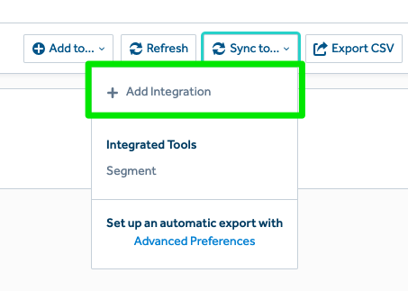
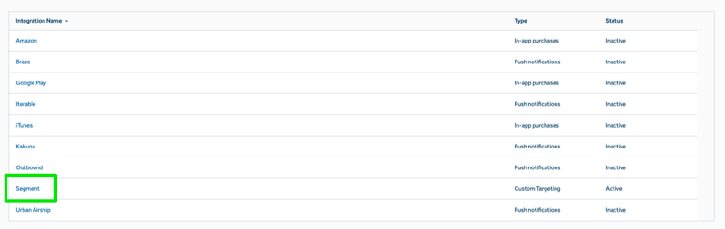
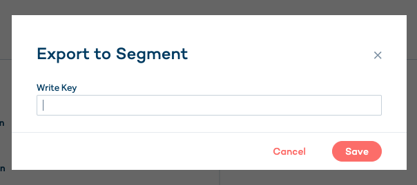



This source combines Amplitude's analytics with Segment's rich connections
ecosystem. This allows you to export Behavioral Cohorts from Amplitude to
Segment so that you can better target users across their many downstream
connections. You can easily sync Behavioral Cohorts to your
Segment-connected raw data warehouses and downstream destinations that accept
Segment `identify` events.

> success ""
> **Good to know**: This page is about the Amplitude Engage Segment source, which sends data _into_ Segment. There's also a page about the [Amplitude Segment destination](/docs/connections/destinations/catalog/amplitude/), which receives data _from_ Segment!

## Getting Started
 1. From your Sources page in Segment, click **Add source**.
 2. Choose **Amplitude Engage**, then click **Connect**.
 3. Give the Source a nickname. The nickname is a label used in the Segment interface.
 4. From the new Source's Overview page, copy the Segment `writeKey`.
 5. To export users from Amplitude to Segment, first, in Amplitude, create the
    cohort of users you wish to export. You can read more about the different
    types of cohorts you can create in [Amplitude's documentation](https://help.amplitude.com/hc/en-us/articles/231881448-Behavioral-Cohorts).
 6. In your Amplitude account, navigate to your Behavioral Cohort and
    paste the Segment `writeKey` under "Sync to" -> "Add Integration" if the
    Segment integration is not already set up for your project. **NOTE:** If you
     have just added the integration and do not see Segment in the list, you
    will need to refresh your page in order to see it
    in the list.







 7. If you would like to set up automated export on an hourly or daily basis,
    you can use Amplitude's Cohort Sync feature. Click "Advanced Preferences"
    and select "Segment" as the integration.
 8. From your Segment account, click into your Amplitude Engage Source, and
     you'll be able to add other downstream destinations where you want to see
     your Behavioral Cohort data.

you're all set! Behavioral Cohorts will now sync to Segment based on the sync
schedule you defined in Amplitude.

## How Amplitude Syncs Cohorts

Amplitude sends cohort data to Segment by triggering an `identify` call for
each user in the cohort being synced, for example:

```js
analytics.identify({
  userId: <amplitude_user_id>,
  traits: {
    '[Amplitude] <some_cohort_name> (<cohort_id>)': true
  },
  context: {
    integration: {
      name: 'Amplitude Cohort Sync',
      version: '1.0.0'
    }
  }
})
```

Upon subsequent cohort syncs (manual or scheduled), Amplitude syncs only new
users and users whose cohort status has changed (e.g. a user has left a
cohort). When a user has left a cohort, Amplitude sends `false` as the cohort
trait value, for example:

```js
analytics.identify({
  userId: <amplitude_user_id>,
  traits: {
    '[Amplitude] <some_cohort_name> (<cohort_id>)': false
  },
  context: {
    integration: {
      name: 'Amplitude Cohort Sync',
      version: '1.0.0'
    }
  }
})
```
