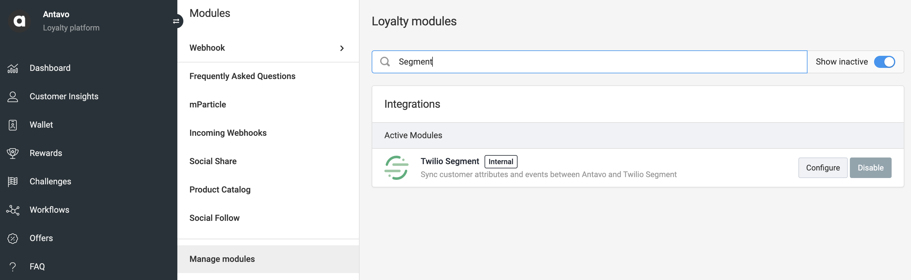
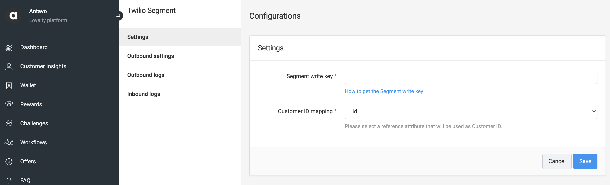
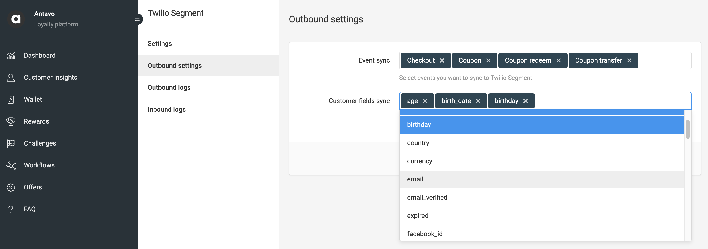

```
title: Antavo Source
```

[Antavo](http://www.antavo.com){:target="_blank”} allows you to synchronize loyalty events and profile updates into Segment.

The Antavo Source allows you to sync profile updates and loyalty events into Segment Destination apps and Segment warehouse.

This source is maintained by Antavo. For any issues with the
source, [contact the Antavo support team](mailto:support@antavo.com).

## Getting started

1. From your workspace's Sources catalog page click `Add Source`.
2. Search for "Antavo" in the Sources Catalog, select Antavo, and click Add Source.
3. On the next screen, you can name the Source (e.g. Antavo or Loyalty Engine).
   1. The name is used as a label in the Segment app, and Segment creates a related schema name in your warehouse.
   2. The name can be anything, but we recommend using something that reflects the source and distinguishes amongst your environments.
4. Click Add Source to save your settings.
5. Copy the Write key from the Segment UI.
6. Log into your Antavo account.
7. Select Twilio Segment integration in Antavo platform.

   
8. Insert the Segment write key and select which attribute contains the userID that will be used as User identifier when syncing events.

   
9. Go to the Outbound settings page and select:
   - The events you want to sync to Segment.
   - The customer attribute updates you want to sync to Segment.

   

## Events

Two main event types are synced into Segment: Profile updates and loyalty events.  
Both event types require userID, which can be selected in Antavo.  
Any customer attribute in Antavo can be selected as “external customer ID.”

### Profile updates

This event happens when a customer attribute - added to the **Customer field sync** - changes.
- Antavo always includes the `userId`.
- Customer attributes are included in `traits` object.

```
{
  "traits": {
    "first_name": "New",
    "last_name": "Name",
  },
  "userId": "antavo-customer-id",
  "timestamp": "2024-11-26T15:19:14.000Z",
  "type": "identify",
}
```

### Loyalty events

When a built-in or custom loyalty event - added to the **Event sync** - happens, event data are streamlined to the Antavo Source.
- Antavo always includes the `userId`.
- Event properties are included in `properties` object.

```
{
  "properties": {
    "points": 5000
    },
  "type": "track",
  "event": "point_add",
  "userId": "antavo-customer-id",
  "timestamp": "2024-11-26T15:15:49.000Z",
}
```

## Adding Destinations

As the last step of the Antavo Source setup, you can select Destinations to receive data.

Log into your downstream tools and check to see that your events appear as expected, and that they contain all of the properties you expect. If your events and properties don’t appear, check the [Event Delivery](https://github.com/segmentio/segment-docs/blob/develop/docs/connections/event-delivery){:target="_blank”} tool, and refer to the Destination docs for each tool for troubleshooting.

If there are any issues with how the events are arriving to Segment, [contact the Antavo support team](mailto:support@antavo.com).
