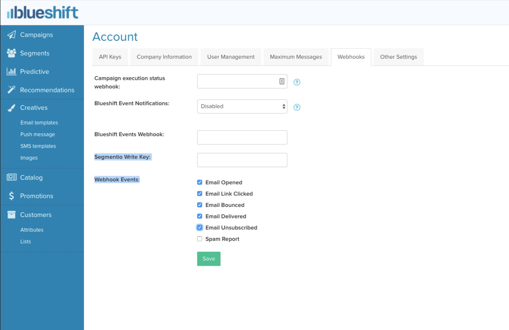



Blueshift is an AI powered customer engagement platform for growth marketers. With Blueshift, you can set up programmatic cross-channel marketing campaigns across Email, Mobile, Website and other channels.

Take your company's email analysis to the next level by adding Blueshift as a Source to Segment. Segment automatically  collects email events like **Email Delivered** and **Email Opened**, forward them to your destinations, and load them into your data warehouse.

In your favorite BI or analytics tool, you'll be able to analyze your email campaigns in SQL or through drag-and-drop reports. And, you'll be able to join your Blueshift data with the event data you're already sending through Segment to analyze the down-funnel effects of your emails.

## Getting Started

1. From your workspace's segment.com/<your-workspace>/sources page, click Add source.
2. Choose Blueshift.
3. Give the Source a nickname and a schema name. The nickname is a label used in the Segment interface, and the schema name is the namespace you query against in your warehouse. You can name them however you'd like, but we recommend sticking to something that reflects the Source itself, like Blueshift for nickname and Blueshift for the schema name.
4. The next page ("Overview") will surface your Segment write key for Blueshift. Copy this write key.
5. To finish the setup, you'll have to go into your Blueshift account and enter this Segment write key in their destinations settings. Find the right place in Blueshift by clicking Account > Webhooks:

6. Click Save.
7. Now when you go back to Segment, click into your Blueshift Source and you'll be able to add other downstream Destinations where you want to see email events.

That's it! As you send emails, events will now be sent to your destinations and automatically loaded into any warehouses you have enabled.

## Blueshift Events

Below is a table of events that Blueshift sends to Segment. These are the events that will appear in your warehouse or your destinations, depending on what connections you enable in Segment:

<table>
  <tr>
   <td>Event Name</td>
   <td>Description</td>
  </tr>
  <tr>
   <td>Email Delivered</td>
   <td>Message has been successfully delivered to the receiving server</td>
  </tr>
  <tr>
   <td>Email Opened</td>
   <td>Recipient has opened the HTML message. You need to enable Open Tracking for getting this type of event</td>
  </tr>
  <tr>
   <td>Email Link Clicked</td>
   <td>Recipient clicked on a link within the message. You need to enable Click Tracking for getting this type of event</td>
  </tr>
  <tr>
   <td>Email Bounced</td>
   <td>Receiving server could not or would not accept message</td>
  </tr>
  <tr>
   <td>Email Marked as Spam</td>
   <td>Recipient marked message as spam</td>
  </tr>
  <tr>
   <td>Unsubscribe</td>
   <td>Recipient clicked on message's subscription management link</td>
  </tr>
</table>

## Blueshift Event Properties

Below is a table of properties that are sent for the events above:

<table>
  <tr>
   <td>Propert Name</td>
   <td>Description</td>
  </tr>
  <tr>
   <td>`account_uuid`</td>
   <td>UUID of the account</td>
  </tr>
  <tr>
   <td>`campaign_uuid`</td>
   <td>UUID of the campaign</td>
  </tr>
  <tr>
   <td>`bucket_uuid`</td>
   <td>UUID of the bucket</td>
  </tr>
  <tr>
   <td>`trigger_uuid`</td>
   <td>UUID of the trigger</td>
  </tr>
  <tr>
   <td>`experiment_uuid`</td>
   <td>UUID of the experiment</td>
  </tr>
  <tr>
   <td>`creative_uuid`</td>
   <td>UUID of the creative (template)</td>
  </tr>
  <tr>
   <td>`message_uuid`</td>
   <td>Blueshift internal unique uuid associated with the corresponding message send event</td>
  </tr>
  <tr>
   <td>`trgger_timestamp`</td>
   <td>The timestamp at which this event was generated</td>
  </tr>
  <tr>
   <td>`trgger_type`</td>
   <td>The type of the trigger. Values can be one of "PushTrigger", "EmailTrigger", "SmsTrigger", "DisplayAdTrigger", "OnsiteTrigger" depending on the channel of the message</td>
  </tr>
  <tr>
   <td>`action`</td>
   <td>Blueshift identifiers for the event - "open", "click", "delivered", "bounce", "spam_report" or "unsubscribed"</td>
  </tr>
  <tr>
   <td>`campaign_name`</td>
   <td>Name of the campaign</td>
  </tr>
  <tr>
   <td>`campaign_exec_term`</td>
   <td>Nature of the campaign</td>
  </tr>
  <tr>
   <td>`creative_name`</td>
   <td>Name of the creative</td>
  </tr>
  <tr>
   <td>`utm_*`</td>
   <td>All of the `utm_campaign`, `utm_content`, `utm_medium`, `utm_source`, `utm_term` on the campaign are sent back on the event</td>
  </tr>
  <tr>
   <td>`sg_message_id`</td>
   <td>Message id on Sendgrid if the event was triggered by a Sendgrid event</td>
  </tr>
  <tr>
   <td>Other</td>
   <td>All trigger level custom URL tracking parameters added on the campaign are sent back on the event</td>
  </tr>
</table>

## UserId

Blueshift sends their `customer_id` associated with the message recipient as the top level `userId` field. Additionally, we will also send "email" and "blueshift_user_uuid" under `context.traits`.

## Send Data to Blueshift

The Blueshift Source works better when you also connect Blueshift as a downstream destination within Segment. With the Blueshift Destination, you can send Blueshift user and event data, which you can use to trigger email campaigns. Want to start sending website or mobile to Blueshift? Head on over to our [Blueshift destination docs](/docs/connections/destinations/catalog/blueshift/).
