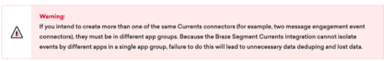

[Braze](https://www.braze.com/?utm_source=segmentio&utm_medium=docs&utm_campaign=partners) is a marketing automation and customer engagement platform. Growth, Engagement, and Marketing teams use Braze to build great long term relationships with their customers across key digital channels.

Take your company's marketing and customer engagement to the next level by adding Braze as a Segment Source, using Braze's Currents product. Segment automatically  collects marketing and analytics events, forward them to your destinations, and load them into your data warehouse.

In your favorite BI or analytics tool, you'll be able to analyze your mobile, email, and web marketing campaign data in SQL or using drag-and-drop reports. You'll be able to join your Braze data with the event data you're already sending through Segment to analyze the impacts of your marketing and engagement programs.

This source is maintained by Braze. For any issues with the source, you may [contact the Braze Support team](https://www.braze.com/docs/support_contact/).

_**NOTE:** If you are interested in using Braze, contact your Braze Customer Success Manager. Braze Currents is only available in select Braze packages and cannot be configured without assistance from the Braze team._

## Getting Started

1. From the Segment Sources page click **Add Source**.
2. Search for "Braze" in the Sources Catalog and confirm by clicking "Connect".
3. Give the Source a nickname and follow the set up steps to "Add Source".
   The nickname is used as a label for the source in your Segment interface, and Segment creates a related schema name. The schema name is the namespace you'll query against in a warehouse. The nickname can be anything, but we recommend sticking to something that reflects the source itself and distinguishes amongst your environments (for example, `Braze_Prod`, `Braze_Staging`, `Braze_Dev`).
4. The next page "Overview" shows the Segment write key for Braze. Copy this write key.
5. To finish set up, contact Braze Support or your Customer Support Manager to activate "Currents" in Braze.
   Braze Currents is only available in select Braze packages and cannot be configured within Braze without assistance from your Braze Customer Success representative.
6. Go back to Segment, click into the Braze Source and you can add Destinations where you want to receive your Braze data.
   Events are now sent to these destinations and automatically loaded into any warehouses you have enabled.

   

## Components
**Stream**
Braze uses our stream Source component to send events to Segment. These events are then available in any Destination that accepts server-side events, including your data warehouse.

## Events

Below is a table of events that Braze sends to Segment. These events show up as tables in your Warehouse, and as regular events in your other Destinations.

<table>
  <tr>
   <td>Event Name</td>
   <td>Description</td>
  </tr>
  <tr>
   <td>Application Uninstalled</td>
   <td>User uninstalled the App.</td>
  </tr>
   <tr>
   <td>Email Sent</td>
   <td>An email was successfully sent</td>
  </tr>
  <tr>
   <td>Email Delivered</td>
   <td>An email was successfully delivered to a User's mail server.</td>
  </tr>
  <tr>
   <td>Email Opened</td>
   <td>User opened an email.</td>
  </tr>
  <tr>
   <td>Email Link Clicked</td>
   <td>User clicked a link in an email. Email click tracking must be enabled.</td>
  </tr>
  <tr>
   <td>Email Bounced</td>
   <td>Braze attempted to send an email, but the User's receiving mail server did not accept it.</td>
  </tr>
  <tr>
   <td>Email Soft Bounced</td>
   <td>Braze attempted to send an email, but the User's receiving mail server temporarily bounced it. (Reasons may include: inbox full, server down, etc.)</td>
  </tr>
  <tr>
   <td>Email Marked As Spam</td>
   <td>User marked an email as spam.</td>
  </tr>
  <tr>
   <td>Email Unsubscribed</td>
   <td>User clicked the unsubscribe link in an email.</td>
  </tr>
  <tr>
   <td>Subscription Group State Changed</td>
   <td>User's subscription group state changed to `Subscribed` or `Unsubscribed`</td>
  </tr>
  <tr>
   <td>Push Notification Sent</td>
   <td>A push notification was successfully sent</td>
  </tr>
  <tr>
   <td>Push Notification Tapped</td>
   <td>User tapped on a push notification.</td>
  </tr>
  <tr>
   <td>Push Notification Bounced</td>
   <td>Braze was not able to send a push notification to this User.</td>
  </tr>
  <tr>
   <td>iOS Foreground Push Opened</td>
   <td>User received a push notification on iOS while the app was open.</td>
  </tr>
  <tr>
   <td>In-App Message Viewed</td>
   <td>User viewed an in-app message.</td>
  </tr>
  <tr>
   <td>In-App Message Clicked</td>
   <td>User tapped or clicked a button in an in-app message.</td>
  </tr>
  <tr>
   <td>News Feed Viewed</td>
   <td>User viewed the native Braze News Feed.</td>
  </tr>
  <tr>
   <td>News Feed Card Viewed</td>
   <td>User viewed a Card within the native Braze News Feed.</td>
  </tr>
  <tr>
   <td>News Feed Card Clicked</td>
   <td>User tapped or clicked on a Card within the native Braze News Feed.</td>
  </tr>
  <tr>
   <td>Webhook Sent</td>
   <td>A webhook message was sent.</td>
  </tr>
  <tr>
   <td>Campaign Converted</td>
   <td>User performed the primary conversion event for a Campaign within its conversion window.</td>
  </tr>
  <tr>
   <td>Canvas Converted</td>
   <td>User performed the primary conversion event for a Canvas within its conversion window.</td>
  </tr>
  <tr>
   <td>Canvas Entered</td>
   <td>User was entered into a Canvas.</td>
  </tr>
  <tr>
   <td>Campaign Control Group Entered</td>
   <td>User was enrolled in a Campaign control group.</td>
  </tr>
</table>

## Braze Event Properties

Below are tables outlining the properties included in the events listed above.

<table>
  <tr>
   <td>Property Name</td>
   <td>Type</td>
   <td>Description</td>
  </tr>
  <tr>
   <td>`app_id`</td>
   <td>string</td>
   <td>The API Identifier of the App on which a user received a message or performed an action, if applicable.</td>
  </tr>
  <tr>
   <td>`send_id`</td>
   <td>string</td>
   <td>The id of the message if specified for the campaign, if applicable.</td>
  </tr>
  <tr>
   <td>`campaign_id`</td>
   <td>string</td>
   <td>The API Identifier of the Campaign associated with the event, if applicable.</td>
  </tr>
  <tr>
   <td>`canvas_id`</td>
   <td>string</td>
   <td>The API Identifier of the Canvas associated with the event, if applicable.</td>
  </tr>
  <tr>
   <td>`canvas_variation_id`</td>
   <td>string</td>
   <td>The API Identifier of the Canvas Variation associated with the event, if applicable.</td>
  </tr>
  <tr>
   <td>`canvas_step_id`</td>
   <td>string</td>
   <td>The API Identifier of the Canvas Step associated with the event, if applicable.</td>
  </tr>
  <tr>
   <td>`context.traits.email`</td>
   <td>string</td>
   <td>For Email events, the email address that the email was sent to.</td>
  </tr>
  <tr>
   <td>`button_id`</td>
   <td>string</td>
   <td>For In-App Message Clicked events, the ID of the button the user clicked on.</td>
  </tr>
  <tr>
   <td>`card_id`</td>
   <td>string</td>
   <td>For News Feed Card Viewed and News Feed Card Clicked events, the API Identifier of the News Feed Card.</td>
  </tr>
</table>

Braze will send the Braze `external_user_id` as the top level `userId` field. This is the same `userId` that Braze originally receives from the downstream destination with Segment. Braze will only send events associated with users who have an `external_user_id` set.

## Adding Destinations

Now that your Source is set up, you can connect it with Destinations.

Log in to your downstream tools and make sure that the events are populating in your Debugger, and that they contain all of the properties you expect. If something isn't working as you expect, see the Destination docs for troubleshooting.

If there are problems with how the events arrive to Segment, [contact the Braze team](https://www.braze.com/docs/support_contact/).

## Sending Data To Braze

The Braze Source works better when you also connect Braze as a Destination. With the Braze Destination, you can use Segment to send event data to Braze in order to target customers with messaging campaigns. Want to start sending data TO Braze? Head on over to our [Braze docs](https://segment.com/docs/connections/destinations/catalog/braze/).
