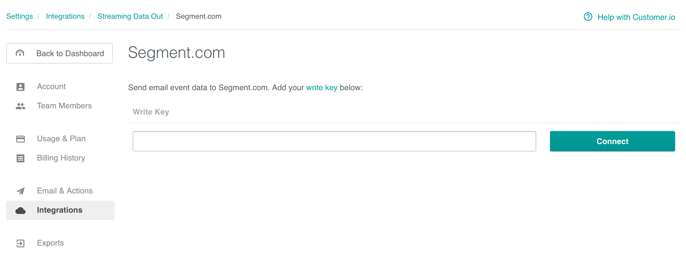

[Customer.io](https://customer.io/) is an automated email tool. It lets you set up rules to automatically send emails to your users after they perform actions, making drip email campaigns really easy.

Take your company's email analysis to the next level by **adding Customer.io as a Source to Segment.** Segment automatically  collects email events like `Email Delivered` and `Email Opened`, forward them to your destinations, and load them into your data warehouse. 

In your favorite BI or analytics tool, you'll be able to analyze your email campaigns in SQL or through drag-and-drop reports. And, you'll be able to join your Customer.io data with the event data you're already sending through Segment to analyze the down-funnel effects of your emails. [Learn more about how you can use Customer.io with Segment.](https://segment.com/sources/customerio/)

> success ""
> **Good to know**: This page is about the Customer.io Segment source, which sends data _into_ Segment. There's also a page about the [Customer.io Segment destination](/docs/connections/destinations/catalog/customer-io/), which receives data from Segment!

## Getting Started

If you previously sent email events using the Customer.io destination during our beta (using a project write key), you do not need to create new Customer.io source. Your email data will continue to flow as normal.

1. Go to **Connections > Sources** and click **Add Source** in the Segment app.

2. Search for **Customer.io** in the Sources Catalog and click **Add Source**.

3. Give the Source a name and add any labels to help you organize and filter your sources. You can give the source any name, but Segment recommends a name that reflects the source itself, as this name autopopulates the schema name. For example, the source name  `Customer.io` creates the schema `customerio`.

4. The next page ("Overview") displays your **Segment write key for Customer.io.** Copy this write key. 

5. To finish the set up, go to your Customer.io account, go to **Data & Integrations > Integrations > Segment**, and enter the Segment write key.

   

6. Click **Connect Segment**.

7. In Segment, click **Add Destinations** in your Customer.io source to add destinations for your Customer.io data.

That's it! As you send emails, events will now be sent to your destinations and automatically loaded into any warehouses you have enabled. 

## Components

**Stream**

Customer.io uses our stream Source component to send Segment email events. It uses a server-side `track` method to send data to Segment. These events are then available in any destination that accepts server-side events, and available in a schema in your data warehouse, so you can query using SQL. 

The default behavior is for Customer.io to pass the `userId` associated with the email recipient as the `userId`. There are cases in which Customer.io does not have an associated `userId`, in which case the email address will be passed in as the `anonymousId`. 

## Collections

Collections are the groupings of data we pull from your Source. In your warehouse, each collection gets its own table, as well as a `tracks` table that aggregates all the events into a single table. 

<table>
  <tr>
    <td>**Collection**</td>
    <td>**Type**</td>
    <td>**Description**</td>
  </tr>
  <tr>
    <td>Email Delivered</td>
    <td>Event</td>
    <td>Message has been successfully delivered to the receiving server</td>
  </tr>
  <tr>
    <td>Email Opened</td>
    <td>Event</td>
    <td>Recipient has opened the HTML message. You need to enable Open Tracking for getting this type of event</td>
  </tr>
    <tr>
    <td>Email Link Clicked</td>
    <td>Event</td>
    <td>Recipient clicked on a link within the message. You need to enable Click Tracking for getting this type of event</td>
  </tr>
    <tr>
    <td>Email Unsubscribed</td>
    <td>Event</td>
    <td>Recipient clicked on message's subscription management link</td>
  </tr>
    <tr>
    <td>Email Bounced</td>
    <td>Event</td>
    <td>Receiving server could not or would not accept message</td>
  </tr>
  <tr>
    <td>Email Marked as Spam</td>
    <td>Event</td>
    <td>Recipient marked message as spam</td>
  </tr>
</table>

<!-- Example: To query the Email Delivered table, you'd write a query like this:


```sql
select *
from customerio.email_delivered
```


<table>
</table> -->

## Send data to Customer.io

The Customer.io Source works better when you also connect Customer.io as a destination. With the Customer.io **Destination**, you can use Segment to send Cusotmer.io user and event data from which you trigger email campaigns. Want to start sending website or mobile data **_TO_** Customer.io? Head on over to our [Customer.io destination docs](https://segment.com/docs/connections/destinations/catalog/customer.io/).
