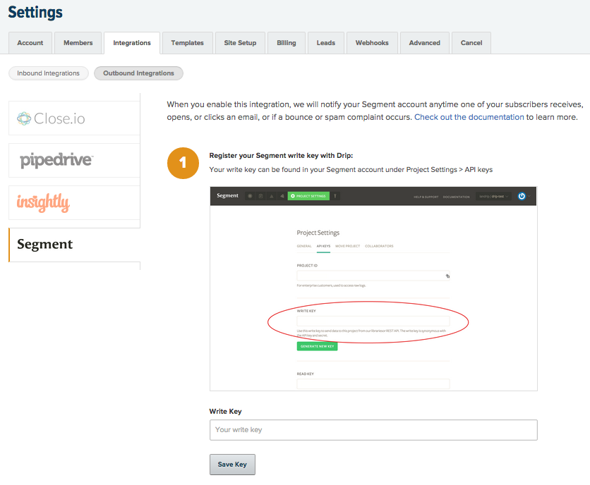



Drip is an automated email tool that lets you set up a drip campaign on your site in a few minutes. After a user signs up, it'll send them the next email in your series every few days. [Visit Website](http://mbsy.co/lqb7?utm_source=segmentio&utm_medium=docs&utm_campaign=partners)

Take your company's email analysis to the next level by **adding Drip as a Source to Segment.** Segment automatically  collects email events like `Email Delivered` and `Email Opened`, forward them to your destinations, and load them into your data warehouse. 

In your favorite BI or analytics tool, you'll be able to analyze your email campaigns in SQL or through drag-and-drop reports. And, you'll be able to join your Drip data with the event data you're already sending through Segment to analyze the down-funnel effects of your emails. 


## Getting Started


If you have previously enabled sending email events using the Drip destination during our beta (using a project write key), you do not need to create new Drip source. Your email data will continue to flow as normal.

1. From your workspace's `segment.com/<your-workspace>/sources page`, click `Add source`.

2. Choose Drip.

3. Give the Source a nickname and a schema name. The nickname is a label used in the Segment interface, and the schema name is the namespace you query against in your warehouse. You can name them however you'd like, but we recommend sticking to something that reflects the Source itself, like `Drip` for nickname and `drip` for the schema name.

4. The next page ("Overview") will surface your **Segment write key for Drip.** Copy this write key. 

5. To finish the setup, you'll have to go into your Drip account and enter this Segment write key in their integrations settings. Find the right place in Drip by clicking Settings > Integrations > Segment.



6. Click **Save**.

7. In Segment, click into your Drip Source in `segment.com/<your-workspace>/sources`. From there you'll be able to add Destinations where you want to see email events.

That's it! As you send emails, events will now be sent to your destinations and automatically loaded into any warehouses you have enabled. 

## Components

**Stream**

Drip uses our stream Source component to send Segment email events. It uses a server-side `track` method to send data to Segment. These events are then available in any destination that accepts server-side events, and available in a schema in your data warehouse, so you can query using SQL. 

The default behavior is for Drip to pass the `userId` associated with the email recipient as the `userId`. There are cases in which Drip does not have an associated `userId`, in which case the email address will be passed in as the `anonymousId`. 

## Collections

Collections are the groupings of data we pull from your Source. In your warehouse, each collection gets its own table, as well as a `tracks` table that aggregates all the events into a single table. 

<table>
  <tr>
    <td>**Collection**</td>
    <td>**Type**</td>
    <td>**Description**</td>
  </tr>
  <tr>
    <td>Email Delivered</td>
    <td>Event</td>
    <td>Message has been successfully delivered to the receiving server</td>
  </tr>
  <tr>
    <td>Email Opened</td>
    <td>Event</td>
    <td>Recipient has opened the HTML message. You need to enable Open Tracking for getting this type of event</td>
  </tr>
    <tr>
    <td>Email Link Clicked</td>
    <td>Event</td>
    <td>Recipient clicked on a link within the message. You need to enable Click Tracking for getting this type of event</td>
  </tr>
    <tr>
    <td>Email Unsubscribed</td>
    <td>Event</td>
    <td>Recipient clicked on message's subscription management link</td>
  </tr>
    <tr>
    <td>Email Bounced</td>
    <td>Event</td>
    <td>Receiving server could not or would not accept message</td>
  </tr>
    <tr>
    <td>Email Marked as Spam</td>
    <td>Event</td>
    <td>Recipient marked message as spam</td>
  </tr>
</table>

<!-- Example: To query the Email Delivered table, you'd write a query like this:

```sql
select *
from drip.email_delivered
```


<table>
</table> -->

## Send data to Drip

The Drip Source works better when you also connect Drip as a destination. With the Drip **Destination**, you can use Segment to send Drip user and event data from which you trigger email campaigns. Want to start sending website or mobile data **_TO_** Drip? Head on over to our [Drip destination docs](/docs/connections/destinations/catalog/drip/).
