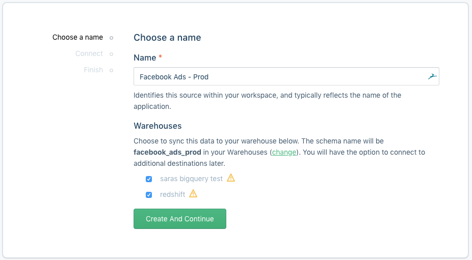
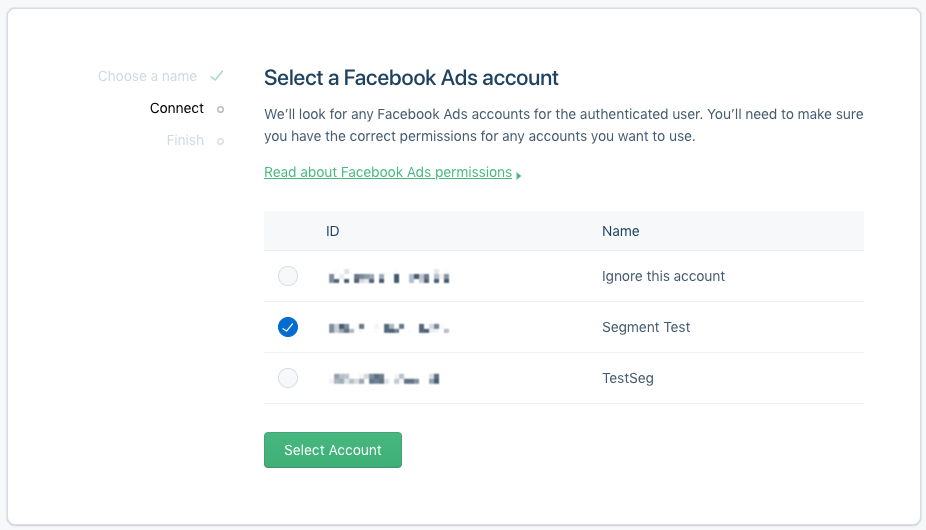

Facebook is one of the most efficient ways to advertise online. Take your company's analysis to the next level by adding [Facebook Ads](https://www.facebook.com/business/products/ads) as a Source to Segment.

## Getting Started

1. From your workspace's `/sources` page, click `add source`.

2. Choose Facebook Ads.

3. Give the source a nickname.
   The nickname is a label used in the Segment interface, and Segment creates a related schema name which you query against in your warehouse. The nickname can be whatever you like, but we recommend sticking to something that reflects the source itself, like `Facebook Ads` or `Facebook Ads Prod`.

   

4. Click **Create And Continue** then **Connect** to OAuth into Facebook.

5. Select which accounts you would like to sync (you may change this selection later).

  

6. Click **Finish**.

### Permissions

If your Facebook user has read permissions to Facebook Ads account's data, you should be able to use your account for the Source.

## Components

### Sync

Facebook Ads has a sync component, which means we'll make requests to their API on your behalf on a 3 hour interval to pull the latest data into Segment. In the initial sync, we'll grab all the Facebook objects (and their corresponding properties) according to the Collections table below. The objects will be written into a separate schema, corresponding to the source instance's schema name you designated upon creation. For example, if you went with `fb_ads`, the `ads` collection will be accessible at `fb_ads.ads` in SQL.

Our sync component uses an upsert API, so the data in your warehouse loaded using sync will reflect the latest state of the corresponding resource in Facebook Ads.  For example, if `budget` from `0` to `100` between syncs, on its next sync that tickets status will be `100`.

The source syncs and warehouse syncs are independent processes. Source runs pull your data into the Segment Hub, and warehouse runs flush that data to your warehouse. Sources will sync with Segment every 3 hours. Depending on your Warehouses plan, we will push the Source data to your warehouse on the interval associated with your billing plan.

## Collections

Collections are the groupings of resources we pull from your source. In your warehouse, each collection gets its own table.

| Collection  | Type   | Description                                                                                                                                                                                            |
| ----------- | ------ | ------------------------------------------------------------------------------------------------------------------------------------------------------------------------------------------------------ |
| ad_accounts | object | An ad account is an account used to manage ads on Facebook                                                                  |
| ad_sets     | object | An [ad set](https://developers.facebook.com/docs/marketing-api/reference/ad-campaign) is a group of ads that share the same daily or lifetime budget, schedule, bid type, bid info, and targeting data |
| ads         | object | An [ad](https://developers.facebook.com/docs/marketing-api/reference/adgroup) object contains the data necessary to visually display an ad and associate it with a corresponding ad set.               |
| campaigns   | object | A [campaign](https://developers.facebook.com/docs/marketing-api/reference/v13.0) is a grouping of ad sets which are organized by the same business objective.                              |
| insights    | object | [Insights](https://developers.facebook.com/docs/marketing-api/reference/adgroup/insights/) contain performance statistics for an ad broken down by day.                                                |

## Collection Properties

The following tables outline the properties included in collections.

### Ad Accounts

| Property Name | Description                                                                                                                                                                                                                                                                         |
| ------------- | ----------------------------------------------------------------------------------------------------------------------------------------------------------------------------------------------------------------------------------------------------------------------------------- |
| id            | Ad Account ID.                                                                                                                                                                                                                                                                      |
| balance       | Bill amount due.                                                                                                                                                                                                                                                                    |
| name          | Name of the account. If the account name is not set, the name of the first admin visible to the user will be returned.                                                                                                                                                              |
| partner_id    | The ID of a Facebook Page or Facebook App.                                                                                                                                                                                                                                          |
| spend_cap     | The maximum that can be spent by this account after which campaigns will be paused. A value of 0 signifies no spending-cap and setting a new spend cap only applies to spend AFTER the time at which you set it. Value specified in basic unit of the currency, e.g. cents for USD. |

### Ad Sets

| Property Name     | Description                                                                                                   |
| ----------------- | ------------------------------------------------------------------------------------------------------------- |
| id                | Ad set ID.                                                                                                    |
| account_id        | Ad Account ID.                                                                                                |
| campaign_id       | Campaign ID.                                                                                                  |
| configured_status | The status set at the ad set level. It can be different from the effective status due to its parent campaign. |
| daily_budget      | The daily budget of the set defined in your account currency.                                                 |
| effective_status  | The effective status of the ad set, which can be either its own status or caused by its parent campaign.      |
| end_time          | End time, in UTC UNIX timestamp.                                                                              |
| name              | Name of ad set.                                                                                               |

### Ads

| Property Name  | Description                                                                                          |
| -------------- | ---------------------------------------------------------------------------------------------------- |
| id             | The ID of this ad.                                                                                   |
| adset_id       | ID of the ad set that contains the ad.                                                               |
| account_id     | The ID of the ad account that this ad belongs to.                                                    |
| bid_amount     | Bid amount for this ad which will be used in auction instead of the ad set bid_amount, if specified. |
| bid_type       | Bid type.                                                                                            |
| campaign_id    | ID of the ad campaign that contains this ad.                                                         |
| name           | Name of the ad.                                                                                      |
| status         | The configured status of the ad.                                                                     |
| url_parameters | URL parameters.                                                                                      |
| utm_source     | UTM source.                                                                                          |
| utm_medium     | UTM medium.                                                                                          |
| utm_campaign   | UTM campaign.                                                                                        |
| utm_term       | UTM term.                                                                                            |
| utm_content    | UTM content.                                                                                         |

### Campaigns

| Property Name    | Description                                                                                                                               |
| ---------------- | ----------------------------------------------------------------------------------------------------------------------------------------- |
| id               | Campaign's ID.                                                                                                                            |
| account_id       | ID of the ad account that owns this campaign.                                                                                             |
| buying_type      | Buying type.                                                                                                                              |
| effective_status | The effective status of this campaign.                                                                                                    |
| name             | Campaign's name.                                                                                                                          |
| spend_cap        | A spend cap for the campaign, such that it will not spend more than this cap. Expressed as integer value of the subunit in your currency. |
| start_time       | Start time.                                                                                                                               |
| stop_time        | Stop time.                                                                                                                                |

### Insights

| Property Name             | Description                                                                                                                                                |
| ------------------------- | ---------------------------------------------------------------------------------------------------------------------------------------------------------- |
| id                        | Segment internal ID.                                                                                                                                       |
| ad_id                     | The unique ID of the ad you're viewing in reporting.                                                                                                       |
| clicks                    | The number of clicks on your ads.                                                                                                                          |
| date_start                | The start date for your data.                                                                                                                              |
| date_stop                 | The end date for your data.                                                                                                                                |
| frequency                 | The average number of times each person saw your ad.                                                                                                       |
| impressions               | The number of times your ads were on screen.                                                                                                               |
| inline_post_engagements   | The total number of actions that people take involving your ads.                                                                                           |
| social_spend              | The total amount you've spent so far for your ads showed with social information.                                                                          |
| spend                     | The estimated total amount of money you've spent on your campaign, ad set or ad during its schedule.                                                       |
| unique_clicks             | The number of people who performed a click (all). This metric is estimated.                                                                                |
| unique_impressions        | Deprecated in favor of `reach` . You can continue to query `unique_impressions` for this metric, but zero-values will now be `null`.                       |
| reach                     | The number of people who saw your ads at least once. Reach is different from impressions, which may include multiple views of your ads by the same people. |

#### Insights Breakdowns

Segment also supports Breakdowns for Insights. Breakdowns are not enabled by default; [reach out to Segment support](https://segment.com/help/contact/){:target="_blank"} to enable them. Segment supports the following properties:

| Property Name                    | Description                                                                                                                    |
| -------------------------------- | ------------------------------------------------------------------------------------------------------------------------------ |
| `actions`                        | The total number of actions people took that are attributed to your ads.                                                       |
| `actions_values`                 | The total value of all conversions attributed to your ads.                                                                     |
| `unique_actions`                 | The total number of unique actions attributed to your ads.                                                                     |
| `video_p25_watched_actions`      | The number of times your video played at 25% of its length, including plays that skipped to this point.                    |
| `video_p50_watched_actions`      | The number of times your video played at 50% of its length, including plays that skipped to this point.                    |
| `video_p75_watched_actions`      | The number of times your video played at 75% of its length, including plays that skipped to this point.                    |
| `video_p95_watched_actions`      | The number of times your video was played at 95% of its length, including plays that skipped to this point.                    |
| `video_p100_watched_actions`     | The number of times your video was played at 100% of its length, including plays that skipped to this point.                   |
| `video_30_sec_watched_actions`   | The number of times your video played for at least 30 seconds, or for nearly its total length if it's shorter than 30 seconds. |
| `video_avg_time_watched_actions` | The average time a video was played, including any time spent replaying the video for a single impression.                     |

For more information, view [Meta's Insights documentation](https://developers.facebook.com/docs/marketing-api/reference/ads-insights/){:target="_blank"}.

## Adding Destinations

Currently, Warehouses are the only supported destination for object-cloud sources.
