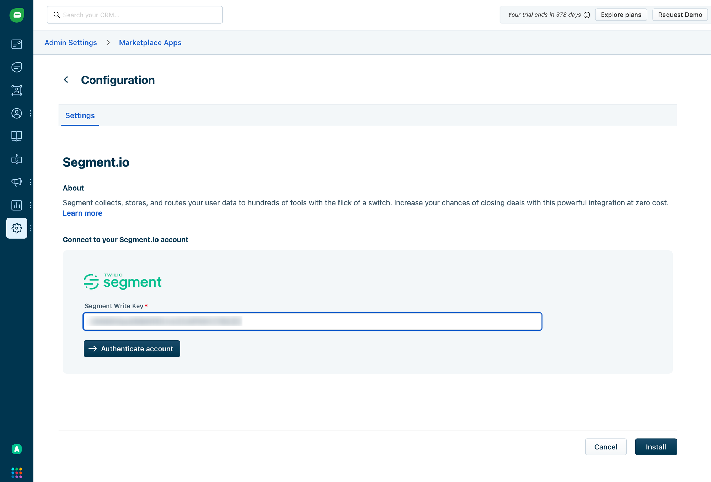

### Freshchat Source

**Freshchat** is a modern messaging software built for sales and customer engagement teams to talk to customers across various channels like website, email and social channels

This is an [Event Cloud Source](https://segment.com/docs/sources/#event-cloud-sources) which can not only export data into your Segment warehouse, but they can also federate the exported data into your other enabled Segment Destinations.

This source is maintained by Freshworks. For any issues with the source, contact the [**Freshchat Support team**](mailto:support@freshdesk.com)

### Getting Started:

Before you start, make sure that you have admin rights in both Aircall and Segment.

**Step 1:** Authenticate Segment

1. From your workspace's [Sources catalog page](https://app.segment.com/goto-my-workspace/sources/catalog) click **Add Source**.
2. Search for "Freshchat" in the Sources Catalog, select Freshchat, and click **Add Source**.
3. On the next screen, give the Source a Name & set Labels
    - The nickname is used as a label in the Segment app, and Segment creates a related schema name in your warehouse. The nickname can be anything, but we recommend using something that reflects the source itself and distinguishes amongst your environments (eg. SourceName_Prod, SourceName_Staging, SourceName_Dev).
4. Click **Add Source** to save your settings.
5. Copy the Write key from the Segment UI to use in Freshchat

**Step 2:** Authenticate Freshchat

1. Log in to your Freshchat account - navigate to Admin → Marketplace Apps → Segment Integration and paste the key to connect.

**Step 3:** Select Freshchat events to send to Segment

1. There are [4 events](https://developers.freshchat.com/v2/docs/product-events/#) that can be pushed to Segment. You will be able to choose the events that you want to send to Segment
2. You can add/remove the events that you want to send anytime after the app installation

### Events

The table below lists events that <integration_name> sends to Segment. These events appear as tables in your warehouse, and as regular events in other Destinations. <integration_name> includes the `userId` if available.

| Event Name | Description |
| --- | --- |
| onAgentActivityCreate | When the general availability or Intelliassign status changes |
| onConversationCreate | When a conversation is initiated by a user |
| onConversationUpdate | When a conversation is:
→ Assigned to an agent or group
→ Existing conversation is reassigned to an agent
→ Conversation is resolved or opened |
| onMessageCreate | When a message is posted, either by the agent or user |

### **Adding Destinations**

Now that your Source is set up, you can connect it with Destinations.

Log into your downstream tools and check to see that your events are populating and they contains all the properties you expect. If all your events and properties are not showing up, refer to the Destination docs for troubleshooting.

If you experience any issues with how the events arrive in Segment, contact the [**Freshchat Support team**](mailto:support@freshdesk.com)