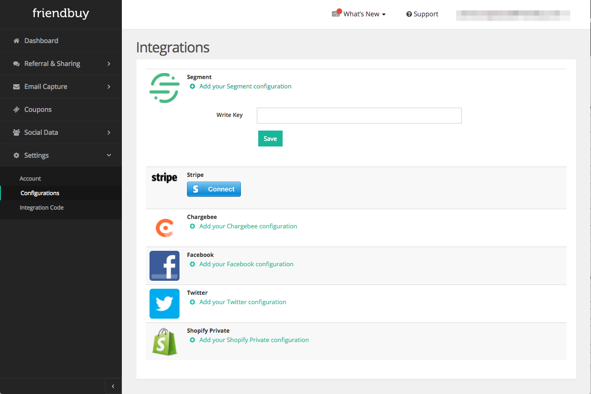



Friendbuy is a referral marketing platform that powers modern day word of mouth. Designed for growth marketers, Friendbuy allows companies to acquire new customers at scale through seamlessly integrated referral and influencer campaigns.

Adding Friendbuy as a Source to Segment is a surefire way to elevate analysis of your referral program performance. Friendbuy will automatically send referral events and important metadata to Segment.

These events can be passed to your Segment Destinations such as data warehouses and analytics tools. Joined with data from other marketing programs, you can start telling a unified story of each customer's journey and tailor your reporting to the KPIs that matter most.

## Getting Started
 1. From your Sources page in Segment, click **Add source**.
 2. Choose Friendbuy.
 3. Click Connect.
 4. Give the Source a nickname.  The nickname will be used to designate
    the Source in the Segment interface.
 5. Copy the Segment write key for Friendbuy from the Overview page.
 6. Login to your Friendbuy account and enter this Segment write key at this location: [Settings>Configurations>Integrations](https://retailer.friendbuy.com/app).
 7. Click Save.

 8. From your Segment account, click into your Friendbuy Source and you'll be able to add other downstream Destinations where you want to see referral events.

you're all set! Referral events such as shares, conversions, and reward evaluations will now be sent to Segment and any other destinations that you've enabled.

## Customer Data
All referral events provided to Segment are in the context of specific customer (the advocate).  Below are the customer attributes that Friendbuy provides to Segment along with these events.  Wherever possible, customer data is mapped to Segment's reserved properties as defined in the [Segment Identify spec](https://segment.com/docs/connections/spec/identify/).

|Trait Name	|	Description |
|--|--|
|	id	|	Customer id assigned by the Merchant (Segment reserved property) 	|
|	email	|	Customer email address (Segment reserved property)	|
|	firstName	|	Customer first name (Segment reserved property)	|
|	lastName	|	Customer last name (Segment reserved property)	|
|	friendbuy_id	|	Internal id of the customer record in Friendbuy	|
|	stripe_customer_id	|	Customer id of the advocate in Stripe	|
|	chargebee_customer_id	|	Customer id of the advocate in Chargebee	|

## Referral Events

Below are the events that Friendbuy sends to Segment. These events will also appear in your Destinations, depending on which platforms you've enabled in Segment.

| Event	Name |	Description |
|--|--|
|	Referral Shared	|	An advocate shares with a friend through a Friendbuy referral widget (or REST API) to a channel such as email, Facebook, Messenger, Twitter, etc.	|
|	Referral Converted	|	A referred friend signs up or orders through an advocate's referral	|
|	Referral Reward Evaluated	|	A conversion is evaluated for fraud checks and criteria to determine if an advocate reward should be approved or rejected	|

### Referral Shared
Below are the properties that are included in the Referral Shared event payload.

| Property Name | Property Description |
|--|--|
|	share_id	|	Friendbuy internal id of the share 	|
|	share_date 	|	Date and time of the share 	|
|	ip_address	|	Ip_address of advocate at time of share 	|
|	referral_code	|	Friendbuy internal identifier used to make attribution between friend order and advocate referral 	|
|	message	|	Advocate provided message to the friend 	|
|	channel	|	Friendbuy channel the share was issued from (email, facebook, facebook messenger, twitter) 	|
|	recipients	|	Array of recipient email addresses for shares sent using email 	|
|	variant_id	|	Friendbuy internal id for the widget variant the share is associated with 	|
|	variant_name	|	Merchant defined name for the widget variant 	|
|	reward_type	|	Merchant defined Reward Type for the advocate reward 	|
|	reward_amount	|	Merchant defined Reward Amount for the advocate reward 	|
|	newsletter_opt_in	|	Indicates if an advocate opted in to receiving newsletter communications 	|
|	reminder_opt_in	|	Indicates if an advocate requested Friendbuy to send referred friend a reminder if they haven't converted within 3 days 	|

###  Referral Converted
Below are the properties that are included in the Referral Converted event payload. Wherever possible, referral conversion data is mapped to Segment's reserved properties as defined in the [Segment Ecommerce spec](https://segment.com/docs/connections/spec/ecommerce/v2/#core-ordering).

| Property Name | Property Description |
|--|--|
|	conversion_id	|	Friendbuy internal id of the conversion 	|
|	conversion_date	|	Date and time of the conversion 	|
|	order_id	|	Order id of the order (Segment reserved property)	|
|	total	|	Total amount of the order (Segment reserved property)	|
|	coupon	|	Coupon code used at checkout  (Segment reserved property)	|
|	products	|	Array of products in the order	|
|	products.sku	|	Sku for a single product (Segment reserved property) 	|
|	products.price	|	Price of a single product (Segment reserved property)	|
|	products.quantity	|	Quantity of a single product (Segment reserved property) 	|
|	purchase_date	|	Date and time of the order was placed 	|
|	friend_new_customer	|	Indicator from the merchant that the order is associated to a new customer 	|
|	friend_email	|	Email address of the purchaser 	|
|	flagged_self_referral	|	Indicates a self referral based fraud checks enabled by the merchant	|
|	fraud_same browser	|	Result of Friendbuy's automatic comparison of referrals and orders made by the same browser and session 	|
|	fraud_same_customer_id	|	Result of Friendbuy's automatic comparison of referrals and purchases with the same email addresses 	|
|	fraud_normal_sensitivity_email_address	|	Result of Friendbuy's automatic comparison of referrals and orders with a similar email address based on a basic algorithm that uses case normalization and strips domain 	|
|	fraud_high_sensitivity_email_address	|	Result of Friendbuy's automatic comparison of referrals and orders with a similar email address based on a advanced algorithm with an adjustable threshold 	|
|	fraud_same_ip_address	|	Result of Friendbuy's automatic comparison of referrals and orders made with the same IP addresses 	|
|	fraud_same_ip_and_user_agent	|	Result of Friendbuy's automatic comparison of referrals and orders with made with the same IP addresses and same user agent 	|
|	share_id	|	Friendbuy internal id of the share (NULL if channel is PURL) 	|
|	referral_code	|	Friendbuy internal identifier used to make attribution between friend order and advocate referral 	|
|	channel	|	Friendbuy channel the share was issued from (email, facebook, facebook messenger, twitter) 	|
|	variant_id	|	Friendbuy internal id for the widget variant the share is associated with 	|
|	variant_name	|	Merchant defined name for the widget variant 	|
|	reward_type	|	Merchant defined Reward Type for the advocate reward 	|
|	reward_amount	|	Merchant defined Reward Amount for the advocate reward 	|

### Referral Reward Evaluated
Below are the properties that are included in the Referral Reward Evaluated event payload.

| Property Name | Property Description |
|--|--|
|	id	|	Friendbuy internal id of the reward 	|
|	reward_date	|	Date and time the pending reward record was created 	|
|	evaluated_date	|	Date and time the reward was evaluated and set to rejected or approved 	|
|	status	|	Status of the reward, either rejected or approved 	|
|	rejected_reasons	|	Reason(s) why a reward was rejected based on fraud and reward criteria evaluation 	|
|	share_id	|	Friendbuy internal id of the share 	|
|	conversion_id	|	Friendbuy internal id of the conversion 	|
|	referral_code	|	Friendbuy internal identifier used to make attribution between friend order and advocate referral 	|
|	channel	|	Friendbuy channel the share was issued from (email, facebook, facebook messenger, twitter) 	|
|	variant_id	|	Friendbuy internal id for the widget variant the share is associated with 	|
|	variant_name	|	Merchant defined name for the widget variant 	|
|	reward_type	|	Merchant defined Reward Type for the advocate reward 	|
|	reward_amount	|	Merchant defined Reward Amount for the advocate reward 	|

## Prerequisites for Source Integration
In order to take advantage of this Source destination, you must be sending Friendbuy customer data either through  their ['track','order' JavaScript integration](https://developers.friendbuy.com/#tracking) or by POSTing shares and orders to the [REST API](https://developers.friendbuy.com/#rest-api).

## Send Data to Friendbuy
The Friendbuy Source works better when you also connect Friendbuy as a downstream destination within Segment. With the Friendbuy Destination, you can use Segment's snippets to load Friendbuy's JavaScript integration used to power loading widgets and tracking of customers, orders, and products. Check out the [Friendbuy Destination documentation](https://segment.com/docs/connections/destinations/catalog/friendbuy/) to get started.
