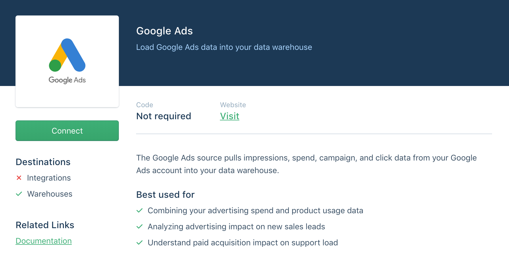
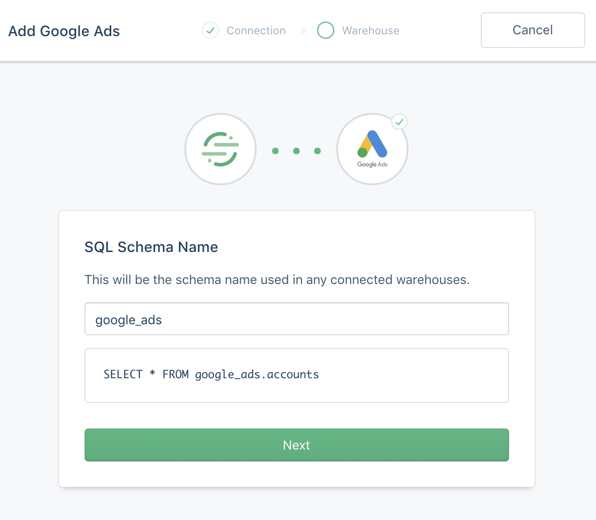
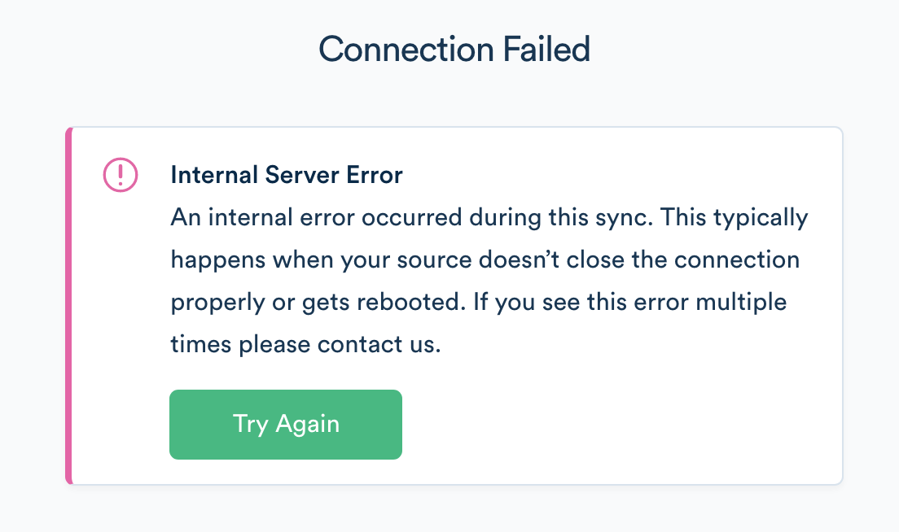



[Google Ads](https://ads.google.com/home/){:target="_blank"} is an online advertising service developed by Google. With Google Ads, you can take advantage of online advertising to improve your internet marketing effectiveness.

> info "Google Ads Source API Upgrade"
> In April 2022, Segment upgraded from using the Google AdWords API to the Google Ads API for the Segment Google Ads source. As a result of this change, Segment [no longer supports](https://developers.google.com/google-ads/api/docs/reporting/zero-metrics#rows_returned){:target="_blank"} "Include Zero Impressions." Queries that contain segments (date, product, country, etc.) will no longer return data for rows that have zero metrics. Because all collections reported to Segment contain date segments in their queries, Include Zero Impressions is no longer supported for any collection in the Google Ads source.
>  In addition, some properties in the following collections have different functionality: 
> - [Ad Performance Report](#ad-performance-report)
> - [Campaign Performance Report](#campaign-performance-report)
> - [Click Performance Report](#click-performance-report)
> - [Search Performance Report](#search-performance-report)
> - [Keyword Performance Report](#keyword-performance-report)

## Getting Started

1. From your workspace's `/sources` page, click `Add Source`.

2. Choose Google Ads and click `Connect`.

   

3. Click `Authenticate Google Ads` and go through the authentication flow.

4. Select a Google Ads account to sync and click `Next`

5. Choose a schema name. This will be the namespace you will be querying against in your warehouse. Segment recommends that you choose a name that reflects the source itself, like `google_ads`, or `google_ads_usa`.

   

### Permissions

When you set up your Google Ads Source, you may notice that all the Google Ads accounts your Google user can view aren't listed. This is because the Google Ads API doesn't expose a list of "managed" or sub-accounts to non-administrators using the API. That said, if you have read permissions to the account and would like to add it, please [contact Support](https://segment.com/help/contact){:target="_blank"}. For more information about finding your Google Ads Customer ID, see [here](https://support.google.com/google-ads/answer/1704344?co=ADWORDS.IsAWNCustomer%3Dfalse&hl=en){:target="_blank"}.

### What Google Ads MCC do you sync?
By default, the primary Google Ads account connected to your Google account syncs to Segment. If you would like to override this, please [contact Support](https://segment.com/help/contact){:target="_blank"}.

### I'm getting an Internal Server Error!

If you're getting the error pictured below, try disabling any ad block extensions in your browser and attempting again. 

## Sync Component

The Google Ads source contains a sync component. This enables Segment to the Google Ads API on your behalf on a 3 hour interval to pull the latest data into Segment. In the initial sync, Segment retrieves the Google Ads objects (and corresponding properties) according to the Collections Table below. The objects write into a separate schema, corresponding to the name of the  source instance's schema you designated during configuration. For example, chose `google-ads` as the schema, the `ads` collection is accessible at `google-ads.ads` in SQL.

The sync component uses an upsert API, so the data in your warehouse loaded using sync will reflect the latest state of the corresponding resource in Google Ads.  For example, if `budget` from `0` to `100` between syncs, on its next sync that tickets status will be `100`.

The source syncs and warehouse syncs are independent processes. Source syncs pull your data into the Segment Hub, and warehouse syncs flush that data to your warehouse. Sources sync with Segment every 3 hours. Depending on your Warehouses plan, Segment pushes the Source data to your warehouse on the interval associated with your billing plan.

## Collections

Collections are the groupings of resources Segment pulls from your source. In your warehouse, each collection has its own table.

| Collection                  | Type   | Description                                                                                                                                                                                                                                                                                                                                                                                                                                     |
| --------------------------- | ------ | ----------------------------------------------------------------------------------------------------------------------------------------------------------------------------------------------------------------------------------------------------------------------------------------------------------------------------------------------------------------------------------------------------------------------------------------------- |
| ad_groups                   | object | An [ad group](https://developers.google.com/google-ads/api/reference/rpc/v10/AdGroup){:target="_blank"} is a set of ads that share the same daily or lifetime budget, schedule, bid type, bid info, and targeting data                                                                                                                                                                                                                           |
| ad_performance_report       | object | [Ad Performance Report](https://developers.google.com/google-ads/api/docs/migration/overview){:target="_blank"} includes all statistics aggregated at the ad level, one row per ad. Segment pulls [7 days of data.](https://developers.google.com/google-ads/api/docs/query/date-ranges){:target="_blank"}                                                                                                                                     |
| ads                         | object | An [ad object](https://developers.google.com/google-ads/api/reference/rpc/v10/Ad){:target="_blank"} contains the data necessary to visually display an ad and associate it with a corresponding ad set.                                                                                                                                                                                                                                 |
| campaigns                   | object | A [campaign](https://developers.google.com/google-ads/api/reference/rpc/v10/Campaign){:target="_blank"} is a grouping of ad sets which are organized by the same business goal.                                                                                                                                                                                                                                                            |
| campaign_performance_report | object | [Campaign performance reports](https://developers.google.com/google-ads/api/docs/migration/overview){:target="_blank"} include a daily snapshot of performance statistics per campaign. Segment pulls [7 days of data.](https://developers.google.com/google-ads/api/docs/query/date-ranges){:target="_blank"}                                                                                                                           |
| click_performance_report    | object | [Click performance Reports](https://developers.google.com/google-ads/api/docs/migration/overview){:target="_blank"} include stats at the click level, including both valid and invalid clicks. Segment pulls [7 days of data.](https://developers.google.com/google-ads/api/docs/query/date-ranges){:target="_blank"}                                                                                                                       |
| search_performance_report   | object | **[Contact Support](https://segment.com/help/contact) to add this collection** [Search query performance Reports](https://developers.google.com/google-ads/api/docs/migration/overview){:target="_blank"} include statistics aggregated at the search terms level, one row per combination of search terms. Segment pulls [7 days of data.](https://developers.google.com/google-ads/api/docs/query/date-ranges){:target="_blank"} |
| keywords_performance_report | object | **[Contact Support](https://segment.com/help/contact) to add this collection** [Keywords Performance Report](https://developers.google.com/google-ads/api/docs/migration/overview){:target="_blank"} includes all statistics aggregated at the keyword level, one row per keyword. Segment pulls [7 days of data.](https://developers.google.com/google-ads/api/docs/query/date-ranges){:target="_blank"}                              |

### Video Campaign Reports

Segment doesn't pull "Video Campaign Reports", because the [Google Ads API](https://developers.google.com/google-ads/api/docs/campaigns/overview){:target="_blank"} doesn't support that report.

## Collection Properties

Below are tables outlining the properties included in the collections listed above. To see the full description of each property, refer to the Google Ads documentation linked in each collection above.

### What unit is money in?
Currency values in Google Ads are in micros, or one millionth of the smallest unit. For example, in USD, the value for `campaign.budget` would be in one millionth of a cent.

### Ad Groups

| Property Name       | Description                                                                                                                |
| ------------------- | -------------------------------------------------------------------------------------------------------------------------- |
| adwords_customer_id | The 10-digit Google Ads Customer ID.                                                                                       |
| campaign_id         | ID of the campaign with which this ad group is associated.                                                                 |
| name                | Name of this ad group.                                                                                                     |
| received_at         | This timestamp is added to incoming messages as soon as they hit Segment API.                                              |
| status              | [Status](https://developers.google.com/google-ads/api/reference/rpc/v10/AdGroupStatusEnum.AdGroupStatus){:target="_blank"} of this ad group. |

### Ad Performance Report

| Property Name                                          | Description                                                                                                                                                                                     |
| ------------------------------------------------------ | ----------------------------------------------------------------------------------------------------------------------------------------------------------------------------------------------- |
| account_currency_code                                  | The currency of the Customer account.                                                                                                                                                           |
| account_descriptive_name                               | The descriptive name of the Customer account.                                                                                                                                                   |
| active_view_impressions                                | How often your ad has become viewable on a Display Network site.                                                                                                                                |
| active_view_measurability                              | The ratio of impressions that could be measured by Active View over the number of served impressions.                                                                                           |
| active_view_measurable_cost                            | The cost of the impressions you received that were measurable by Active View.                                                                                                                   |
| active_view_measurable_impressions                     | The number of times your ads are appearing on placements in positions where they can be seen.                                                                                                   |
| active_view_viewability                                | The percentage of time when your ad appeared on an Active View enabled site (measurable impressions) and was viewable (viewable impressions).                                                   |
| ad_group_id                                            | The ID of the AdGroup.                                                                                                                                                                          |
| ad_id                                                  | The ID of the Ad.                                                                                                                                                                               |
| adwords_customer_id                                    | The 10-digit Google Ads Customer ID.                                                                                                                                                            |
| all_conversion_rate                                    | How often a click on your ad resulted in a conversion.   **This was previously a percentage, but as of April 2022, is now a decimal value. For example, a previous value of 75 is now 0.75.**   |
| all_conversion_value                                   | The total value of your conversions, including estimated conversions.   **This was previously limited to two decimal places, but as of April 2022, you can now have up to nine values after the decimal.** |
| all_conversions                                        | Best estimate of the total number of conversions that Google Ads drives. Includes website, cross-device, and phone call conversions.                                                            |
| average_cost                                           | The average amount you pay per interaction.                                                                                                                                                     |
| ~~average_position~~                                   | _Deprecated by Google._ Your ad's position relative to those of other advertisers.                                                                                                                                      |
| average_time_on_site                                   | Total duration of all sessions (in seconds) / number of sessions.                                                                                                                               |
| bounce_rate                                            | Percentage of clicks where the user visited a single page on your site.                                                                                                                    |
| ~~click_assisted_conversion_value~~                    | _Deprecated by Google._ The total value of all conversions for which this keyword, ad, ad group, or campaign triggered assisted clicks.                                                                                 |
| ~~click_assisted_conversions~~                         | _Deprecated by Google._ The total number of conversions for which this keyword, ad, ad group, or campaign contributed to one or more assisted clicks.                                                                   |
| ~~click_assisted_conversions_over_last_click_conversions~~ | _Deprecated by Google._ The total number of conversions for which this keyword, ad, ad group, or campaign received in assisted clicks divided by the total number of conversions for which it triggered the last click. |
| clicks                                                 | The number of clicks.                                                                                                                                                                           |
| conversion_value                                       | The sum of conversion values for all conversions.                                                                                                                                               |
| conversions                                            | The number of conversions for all conversion actions that you have opted into optimization.                                                                                                     |
| cost                                                   | The sum of your cost-per-click (CPC) and cost-per-thousand impressions (CPM) costs during this period.                                                                                          |
| date_start                                             | The date start formatted as yyyy-MM-dd.                                                                                                                                                         |
| date_stop                                              | The date stop formatted as yyyy-MM-dd.                                                                                                                                                          |
| engagements                                            | The number of engagements. An engagement occurs when a viewer expands your Lightbox ad.                                                                                                         |
| gmail_forwards                                         | The number of times your ad was forwarded to someone else as a message.                                                                                                                         |
| gmail_saves                                            | The number of times someone has saved your Gmail ad to their inbox as a message.                                                                                                                |
| gmail_secondary_clicks                                 | The number of clicks to your landing page on the expanded state of Gmail ads.                                                                                                                   |
| ~~impression_assisted_conversions~~                    | _Deprecated by Google._ Total number of conversions for which this object triggered assist impressions before the last click.                                                                                         |
| impressions                                            | Count of how often your ad has appeared on a search results page or website on the Google Network.                                                                                              |
| interaction_types                                      | The types of interactions that are reflected in the Interactions, InteractionRate, and AverageCost columns.                                                                                     |
| interactions                                           | The number of interactions. An interaction is the main user action associated with an ad format--clicks for text and shopping ads, views for video ads, and so on.                              |
| value_per_all_conversion                               | The value, on average, of all conversions.                                                                                                                                                      |
| video_quartile_100_rate                                | Percentage of impressions where the viewer watched 100% of your video.                                                                                                                           |
| video_quartile_25_rate                                 | Percentage of impressions where the viewer watched 25% of your video.                                                                                                                           |
| video_quartile_50_rate                                 | Percentage of impressions where the viewer watched 50% of your video.                                                                                                                           |
| video_quartile_75_rate                                 | Percentage of impressions where the viewer watched 75% of your video.                                                                                                                           |
| video_view_rate                                        | The number of views your TrueView video ad receives divided by its number of impressions, including thumbnail impressions for TrueView in-display ads.                                          |
| video_views                                            | The number of times your video ads were viewed.                                                                                                                                                 |
| view_through_conversions                               | The total number of view-through conversions.                                                                                                                                                   |

### Ads

> note "Returning removed ads"
> As of April 2022, the Google Ads source uses the Google Ads API, which returns ads with a status of `REMOVED`. Prior to April 2022, `REMOVED` ads were not returned by the default AdWords API. 

| Property Name       | Description                                                                                                                 |
| ------------------- | --------------------------------------------------------------------------------------------------------------------------- |
| ad_group_id         | The id of the adgroup containing this ad.                                                                                   |
| adwords_customer_id | The 10-digit Google Ads Customer ID.                                                                                        |
| final_mobile_urls   | A list of final mobile landing page urls.                                                                                   |
| final_urls          | A list of final landing page urls.                                                                                          |
| received_at         | This timestamp is added to incoming messages as soon as they hit Segment API.                                               |
| status              | The [status](https://developers.google.com/google-ads/api/reference/rpc/v10/AdGroupAdStatusEnum.AdGroupAdStatus){:target="_blank"} of the ad. |
| type                | The type of this ad.                                                                                                        |
| ~~url~~             | _Deprecated by Google._ Unique identifier for this instance of UrlData.                                                     |

### Campaigns

| Property Name       | Description                                                                                                                       |
| ------------------- | --------------------------------------------------------------------------------------------------------------------------------- |
| adwords_customer_id | The 10-digit Google Ads Customer ID.                                                                                              |
| end_date            | Date the campaign ends.                                                                                                           |
| name                | Name of this campaign.                                                                                                            |
| received_at         | This timestamp is added to incoming messages as soon as they hit Segment API.                                                     |
| serving_status      | [Serving status](https://developers.google.com/google-ads/api/reference/rpc/v10/CampaignServingStatusEnum.CampaignServingStatus){:target="_blank"} of the campaign. |
| start_date          | Date the campaign begins.                                                                                                         |
| status              | [Status](https://developers.google.com/google-ads/api/reference/rpc/v10/CampaignStatusEnum.CampaignStatus){:target="_blank"} of the campaign.       |

### Campaign Performance Report

| Property Name                                          | Description                                                                                                                                                                                     |
| ------------------------------------------------------ | ----------------------------------------------------------------------------------------------------------------------------------------------------------------------------------------------- |
| active_view_impressions                                | How often your ad has become viewable on a Display Network site.                                                                                                                                |
| active_view_measurability                              | The ratio of impressions that could be measured by Active View over the number of served impressions.                                                                                           |
| active_view_measurable_cost                            | The cost of the impressions you received that were measurable by Active View.                                                                                                                   |
| active_view_measurable_impressions                     | The number of times your ads are appearing on placements in positions where they can be seen.                                                                                                   |
| active_view_viewability                                | The percentage of time when your ad appeared on an Active View enabled site (measurable impressions) and was viewable (viewable impressions).                                                   |
| advertising_channel_sub_type                           | Primary serving target for ads in the campaign.                                                                                                                                                 |
| adwords_customer_id                                    | The 10-digit Google Ads Customer ID.                                                                                                                                                            |
| all_conversion_rate                                    | How often a click on your ad resulted in a conversion.   **This was previously a percentage, but as of April 2022, is now a decimal value. For example, a previous value of 75 is now 0.75.** |
| all_conversion_value                                   | The total value of all of your conversions, including those that are estimated.   **This was previously limited to two decimal places, but as of April 2022, you can now have up to nine values after the decimal.** |
| all_conversions                                        | Best estimate of the total number of conversions that Google Ads drives. Includes website, cross-device, and phone call conversions.                                                            |
| amount                                                 | The daily budget.                                                                                                                                                                               |
| average_cost                                           | The average amount you pay per interaction.                                                                                                                                                     |
| ~~average_position~~                                   | _Deprecated by Google._ Your ad's position relative to those of other advertisers.                                                                                                                                      |
| average_time_on_site                                   | Total duration of all sessions (in seconds) / number of sessions.                                                                                                                               |
| base_campaign_id                                       | The ID of base campaign of trial campaigns.   **As of April 2022, the attribute type has changed from a [`xsd:long`](https://developers.google.com/adwords/api/docs/reference/v201809/CampaignService.Campaign#basecampaignid){:target="_blank"} to a [string](https://developers.google.com/google-ads/api/reference/rpc/v10/Campaign){:target="_blank"}.**    |
| bounce_rate                                            | Percentage of clicks where the user only visited a single page on your site.   **This was previously a percentage, but as of April 2022, is now a decimal value. For example, a previous value of 75 (for example, 75%) is now 0.75.** |
| budget_id                                              | The ID of the Budget.                                                                                                                                                                           |
| campaign_id                                            | The ID of the Campaign.                                                                                                                                                                         |
| campaign_status                                        | The status of the Campaign.                                                                                                                                                                     |
| campaign_trial_type                                    | The type of campaign. This shows if the campaign is a trial campaign or not.                                                                                                                    |
| ~~click_assisted_conversion_value~~                    | _Deprecated by Google._ The total value of all conversions for which this keyword, ad, ad group, or campaign triggered assisted clicks.                                                                                 |
| ~~click_assisted_conversions~~                         | _Deprecated by Google._ The total number of conversions for which this keyword, ad, ad group, or campaign contributed to one or more assisted clicks.                                                                   |
| ~~click_assisted_conversions_over_last_click_conversions~~ | _Deprecated by Google._ The total number of conversions for which this keyword, ad, ad group, or campaign received in assisted clicks divided by the total number of conversions for which it triggered the last click. |
| clicks                                                 | The number of clicks.                                                                                                                                                                           |
| conversion_value                                       | The sum of conversion values for all conversions.                                                                                                                                               |
| conversions                                            | The number of conversions for all conversion actions that you have opted into optimization.                                                                                                     |
| cost                                                   | The sum of your cost-per-click (CPC) and cost-per-thousand impressions (CPM) costs during this period.                                                                                          |
| date_start                                             | The date start formatted as yyyy-MM-dd.                                                                                                                                                         |
| date_stop                                              | The date stop formatted as yyyy-MM-dd.                                                                                                                                                          |
| engagements                                            | The number of engagements. An engagement occurs when a viewer expands your Lightbox ad.                                                                                                         |
| gmail_forwards                                         | The number of times your ad was forwarded to someone else as a message.                                                                                                                         |
| gmail_saves                                            | The number of times someone has saved your Gmail ad to their inbox as a message.                                                                                                                |
| gmail_secondary_clicks                                 | The number of clicks to your landing page on the expanded state of Gmail ads.                                                                                                                   |
| ~~impression_assisted_conversions~~                    | _Deprecated by Google._ Total number of conversions for which this object triggered assist impressions prior to the last click.                                                                                         |
| ~~impression_reach~~                                   | _Deprecated by Google._ Number of unique cookies that were exposed to your ad over a given time period, or the special value "< 100" if the number of cookies is less than 100.                                         |
| impressions                                            | Count of how often your ad has appeared on a search results page or website on the Google Network.                                                                                              |
| interaction_types                                      | The types of interactions that are reflected in the Interactions, InteractionRate, and AverageCost columns.   **As of April 2022, the case of the value changed from Pascal case (`Click`) to [upper case (`CLICK`)](https://developers.google.com/google-ads/api/reference/rpc/v10/InteractionEventTypeEnum.InteractionEventType){:target="_blank"}.** |
| interactions                                           | The number of interactions. An interaction is the main user action associated with an ad format--clicks for text and shopping ads, views for video ads, and so on.                              |
| invalid_clicks                                         | Number of clicks Google considers illegitimate and doesn't charge you for.                                                                                                                      |
| is_budget_explicitly_shared                            | Indicates if the budget is a shared budget (true) or specific to the campaign (false).   **As of April 2022, the case of the value changed from lowercase (`false`) to Pascal case (`False`).** |
| url_custom_parameters                                  | Custom URL parameters of the main object of this row.                                                                                                                                           |
| value_per_all_conversion                               | The value, on average, of all conversions.                                                                                                                                                      |
| video_quartile_100_rate                                | Percentage of impressions where the viewer watched all of your video.                                                                                                                           |
| video_quartile_25_rate                                 | Percentage of impressions where the viewer watched 25% of your video.                                                                                                                           |
| video_quartile_50_rate                                 | Percentage of impressions where the viewer watched 50% of your video.                                                                                                                           |
| video_quartile_75_rate                                 | Percentage of impressions where the viewer watched 75% of your video.                                                                                                                           |
| video_view_rate                                        | The number of views your TrueView video ad receives divided by its number of impressions, including thumbnail impressions for TrueView in-display ads.                                          |
| video_views                                            | The number of times your video ads were viewed.                                                                                                                                                 |
| view_through_conversions                               | The total number of view-through conversions.                                                                                                                                                   |

### Click Performance Report

| Property Name               | Description                                                     |
| --------------------------- | --------------------------------------------------------------- |
| ~~ad_format~~               | _Deprecated by Google._ The underlying media format of the ad.  |
| ad_group_id                 | The ID of the AdGroup.                                          |
| ad_network_type             | The network type. Previously `ad_network_type_1` and `ad_network_type_2`.  |
| adwords_customer_id         | The 10-digit Google Ads Customer ID.                            |
| aoi_most_specific_target_id | The most specific location target.                              |
| campaign_id                 | The ID of the Campaign.                                         |
| click_type                  | Indicates the click type for metric fields such as Impressions. |
| creative_id                 | ID of the ad.                                                   |
| ~~criteria_parameters~~     | _Deprecated by Google._ Descriptive string for the Criterion.   |
| date_start                  | The date start formatted as yyyy-MM-dd.                         |
| date_stop                   | The date stop formatted as yyyy-MM-dd.                          |
| device                      | Device type where the impression was shown.   **As of April 2022, the [device values have been updated](https://developers.google.com/google-ads/api/reference/rpc/v10/DeviceEnum.Device){:target="_blank"}.** |
| gcl_id                      | The Google Click ID.                                            |
| page                        | Page number in search results where the ad was shown.           |
| slot                        | The position of the Ad.   **As of April 2022, the [case of the value changed](https://developers.google.com/google-ads/api/reference/rpc/v10/SlotEnum.Slot){:target="_blank"} from Pascal case (`SearchTop`) to screaming snake case (`SEARCH_TOP`).** |
| user_list_id                | The ID of the UserList (audience).                              |

### Search Performance Report

> info "Ads API updates"
> As of April 2022, in the absence of a value the following fields return `0` or empty strings instead of `null` values:
> - conversion_category_name:`0`
> - conversion_name: _empty string_
> - conversion_tracker_id: _empty string_
> - cross_device_conversions: `0`
> - external_conversion_source: `0`
> - tracking_url_template: _empty string_

| Property Name                 | Description                                                                                                                                            |
| ----------------------------- | ------------------------------------------------------------------------------------------------------------------------------------------------------ |
| ad_group_id                   | The ID of the AdGroup.                                                                                                                                 |
| ad_group_name                 | The name of the AdGroup.                                                                                                                               |
| ad_group_state                | Status of the ad group.                                                                                                                                |
| ad_id                         | The ID of the Ad.                                                                                                                                      |
| adwords_customer_id           | The 10-digit Google Ads Customer ID.                                                                                                                   |
| all_conversion_rate           | How often a click on your ad resulted in a conversion.                                                                                                 |
| all_conversion_value          | The total value of all of your conversions, including those that are estimated.                                                                        |
| all_conversions               | Best estimate of the total number of conversions that Google Ads drives. Includes website, cross-device, and phone call conversions.                   |
| average_cost                  | The average amount you pay per interaction.                                                                                                            |
| average_cpc                   | The total cost of all clicks divided by the total number of clicks received.                                                                           |
| average_cpe                   | The average amount that you've been charged for an ad engagement.                                                                                      |
| average_cpm                   | Average Cost-per-thousand impressions (CPM).                                                                                                           |
| average_cpv                   | The average amount you pay each time someone views your ad.                                                                                            |
| ~~average_position~~          | _Deprecated by Google._ Your ad's position relative to those of other advertisers.                                                                     |
| campaign_id                   | The ID of the Campaign.                                                                                                                                |
| clicks                        | The number of clicks.                                                                                                                                  |
| conversion_rate               | The number of conversions divided by total clicks that can be tracked to conversions                                                                   |
| conversion_value              | The sum of conversion values for all conversions.                                                                                                      |
| conversions                   | The number of conversions for all conversion actions that you have opted into optimization.                                                            |
| cost                          | The sum of your cost-per-click (CPC) and cost-per-thousand impressions (CPM) costs during this period.                                                 |
| cost_per_all_conversion       | Total cost divided by all conversions.                                                                                                                 |
| cost_per_conversion           | The Cost attributable to conversion-tracked clicks divided by the number of conversions.                                                               |
| cross_device_conversions      | Conversions from when a customer clicks on an Google Ads ad on one device, then converts on a different device or browser.                             |
| ctr                           | The number of clicks your ad receives (Clicks) divided by the number of times your ad is shown (Impressions).                                          |
| date                          | The date formatted as yyyy-MM-dd.                                                                                                                      |
| device                        | Device type where the impression was shown.                                                                                                            |
| engagement_rate               | How often people engage with your ad after it's shown to them.                                                                                         |
| engagements                   | The number of engagements. An engagement occurs when a viewer expands your Lightbox ad.                                                                |
| external_conversion_source    | The source of conversion such as website, import from calls.                                                                                           |
| external_customer_id          | The Customer ID.                                                                                                                                       |
| final_url                     | Final URL of the impressions.   **This previously contained the protocol, domain, and path for your URL, but as of April 2022, now only contains the protocol and domain. For example, a previous value of https://segment.com/docs/ is now https://segment.com/.**                                                                                    |
| impressions                   | Count of how often your ad has appeared on a search results page or website on the Google Network.                                                     |
| interaction_rate              | How often people interact with your ad after it is shown to them.                                                                                      |
| interaction_types             | The types of interactions that are reflected in the Interactions, InteractionRate, and AverageCost columns.                                            |
| interactions                  | The number of interactions.                                                                                                                            |
| keyword_id                    | The ID of the Keyword that triggered the ad.                                                                                                           |
| network                       | First level network type.                                                                                                                              |
| ~~network_with_search_partners~~  | _Deprecated by Google._ Second level network type (includes search partners).                                                                      |
| original_ad_id                | -                                                                                                                                                      |
| query                         | Keyword that triggered the ad.                                                                                                                         |
| query_match_type_with_variant | Match type of the keyword that triggered the ad, including variants.   **As of April 2022, `query_match_type_with_variant` doesn't support the [following metrics](https://developers.google.com/google-ads/api/fields/v10/segments#segmentsconversion_action_category){:target="_blank"}, so they will return a `null` value:** average_cpv, video_quartile_p100_rate, video_quartile_p25_rate, video_quartile_p50_rate, video_quartile_p75_rate, video_view_rate, video_views |
| tracking_url_template         | Tracking template of the main object of this row.                                                                                                      |
| value_per_all_conversion      | The value, on average, of all conversions.                                                                                                             |
| value_per_conversion          | The total value of your conversions divided by the total number of conversions.                                                                        |
| video_quartile_100_rate       | Percentage of impressions where the viewer watched all of your video.                                                                                  |
| video_quartile_25_rate        | Percentage of impressions where the viewer watched 25% of your video.                                                                                  |
| video_quartile_50_rate        | Percentage of impressions where the viewer watched 50% of your video.                                                                                  |
| video_quartile_75_rate        | Percentage of impressions where the viewer watched 75% of your video.                                                                                  |
| video_view_rate               | The number of views your TrueView video ad receives divided by its number of impressions, including thumbnail impressions for TrueView in-display ads. |
| video_views                   | The number of times your video ads were viewed.                                                                                                        |
| view_through_conversions      | The total number of view-through conversions.                                                                                                          |
| week                          | The date for the Monday of the week, formatted as yyyy-MM-dd.                                                                                          |
| year                          | The year, formatted as yyyy.                                                                                                                           |

### Keyword Performance Report

| Property Name                   | Description                                                                                                                          |
| ------------------------------- | ------------------------------------------------------------------------------------------------------------------------------------ |
| ad_group_id                     | The ID of the AdGroup.                                                                                                               |
| adwords_customer_id             | The 10-digit Google Ads Customer ID.                                                                                                 |
| all_conversion_rate             | How often a click on your ad resulted in a conversion.   **This value was previously a percentage, but as of April 2022, is now a decimal. For example, a previous value of 75 is now 0.75.** |
| all_conversion_value            | The total value of all of your conversions, including those that are estimated.   **This was previously limited to two decimal places, but as of April 2022, you can now have up to nine values after the decimal.** |
| all_conversions                 | Best estimate of the total number of conversions that Google Ads drives. Includes website, cross-device, and phone call conversions. |
| approval_status                 | Approval status of the criterion.                                                                                                    |
| average_cost                    | The average amount you pay per interaction.                                                                                          |
| average_cpc                     | The total cost of all clicks divided by the total number of clicks received.                                                         |
| average_cpm                     | Average Cost-per-thousand impressions (CPM).   **This was previously limited to two decimal places, but as of April 2022, you can now have up to nine values after the decimal.**|
| average_cpv                     | The average amount you pay each time someone views your ad.                                                                          |
| average_pageviews               | Average number of pages viewed per session.                                                                                          |
| ~~average_position~~            | _Deprecated by Google._ Your ad's position relative to those of other advertisers.                                                   |
| average_time_on_site            | Total duration of all sessions (in seconds) / number of sessions.                                                                    |
| campaign_id                     | The ID of the Campaign.                                                                                                              |
| ~~click_assisted_conversion_value~~ | _Deprecated by Google._ The total value of all conversions for which this keyword, ad, ad group, or campaign triggered assisted clicks. |
| ~~click_assisted_conversions~~      | _Deprecated by Google._ The total number of conversions for which this keyword, ad, ad group, or campaign contributed to one or more assisted clicks. |
| clicks                          | The number of clicks.                                                                                                                |
| conversions                     | The number of conversions for all conversion actions that you have opted into optimization.                                          |
| cpc_bid                         | Cost per click bid.    **This value was [previously one of three units](https://developers.google.com/adwords/api/docs/appendix/reports/keywords-performance-report#cpcbid){:target="_blank"}: a monetary amount in micros, "auto: x" or "auto", but as of April 2022, is now a monetary amount in micros.** |
| cpc_bid_source                  | Source of the CPC bid.   **As of April 2022, the [ENUM values have been updated](https://developers.google.com/google-ads/api/reference/rpc/v10/BiddingSourceEnum.BiddingSource){:target="_blank"}.** |
| criteria                        | Descriptive string for the Criterion.                                                                                                |
| ctr                             | The number of clicks your ad receives (Clicks) divided by the number of times your ad is shown (Impressions).   **This value was previously a percentage, but as of April 2022, is now a decimal. For example, a previous value of 75 is now 0.75.**  |
| date_start                      | The date start formatted as yyyy-MM-dd.                                                                                              |
| date_stop                       | The date stop formatted as yyyy-MM-dd.                                                                                               |
| ~~impression_assisted_conversions~~ | _Deprecated by Google._ Total number of conversions for which this object triggered assist impressions prior to the last click.  |
| impressions                     | Count of how often your ad has appeared on a search results page or website on the Google Network.                                   |
| keyword_id                      | ID of the main object of this row. **As of April 2022, the format of this value changed from the keyword_id itself to the entire link: for example, a previous value of `10004380` is now `customers/.../adGroupCriteria/39801374490~10004380`** |
| original_keyword_id             | -                                                                                                                                    |

## Adding Destinations

Warehouses are the sole supported destination for object-cloud sources.
