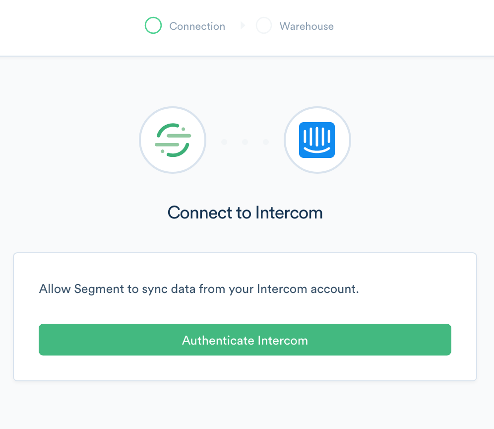
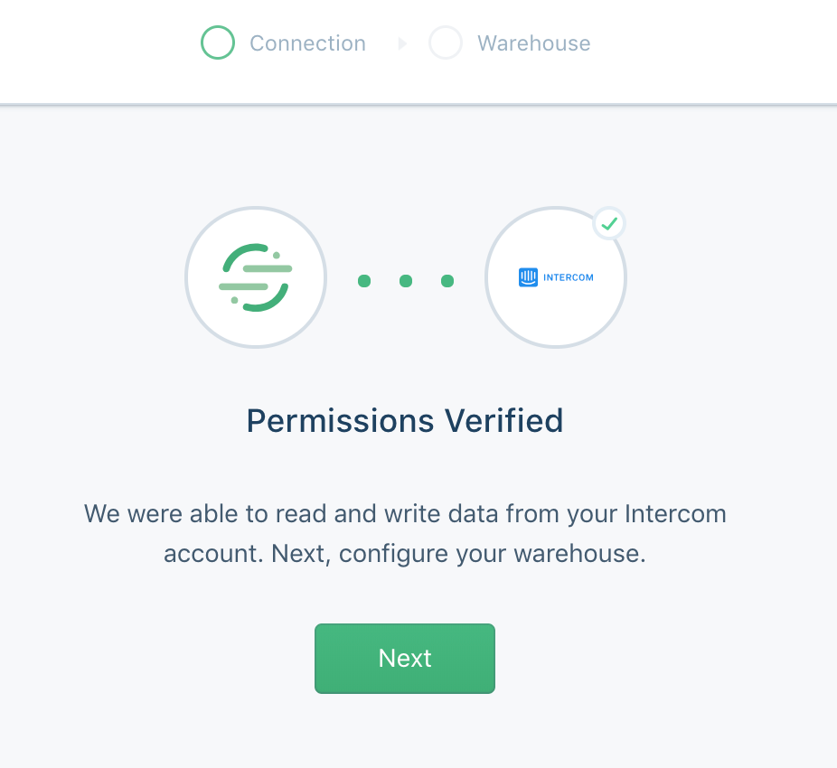
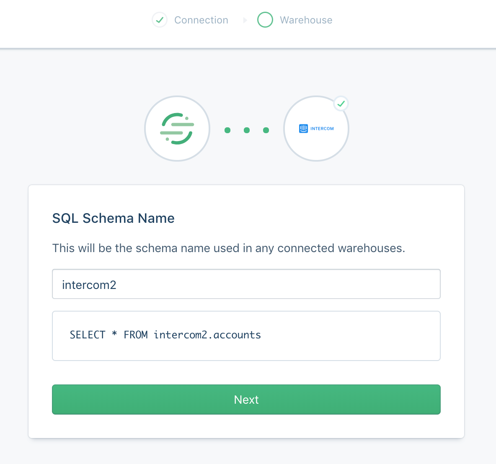
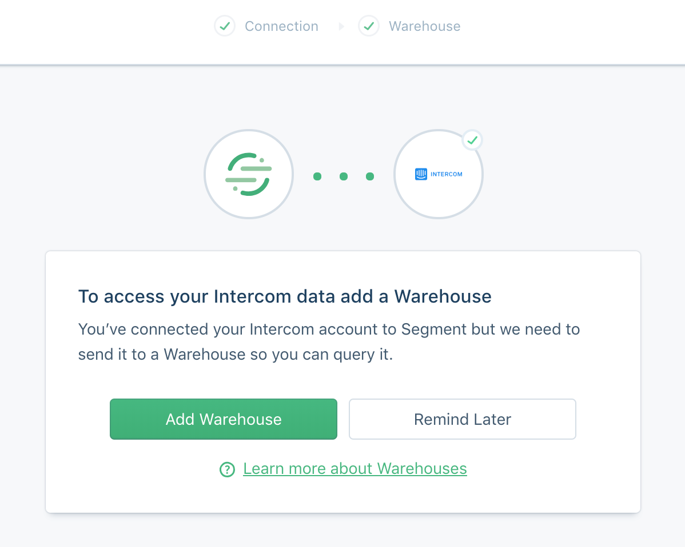



[Intercom](http://intercom.com) is a customer platform with a suite of products for live chat, marketing, feedback, and support. With Intercom you will be able to send targeted messages to the right people at the right time, manage conversations with leads and customers at scale and create, organize, and publish articles to help people get answers to their questions and get started with your app.

Take your company's email analysis to the next level by **adding Intercom as a Source to Segment.** Segment automatically  collects objects like `Users` and `Conversations` and load them into your data warehouse. 

## Getting Started

1. From your workspace's `/sources` page, click `add source`.

2. Choose Intercom and press **connect**.

3. OAuth into Intercom

4. We will verify all the required permissions

5. Configure the name for the Intercom schema in your warehouse

6. Add a warehouse or connect Intercom to an already existing warehouse in your workspace

Voila! We'll begin syncing your Intercom data into Segment momentarily, and it will be written to your warehouse at your next Warehouse run.

## Components

### Sync

Our Intercom source has a sync component, which means we'll make requests to [their API](https://developers.intercom.io/docs/) on your behalf on a 3 hour interval to pull the latest data into Segment. In the initial sync, we'll grab all the Intercom objects (and their corresponding properties) according to the collections table below. The objects will be written into a designated schema corresponding to the source instance's schema name you designated upon creation. For example, if you went with `intercom_prod`, the `users` collection will be accessible at `intercom_prod.users` in SQL.

Our sync component uses an upsert API, so the data in your warehouse loaded using sync will reflect the latest state of the corresponding resource in Intercom.  For example, if the `users.last_seen_ip` will be the latest value upon each sync.

The source syncs and warehouse syncs are independent processes. Source runs pull your data into the Segment Hub, and warehouse runs flush that data to your warehouse. Sources will sync with Segment every 3 hours. Depending on your Warehouses plan, we will push the Source data to your warehouse on the interval associated with your billing plan.

At the moment, we don't support filtering which objects or properties get synced. If you're interested in this feature, [let us know](https://segment.com/help/contact/)!

## Collections

Collections are the groupings of resources we pull from your source. In your warehouse, each collection gets its own table.

| Collection           | Type   | Description                                                                                                                                                                                                                                                                                                                                 |
| -------------------- | ------ | ------------------------------------------------------------------------------------------------------------------------------------------------------------------------------------------------------------------------------------------------------------------------------------------------------------------------------------------- |
| `users`              | Object | The Users resource is the primary way of interacting with Intercom. You can create, update and delete your users, and add custom attributes describing them. Users can be viewed individually or as a list, and can queried using tags or segments. For more info, check out the [Intercom docs](https://developers.intercom.io/docs/users) |
| `companies`          | Object | Companies allow you to represent commercial organizations using your product. For more info, check out the [Intercom docs](https://developers.intercom.io/docs/companies)                                                                                                                                                                   |
| `contacts`           | Object | Leads (previously known as Contacts) are useful for representing logged-out users of your application For more info, check out the [Intercom docs](https://developers.intercom.io/docs/leads)                                                                                                                                               |
| `segments`           | Object | A segment is a group of your users defined by rules that you set For more info, check out the [Intercom docs](https://developers.intercom.io/docs/segments)                                                                                                                                                                                 |
| `tags`               | Object | A tag allows you to label your users and companies and list them using that tag. For more info, check out the [Intercom docs](https://developers.intercom.io/docs/tags)                                                                                                                                                                     |
| `conversations`      | Object | Conversation are how you can communicate with users in Intercom. For more info, check out the [Intercom docs](https://developers.intercom.io/docs/conversations)                                                                                                                                                                            |
| `admins`             | Object | Admins are how you can view your teams and team members. For more info, check out the [Intercom docs](https://developers.intercom.io/docs/admin-model#section-admin-object)                                                                                                                                                                 |
| `social_profiles`    | Object | Social data about the user For more info, check out the [Intercom docs](https://developers.intercom.io/docs/user-model#section-social-profile-object)                                                                                                                                                                                       |
| `conversation_parts` | Object | A conversation part describes an element of the conversation. For more info, check out the [Intercom docs](https://developers.intercom.io/docs/conversation-part-model#section-conversation-part-object)                                                                                                                                    |

## Collection Properties

### Users

| Property Name            | Description                                                                                                                                          |
| ------------------------ | ---------------------------------------------------------------------------------------------------------------------------------------------------- |
| id                       | The Intercom defined id representing the user                                                                                                        |
| user_id                  | The user id you have defined for the user. (Max limit of 255 UTF-8 characters, and should not have trailing or leading spaces)                       |
| anonymous                | Whether or not this is a Lead. Always false (read only)                                                                                              |
| avatar                   | An avatar object for the user                                                                                                                        |
| companies                | A list of companies for the user                                                                                                                     |
| email                    | The email you have defined for the user (Max limit of 255 UTF-8 characters, and should not have trailing or leading spaces)                          |
| phone                    | The phone number of the user                                                                                                                         |
| created_at               | The time (in seconds) the user was added to Intercom                                                                                                 |
| remote_created_at        | The time the user was created by you                                                                                                                 |
| updated_at               | The last time the user was updated                                                                                                                   |
| signed_up_at             | The time (in seconds) the user signed up                                                                                                             |
| last_request_at          | The time the user last recorded making a request                                                                                                     |
| session_count            | How many sessions the user has recorded (read only)                                                                                                  |
| unsubscribed_from_emails | Whether the user is unsubscribed from emails                                                                                                         |
| location_data            | A Location Object relating to the user. To update location data send in a value for `last_seen_ip` and the IP will be used to populate location data |
| name                     | The full name of the user                                                                                                                            |
| segments                 | A list of segments associated with the user                                                                                                          |
| tags                     | A list of tags associated with the user                                                                                                              |
| last_seen_ip             | An ip address (e.g. "1.2.3.4") representing the last ip address the user visited your application from. (Used for updating location_data)            |
| user_agent_data          | Data about the last user agent the user was seen using. To update this value use `last\_seen\_user\_agent`                                           |
| custom_attributes        | The custom attributes you have set on the user (case sensitive)                                                                                      |

## Companies

| Property Name     | Description                                               |
| ----------------- | --------------------------------------------------------- |
| id                | The Intercom defined id representing the company          |
| company_id        | The company id you have defined for the company           |
| created_at        | The time the company was added to Intercom                |
| remote_created_at | The time the company was created by you                   |
| updated_at        | The last time the company was updated                     |
| last_request_at   | The time the company last recorded making a request       |
| name              | The name of the company                                   |
| custom_attributes | The custom attributes you have set on the company         |
| session_count     | How many sessions the company has recorded                |
| monthly_spend     | How much revenue the company generates for your business  |
| user_count        | The number of users in the company                        |
| plan              | The name of the plan you have associated with the company |
| size              | The number of employees in the company                    |
| website           | The URL for the company website                           |
| industry          | The industry that the company operates in                 |

## Contacts

| Property Name           | Description                                                                                                                                  |
| ----------------------- | -------------------------------------------------------------------------------------------------------------------------------------------- |
| id                      | The Intercom defined id representing the Lead                                                                                                |
| created_at              | The time the Lead was added to Intercom                                                                                                      |
| updated_at              | The last time the Lead was updated                                                                                                           |
| user_id                 | The user id you have defined for the user. (Max limit of 255 UTF-8 characters, and should not have trailing or leading spaces)               |
| last_request_at         | The time the Lead last recorded making a request                                                                                             |
| name                    | The name of the Lead                                                                                                                         |
| email                   | The email you have defined for the user (Max limit of 255 UTF-8 characters, and should not have trailing or leading spaces)                  |
| phone                   | The phone number of the user                                                                                                                 |
| custom_attributes       | The custom attributes you have set on the Lead                                                                                               |
| unsuscribed_from_emails | Whether the Lead is unsubscribed from emails                                                                                                 |
| location_data           | A Location Object relating to the Lead. To update location_data use `last_seen_ip` which will be translated to the appropriate location_data |
| last_seen_ip            | An ip address (e.g. "1.2.3.4") representing the last ip address the user visited your application from. (Used for updating location_data)    |
| user_agent_data         | Data about the last user agent the user was seen using. To update this value use `last\_seen\_user\_agent`                                   |
| companies               | A list of companies for the user                                                                                                             |
| avatar                  | An avatar object for the Lead                                                                                                                |

## Segments

| Property Name | Description                                                                                                 |
| ------------- | ----------------------------------------------------------------------------------------------------------- |
| id            | The Intercom defined id representing the segment                                                            |
| name          | The name of the segment                                                                                     |
| created_at    | The time the segment was created                                                                            |
| updated_at    | The time the segment was updated                                                                            |
| person_type   | Type of the record: user or lead                                                                            |
| count         | The number of items in the user segment. It's returned when `include_count=true` is included in the request |

## Tags

| Property Name | Description         |
| ------------- | ------------------- |
| id            | The id of the tag   |
| name          | The name of the tag |

## Conversations

| Property Name | Description                                                                                                               |
| ------------- | ------------------------------------------------------------------------------------------------------------------------- |
| id            | The id representing the conversation                                                                                      |
| created_at    | The time the conversation was created                                                                                     |
| updated_at    | The last time the conversation was updated                                                                                |
| message       | The message that started the conversation rendered for presentation                                                       |
| user          | The user the conversation concerns                                                                                        |
| assignee      | The admin the conversation is currently assigned to. Note `nobody_admin` indicates the conversation is assigned to Nobody |
| open          | Indicates whether a conversation is open (true) or closed (false)                                                         |
| read          | Indicates whether a conversation has been read                                                                            |
| total_count   | The number of conversation parts in this conversation                                                                     |
| tags          | A list of tags associated with the conversation                                                                           |

## Admins

| Property Name | Description                                                      |
| ------------- | ---------------------------------------------------------------- |
| id            | The id of the admin or team                                      |
| name          | The name of the admin or team                                    |
| email         | The email address of the admin. This attribute is null for teams |

## Social Profiles

| Property Name | Description                                       |
| ------------- | ------------------------------------------------- |
| id            | Optional. User ID on the service                  |
| name          | The name of the service (e.g., twitter, facebook) |
| url           | The user homepage on the service                  |
| username      | User name or handle on the service                |

## Conversation Parts

| Property Name | Description                                                                                            |
| ------------- | ------------------------------------------------------------------------------------------------------ |
| id            | The id representing the conversation part                                                              |
| assigned_to   | The id of the admin that the conversation is assigned to (not null only when `part_type: assignment` ) |
| author        | The user or admin that created the part                                                                |
| body          | The html encoded body of the comment                                                                   |
| created_at    | The time the conversation part was created                                                             |
| notified_at   | The time the user was notified with the conversation part                                              |
| part_type     | The type of conversation part                                                                          |
| updated_at    | The last time the conversation part was updated                                                        |

## Adding Destinations

Currently, Warehouses are the only supported destination for object-cloud sources.
