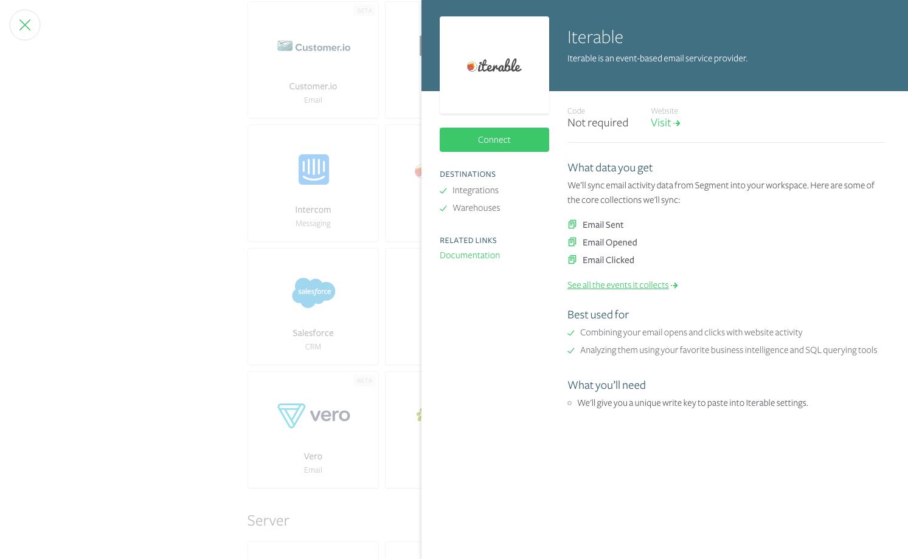
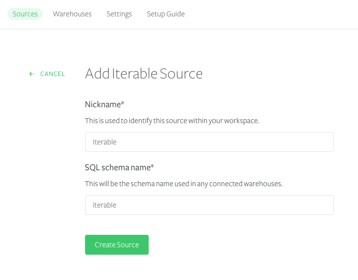
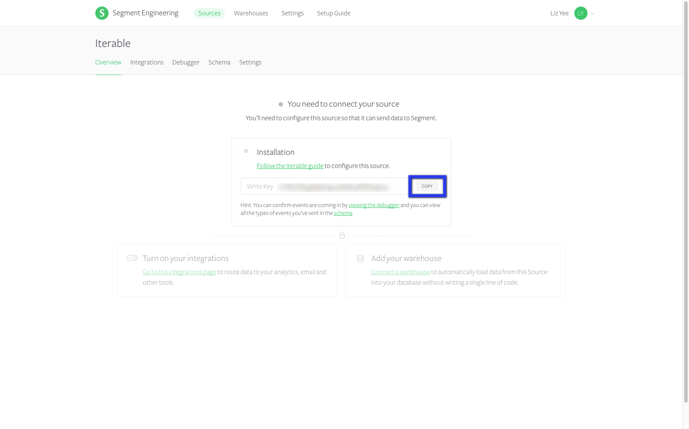

Iterable is the growth marketing platform that enables brands to create, execute and optimize campaigns to power world-class customer engagement across email, push, SMS, in-app and more with unparalleled data flexibility. An integrated, cross-channel solution—built for marketers, trusted by engineers, designed with intelligence.

Take your company's marketing analysis to the next level by **adding Iterable as a Source to Segment**. Iterable will automatically collect cross-channel messaging events like `Email Delivered` and `Push Delivered`, forward them to your destinations and load them into your data warehouse.

In your favorite BI or analytics tool, you'll be able to analyze all your cross-channel marketing campaigns in SQL or through drag-and-drop reports. And you'll be able to sync your Iterable data with event data you're already sending through Segment to analyze the down-funnel effects of your messaging. 

## Getting Started

If you have previously enabled sending email events using the Iterable destination during our beta (using a project write key), you do not need to create new Iterable source. Your email data will continue to flow as normal.

1. From your workspace's `segment.com/<your-workspace>/sources page`, click `Add source`.

2. Choose Iterable.

  

3. Give the Source a nickname and a schema name. The nickname is a label used in the Segment interface, and the schema name is the namespace you query against in your warehouse. You can name them however you'd like, but we recommend sticking to something that reflects the Source itself, like `Iterable` for nickname and `iterable` for the schema name.

  

4. The next page ("Overview") will surface your **Segment write key for Iterable.** Copy this write key. 

  

5. To finish the setup, you'll have to go into your Iterable account and enter this Segment write key in their integrations settings. Find the right place in Iterable by clicking Integrations > Third Party > Segment.

6. Click **Save**.

7. In Segment, click into your Iterable Source in `segment.com/<your-workspace>/sources`. From there you'll be able to add Destinations where you want to see email events.

That's it! As you send emails, events will now be sent to your destinations and automatically loaded into any warehouses you have enabled. 

## Components

**Stream**

Iterable uses our stream Source component to send Segment email events. It uses a server-side `track` method to send data to Segment. These events are then available in any destination that accepts server-side events, and available in a schema in your data warehouse, so you can query using SQL. 

The default behavior is for Iterable to pass the `userId` associated with the email recipient as the `userId`. There are cases in which Iterable does not have an associated `userId`, in which case the email address will be passed in as the `anonymousId`. 

## Collections

Collections are the groupings of data we pull from your Source. In your warehouse, each collection gets its own table, as well as a `tracks` table that aggregates all the events into a single table. 

<table>
  <tr>
    <td>**Collection**</td>
    <td>**Type**</td>
    <td>**Description**</td>
  </tr>
  <tr>
    <td>Email Delivered</td>
    <td>Event</td>
    <td>Message has been successfully delivered to the receiving server</td>
  </tr>
  <tr>
    <td>Email Opened</td>
    <td>Event</td>
    <td>Recipient has opened the HTML message. You need to enable Open Tracking for getting this type of event</td>
  </tr>
    <tr>
    <td>Email Bounced</td>
    <td>Event</td>
    <td>Receiving server could not or would not accept message</td>
  </tr>
    <tr>
    <td>Email Link Clicked</td>
    <td>Event</td>
    <td>Recipient clicked on a link within the message. You need to enable Click Tracking for getting this type of event</td>
  </tr>
  <tr>
    <td>Email Subscribed</td>
    <td>Event</td>
    <td>User subscribes to a messaging channel</td>
  </tr>
    <tr>
    <td>Email Unsubscribed</td>
    <td>Event</td>
    <td>Recipient clicked on message's subscription management link</td>
  </tr>
    <tr>
    <td>Email Marked as Spam</td>
    <td>Event</td>
    <td>Recipient marked message as spam</td>
  </tr>
  <tr>
    <td>Push Delivered</td>
    <td>Event</td>
    <td>Message has been successfully delivered to the receiving server</td>
  </tr>
    <tr>
    <td>Push Opened</td>
    <td>Event</td>
    <td>User has been shown push notification by client app</td>
  </tr>
    <tr>
    <td>Push Bounced</td>
    <td>Event</td>
    <td>Receiving server could not or would not accept message</td>
  </tr>
    <tr>
    <td>Mobile App Uninstalled</td>
    <td>Event</td>
    <td>Ghost message sent 12 hours after original push delivered results in rejection from receiving server</td>
  </tr>
    <tr>
    <td>SMS Send</td>
    <td>Event</td>
    <td>Message has been successfully delivered to the receiving server</td>
  </tr>
    <tr>
    <td>SMS Bounced</td>
    <td>Event</td>
    <td>Receiving server could not or would not accept message</td>
  </tr>
    <tr>
    <td>SMS Received</td>
    <td>Event</td>
    <td>User has sent an inbound SMS that was received by server</td>
  </tr>
</table>

<!-- Example: To query the Email Delivered table, you'd write a query like this:

```sql
select *
from iterable.email_delivered
```


<table>
</table> -->

## Send data to Iterable

The Iterable Source works better when you also connect Iterable as a destination. With the Iterable **Destination**, you can use Segment to send Iterable user and event data from which you trigger email campaigns. Want to start sending website or mobile data **_TO_** Iterable? Head on over to our [Iterable destination docs](/docs/connections/destinations/catalog/iterable/).
