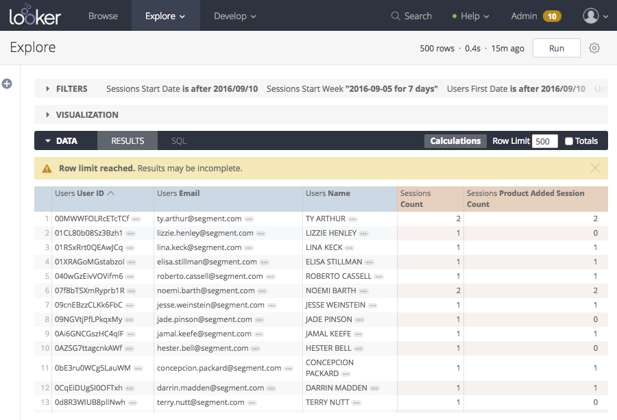



Looker is a business intelligence software platform that helps you explore, analyze and share real-time business insights easily. Create custom cohorts of customers in Looker's powerful and flexible exploration tool and pass your analysis into your marketing tools for activation and engagement using the Looker Source in Segment.

## Getting Started

To enable the integration service in Looker, contact your account representative. They will walk you through the implementation on the Looker side.

From Segment's end, you will need to create a Looker source, and copy your write key into the Looker integration admin settings.


### Defining Looks

Using this Source, Looker sends Look (query) results into Segment as `identify` calls. Any user trait that you include as a column in your Look will be included as a user trait on these identify call. 

> note ""
> **NOTE:** Segment doesn't support arrays. Segment supports properties that are strings or numbers.

When you set up your Look and generate new user traits (column names), avoid using trait names that may already exist in your marketing tools. If you create a new user trait in Looker (e.g. "churn risk") and that trait already exists in your tools, syncing the user profile to the downstream tool overrides the existing trait value with the new one.

Below is an example of a cohort of users in Looker who have been active on toastmates.com (example website) at least once  in the last 30 days.



Below is an example of the `identify()` call Looker will send to Segment for the first user in the Look shown above:

```json
{
  "type": "identify",
  "traits": {
    "name": "Ty Arthur",
    "email": "ty.arthur@segment.com",
    "sessions count": 2
  },
  "userId": "00MWWFOLRcETcTCf"
  }
```

**Rename fields**

If you don't like the formatting of field names as they appear in Segment, you can use [Table Calculations](https://docs.looker.com/exploring-data/using-table-calculations) to create a new
version of the field with the desired name. Then you can hide the original field from the table visualization.

### Send Looks to your Segment Destinations

**Customer identifiers to include**
The end goal of using the Looker Source is to trigger actions in your marketing tools, or Segment Destinations. These Destinations require either a userId or an email with an `identify()` call. To err on the side of caution, we recommend including `userId` and `email` whenever possible.

Below is a chart of all the server side Destinations that will accept `identify()` calls from Looker and any required identifiers you must pass through. Be sure to include the required trait(s) when setting up your Look, otherwise your user profiles will not make it into your Segment Destinations.

**Supported destinations**

| **Destination**                   | **Email** | **UserId** | **Either** | **Special Note**                                                                                             |
| --------------------------------- | --------- | ---------- | ---------- | ------------------------------------------------------------------------------------------------------------ |
| aboardly                          |           | X          |            |                                                                                                              |
| activecampaign                    |           | X          |            |                                                                                                              |
| amazon-kinesis                    |           | X*         |            | *or anonymousId                                                                                              |
| amazon-kinesis-firehose           |           |            | X          |                                                                                                              |
| amplitude                         |           | X          |            |                                                                                                              |
| braze (previously appboy)         |           | X          |            |                                                                                                              |
| appcues                           |           | X          |            |                                                                                                              |
| attribution                       |           | X          |            |                                                                                                              |
| autopilothq                       |           | X          |            |                                                                                                              |
| blueshift                         | X         | X          |            |                                                                                                              |
| calq                              |           | X*         |            | *or anonymousId                                                                                              |
| castle                            |           | X          |            |                                                                                                              |
| chameleon                         |           | X          |            |                                                                                                              |
| clearbit-enrichment               | X         | X          |            |                                                                                                              |
| clientsuccess                     |           | X          |            |                                                                                                              |
| convertro                         |           | X          |            |                                                                                                              |
| [customer.io](http://customer.io) | X         | X          |            |                                                                                                              |
| delighted                         | X         | X          |            |                                                                                                              |
| drift                             |           | X          |            |                                                                                                              |
| drip                              | X         |            |            |                                                                                                              |
| eloqua                            | X         |            |            |                                                                                                              |
| freshsales                        |           | X          |            |                                                                                                              |
| gainsight                         |           |            | X          |                                                                                                              |
| goedle                            |           | X          |            |                                                                                                              |
| gosquared                         |           | X          |            |                                                                                                              |
| heap                              |           | X          |            |                                                                                                              |
| help-scout                        | X         |            |            |                                                                                                              |
| hubspot                           | X         |            |            |                                                                                                              |
| hull                              |           | X          |            |                                                                                                              |
| indicative                        |           |            | X          |                                                                                                              |
| infinario                         |           | X          |            |                                                                                                              |
| intellimize                       |           | X          |            |                                                                                                              |
| intercom                          |           |            | X          |                                                                                                              |
| [iron.io](http://iron.io)         |           |            | X          |                                                                                                              |
| iterable                          |X          |            |             |                                                                                                           |
| kahuna                            |           |            | X          |                                                                                                              |
| kissmetrics                       |           | X*         |            | *or anonymousID                                                                                              |
| klaviyo                           | X         |            |            |                                                                                                              |
| knowtify                          | X         |            |            |                                                                                                              |
| leanplum                          |           | X          |            |                                                                                                              |
| lytics                            |           |            | X          |                                                                                                              |
| madkudu                           | X         |            |            |                                                                                                              |
| mailchimp                         | X         |            |            |                                                                                                              |
| marketo-v2                        |           |            | X          | *You must create the custom traits in Marketo and map it in your integation settings before sending the look |
| mixpanel                          |           | X          |            |                                                                                                              |
| natero                            |           |            | X          |                                                                                                              |
| nudgespot                         | X         |            |            |                                                                                                              |
| onesignal                         |           | X          |            |                                                                                                              |
| outbound                          |           | X          |            |                                                                                                              |
| pardot                            | X*        |            |            | *you need to put the pardot field you'd like to be the unique identifier in your Pardot destination settings |
| planhat                           |           | X          |            |                                                                                                              |
| pointillist                       |           | X          |            |                                                                                                              |
| [promoter.io](http://promoter.io) | X         | X          |            |                                                                                                              |
| ramen                             |           | X          |            |                                                                                                              |
| relay                             |           | X          |            |                                                                                                              |
| responsys                         |           |            | X          |                                                                                                              |
| sailthru                          |           | X          |            |                                                                                                              |
| salesforce                        | X         |            |            |                                                                                                              |
| salesforce-marketing-cloud        |           | X          |            |                                                                                                              |
| salesmachine                      |           |            |            | *account_uid                                                                                                 |
| satismeter                        |           | X          |            |                                                                                                              |
| seg                               | X         |            |            |                                                                                                              |
| sendwithus                        |           | X          |            |                                                                                                              |
| slack                             |           |            | X          |                                                                                                              |
| smyte                             |           | X          |            |                                                                                                              |
| totango                           |           | X*         |            | *Also requires context.groupId                                                                               |
| tractionboard                     |           | X          |            |                                                                                                              |
| [tray.io](http://tray.io)         |           |            | X          |                                                                                                              |
| treasure-data                     |           |            | X          |                                                                                                              |
| tune                              | X         |            |            |                                                                                                              |
| vero                              |           | X          |            |                                                                                                              |
| webhooks                          |           |            | X          |                                                                                                              |
| whale-alerts                      | X         |            |            |                                                                                                              |
| wigzo                             | X         |            |            |                                                                                                              |
| woopra                            |           | X*         |            | *or cooke set in destination settings                                                                        |
| zaius                             | X         |            |            |                                                                                                              |
| zendesk                           | X*        |            |            | *Also requires a name trait                                                                                  |
