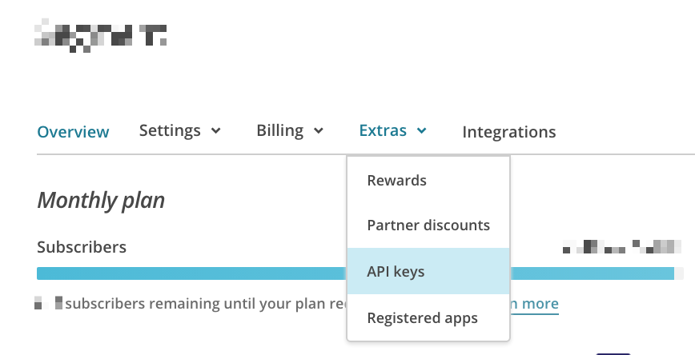
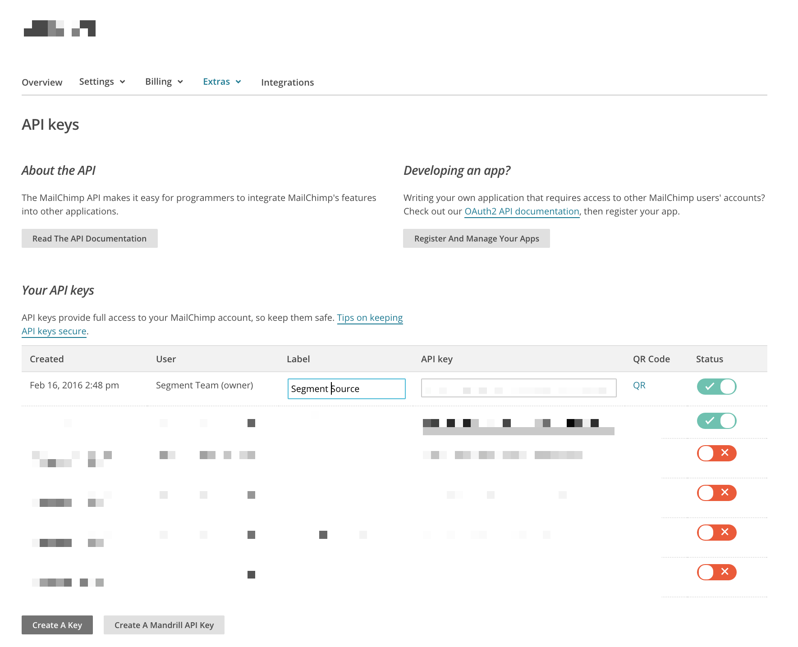



## Getting Started

1. From your workspace's `/sources` page, click `add source`.

2. Choose Mailchimp.

3. Give the source a nickname and a schema name. The nickname is a label used in the Segment interface, and the schema name is the namespace you query against in your warehouse. Both can be whatever you like, but we recommend sticking to something that reflects the source itself, like `Mailchimp` for nickname and `mailchimp` or `email` or `chimp_prod` for the schema name.

   **Note**: You can add multiple instances if you have multiple Mailchimp accounts. That's why we allow you to customize the source's nickname and schema name!
4. Next, provide credentials to an account with API permissions to access your Mailchimp data. It is recommended that you create a brand new api key for the Segment source. MailChimp restricts each api key to a maximum of 10 concurrent requests, so creating a dedicated one for Segment will ensure maximum throughput. You can find your API key in **Account > Extras > API Keys**. You can read more about API keys on [MailChimp's docs](http://kb.mailchimp.com/integrations/api-integrations/about-api-keys).

   

   

5. Back in Segment, go to the MailChimp source and paste key into the MailChimp API Key field.

## Components

### Sync

Mailchimp has a sync component, which means we'll make requests to their API on your behalf on a 3 hour interval to pull the latest data into Segment. In the initial sync, we'll grab all the Mailchimp objects (and their corresponding properties) according to the Collections table below. The objects will be written into a separate schema, corresponding to the source instance's schema name you designated upon creation. For example, if you went with `mailchimp`, the `lists` collection will be accessible at `mailchimp.lists` in SQL.

Our sync component uses an upsert API, so the data in your warehouse loaded using sync will reflect the latest state of the corresponding resource in Mailchimp.  For example, if `status` goes from `subscribed` to `unsubscribed` between syncs, on its next sync that tickets status will be `unsubscribed`.

The source syncs and warehouse syncs are independent processes. Source runs pull your data into the Segment Hub, and warehouse runs flush that data to your warehouse. Sources will sync with Segment every 3 hours. Depending on your Warehouses plan, we will push the Source data to your warehouse on the interval associated with your billing plan.

At the moment, we don't support filtering which objects or properties get synced. If you're interested in this feature, [let us know](https://segment.com/help/contact/)!

## Collections

Collections are the groupings of resources we pull from your source. In your warehouse, each collection gets its own table.

|  Collection | Type | Description |
|  ------ | ------ | ------ |
|  `conversations` | object | Conversation tracking is a [paid feature](http://kb.mailchimp.com/accounts/billing/how-mailchimp-pricing-plans-work) that lets you view subscribers' replies to your campaigns from inside your MailChimp account. Fetched using Mailchimp's [`/conversations`endpoint](https://mailchimp.com/developer/reference/conversations/). |
|  `lists` | object | The state of your various lists in Mailchimp. Fetched using Mailchimp's [`/lists` endpoint](https://mailchimp.com/developer/reference/lists/). |
|  `campaigns` | object | Your Mailchimp campaigns. Fetched using Mailchimp's [`/campaigns` endpoint](https://mailchimp.com/developer/reference/campaigns/). |
|  `subscriber activity` | object | **Currently unavailable** Mailchimp's subscriber activity endpoint cannot support our Sources product. If you are interested in this collection, contact your MailChimp Client Success Manager and request that they update their export API functionality.* |
