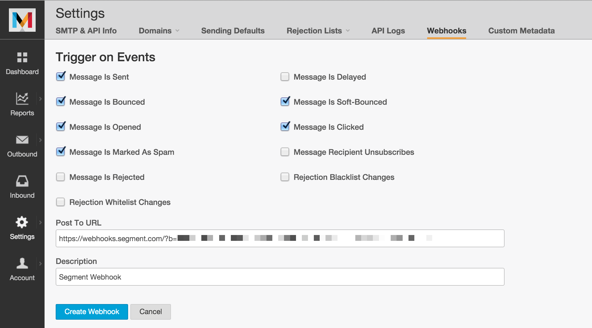



[Mandrill](http://www.mandrill.com/) is a transactional email API for MailChimp users.

Take your company's email analysis to the next level by **adding Mandrill as a Source to Segment.** Segment automatically  collects email events like `Sent` and `Opened` and load them into your data warehouse. 

## Getting Started

1. From your workspace's `sources` page, click `add source`.

2. Choose Mandrill.

3. Give the source a nickname and a schema name. The nickname is a label used in the Segment interface, and the schema name is the namespace you query against in your warehouse. Both can be whatever you like, but we recommend sticking to something that reflects the source itself, like `Mandrill` for nickname and `mandrill` or `mandrill_prod` for the schema name.

   **Note**: You can add more than one instance if you have multiple Mandrill accounts. That's why Segment allows you to customize the source's nickname and schema name!

4. Copy the auto-generated Webhook URL.
5. In Mandrill, go to **Settings > Webhook** and paste the URL in the Event Notification settings pane.

   

   Once you enable the webhook, you're good to go! Segment automatically creates your collections based on which triggers you select. If any seem unnecessary for your analysis, feel free to leave them unchecked.

5. Finally, back in the Segment UI, press Next and then Finish to wrap up the set up flow.

## Components

### Streaming

The Mandrill source is comprised only of a streaming component which listens in real time for inbound webhooks from [Mandrill's Webhooks](https://mandrill.zendesk.com/hc/en-us/articles/205583217-Introduction-to-Webhooks) and batches the events to be uploaded on your next warehouse flush. These events are only ever appended to your warehouse. Since Mandrill is strictly used for transactional emails triggered directly by API calls, there are no "dimensional" concepts in their data model that would require any additional components.

## Collections

Collections are the groupings of resources we pull from your source. In your warehouse, each collection gets its own table.

|  Collection | Type | Description |
|  ------ | ------ | ------ |
|  Sent | Event | Message has been sent successfully |
|  Bounced | Event | Message has hard bounced |
|  Opened | Event | Recipient opened a message; will only occur when [open tracking](http://help.mandrill.com/entries/23298476-How-does-open-tracking-work-) is enabled. |
|  Marked As Spam | Event | Recipient marked a message as spam |
|  Rejected | Event | Message was [rejected](http://help.mandrill.com/entries/22880521-What-is-a-rejected-email-Rejection-Blacklist-) |
|  Delayed | Event | Message has been sent, but the receiving server has indicated mail is being delivered too quickly and Mandrill should slow down sending temporarily |
|  Soft-Bounced | Event | Message has soft bounced |
|  Clicked | Event | Recipient clicked a link in a message; will only occur when click tracking is enabled |
|  Recipient Unsubscribes | Event | Recipient [unsubscribed](http://help.mandrill.com/entries/22880521-What-is-a-rejected-email-Rejection-Blacklist-) |
