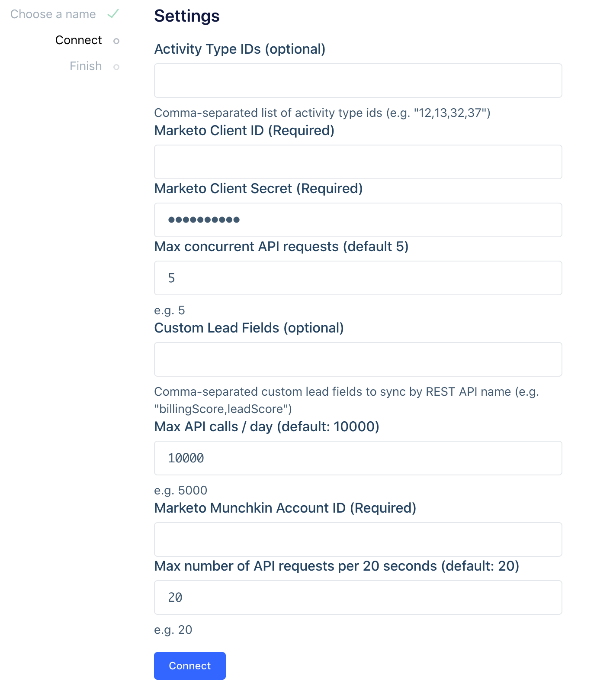
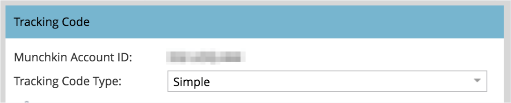
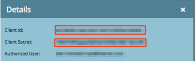

<!-- Marketo is listed as an object source, but doesn't appear in our configapi source catalog, so leave the "source-type" set here -->

[Marketo](https://www.marketo.com/) is a leader in marketing automation. Use the Marketo source to load your campaigns, emails, leads and other collections into your data warehouse.

This will allow you to write SQL to analyze your analyze your email marketing campaigns ROI, or join your email data to other data sources like web and mobile events, Salesforce, and Zendesk to tie nurture emails to re-activation rates in your app.



## Getting Started

### Permissions

You will need Admin permissions to your Marketo account.

### Add a new Marketo source

1. From your workspace's `sources` page, click `add source`.
2. Choose Marketo.
3. Give the source a nickname and a schema name. The nickname is a label used in the Segment interface, and the schema name is the namespace you query against in your warehouse. Both can be whatever you like, but Segment recommends that you stick to something that reflects the source itself, like Marketo for nickname and marketo or marketo_prod for the schema name.
4. Configure your Marketo source with the required settings (see section below for details)

> warning "Lead Activity Type IDs"
> In Marketo's settings, the Lead Activity Type IDs field is labeled as optional, but is required to see the `lead_activities` table. Segment recommends that you complete this field to see all available data.

### Configure your Marketo Source

1. Open Marketo
2. Go to Admin > Munchkin to find your Munchkin Account ID

3. Go to Admin > LaunchPoint
  a. If you don't already have a REST service setup, follow [these steps](http://developers.marketo.com/rest-api/custom-services/).
  b. Then, copy the "Client ID" and "Client Secret" parameters.
  
  c. Paste the "Client ID" and "Client Secret" into the Segment Marketo source settings.

Data should start flowing into your Warehouse in the next few hours.

## Components

### Sync

The Marketo source is built with a sync component, which means Segment makes requests to Marketo's API on your behalf on a 3 hour interval to pull the latest data into Segment. In the initial sync, Segment grabs all the Marketo objects (and their corresponding properties) according to the Collections Table below. The objects will be written into a separate schema, corresponding to the source instance's schema name you designated upon creation (for example, `my_source.charges`).

The sync component uses an upsert API, so the data in your warehouse loaded using sync will reflect the latest state of the corresponding resource in Marketo. For example, if `first_name` goes from `Jess` to `Jessica` between syncs, on its next sync that field will be `Jessica`.

The source syncs and warehouse syncs are independent processes. Source runs pull your data into the Segment Hub, and warehouse runs flush that data to your warehouse. Sources will sync with Segment every 3 hours. Depending on your Warehouses plan, Segment pushes the Source data to your warehouse on the interval associated with your billing plan.

## Collections

Collections are the groupings of resources Segment pulls from your source. In your warehouse, each collection gets its own table.

| Collection                    | Type   | Description                                                                 |
| ----------------------------- | ------ | --------------------------------------------------------------------------- |
| `leads`                         | object | All available leads.                                                        |
| `campaigns`                     | object | All available campaigns.                                                    |
| `email`                         | object | All available emails.                                                       |
| `landing_pages`                 | object | All available landing pages.                                                |
| `lists`                         | object | A set of static list records.                                               |
| `lead_activities`               | object | Activities performed by leads.                                              |
| `lead_activity_attributes`      | object | Attributes found for each individual Lead Activity.                         |
| `lead_activity_types`           | object | Available lead activity types, along with associated metadata of each type. |
| `lead_activity_type_attributes` | object | Attributes found for each individual Lead Activity Type.                    |
| `programs`                      | object | All available programs.                                                     |
| `segmentation`                  | object | Accessible segmentations (subgroups based on a Smart List rule).            |
| `segments`                      | object | Segments inside a given segmentation.                                       |

## Collection Properties

### Leads

| Property Name      | Description                |
| ------------------ | -------------------------- |
| `id`                 | Lead id                    |
| `email`              | Lead email                 |
| `first_name`         | Lead First Name            |
| `last_name`          | Lead Last Name             |
| `created_at`         | Date Lead created          |
| `updated_at`         | Date Lead last updated     |
| `deleted_at`         | Date Lead deleted          |
| `custom_lead_fields` | * Added during set up flow |

### Campaigns

| Property Name  | Description                                                          |
| -------------- | -------------------------------------------------------------------- |
| `id`             | Campaign id                                                          |
| `name`           | Campaign name                                                        |
| `active`         | Whether the Campaign is active. Only applicable to trigger campaigns |
| `type`           | Type of the Campaign (['batch', 'trigger'])                          |
| `workspace_name` | Name of the parent workspace if applicable                           |
| `created_at`     | Date Campaign created                                                |
| `updated_at`     | Date Campaign last updated                                           |

### Email

| Property Name | Description                                                 |
| ------------- | ----------------------------------------------------------- |
| `id`            | Email id                                                    |
| `name`          | Email name                                                  |
| `status`        | Status filter for draft or approved versions                |
| `url`           | URL of the Email in the Marketo UI                          |
| `description`   | Description of the Email                                    |
| `operational`   | Whether the email is operational                            |
| `template`      | Id of the parent template                                   |
| `text_only`     | Setting to include text-only version of email when sent     |
| `web_view`      | Whether 'View as Webpage' function is enabled for the email |
| `workspace`     | Name of the workspace                                       |
| `version`       | Version/Revision of the Email                               |
| `subject`       | Subject Line of the Email                                   |
| `from_name`     | From-name of the Email                                      |
| `from_email`    | From-address of the Email                                   |
| `reply_email`   | Reply-To address of the Email                               |
| `folder_type`   | Folder type of the Email                                    |
| `folder_value`  | Folder value of the Email                                   |
| `folder_name`   | Folder name of the Email                                    |
| `created_at`    | Date Email created                                          |
| `updated_at`    | Date Email last updated                                     |

### Landing Pages

| Property Name    | Description                                                       |
| ---------------- | ----------------------------------------------------------------- |
| `id`               | Landing Page id                                                   |
| `name`             | Landing Page name                                                 |
| `status`           | Status filter for draft or approved versions                      |
| `workspace`        | Name of the workspace                                             |
| `url`              | URL of the Landing Page in the Marketo UI                         |
| `computed_url`     | -                                                                 |
| `mobile_enabled`   | Whether the page has mobile viewing enabled                       |
| `robots`           | Robots directives to apply to the pages meta tags                 |
| `keywords`         | -                                                                 |
| `title`            | Title element of the Landing Page                                 |
| `template`         | Id of the template used                                           |
| `custom_head_html` | Any custom HTML to embed in the tag of the page                   |
| `description`      | Description of the asset                                          |
| `facebook_og_tags` | Any Facebook OpenGraph meta tags to apply to the page             |
| `form_prefill`     | Boolean to toggle whether forms embedded in the page will prefill |
| `folder_type`      | Folder type of the Landing Page                                   |
| `folder_value`     | Folder value of the Landing Page                                  |
| `folder_name`      | Folder name of the Landing Page                                   |
| `created_at`       | Date Landing Page created                                         |
| `updated_at`       | Date Landing Page last updated                                    |

### Lists

| Property Name  | Description             |
| -------------- | ----------------------- |
| `id`             | List id                 |
| `name`           | List name               |
| `description`    | Description of the list |
| `program_name`   | Program name            |
| `workspace_name` | Name of the workspace   |
| `created_at`     | Date List created       |
| `updated_at`     | Date List last updated  |

### Lead Activities

| Property Name              | Description                                  |
| -------------------------- | -------------------------------------------- |
| `id`                         | Lead Activity id                             |
| `activity_id`                | Legacy Id of the activity (Deprecated)       |
| `lead_id`                    | Id of the lead associated to the activity    |
| `campaign_id`                | Id of the associated Campaign, if applicable |
| `primary_attribute_value_id` | Id of the primary attribute                  |
| `primary_attribute_value`    | Value of the primary attribute               |
| `activity_type_id`           | Id of the activity type                      |
| `activity_date`              | Datetime of the activity type                |

### Lead Activity Attributes

| Property Name              | Description                                                                             |
| -------------------------- | --------------------------------------------------------------------------------------- |
| `id`                         | Combination of Lead Activity id, Lead Activity Type id and Lead Activity Attribute name |
| `activity_id`                | Id of the lead activity associated to the attribute                                     |
| `activity_type_id`           | Id of the lead activity type associated to the attribute                                |
| `activity_type_attribute_id` | Combination of the attributes associated activity type id and attribute name            |
| `name`                       | name of the Attribute                                                                   |
| `value`                      | value of the Attribute                                                                  |

### Lead Activity Types

| Property Name               | Description                    |
| --------------------------- | ------------------------------ |
| `id`                          | Lead Activity Type id          |
| `name`                        | Lead Activity Type name        |
| `description`                 | Lead Activity Type description |
| `primary_attribute_name`      | Value of the primary attribute |
| `primary_attribute_data_type` | Type of the primary attribute  |

### Lead Activity Type Attributes

| Property Name    | Description                                              |
| ---------------- | -------------------------------------------------------- |
| `id`               | Combination of Lead Activity Type id and attribute name  |
| `activity_type_id` | Id of the lead activity type associated to the attribute |
| `name`             | Name of the Attribute                                    |
| `data_type`        | Data Type of the Attribute                               |

### Programs

| Property Name | Description                                               |
| ------------- | --------------------------------------------------------- |
| `id`            | Program id                                                |
| `name`          | Program name                                              |
| `description`   | Program description                                       |
| `url`           | URL of the Program in the Marketo UI                      |
| `type`          | Program type (['program', 'event', 'webinar', 'nurture']) |
| `channel`       | Program channel                                           |
| `status`        | Program status (['locked', 'unlocked', 'on', 'off'])      |
| `workspace`     | Name of the workspace                                     |
| `sfdc_id`       | SFDC id of the program if linked to an SFDC campaign      |
| `sfdc_name`     | Name of the linked SFDC campaign if applicable            |
| `folder_value`  | Folder value                                              |
| `folder_name`   | Folder name                                               |
| `folder_type`   | Folder type                                               |
| `created_at`    | Date Program created                                      |
| `updated_at`    | Date Program last updated                                 |

### Segmentations

| Property Name | Description                                  |
| ------------- | -------------------------------------------- |
| `id`            | Segmentation id                              |
| `name`          | Segmentation name                            |
| `url`           | URL of the Segmentation in the Marketo UI    |
| `description`   | Description of the asset                     |
| `status`        | Status filter for draft or approved versions |
| `workspace`     | Name of the workspace                        |
| `folder_value`  | Folder value                                 |
| `folder_name`   | Folder name                                  |
| `folder_type`   | Folder type                                  |
| `created_at`    | Date Segmentation created                    |
| `updated_at`    | Date Segmentation last updated               |

### Segments

| Property Name   | Description                        |
| --------------- | ---------------------------------- |
| `id`              | Segment id                         |
| `name`            | Segment name                       |
| `segmentation_id` | Id of the related Segmentation     |
| `description`     | Description of the asset           |
| `url`             | Url of the asset in the Marketo UI |
| `created_at`      | Date Segment created               |
| `updated_at`      | Date Segment last updated          |

## Adding Destinations

Currently, Warehouses are the only supported destination for object-cloud sources

## FAQs

### How many API calls will the Segment source use to sync all my data?

Segment couldn't provide the statistics regarding the number of API calls we consumed, becasue our systems only log the number of objects that we pulled from Marketo as throughput. 

<<<<<<< HEAD
### Could I limit the API usage on the source?

Yes, you have the option to specify a cap to the API calls that our source will consume per day. If no cap is specified, we will by default consume as many API calls that are available within your limit that you agreed with Marketo to sync the entire source.

We also use the `Lead` and  `Activity` Bulk Extract APIs to reduce the number of requests needed to sync the data; this however, also has a limit of 500MB worth of files downloaded per day.
=======
At set up time, you have the option to specify a cap to the API calls that a source can consume. If no cap is specified, Segment consumes as many API calls that are available to sync the entire source.

Segment uses the Lead Activities bulk API to reduce the number of requests needed to sync the data; this however, also has a limit of 500MB worth of files downloaded per day.

If your source requires more than 10k calls or over 500MB from the bulk API to sync, Segment continues the sync the following day when a new batch of API calls are available.
>>>>>>> develop

### What happens when my Marketo API limits daily quota is not enough?

If your source requires more than 10k Rest API calls, or over 500MB via the Bulk Extract API to sync, we will continue the sync when a new batch of API calls are available.

<<<<<<< HEAD
Please be aware that the Marketo API quota is available across your subscription, if other applications are sharing the quota, it will interfere with our ability to sync the source.

### Why the `lead_activities` collections is not ingested by Segment? Why I couldn't find `lead_activities` table in my data warehouse?

Please fill the Activity Type IDs (optional) setting in the Marketo source. It is required to pull the `lead_activities` collection source. Once Segment pulled data, the data will be availabe in your data warehouses shortly 
=======
Segment uses the REST API in most situations, but also uses the Lead Activity Bulk API to reduce the number of requests needed to sync.
>>>>>>> develop

### Can I get other collections not default synced by the source?

[Contact Support](https://segment.com/help/contact/) to request additional collections.

### Can I get other columns not default synced by the source?
<<<<<<< HEAD
Yes! For `leads` and `activities`, we've introduced "Custom Lead Fields (optional)" where you can enter comma-separated custom fields, which will be synced by Marketo's REST API name.

Full list of standard fields and Maketo's REST API names can be found at [here](http://developers.marketo.com/rest-api/lead-database/fields/list-of-standard-fields/). If there are other fields you're interested in, [contact support](https://segment.com/help/contact/)  for assistance.
=======
For leads and activities, Segment added  a custom fields setting where you can enter comma-separated custom fields to sync by their REST API name.

By default, Segment syncs the following fields on the leads collection:

- `id`
- `email`
- `firstName`
- `lastName`
- `createdAt`
- `updatedAt`

You can find a full list of standard fields and their REST API names [here](http://developers.marketo.com/rest-api/lead-database/fields/list-of-standard-fields/). If there are other fields you're interested in, [contact support](https://segment.com/help/contact/)  for assistance.
>>>>>>> develop
