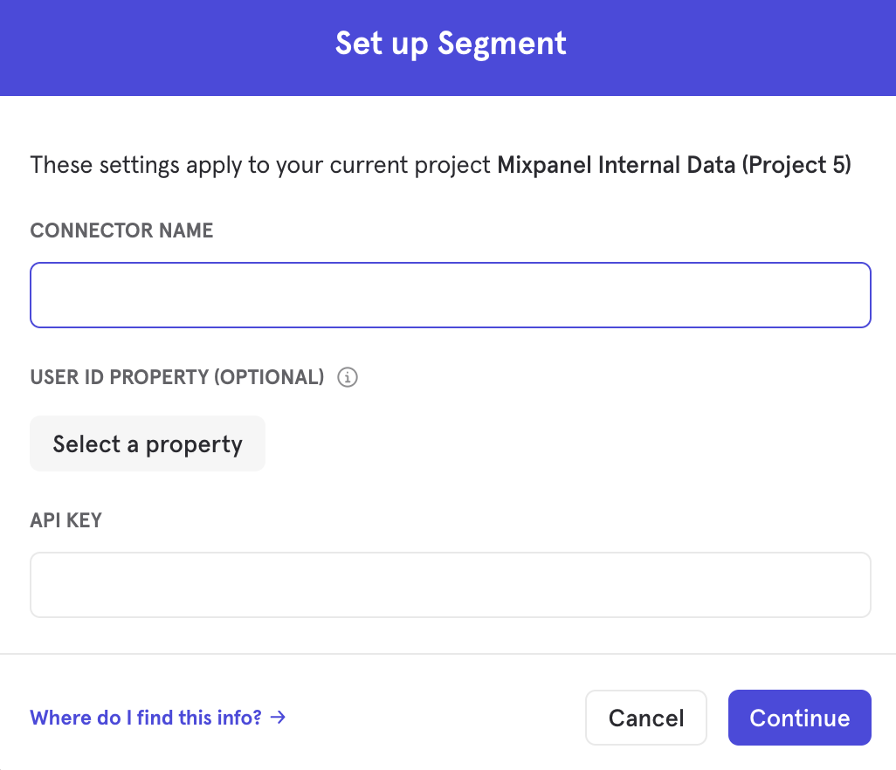
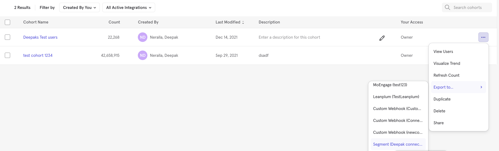



[Mixpanel Cohorts](https://help.mixpanel.com/hc/en-us/articles/115005708186-Cohorts-Overview-){:target="_blank} are groups of users defined by a set of criteria. The Mixpanel Cohorts Source allows you to export Cohorts of users from Mixpanel to Segment so that you can better target users across many downstream connections. You can sync Cohorts of users to your Segment-connected raw data warehouses and downstream destinations that accept Segment identify events.

This source is maintained by Mixpanel. For any issues with the source, contact the [Mixpanel Support team](https://help.mixpanel.com/hc/en-us/requests/new){:target="_blank"}.

## Getting Started

1. From your workspace's [Sources catalog page](https://app.segment.com/goto-my-workspace/sources/catalog) click **Add Source**.
2. Search for **Mixpanel Cohorts** in the Sources Catalog and click **Add Source**.
3. On the next screen, give the Source a nickname and configure any other settings. 
4. From the new Source's Overview page, copy the Segment WriteKey
5. To export users from Mixpanel to Segment, in Mixpanel first Connect Your segment workspace in  integrations page add add the copied WriteKey in the **API KEY** field and give the connection a desired name in **CONNECTOR NAME** field. 
6. Once connected you can go to mixpanel cohorts page and export any cohort to the connection.
7. Once configured, Cohorts sync to Segment based on the sync schedule in Mixpanel. For more information go to [Mixpanel Segment Integration documentation.](https://help.mixpanel.com/hc/en-us/articles/4408988683156-Segment-Integration){:target="_blank"}


## The Cohort sync process

Mixpanel sets a property on the user's profile in Segment indicating whether they are currently part of the cohort.

The following identify call to Segment when a user enters the cohort:
```json
{
  "type": "identify",
  "traits": {
    "Mixpanel - <Cohort Name in Mixpanel>": true,
  },
  "userId": "user@email.com" // mixpanel uses the distinct_id property here
}
```
 

Mixpanel sends the following identify call when a user exits the cohort:
```json
{
  "type": "identify",
  "traits": {
    "Mixpanel - <Cohort Name in Mixpanel>": false,
  },
  "userId": "user@email.com" // mixpanel uses the distinct_id property here
}
```
