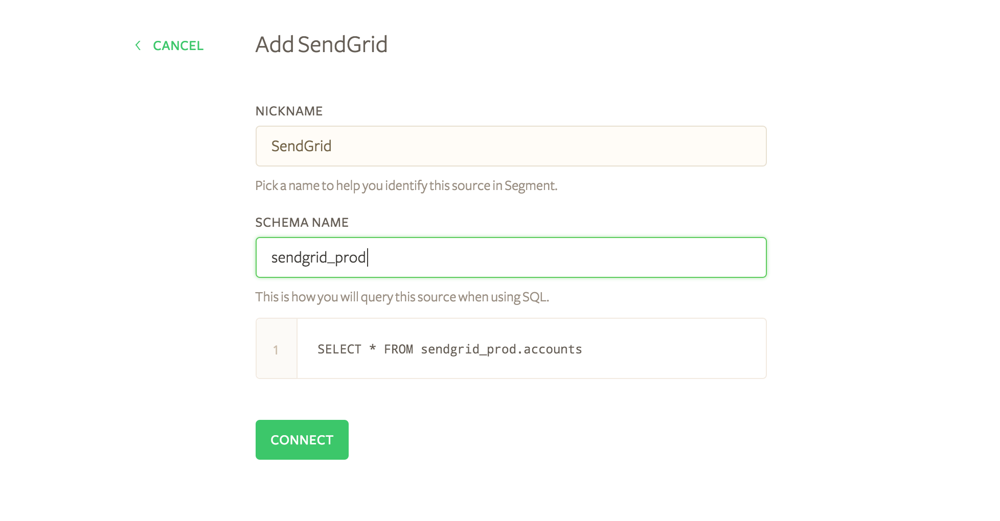
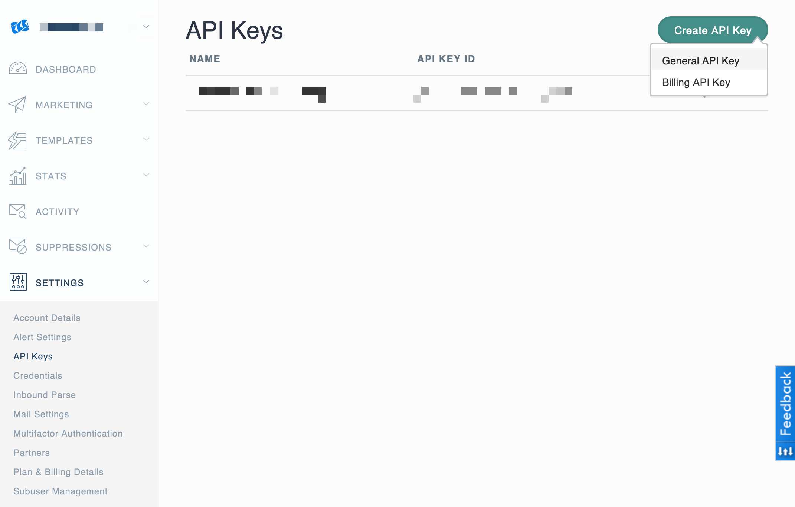
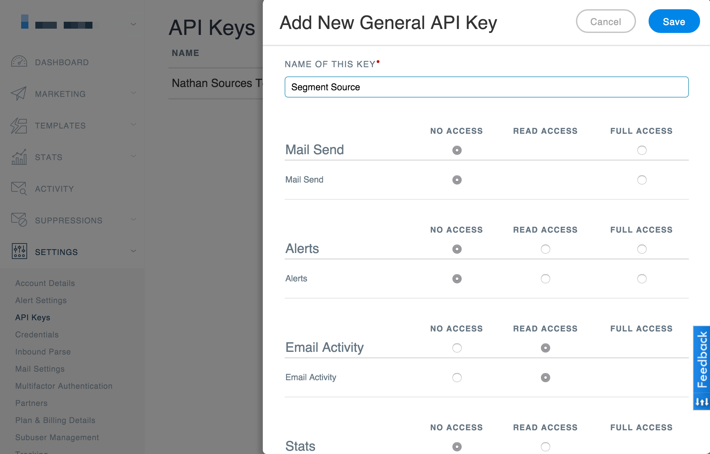
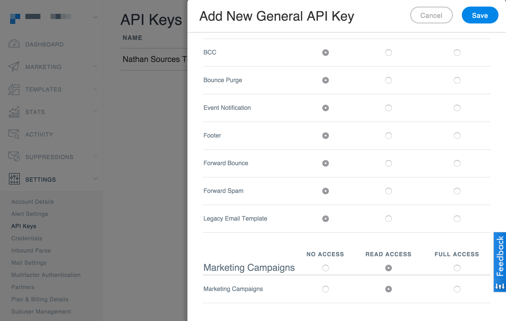
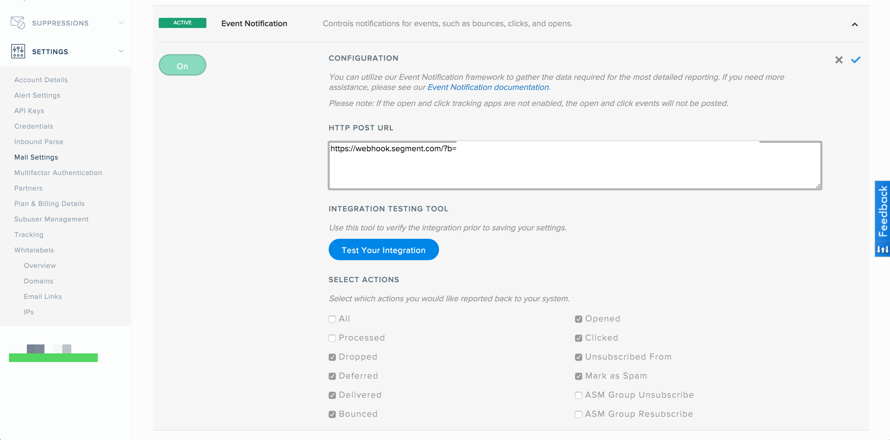

SendGrid is a trusted platform for transactional email and email marketing. [Visit Website](http://sendgrid.com)

Take your company's analysis to the next level by **adding Sendgrid as a Source to Segment.** Segment automatically  collects events like `Click` or `Delivered` and objects such as `Recipients` or `Campaigns` and load them into your data warehouse. 

## Getting Started

1. From your workspace's `sources` page, click `add source`.

2. Choose Sendgrid.

4. Give the source a nickname and a schema name. The nickname is a label used in the Segment interface, and the schema name is the namespace you query against in your warehouse. Both can be whatever you like, but we recommend sticking to something that reflects the source itself, like `SendGrid` for nickname and `sendgrid` or `sendgrid_prod` for the schema name.

  

  **Note** that you can add multiple instances if you have multiple SendGrid accounts. That's why we allow you to customize the source's nickname and schema name!

5. Provide your API Key.  In order to pull information about your contacts, we'll make requests to SendGrid's API with our [sync component](#sync).  You can create an API Key by navigating to **Settings > API Keys**, clicking **General API Key**.

  

  You will then be prompted to name that key and given the option to adjust the settings.  We recommend providing read permissions for **Email Activity** and **Marketing Activity**.

  

  

6. Finally, copy the resulting API Key into the Segment interface, taking care to trim any errant trailing spaces from copying and pasting, and press connect.

  

7. Copy the auto-generated Webhook URL and paste it into SendGrid's Event Notification settings pane under **Settings > Mail Settings**.

  

  

8. Once you enable the Event Notification, you're good to go! Press **Next**, and then **Finish** to wrap up the set up flow.

### Event URL

SendGrid has a single Event URL location. By using the SendGrid source, you will be using your only Event URL location. If you remove a pre-existing URL, then that location will no longer receive events.

## Components

### Sync

SendGrid has a sync component, which means we'll make requests to their API on your behalf on a 3 hour interval to pull the latest data into Segment. In the initial sync, we'll grab all the SendGrid objects (and their corresponding properties) according to the [Collections Table](#collections) below. **Note**: If you don't use Sendgrid's marketing campaigns features, these collections will be empty in Sendgrid and you'll see "Zero data synced" in your runs. The webhook will still be processing activity data (but only activity data) for you though!

Our sync component gets resources from SendGrid and forwards them to Segment using an upsert API, so the dimensional data in your warehouse loaded will reflect the latest state of the corresponding resource in SendGrid.  For example, if `lists.recipient_count` goes from `100` to `200` between syncs, on its next flush to your warehouse, that tickets status will be  `200`.

The source syncs and warehouse syncs are independent processes. Source runs pull your data into the Segment Hub, and warehouse runs flush that data to your warehouse. Sources will sync with Segment every 3 hours. Depending on your Warehouses plan, we will push the Source data to your warehouse on the interval associated with your billing plan.

At the moment, we don't support filtering which objects or properties get synced. If you're interested in this feature, [let us know](https://segment.com/help/contact/)!

### Streaming

The SendGrid source also has a streaming component which listens in real time for inbound webhooks from SendGrid's Event Notifications and batches the events to be uploaded on your next warehouse flush. These events are only ever appended to your warehouse. Note, if you don't use SendGrid's marketing features, this will be the only data that we receive from SendGrid. At present, there is no way to retrieve email event history from SendGrid, so you will only have access to data that we've collected after you successfully enable this component of the source destination.

## Collections

Collections are the groupings of resources we pull from your source. In your warehouse, each collection gets its own table.

**Object** collections are updated with each sync. These are pulled using our sync component.

**Event** collections are append only, represent a user action or activity, and may be likened to fact tables in a traditional data warehouse.

|  Collection | Type | Description |
|  ------ | ------ | ------ |
|  activity | Event | The union of all SendGrid **event** tables. Useful for creating funnels |
|  _open | Event | Recipient has opened the HTML message. You need to enable Open Tracking for getting this type of event. |
|  click | Event | Recipient clicked on a link within the message. You need to enable Click Tracking for getting this type of event. |
|  bounce | Event | Receiving server could not or would not accept message. |
|  delivered | Event | Message has been successfully delivered to the receiving server. |
|  processed | Event | Triggered when the email is processed |
|  dropped | Event | You may see the following drop reasons: Invalid SMTPAPI header, Spam Content (if spam checker app enabled), Unsubscribed Address, Bounced Address, Spam Reporting Address, Invalid, Recipient List over Package Quota |
|  deferred | Event | Recipient's email server temporarily rejected message. |
|  unsubscribe | Event | Recipient clicked on message's subscription management link. You need to enable Subscription Tracking for getting this type of event. |
|  spam_report | Event | Recipient marked message as spam. |
|  lists | Object | [Groups of contacts](https://sendgrid.com/docs/API_Reference/Web_API_v3/Marketing_Campaigns/contactdb.html). **Will only return data if you're using Marketing Campaign featurs of SendGrid.** |
|  segments | Object | [Slices of lists](https://sendgrid.com/docs/API_Reference/Web_API_v3/Marketing_Campaigns/contactdb.html). **Will only return data if you're using Marketing Campaign featurs of SendGrid.** |
|  recipients | Object | All contacts who have received an email, with information about their last activities and custom activities. [More Info](https://sendgrid.com/docs/API_Reference/Web_API_v3/Marketing_Campaigns/contactdb.html).  **Will only return data if you're using Marketing Campaign featurs of SendGrid.** |
|  campaigns | Object | All campaigns you've created in Sendgrid. [More Info](https://sendgrid.com/docs/API_Reference/Web_API_v3/Marketing_Campaigns/campaigns.html).  **Will only return data if you're using Marketing Campaign featurs of SendGrid.** |

## Troubleshooting 

If you're getting an "Invalid Credentials" error when setting up the SendGrid source, send a direct ping to the [SendGrid Marketing Campaigns API](https://sendgrid.com/docs/API_Reference/Web_API_v3/Marketing_Campaigns/campaigns.html) to test if you're using the correct credentials.

Make sure you whitelist the Segment IP addresses on Sendgrid. [contact our team](https://segment.com/help/contact/) for the list of IP addresses to whitelist.
