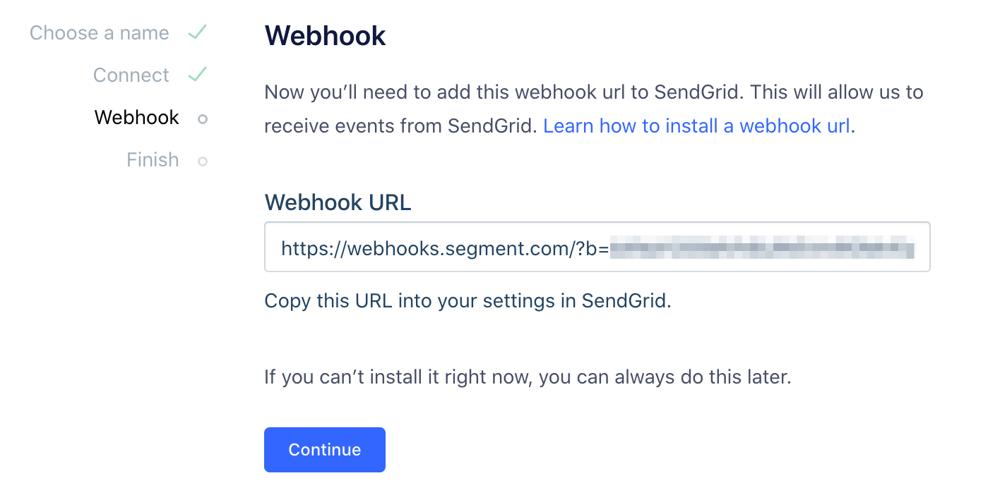



[SendGrid](http://sendgrid.com) is a trusted platform for transactional email and email marketing.

Take your company's analysis to the next level by **adding SendGrid as a Source to Segment.** Segment automatically  collects events like `Click` or `Delivered` and objects such as `Recipients` or `Campaigns` and loads them into your data warehouse. 

## Getting Started

Adding SendGrid as a Source in Segment requires a SendGrid API key. If you don't yet have a SendGrid API key, first follow these steps within your SendGrid account:

1.  Log in to your SendGrid account.
2.  Navigate to **Settings > API Keys**, then click **General API Key**.
3.  Name the key and, optionally, adjust its settings.
4.  Copy the API Key, omitting all spaces.

> info "SendGrid API Key Settings"
> Segment recommends providing read permissions for **Email Activity** and **Marketing Activity**.

To finish adding the SendGrid source, return to your Segment Workspace and follow these steps:

1. From the [Source catalog page](https://app.segment.com/goto-my-workspace/sources/catalog) in your Segment workspace, enter **SendGrid** and select the SendGrid source that appears.
2. From the SendGrid information panel that appears, click **Add source**.
3. Give the Source a name and add any labels to help you organize and filter your sources.
   Segment recommends a name that reflects the source itself, as this name populates the schema name. For example, the source name `SendGrid` creates the schema `SendGrid`. You can add multiple instances if you have multiple SendGrid accounts.
4. Paste the SendGrid API Key you copied above into the Segment interface. Click **Connect**.

6. Copy the auto-generated Webhook URL and paste it into SendGrid's Event Notification settings pane under **Settings > Mail Settings**.

7. Enable Event Notification in SendGrid. Select **Next** and then **Finish** to complete setup.

### Event URL

SendGrid has a single Event URL location. By using the SendGrid source, you will be using your only Event URL location. If you remove a pre-existing URL, then that location will no longer receive events.

## Components

### Sync

Segment makes requests to the SendGrid API every three hours. In the initial sync, Segment pulls all SendGrid objects (and their corresponding properties) according to the [Collections Table](#collections) below. If you don't use SendGrid's marketing campaigns features, these collections will be empty in SendGrid and you'll see "Zero data synced" in your runs. The webhook still processes activity data.

Segment's sync component pulls and forwards SendGrid resources to Segment using an upsert API. As a result, dimensional data loaded into your warehouse reflects the latest state of the corresponding resource in SendGrid.  For example, if `lists.recipient_count` goes from `100` to `200` between syncs, its status will be `200` on its next flush to your warehouse.

The source syncs and warehouse syncs are independent processes. Source runs pull your data into the Segment Hub, and warehouse runs flush that data to your warehouse. Sources sync with Segment every three hours. Depending on your Warehouses plan, Segment pushes the Source data to your warehouse on the interval associated with your billing plan.

> info "SendGrid Syncs"
> Segment syncs all objects and properties. [Reach out to support](https://segment.com/help/contact/) if you're interested in filtering objects or properties during syncs.

### Streaming

The SendGrid source's streaming component listens in real time for inbound webhooks from SendGrid's Event Notifications. The source batches these events for upload on your next warehouse flush. **These events only append to your warehouse.**

> note ""
> **NOTE:** If you don't use SendGrid's marketing features, this will be the only data that Segment receives from SendGrid. There isn't a way to retrieve email event history from SendGrid, so you will only have access to data that Segment collected after you successfully enable this component of the source destination.

## Collections

Collections are the groupings of resources Segment pulls from your source. In your warehouse, each collection gets its own table.

**Object** collections are updated with each sync. These are pulled using Segment's sync component.

**Event** collections are append only, represent a user action or activity, and may be likened to fact tables in a traditional data warehouse. Unlike traditional events captured by Segment, you can't forward these events to Destinations you've configured in your Segment workspace. You can only sync these events to a supported data warehouse.

|  Collection | Type | Description |
|  ------ | ------ | ------ |
|  activity | Event | The union of all SendGrid **event** tables. Useful for creating funnels. |
|  _open | Event | Recipient has opened the HTML message. Enable Open Tracking to get this type of event. |
|  click | Event | Recipient clicked on a link within the message. Enable Click Tracking to get this type of event. |
|  bounce | Event | Receiving server could not or would not accept message. |
|  delivered | Event | Message has been successfully delivered to the receiving server. |
|  processed | Event | Triggered when the email is processed. |
|  dropped | Event | You may see the following drop reasons: Invalid SMTPAPI header, Spam Content (if spam checker app enabled), Unsubscribed Address, Bounced Address, Spam Reporting Address, Invalid, Recipient List over Package Quota |
|  deferred | Event | Recipient's email server temporarily rejected message. |
|  unsubscribe | Event | Recipient clicked on message's subscription management link. You need to enable Subscription Tracking for getting this type of event. |
|  spam_report | Event | Recipient marked message as spam. |
|  lists | Object | [Groups of contacts](https://sendgrid.com/docs/API_Reference/Web_API_v3/Marketing_Campaigns/contactdb.html). **Will only return data if you're using SendGrid's Marketing Campaign features.** |
|  segments | Object | [Slices of lists](https://sendgrid.com/docs/API_Reference/Web_API_v3/Marketing_Campaigns/contactdb.html). **Will only return data if you're using SendGrid's Marketing Campaign features.** |
|  recipients | Object | All contacts who have received an email, with information about their last activities and custom activities. [More Info](https://sendgrid.com/docs/API_Reference/Web_API_v3/Marketing_Campaigns/contactdb.html).  **Will only return data if you're using SendGrid's Marketing Campaign features.** |
|  campaigns | Object | All campaigns you've created in SendGrid. [More Info](https://sendgrid.com/docs/API_Reference/Web_API_v3/Marketing_Campaigns/campaigns.html).  **Will only return data if you're using SendGrid's Marketing Campaign features.** |

> info "SendGrid and Personas"
> SendGrid data is not available in Personas.

## Troubleshooting

If you're getting an "Invalid Credentials" error when setting up the SendGrid source, send a direct ping to the [SendGrid Marketing Campaigns API](https://sendgrid.com/docs/API_Reference/Web_API_v3/Marketing_Campaigns/campaigns.html) to test if you're using the correct credentials.

Make sure you allowlist Segment IP addresses on SendGrid. [Contact Segment](https://segment.com/help/contact/) for the list of IP addresses to allowlist.
