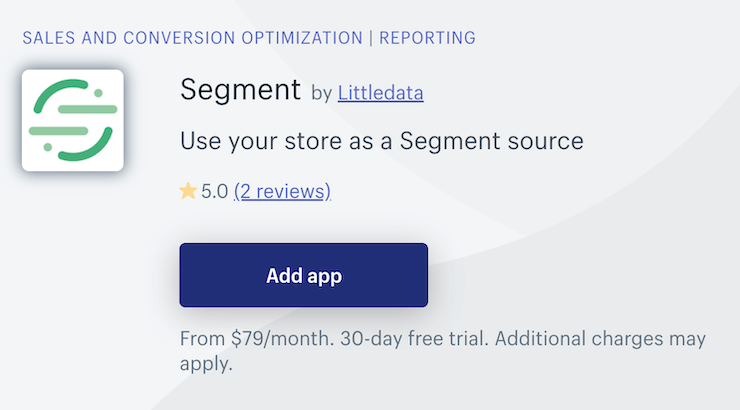
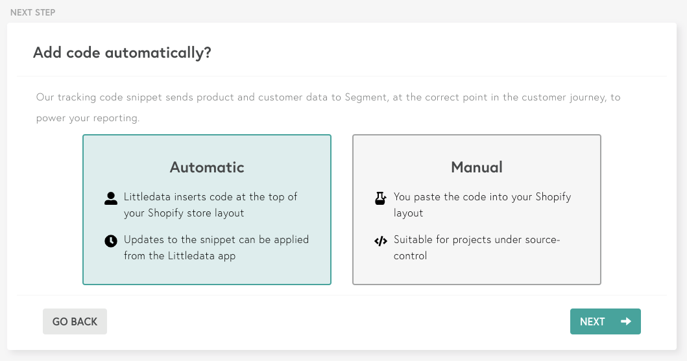
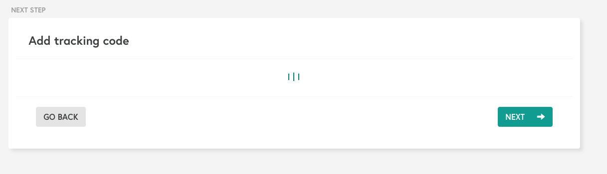



Littledata is a smart analytics app that automates ecommerce tracking. Littledata's [Shopify-to-Segment connection](https://www.littledata.io/connections/segment/?utm_source=segmentio&utm_medium=docs&utm_campaign=partners) automatically tracks key ecommerce events on a Shopify or Shopify Plus store, so you can use Shopify as a source in your Segment workspace.

Littledata uses a smart tracking script that can be applied to any Shopify site. The app uses server-side tracking to ensure 100% accuracy, gathering data at every customer touch point.

This integration is maintained by Littledata. [Contact the Littledata Support team](mailto:support@littledata.io) with any questions.

## Getting Started

1. **Log in** to your Shopify Store account.
2. Go the [Shopify app store listing](https://apps.shopify.com/segment-com-by-littledata) for ***Segment by Littledata***.

4. Click **Add app** to begin the installation process.
5. **Sign up** for a Littledata account using an email address, Google login or Facebook login. *More team members can be added to the subscription after completing the installation process.*
6. Add the [**Segment write key**](https://segment.com/docs/connections/find-writekey/) for the source that is going to send data in the **input field**.

7. Choose either an **Automatic** or a **Manual** install. *Automatic installs work in most instances, but if you choose to do a manual install, just follow [this guide](https://blog.littledata.io/help/posts/segment-installation-guide/).*

9. Segment's **analytics.js** library, Littledata **tracking script** and **webhooks** will be automatically applied to the store and the installation proccess will then be complete.

## Events

Below is a table of events that **Shopify by Littledata** sends to Segment. These events will show up as tables in your warehouse, and as regular events in your other Destinations. **Shopify by Littledata** will send through the `userId` if available.

<table>
  <tr>
   <td>Event Name</td>
   <td>Description</td>
  </tr>
  <tr>
   <td>Page Viewed</td>
   <td>Prospect has viewed a page</td>
  </tr>
  <tr>
   <td>Product List Viewed</td>
   <td>Prospect has viewed a product collection page</td>
  </tr>
  <tr>
   <td>Product Clicked</td>
   <td>Prospect has clicked a product</td>
  </tr>
  <tr>
   <td>Product Viewed</td>
   <td>Prospect has viewed a product</td>
  </tr>
  <tr>
   <td>Product Added</td>
   <td>Prospect has added a product to the cart</td>
  </tr>
  <tr>
   <td>Product Removed</td>
   <td>Prospect has removed a product from the cart</td>
  </tr>
  <tr>
   <td>Checkout Started</td>
   <td>Prospect has started checkout</td>
  </tr>
  <tr>
   <td>Checkout Step Completed</td>
   <td>Prospect has completed a step in the checkout </td>
  </tr>
  <tr>
   <td>Payment Info Entered</td>
   <td>Prospect has entered payment info</td>
  </tr>
  <tr>
   <td>Order Completed</td>
   <td>Prospect has completed an order</td>
  </tr>
  <tr>
   <td>Order Refunded</td>
   <td>Order has been refunded</td>
  </tr>
</table>
 

In addition to the events tracked as standard, the following hits can be tracked based on page path:
<table>
  <tr>
   <td>Event Name</td>
   <td>Description</td>
  </tr>
  <tr>
   <td>Registration Viewed</td>
   <td>Prospect has viewed the registration page</td>
  </tr>
  <tr>
   <td>Cart Viewed</td>
   <td>Prospect has viewed the cart</td>
  </tr>
  <tr>
   <td>Blog Viewed</td>
   <td>Prospect has viewed the blog</td>
  </tr>
  <tr>
   <td>Registration Completed</td>
   <td>Prospect has completed registration</td>
  </tr>
</table>

## Event Properties

Below are tables outlining the properties included in the events listed above.

<table>
  <tr>
   <td>Property Name</td>
   <td>Description</td>
  </tr>
  <tr>
   <td>`event`</td>
   <td>Event name</td>
  </tr>
    <tr>
   <td>`anonymousId`</td>
   <td>Prospect Google Analytics client ID</td>
  </tr>
  <tr>
   <td>`userId`</td>
   <td>Prospect ID</td>
  </tr>
  <tr>
   <td>`order_id`</td>
   <td>ID of the order</td>
  </tr>
  <tr>
   <td>`checkoutId`</td>
   <td>ID of the checkout session</td>
  </tr>
  <tr>
   <td>`revenue`</td>
   <td>Revenue of the order</td>
  </tr>
  <tr>
   <td>`shipping`</td>
   <td>Shipping tax</td>
  </tr>
  <tr>
   <td>`tax`</td>
   <td>Order tax</td>
  </tr>
  <tr>
   <td>`total`</td>
   <td>Total value of the order</td>
  </tr>
  <tr>
   <td>`affiliation`</td>
   <td>Affiliation of the order</td>
  </tr>
  <tr>
   <td>`coupon`</td>
   <td>Discount coupon</td>
  </tr>
  <tr>
   <td>`currency`</td>
   <td>Currency of the order</td>
  </tr>
  <tr>
   <td>`discount`</td>
   <td>Discounted amount</td>
  </tr>
  <tr>
   <td>`products`</td>
   <td>Property that holds product details</td>
  </tr>
  <tr>
   <td>`category`</td>
   <td>Category of the product</td>
  </tr>
  <tr>
   <td>`brand`</td>
   <td>Brand of the product</td>
  </tr>
  <tr>
   <td>`list_id`</td>
   <td>ID of the product collection</td>
  </tr>
    <tr>
   <td>`list_name`</td>
   <td>Name of the product collection</td>
  </tr>
    <tr>
   <td>`list_position`</td>
   <td>Product position in the collection</td>
  </tr>
<tr>
   <td>`name`</td>
   <td>Product name</td>
  </tr>
      <tr>
   <td>`price`</td>
   <td>Product price</td>
  </tr>
      <tr>
   <td>`product_id`</td>
   <td>ID of the product</td>
  </tr>
      <tr>
   <td>`sku`</td>
   <td>Product SKU</td>
  </tr>
      <tr>
   <td>`variant`</td>
   <td>Product variant ID</td>
  </tr>
        <tr>
   <td>`variants`</td>
   <td>Property that holds product variant IDs and SKUs</td>
  </tr>
        <tr>
   <td>`id`</td>
   <td>Variant ID</td>
  </tr>
      <tr>
   <td>`quantity`</td>
   <td>Quantity of the product</td>
  </tr>
      <tr>
   <td>`properties`</td>
   <td>Property that holds payment details</td>
  </tr>
    <tr>
   <td>`step`</td>
   <td>Checkout step</td>
  </tr>
    <tr>
   <td>`paymentMethod`</td>
   <td>Payment method chosen for checkout</td>
  </tr>
    <tr>
   <td>`shipping_method`</td>
   <td>Shipping method chosen for checkout</td>
  </tr>
    <tr>
   <td>`sent_from`</td>
   <td>Unique property to identify events sent by Littledata</td>
  </tr>
</table>
