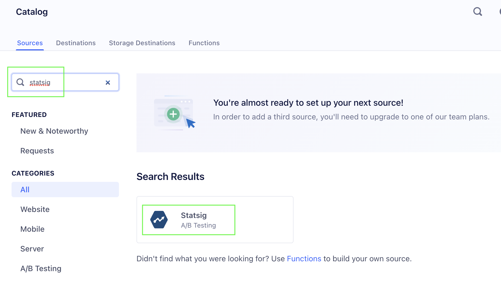
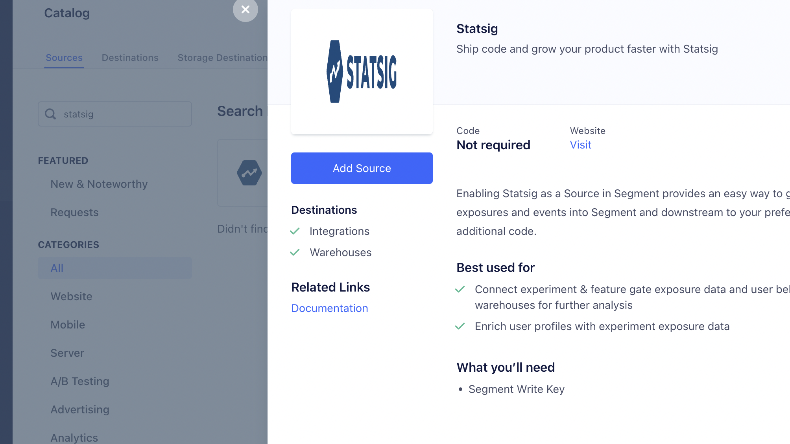
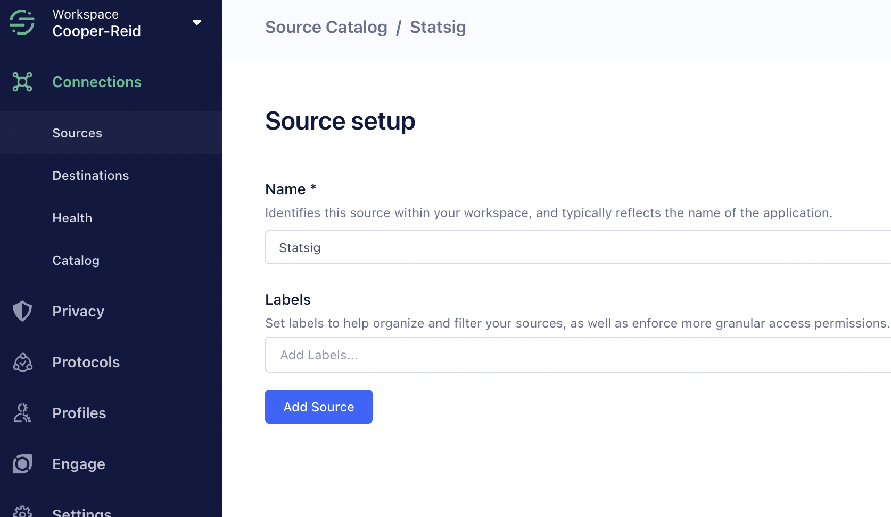
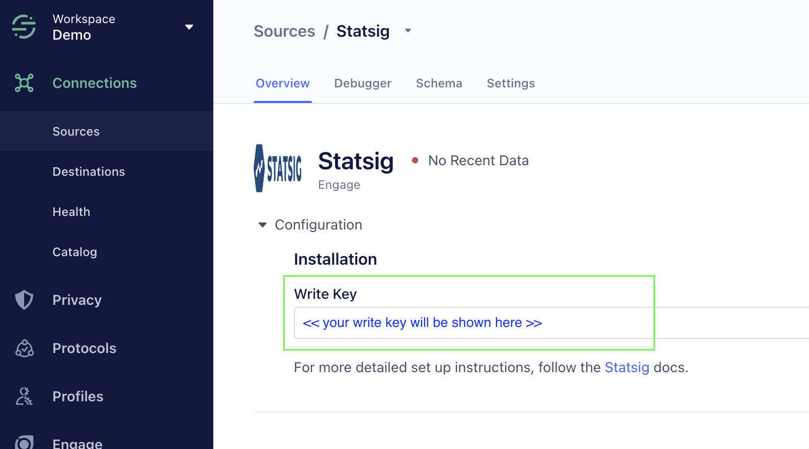
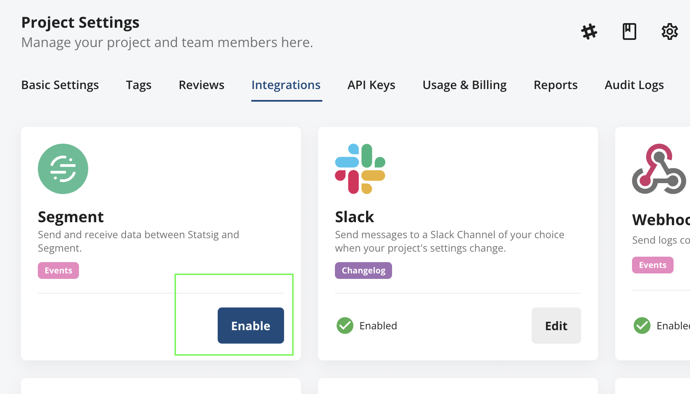
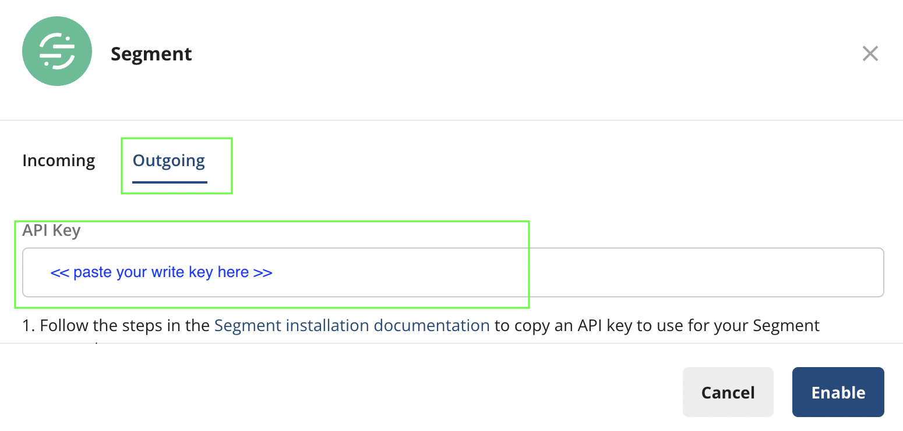
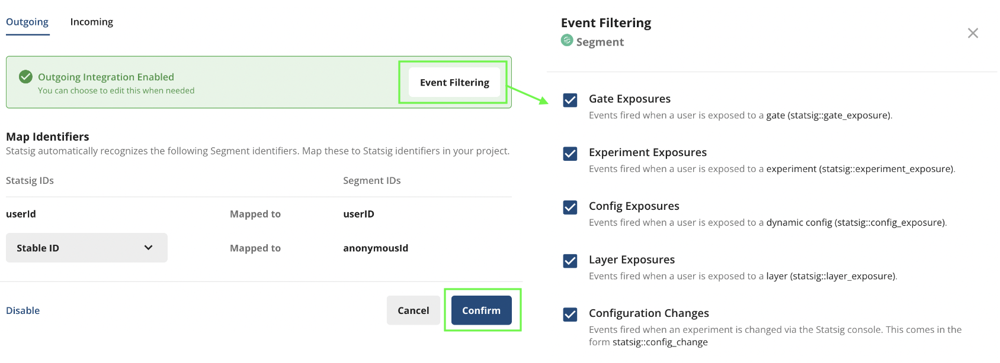
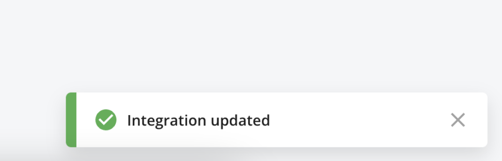
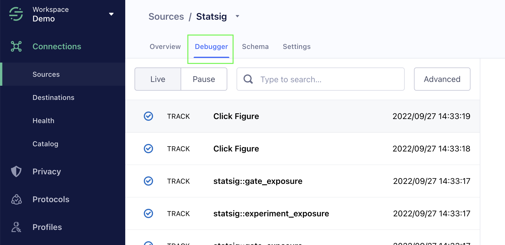

[Statsig](https://www.statsig.com/?utm_source=segmentio&utm_medium=docs&utm_campaign=partners) helps companies safely A/B test features in production before rolling them out, avoiding product debates and costly mistakes when shipping out new features. Statsig serves all your experimentation needs with a unified platform that connects what you build with the impact you deliver. We power A/B tests and experiments on any device, in any part of the application stack, at any scale. Statsig gives you a comprehensive 360° view of how your product is performing.

The Statsig integration enables custom events and exposure events to be forwarded from Statsig to Segment without any additional work on the client — this is a pure server-to-server integration.

This is an [Event Cloud Source](https://segment.com/docs/sources/#event-cloud-sources) which can not only forward data into your Segment warehouse, but they can also federate the exported data into your other enabled Segment Destinations.

This source is maintained by Statsig. For any issues with the source, [contact their Support team](mailto:support@statsig.com).

## Getting Started

1. From within the Segment dashboard, navigate to **Catalogue** and search for "Statsig" under _Sources_.   
2. Click on the Statsig tile, and then click on the blue "Add Source" button within the modal.  
3. Name your source and proceed to click "Add Source"   
4. Locate your `Write Key` and copy it.  
5. Log into the Statsig console and navigate to the [Integrations](https://console.statsig.com/integrations) page. Click on the Segment card and switch to the Outbound tab, paste the Write Key into the API Key text box shown below, and click Enable.  
6. Click to the "Outgoing tab. Paste the `Write Key` captured on step #4" and click "Enable". 
7. Now, configure how data should be mapped and which events to include. The "Event Filtering" screen will allow you to elect which events & event types get forwarded. The "Map Identifiers" configuration will map Statsig identifiers to a corresponding Segment allocation of your choice. Press "Confirm" and you will see an "Integration Updated" dialogue ✅    
8. Within a few minutes, you can observe your statsig events being ingested in Segment within the "Debugger" panel as shown below.  

## Events

The table below lists events that Statsig sends to Segment. These events appear as tables in your warehouse, and as regular events in other Destinations. Statsig will include the `userId` if available.

> More details on event payloads can be found in [Statsig's documentation](https://docs.statsig.com/integrations/data-connectors/segment#configuring-outbound-events).

<table>
  <tr>
   <td>Event Name</td>
   <td>Description</td>
  </tr>
  <tr>
   <td>statsig::config_exposure</td>
   <td>User was exposed to a set of configuration values</td>
  </tr>
  <tr>
   <td>statsig::experiment_exposure</td>
   <td>User was exposed to an experiment</td>
  </tr>
  <tr>
   <td>statsig::gate_exposure</td>
   <td>User was exposed to a gate</td>
  </tr>
  <tr>
   <td><<custom event>></td>
   <td>Any custom event name tracked</td>
  </tr>
</table>

## Event Properties

The table below lists the properties included in the events listed above.

> More details on event payloads can be found in [Statsig's documentation](https://docs.statsig.com/integrations/data-connectors/segment#configuring-outbound-events).

<table>
  <tr>
   <td>Property Name</td>
   <td>Description</td>
  </tr>
  <tr>
   <td>event</td>
   <td>Name of the event</td>
  </tr>
  <tr>
   <td>userId</td>
   <td>ID of the user (may not always be present)</td>
  </tr>
  <tr>
   <td>email</td>
   <td>Email of the user</td>
  </tr>
<tr><td>
    anonymousId</td><td>An anonymous identifier, typically the Statsig `stableID`. This can be controlled in the Statsig mapping settings shown in step #7 above.</td>
</tr>
  <tr>
   <td>properties.metadata</td>
   <td>Any other contextual event metadata</td>
  </tr>
  <tr>
   <td>properties.value</td>
   <td>Value associated with the event</td>
  </tr>
  <tr>
    <td>originalTimestamp</td>
    <td>Timestamp the event was triggered</td>
  </tr>
  <tr>
    <td>receivedAt</td>
    <td>Timestamp the event was received</td>
  </tr>    
</table>

## Adding Destinations

Now that your Source is set up, you can connect it with Destinations.

Log into your downstream tools and check to see that your events appear as expected, and that they contain all of the properties you expect. If your events and properties don’t appear, check the [Event Delivery](https://segment.com/docs/connections/event-delivery/) tool, and refer to the Destination docs for each tool for troubleshooting.

If there are any issues with how the events are arriving to Segment, [contact the Statsig support team](mailto:support@statsig.com).

