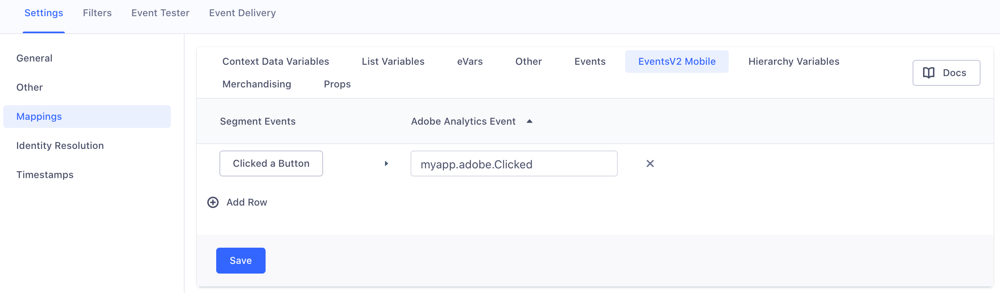
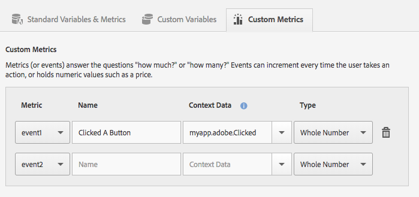
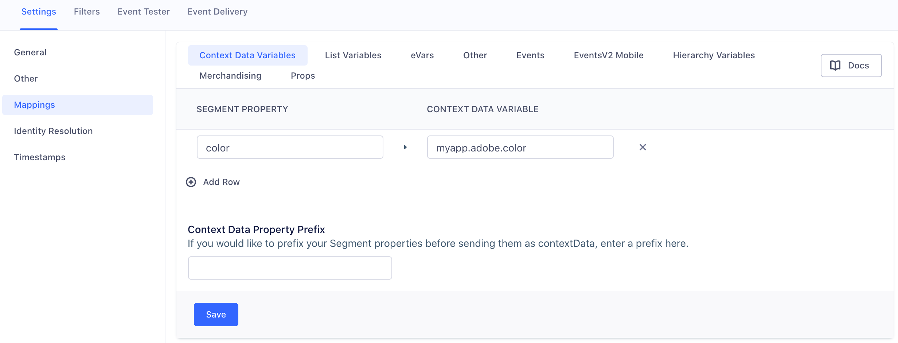
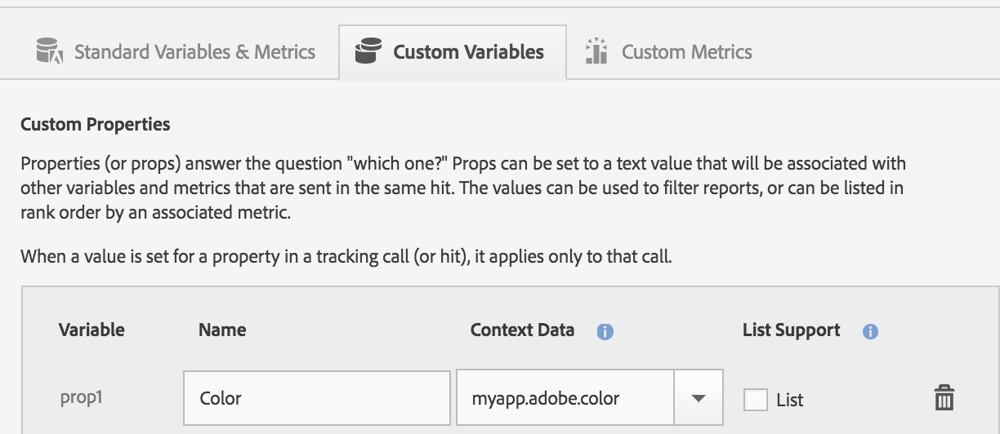

After you enable Adobe Analytics (formerly known as Omniture or Sitecatalyst) in Segment, you can start sending data from any of the Segment [libraries](/docs/connections/sources/catalog/) to an Adobe report suite. When you send events from Segment's mobile SDKs or Cloud-mode libraries, Segment translates that data using a mapping that you configure, and then passes it to the Adobe Analytics [Data Insertion API](https://docs.adobe.com/content/help/en/analytics/import/c-data-insertion-api.html){:target="_blank”}. For additional details, you can browse the code on GitHub in the [@segment-integrations/analytics-swift-adobe-analytics](https://github.com/segment-integrations/analytics-swift-adobe-analytics){:target="_blank”} repo.

## Planning for Adobe Analytics

Adobe Analytics uses a slightly different approach to tracking than Segment, and it's important to understand the difference so you can effectively set up your integration. Segment uses a user-action data model, which uses different types of calls to track different activities of a user on a website or app. Adobe Analytics uses page views as the basic unit of activity, and variables like custom traffic variables (also called 'props'), eVars, list variables, and hierarchy variables to add details for more nuanced analysis.

For example, if one of your end users dismissed a welcome dialog in your app, Segment would generate a `Welcome Dialog Dismissed` event with properties that contain the user ID (`user123`) and the dialog name (`welcome-dialog`), while Adobe Analytics would model the same action as a pageView with variables that represent the dialog name, visitorID, and the event name, and an eVar ("dismissed").

Both Segment and Adobe Analytics have recommended standard data for tracking events. Segment has [the Spec](/docs/connections/spec/), and Adobe uses predefined events. Segment automatically maps incoming event data and some product level properties to Adobe's predefined events, when the event data is in the correct [Segment Ecommerce Spec](/docs/connections/spec/ecommerce/v2/) format. Video calls using the format described in [this document](/docs/connections/spec/video) are also automatically mapped. If you're using the Mobile SDKs, mobile lifecycle events are also automatically mapped. If you need to create Page and Track events that are outside the scope of the Ecommerce Spec, you need to map those in your Segment destinations settings UI.

Segment strongly recommends that you create a [Tracking Plan](/docs/protocols) for both your Segment and Adobe Analytics events before you send any events or properties to Adobe. This helps you map your Segment events to Adobe `events` and Segment properties to Adobe variables. If you decide to set up Adobe Analytics for mobile, you must set up this mapping in both the Segment settings and the Adobe Mobile Services dashboard, so it's good to stay consistent.

## Setting Up the Adobe Analytics SDK

Before you start sending data from your Swift application to Adobe Analytics, complete the following setup steps:

1. Enable the Segment-Adobe Analytics destination in your Segment workspace.
2. From your Adobe Mobile Services dashboard, check and customize the settings on the "Manage App Settings" tab.
3. Download these settings as the `ADBMobileConfig.json` file by clicking the **Config JSON** link at the bottom of the same tab. Follow the instructions in Adobe's [Core implementation and lifestyle](https://marketing.adobe.com/resources/help/en_US/mobile/ios/dev_qs.html){:target="_blank”} documentation. 
4. Follow the instructions below for each mobile environment to add the Adobe Analytics dependency to your project.

> success ""
> **Tip**: Mobile implementations use the `ADBMobileConfig.json` file to store the settings that you would otherwise enter in the Adobe Analytics destination settings in the Segment app. You can change these settings from the Manage App Settings tab in your Adobe Mobile Services dashboard, and can download the file from that same tab. This file includes the Report Suite ID, Timestamp Option, Tracking Server Secure URL, Tracking Server URL, and Use Secure URL for Server-side settings.


## Adding the dependency

### Using Xcode
In the Xcode `File` menu, click `Add Packages`.  You'll see a dialog where you can search for Swift packages.  In the search field, enter the URL to this repository.

```
https://github.com/segment-integrations/analytics-swift-adobe-analytics
```

You then have the option to pin to a version or specific branch and select which project in your workspace to add the package to. After you've made your selections, click the **Add Package** button.

### Using Package.swift

Open your Package.swift file and add the following to the `dependencies` section:

```swift
.package(
            name: "Segment",
            url: "https://github.com/segment-integrations/analytics-swift-adobe-analytics.git",
            from: "1.1.3"
        ),
```

## Using the Plugin in your App

Open the file where you set up and configured the Analytics-Swift library.  Add this plugin to the list of imports.

```swift
import Segment
import SegmentAdobe // <-- Add this line
```

Just under your Analytics-Swift library setup, call `analytics.add(plugin: ...)` to add an instance of the plugin to the Analytics timeline.

```swift
let analytics = Analytics(configuration: Configuration(writeKey: "<YOUR WRITE KEY>")
                    .flushAt(3)
                    .trackApplicationLifecycleEvents(true))
analytics.add(plugin: AdobeDestination())
```

## Sending Data to Adobe analytics

Segment strongly recommends that you create a tracking plan for both your Segment and Adobe Analytics events _before_ you send any events or properties to Adobe. This helps you map your Segment events to Adobe `events` and Segment properties to Adobe `eVars` or `props`, since you'll have to do this in both the Segment settings UI and your Adobe Mobile Services dashboard.

## Sending Events

You can map Segment events in your `Events V2` settings to any event variable you already defined in your Adobe Analytics Mobile Services dashboard.

> warning ""
> **Note**: Do not use the deprecated `Events` settings. These no longer forward events to Adobe.

To  map Segment events to Adobe Analytics events in device mode:

<!--todo: rewrite this so that it doesn't rely on the screenshots to explain how to map events in Segment-->



Here's an example of how you would implement the same mapping in Adobe's Mobile Services Dashboard:



## Sending Custom Properties

You can use the `Context Data Variables` settings to map Segment `properties` to any context data variable defined in your Adobe Analytics Mobile Services dashboard. This includes both Adobe `props` and `eVars`. You can see a list of the Adobe variable types in your Adobe Mobile Services dashboard.



Here's an example of how you would implement the same mapping in Adobe's Mobile Services Dashboard:




| Segment Payload Field                                       | iOS Mapping Notation                                  | Android Mapping Notation | 
| ----------------------------------------------------------- | ----------------------------------------------------- | ------------------------ |
| `anonymousId`                                               | `anonymousId`                                         | `.anonymousId`           |
| `messageId`                                                 | `messageId`                                           | `.messageId`             |
| `event`<br> Track calls only                                | `event`                                               | `.event`                 |
| `name`<br> Screen calls only                                | `name`                                                | `.name`                  |
| `context.traits.key`                                        | `traits.key`                                          | `.context.traits.key`    |
| `context.key`                                               | `key`                                                 |  `.context.key`          |
| `context.arrayKey.key`<br> for example: `context.device.id` | `arrayKey.key`<br> for example: `device.id`           | `.context.arrayKey.key`  |
| `properties.key`                                            | `key`                                                 | `.key`                   |


## Adobe Lifecycle events

Segment implements Adobe Lifecycle Events automatically - you don't have to enable any additional settings. Lifecycle events gather important information like app launches, crashes, session length, and more. See the [list of all Adobe lifecycle metrics and dimensions](https://marketing.adobe.com/resources/help/en_US/mobile/android/metrics.html){:target="_blank”} to learn more.

## Identify 

When you make an Identify call, Segment sets the Adobe `visitorId` to the value of the user's Segment `userId`. The snippets below show what Segment does with this information.

```objc
[ADBMobile setUserIdentifier:@"123"];
```

## Screen

When you call Screen, Segment sends an Adobe `trackState` event, and passes the screen name and any properties you mapped to Adobe as context data values. The snippets below show what Segment does with this information.


```objc
[self.ADBMobile trackState:@"Home Screen" data:<properties mapped in contextData>];
```

## Track

When you call Track, Segment sends an Adobe `trackAction` event, and passes your event name and any properties you mapped to Adobe as context data values.
The snippets below show what Segment does with this information.

```objc
[ADBMobile trackAction:@"Clicked A Button" data:<properties mapped in contextData>];
```

## Reset

Calling `reset` sets the user's `visitorId` to  `null`. `null` is Adobe's default `visitorId` value until you explicitly set it (by calling Identify). The snippets below show what Segment does in the background.


```objc
[ADBMobile trackingClearCurrentBeacon];
```

## Flush

Calling `flush` immediately sends all locally queued events to Adobe. 

```objc
[ADBMobile trackingSendQueuedHits];
```
