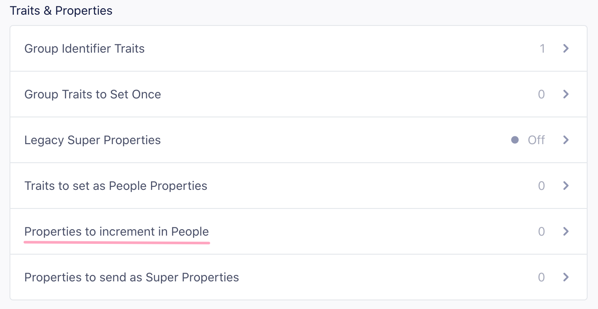

[Mixpanel](https://mixpanel.com/?utm_source=segmentio&utm_medium=docs&utm_campaign=partners){:target="_blank”} is an event-tracking and segmentation platform for your web and mobile apps. 

By analyzing the actions your users perform, you can gain a better understanding to drive retention, engagement, and conversion. The client-side Mixpanel Destination code is open-source.

Segment's Mixpanel destination plugin code is open source and [available on GitHub](https://github.com/segment-integrations/analytics-swift-mixpanel){:target="_blank"}.

## Getting started

1. From the Segment app Destinations page, click on **Add Destination**.
2. Search for Mixpanel in the Destinations Catalog and confirm the source to connect to.
3. Copy your Mixpanel "API Secret" and "Token", and paste them into the Connection Settings in Segment.
4. Enable the destination to start sending your data to Mixpanel.

### Add the dependency

When you add the Mixpanel plugin, the Mixpanel library is installed automatically as an additional dependency.

#### Through Xcode

1. In Xcode, go to **File > Add Packages**.  
2. In the search field, enter the repository URL:  
   `https://github.com/segment-integrations/analytics-swift-mixpanel`  
3. Choose a version or branch, and select the project where you want to add the package.  
4. Click **Add Package** to complete the installation.

In the Xcode `File` menu, click `Add Packages`.  You'll see a dialog where you can search for Swift packages.  In the search field, enter the URL to this repository.

https://github.com/segment-integrations/analytics-swift-mixpanel{:target="_blank"}

You'll then have the option to pin to a version, or specific branch, as well as which project in your workspace to add it to.  Once you've made your selections, click the `Add Package` button.  

#### Through Package.swift

Open your `Package.swift` file and add the dependency to the `dependencies` section:

```swift
.package(
  name: "Segment",
  url: "https://github.com/segment-integrations/analytics-swift-mixpanel.git",
  from: "1.1.3"
),
```

## Using the plugin in your App

Open the file where you set up and configure the Analytics Swift library. Import the Mixpanel plugin alongside Segment:

```swift
import Segment
import SegmentMixpanel // Add this line
```

After configuring the Analytics Swift library, add the Mixpanel plugin to the analytics timeline:

```swift
let analytics = Analytics(
  configuration: Configuration(writeKey: "<YOUR_WRITE_KEY>")
    .flushAt(3)
    .trackApplicationLifecycleEvents(true)
)

analytics.add(plugin: MixpanelDestination())
```

After you add the plugin, Segment automatically routes your events to Mixpanel in device mode.

## Identify

If you're not familiar with the Segment Specs, take a look to understand what the [Identify method](/docs/connections/spec/identify/) does. An example call would look like:

```swift
struct MyTraits: Codable {
        let favoriteColor: String
}

analytics.identify(userId: "a user's id", MyTraits(favoriteColor: "fuscia"))
```

The Identify method links a user’s unique ID with their traits so Mixpanel can recognize and track them.

> info "Identity merge"
> Mixpanel uses [Identity merge](https://help.mixpanel.com/hc/en-us/articles/360039133851#enable-id-merge){:target="_blank"} to connect anonymous visitors to identified users. To enable it, go to **Project Settings > Identity Merge** in your Mixpanel dashboard. If you don’t have Identity merge enabled, use the aliasing steps that follow.


When a visitor becomes an identified user, call [`alias`](/docs/connections/spec/alias/) to link their previous anonymous `id` to their new `userId`.

In Mixpanel, only one anonymous history can be merged with one identified user. Call `alias` **once**, right after the user registers and **before** the first Identify call.

When you call `identify` from the client (in Analytics.js or a mobile SDK), Segment automatically maps [special traits](/docs/connections/spec/identify/#traits) to match Mixpanel’s API. The following table shows how each Segment trait gets transformed before Segment sends it to Mixpanel:

| Key         | Segment transformation |
| ----------- | ---------------------- |
| `created`   | `$created`             |
| `email`     | `$email`               |
| `firstName` | `$first_name`          |
| `lastName`  | `$last_name`           |
| `name`      | `$name`                |
| `username`  | `$username`            |
| `phone`     | `$phone`               |

### People

Segment doesn't send data to Mixpanel People by default. To enable Mixpanel People, change the "Use Mixpanel People" setting in the Mixpanel Destination settings in Segment.

To add people properties in Mixpanel before you know the user's unique database `userId`, you can identify `traits` without the `userId`.

## Group

## Group

Segment sends Group calls to Mixpanel when all of the following conditions are met:

- The **Group Identifier Traits** setting in your Mixpanel destination includes one or more traits.  
   
- You’ve created a group key with the same name in your Mixpanel [project settings](https://help.mixpanel.com/hc/en-us/articles/360025333632-Group-Analytics#implementation){:target="_blank"}.  
- The Group call includes a trait that matches one of the configured Group Identifier Traits.

Here's an example:

```swift
struct MyTraits: Codable {
  let username: String
  let email: String
  let plan: String
}

analytics.group(
  groupId: "group123",
  traits: MyTraits(
    username: "MisterWhiskers",
    email: "hello@test.com",
    plan: "premium"
  )
)
```

Mixpanel supports multiple definitions of groups. For more information see [Mixpanel's Group Analytics documentation](https://help.mixpanel.com/hc/en-us/articles/360025333632-Group-Analytics){:target="_blank"}.

If the group call doesn't have a group trait that matches the Group Identifier Traits setting, then the event will be ignored.

### Register Super Properties

By default, traits included in an Identify call get registered as Super Properties. This doesn’t require a `userId`. You can send a `traits` object alone, and Segment still registers those traits as super properties.

Disable **Set All Traits as Super Properties or People Properties By Default** to disable the default behavior and register super properties explicitly. For more information, see [Explicitly set People Properties and Super Properties](#explicitly-set-people-properties-and-super-properties).

> info "Device mode required"
> Super Properties require a device-mode connection.

#### Set People Properties

If you've enabled Mixpanel People in your Segment settings, Segment calls Mixpanel's `people.set` with the same `traits` object. You don’t need an extra API call to populate Mixpanel People.

Disable **Set All Traits as Super Properties or People Properties By Default** to disable the default behavior and register super properties explicitly. Segment automatically includes any trait in an Identify call that matches one of Mixpanel’s special properties listed in the previously shown transformations table.  
 For more information, see [Explicitly set People Properties and Super Properties](#explicitly-set-people-properties-and-super-properties).

## Track

If you're not familiar with the Segment Specs, take a look to understand what the [Track method](/docs/connections/spec/track/) does. An example call would look like:

```swift
struct TrackProperties: Codable {
        let someValue: String
}

analytics.track(name: "My Event", properties: TrackProperties(someValue: "Hello"))
```

Use the [Track](/docs/connections/spec/track/) method to record user actions and send event data to Mixpanel. Segment maps each event and its properties directly to Mixpanel events and event properties.

### Track Charge

If Mixpanel People is enabled in your Segment settings and you include an event property called `revenue`, Segment tracks a charge to the current user.

### Reserved Properties

There are two strings to avoid when naming event properties that will be sent to Mixpanel: `length` and `bucket`. `length` is interpreted as the JavaScript `.length` method, which causes the `mixpanel.track` call to fail silently. `bucket` is a reserved property that was used in the early days of Mixpanel. If you include a property called `bucket` in your events, it will not show up in the UI. However, it will not cause the `mixpanel.track` call to fail.

### Explicitly Set People Properties and Super Properties

Mixpanel lets you segment reports using both People Properties and Super Properties. To control which traits Segment sends to each, clear **Set All Traits as Super Properties or People Properties By Default** in your Mixpanel destination settings. Then, explicitly pass the traits you want to send as People or Super Properties. 

Segment automatically includes any of Mixpanel’s special traits as People Properties, so you only need to add traits that aren’t in the [Identify traits list](#identify).

### Incrementing events

You don't need to add extra code to increment event counts for Mixpanel people, as long as they are "known users". Supply the events that should be incremented.



You can find this in the **Advanced Options** of your Mixpanel settings on your Segment Destinations page.

For each event name listed, Segment calls Mixpanel `increment`, and set a user trait of `Last + {{ event.name }}`.

For example, if you add **Logged In** to the list of increment events, Segment increments a user trait called **Logged In** and sets a trait called **Last Logged In** with the current date and time.

To add an increment for viewing a specific page or screen, ensure you have the setting "Track Named Pages" selected and use the dynamically generated event name under "Events to Increment in People." For example, `.page('Signup')` would translate to "*Viewed* Signup *Page*" and `.screen('Listing')` would translate to "*Viewed* Listing *Screen*".

Segment sends one event per Page call.

> info ""
> Increment works for "known users", so if your track call is being made server-side, you need to pass a `userId`. If your track call is being made client-side, you need to identify the user first.

### Incrementing properties

To increment at the property level, tell Segment which properties you want to increment using the **Properties to increment** setting and Segment calls Mixpanel's `increment` for you when you attach a number to the property (for example, `'items purchased': 5`)

### Screen

When you use the Mixpanel destination in device mode, Segment sends Screen events to Mixpanel as follows:

- If you select "Track all Pages to Mixpanel", all Screen calls regardless of how you have customized it will send a `Loaded A Screen`. Even if you have the other options enabled, Segment sends this call to prevent double counting your pageviews.

- If you select "Track Categorized Pages to Mixpanel", Segment sends a `Viewed [category] Screen` event.

- If you select "Track Named Pages to Mixpanel", Segment sends a `Viewed [name] Screen` event.

In short, Segment sends one event to Mixpanel per `screen` call.

## Troubleshooting and FAQ

#### How do I send data to Mixpanel’s EU endpoint?

To send data to Mixpanel’s European Union endpoint, turn on **Enable European Union Endpoint** in your Mixpanel destination settings. When this setting is on, Segment routes data for all supported libraries (server side, Analytics.js, and iOS SDK) through Mixpanel’s EU servers.

#### Why don’t I see data from my mobile app right away?

When you enable Mixpanel for a deployed app, it can take up to an hour for users’ Segment settings cache to refresh. Mixpanel’s SDK also sends data only when the app is backgrounded. When you test in Xcode, background the app before ending your session. Otherwise, those events won’t be sent to Mixpanel.

#### I see events in Mixpanel, but not People data. What should I check?

- Confirm you’re calling `identify`. Track calls alone don’t create People records.
- Make sure the People setting is turned on in your Mixpanel destination.
- Disable any default filters in the Mixpanel People Explore tab.

#### Why doesn’t my `ip` property appear in Mixpanel?

Mixpanel automatically parses the `ip` field into geolocation traits (City, Country, Region) and then discards the raw IP address. To retain the full IP value, rename the property to something like `user_ip` or `IP Address`.

For more details, see [Mixpanel's Import Events](https://mixpanel.com/help/reference/http#tracking-events){:target="_blank"} docs.

#### How do I use push notifications with Mixpanel?

Push notifications are only available for projects that bundle the Segment-Mixpanel SDK.

Configure push notification handlers using Mixpanel’s native methods. For details, see the[iOS source documentation](/docs/connections/sources/catalog/libraries/mobile/ios/#what-if-your-sdk-doesnt-support-feature-x).