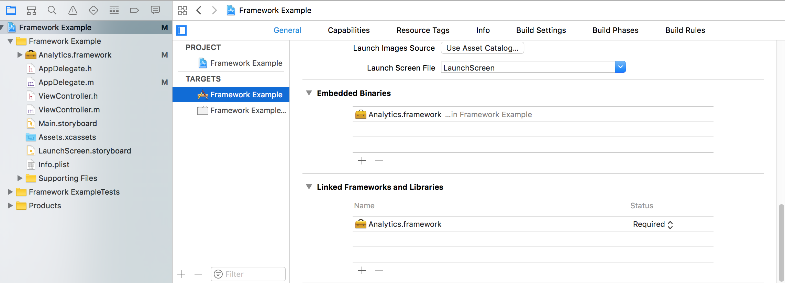

## How big is the Segment SDK?

The core Segment SDK is extremely lightweight. It weighs in at about 212kb.


## Can I install the SDK manually using a dynamic framework?

Segment **highly recommends** using Swift Package Manager or Cocoapods. We cannot guarantee support if you do not use a dependency manager.

However, if you cannot use Swift Package Manager or Cocoapods, you can manually install our dynamic framework allowing you to send data to Segment and on to enabled cloud-mode destinations. We do not support sending data to bundled, device-mode integrations outside of Cocoapods.

To install manually:

1. Download the [latest built SDK](https://github.com/segmentio/analytics-ios/releases/), and unzip the zip file
2. Drag the unzipped `Segment.framework` folder into your XCode project
3. In the **General Tab** for your project, search for `Embedded Binaries` and add the `Segment.framework`




Once you install the framework, import the header file and install as described in [Install the SDK](https://segment.com/docs/connections/sources/catalog/libraries/mobile/ios#install-the-sdk).

If you choose not to use a dependency manager, you must manually keep files up-to-date with regularly scheduled, manual updates.


## Should I include each destination's native SDK in my project?

No. Don't include destination-native SDKs manually for a service Segment supports. Instead, bundle the destination's Segment-integration SDK.

If you already include destination native SDKs, you should remove them when you install the Segment SDK. Keeping the duplicate native SDK can cause symbol conflicts, namespace collisions, duplicate data, and sometimes even silent failures.


## What if Analytics-iOS doesn't support a feature I want to use?

If you're using device-mode for a mobile destination and want to access a feature from the tool's native SDK, you can include the header file and call the method just as normal.

For example, you might want access to Flurry's location logging or Localytics's attribution parameters. To use the destination's SDK you import the headers, then access the SDK as you would without Segment. Segment still handles initialization, event, screen and user tracking, plus all the proxied services and data storage for you.
Here's an example for Flurry location logging:

```objc
#import <Segment/SEGAnalytics.h>
#import <Flurry-iOS-SDK/Flurry.h>

CLLocationManager *locationManager = [[CLLocationManager alloc] init];
[locationManager startUpdatingLocation];
CLLocation *location = locationManager.location;
[Flurry setLatitude:location.coordinate.latitude
          longitude:location.coordinate.longitude
 horizontalAccuracy:location.horizontalAccuracy
   verticalAccuracy:location.verticalAccuracy];

```

## How do I use push notifications?

For services that send push notifications, you must first [create a Push SSL certificate](https://developer.apple.com/library/content/documentation/IDEs/Conceptual/AppDistributionGuide/AddingCapabilities/AddingCapabilities.html). Then configure your application delegate similarly to the example code below, replacing `YOUR_WRITE_KEY` with your own Segment source write key.  Detailed examples of how to complete the process can be found in [Apple's documentation on the subject](https://developer.apple.com/documentation/usernotifications/handling_notifications_and_notification-related_actions).




```swift
func application(_ application: UIApplication, didFinishLaunchingWithOptions launchOptions: [UIApplication.LaunchOptionsKey: Any]?) -> Bool {
    let configuration = AnalyticsConfiguration(writeKey: "YOUR_WRITE_KEY")

    // Use launchOptions to track tapped notifications
    configuration.launchOptions = launchOptions
    Analytics.setup(with: configuration)

    // See the Apple linked above for detailed setup information, as it will vary 
    // based on which versions of iOS are supported and what language is being used.
    ...

    return true
}

```



```objc
- (BOOL)application:(UIApplication *)application didFinishLaunchingWithOptions:(NSDictionary *)launchOptions {
    SEGAnalyticsConfiguration* configuration = [SEGAnalyticsConfiguration configurationWithWriteKey:@"YOUR_WRITE_KEY"];

    // Use launchOptions to track tapped notifications
    configuration.launchOptions = launchOptions;
    [SEGAnalytics setupWithConfiguration:configuration];

    // See the Apple documentation linked above for detailed setup information, as it will vary 
    // based on which versions of iOS are supported and what language is being used.
    ...

    return YES;
}
```




Once you've passed in the launch options and configured the types of notifications your application should received you can then call into Segment's library to indicate that a device token and/or notification has been received.



```swift
// Let Segment Analytics know a device token was received
Analytics.shared().registeredForRemoteNotifications(deviceToken: deviceToken)

...

// Let Segment Analytics know that a remote notification was received
Analytics.shared().receivedRemoteNotification(userInfo)
```



```objc
// Let Segment Analytics know a device token was received
[[SEGAnalytics sharedAnalytics] registeredForRemoteNotificationsWithDeviceToken:deviceToken];

...

// Let Segment Analytics know that a remote notification was received
[[SEGAnalytics sharedAnalytics] receivedRemoteNotification:userInfo];
```





## Can I set user traits without a User ID?

Yes, you can pass a `nil` value for the `userId` in an [Identify call](/docs/connections/spec/identify), like in the following example:



```swift
Analytics.shared().identify(nil, traits: ["email": "example@example.com", "gender": "F"])
```



```objc
[[SEGAnalytics sharedAnalytics] identify: nil
    traits:@{ @"email": @"example@example.com",
      @"Gender": @"F" }];
```





## Do you support iOS 10.x?

Analytics-iOS supports iOS 11.0+. If you need support for older operating systems you can fork [the Segment iOS repo on GitHub](https://github.com/segmentio/analytics-ios/) and [build the framework](https://github.com/segmentio/analytics-ios/wiki/Building-the-framework) with support for your version of iOS.


## Is the Segment SDK compatible with Swift?

Yes, Swift's compatibility with Objective-C lets you create a source that contains files written in either language. To use the Segment Analytics-iOS SDK from a Swift source, [follow these instructions from Apple](https://developer.apple.com/library/ios/documentation/Swift/Conceptual/BuildingCocoaApps/MixandMatch.html).


## Can I help develop a destination?

Yes, the Segment [Analytics-iOS SDK is open-source](https://github.com/segmentio/analytics-ios). If you'd like to contribute, fix a bug, or add a destination please [see the contributing guide](https://github.com/segmentio/analytics-ios/blob/master/CONTRIBUTING.md).


## How do I know when a destination is initialized?

The iOS library posts a notification to indicate when it initializes any destination, so you can call its methods directly.



```swift
NotificationCenter.default.addObserver(self, selector: #selector(integrationDidStart(_:)), name: SEGAnalyticsIntegrationDidStart, object: nil)

@objc func integrationDidStart(_ notification:Notification) {
    guard let integration = notification.object as? String else { return }

    if integration == "Mixpanel" {
        // Call Mixpanel library methods here.
    }
}
```



```objc
[[NSNotificationCenter defaultCenter] addObserver:self selector:@selector(integrationDidStart:) name:SEGAnalyticsIntegrationDidStart object:nil];

- (void)integrationDidStart:(nonnull NSNotification *)notification
{
    NSString *integration = nil
    if ([notification.object isKindOfClass:[NSString class]])
        integration = (NSString *)notification.object;

    if ([integration isEqualToString:@"Mixpanel"]) {
        // Call Mixpanel library methods here.
    }
}
```





## Can I anonymize IP addresses?

Segment collects IP addresses for device-mode (iOS, Android, Analytics.js and Xamarin) events automatically. If you don't want to record your tracked users' IP in destinations (and in storage destinations like S3), you can set the event's `context.ip` field to `0.0.0.0` .  The Segment servers don't record the IP address of the client for libraries if the `context.ip` field is already set.

If you'd like to centralize this logic, you can write a [middleware](/docs/connections/sources/catalog/libraries/mobile/ios/middleware/) for it.

The following examples show how to set a static 0 value for the IP.



```swift
Analytics.shared().track("Clicked Button", properties: nil, options: ["context": ["ip": "0.0.0.0"]])
```



```objc
[[SEGAnalytics sharedAnalytics] track: @"Clicked Button"
  properties:nil
  options:@{ @"context": @{@"ip": @"0.0.0.0"}}];
```






## How can I get the user's IDFA?

Some destinations, especially mobile attribution tools (for example, [Kochava](https://www.kochava.com/){:target="_blank"}), require the IDFA (identifier for advertisers). The IDFA appears in Segment calls in the debugger as `context.device.advertisingId`. To capture this value with Analytics-iOS, follow the steps in [Ad-tracking and IDFA](/docs/connections/sources/catalog/libraries/mobile/ios#ad-tracking-and-idfa).  Remember that Apple now requires that the user consent to your tracking before you can collect the IDFA.


## tvOS / macOS / Catalyst Support

As of [Version 4.1.0](https://github.com/segmentio/analytics-ios/releases/tag/4.1.0), Analytics-iOS now supports tvOS, macOS and Catalyst as well. You can follow the [quickstart documentation](/docs/connections/sources/catalog/libraries/mobile/ios/quickstart/) to set it up!
