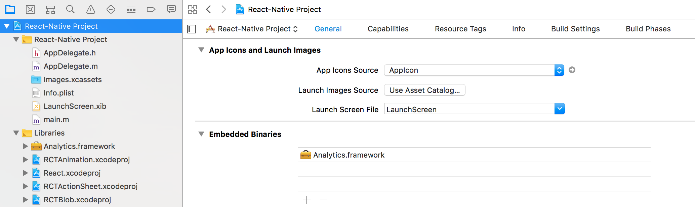

> info "Analytics for React Native 2.0"
> Analytics for React Native 2.0 is available. For more information, see the [Analytics for React Native 2.0 GitHub repository](https://github.com/segmentio/analytics-react-native){:target="_blank"}.

Analytics for React Native makes it easy to send your data to any analytics or marketing tool without having to learn, test or implement a new API every time.

All of Segment's libraries are open-source, and you can [view Analytics for React Native on GitHub](https://github.com/segmentio/analytics-react-native){:target="_blank"}, or see a list of the other [Segment browser and server libraries](/docs/connections/sources/catalog/){:target="_blank"} too.

> info ""
> You can subscribe to the [release feed](https://github.com/segmentio/analytics-react-native/tags.atom){:target="_blank"} to keep up to date with the latest releases.

In cloud-mode, Analytics-React-Native functions as a normal Segment library. In device-mode it wraps the Segment [Analytics-iOS](/docs/connections/sources/catalog/libraries/mobile/ios/) and [Analytics-Android](/docs/connections/sources/catalog/libraries/mobile/android/) libraries, and loads the appropriate mobile library depending on the user's platform. Because of this, Analytics-React-Native includes the two mobile libraries as dependencies.

> warning ""
> When you bundle a destination's device-mode SDK, the React Native library serves as a wrapper for the iOS or Android source libraries. To access the underlying destination code, it is necessary to write bridging code between the React Native wrapper, and the destination's SDK.
>
> For example, if to configure deep linking or retrieve the Appsflyer ID in Appsflyer, or configure in-app messages or push notifications in Braze, you must write code to specifically access these methods from the destination SDK.

### Analytics-React-Native and Unique Identifiers

One of the most important parts of any analytics platform is the ability to consistently and accurately identify users. To do this, the platform must assign and persist some form of identification on the device, so you can analyze user actions effectively. This is especially important for funnel conversion analysis and retention analysis.

#### Unique Identifiers in iOS

Apple restricts how you can generate and use unique IDs to help protect end-users' privacy. Segment generates IDs while remaining in compliance with Apple's policies.

Before iOS 5 developers had access to `uniqueIdentifier`, which was a hardware-specific serial number that was consistent across different apps, vendors and installs. Starting with iOS 5, however, [Apple deprecated access to this identifier](https://developer.apple.com/news/?id=3212013a){:target="_blank"}. In iOS 6 Apple introduced the `identifierForVendor` which protects end-users from cross-app identification. In iOS 7 Apple [restricted access to the device's MAC address](http://techcrunch.com/2013/06/14/ios-7-eliminates-mac-address-as-tracking-option-signaling-final-push-towards-apples-own-ad-identifier-technology/){:target="_blank"}, which many developers used as a workaround to get a similar device-specific serial number to replace  `uniqueIdentifier`.

Segment's iOS library supports iOS 7+ by generating a UUID and storing it on disk. This complies with Apple's required privacy policies, maintains compatibility, and also enables correct tracking in situations where multiple people use the same device, since the UUID can be regenerated.

#### Unique Identifiers in Android

Analytics-React-Native also collects the [Advertising ID](https://developer.android.com/google/play-services/id.html){:target="_blank"} provided by Play Services. This is the ID that should be used for advertising purposes. This value is set to `context.device.advertisingId`.

Make sure you include the Play Services Ads library as a dependency for your application.

Analytics-React-Native also collects the [Android ID](http://developer.android.com/reference/android/provider/Settings.Secure.html#ANDROID_ID){:target="_blank"} as `context.device.id`. Some destinations rely on this field being the Android ID. Check the documentation for the destinations you use and consider if you really want to override the default value.

### API call queueing in Analytics-React-Native

The Analytics-React-Native library queues API calls and uploads them in batches. This limits the number of network calls made, and helps save battery on the user's device.

When you send an event, the library saves it to disk. When the queue size reaches the maximum size you specify (20 by default), the library flushes the queue and uploads the events in a single batch. Since the data is saved immediately, it isn't lost even if the app is killed or the operating system crashes.

The queue behavior might differ for Device-mode destinations. For example, Mixpanel's SDK queues events and then flushes them only when the app goes to the background.

This is why even if you see events in the debugger, the Device-mode destination may not show them on their dashboards yet because they might still be in their mobile SDK's queue. The opposite may also happen: the Device-mode destination SDK might send events to its servers before Segment sends its queue, so events could show up in the destination's dashboard before they appear in the Segment debugger.

## Getting Started

> warning "React-Native version requirement"
> You must use React version 0.62 or later.


> info "Good to know - Device-mode destinations"
> Segment's React Native library serves as a wrapper around the two mobile libraries for iOs and Android. If you plan to [bundle device-mode destinations](#packaging-destinations-using-device-mode) you must add these dependencies.

### iOS configuration

You should use CocoaPods (**recommended**) to manage your installation and dependencies for iOS.
To add CocoaPods to your app, follow [these instructions](https://facebook.github.io/react-native/docs/integration-with-existing-apps#configuring-cocoapods-dependencies){:target="_blank"}.

### Install the SDK

Segment recommends that you use NPM to install Analytics for React Native. This allows you to create a build with specific destinations, and makes it much easier to install and upgrade the library and any components. To install the SDK:

1. Add the `@segment/analytics-react-native` dependency to your `dependencies` and link it using `react-native-cli`, using the example commands below.

    ```bash
    $ yarn add @segment/analytics-react-native
    $ yarn react-native link
    ```

2. In your application, set up the library as in the example below.

    ```js
    await analytics.setup('YOUR_WRITE_KEY', {
      // Record screen views automatically!
      recordScreenViews: true,
      // Record certain application events automatically!
      trackAppLifecycleEvents: true
    })
    ```
3. Make sure you import Analytics-React-Native in any files that you use want to it in. You can use an `import` statement like the example below.

```js
import analytics from '@segment/analytics-react-native'
```

### Dynamic Framework for Manual Installation

Segment only supports sending data to bundled, device-mode destinations if you are using Cocoapods to manage your dependencies. Our Support staff cannot answer questions about, and are not responsible for, projects that do not use Cocoapods.

If you can't use Cocoapods, you can manually install Segment's dynamic framework which allows you to send data to Segment, and have Segment send it on to enabled cloud-mode destinations.

To install Analytics-React-native manually:

1. Add `analytics-ios` as a npm dependency: `yarn add @segment/analytics-ios@github:segmentio/analytics-ios`
2. In the `General` tab for your project, search for `Embedded Binaries` and add the `Analytics.framework`
   

> warning ""
> **Note**: If you choose not to use a dependency manager, you must keep all of the files up-to-date with regularly scheduled, manual updates.


### Packaging Destinations using Device-mode

By default, Analytics-React-Native sends all of your data first to the Segment servers, which forward the data on to any tools you enabled from the Segment web app. It does not package any external destination code by default. This is known as sending your data using "Cloud-mode", and it helps reduce the size of your project.

However, some destinations require that you include code in your project that can be run on the user's device so that these tools can function correctly. These destinations send data directly to the destination's API endpoints, as well as sending a copy to the Segment servers for archiving. This is known as sending data in "device-mode". Other destinations offer a device-mode SDK, but still work (with reduced features) in cloud-mode.

You can read [more about connection modes](/docs/connections/destinations/#connection-modes) in the Destination documentation.

> success ""
> **Tip!** Segment recommends that you use Device-mode destinations only when necessary to use device-specific features, so you can reduce the size of your application.

To use a device-mode destination, add the destination's SDK to the project. You can find information about these in the destination information pages in the Segment app. Any mobile destination with a Device-mode option includes information on how to bundle SDK.

> warning ""
> **Good to know**: Not all destinations have a device-mode package available for use with React Native. [See the list below](#destinations-that-support-device-mode-for-react-native). If a destination you want to use doesn't offer a React Native SDK, you can usually still use it in cloud-mode instead.

When you bundle a destination's device-mode SDK, Segment's React Native library source serves as a wrapper for the iOS and Android source libraries. The React Native device mode SDKs you bundle are generated from the iOS and Android ones.

To use device-mode destinations with React Native, first add the dependencies using the `yarn add` command, as in the example below. Run this command for each device-mode destination you want to bundle. You may also need to run `yarn link`, but this is usually optional.

```bash
yarn add @segment/analytics-react-native-{bugsnag,branch,firebase}
```

> tip "Tip!"
> If you are bundling several device-mode destinations in your project, you might want to make a checklist to make sure you add the relevant dependencies, and add import statements.

See the [device mode documentation in the React Native readme](https://github.com/segmentio/analytics-react-native/#packaging-device-mode-destination-sdks){:target="_blank"} for more details.

Some device-mode dependencies such as Firebase require that you also add the dependencies to your `build.gradle​` file in your Android project.

After you add the destination dependency, you register it with Analytics-React as in the example below. This tells your application how to access the destination's SDK.

```js
import analytics from '@segment/analytics-react-native'
import Bugsnag from '@segment/analytics-react-native-bugsnag'
import Branch from '@segment/analytics-react-native-branch'
import Firebase from '@segment/analytics-react-native-firebase'

await analytics.setup('YOUR_WRITE_KEY', {
  // Add any of your Device-mode destinations.
  using: [Bugsnag, Branch, Firebase]
  // ...
})
```

#### Destinations that support device-mode for React native


| Name                                                                              | iOS | Android | npm package                                               |
| --------------------------------------------------------------------------------- | --- | ------- | --------------------------------------------------------- |
| [Adjust](/docs/connections/destinations/catalog/adjust/)                          | ✅  | ✅      | `@segment/analytics-react-native-adjust`                  |
| [Amplitude](/docs/connections/destinations/catalog/amplitude/)                    | ✅  | ✅      | `@segment/analytics-react-native-amplitude`               |
| [Braze](/docs/connections/destinations/catalog/braze/) (formerly Appboy)          | ✅  | ✅      | `@segment/analytics-react-native-appboy`                  |
| [AppsFlyer](/docs/connections/destinations/catalog/appsflyer/)                    | ✅  | ✅      | `@segment/analytics-react-native-appsflyer`               |
| [Branch](/docs/connections/destinations/catalog/branch-metrics/)                  | ✅  | ✅      | `@segment/analytics-react-native-branch`                  |
| [Bugsnag](/docs/connections/destinations/catalog/bugsnag/)                        | ✅  | ✅      | `@segment/analytics-react-native-bugsnag`                 |
| [CleverTap](/docs/connections/destinations/catalog/clevertap/)                    | ✅  | ✅      | `@segment/analytics-react-native-clevertap`               |
| [ComScore](/docs/connections/destinations/catalog/comscore/)                      | ✅  | ⬜️     | `@segment/analytics-react-native-comscore-ios`            |
| [Countly](/docs/connections/destinations/catalog/countly/)                        | ✅  | ✅      | `@segment/analytics-react-native-countly`                 |
| [Crittercism](/docs/connections/destinations/catalog/crittercism/)                | ✅  | ✅      | `@segment/analytics-react-native-crittercism`             |
| [Facebook App Events](/docs/connections/destinations/catalog/facebook-app-events/) | ✅  | ⬜️     | `@segment/analytics-react-native-facebook-app-events-ios` |
| [Firebase](/docs/connections/destinations/catalog/firebase/)                      | ✅  | ✅      | `@segment/analytics-react-native-firebase`                |
| [Flurry](/docs/connections/destinations/catalog/flurry)                           | ✅  | ✅      | `@segment/analytics-react-native-flurry`                  |
| [Intercom](/docs/connections/destinations/catalog/intercom/)                      | ✅  | ✅      | `@segment/analytics-react-native-intercom`                |
| [Localytics](/docs/connections/destinations/catalog/localytics/)                   | ✅  | ✅      | `@segment/analytics-react-native-localytics`              |
| [Mixpanel](/docs/connections/destinations/catalog/mixpanel/)                       | ✅  | ✅      | `@segment/analytics-react-native-mixpanel`                |
| [Quantcast](/docs/connections/destinations/catalog/quantcast/)                     | ⬜️ | ✅      | `@segment/analytics-react-native-quantcast-android`       |
| [Taplytics](/docs/connections/destinations/catalog/taplytics/)                     | ✅  | ⬜️     | `@segment/analytics-react-native-taplytics-ios`           |
| [Tapstream](/docs/connections/destinations/catalog/tapstream/)                     | ⬜️ | ✅      | `@segment/analytics-react-native-tapstream-android`       |


## Tracking methods

Now that the library is installed and some SDKs are set up, you're ready to learn about the Segment Tracking methods.

### Identify

The [Identify call](/docs/connections/spec/identify/) lets you tie a user to their actions, and record traits about them. It includes a unique User ID, and any optional traits you know about them.

Segment recommends that you make an Identify call when the user first creates an account, and when they update their information.  If users can log out of your app, you should call `identify` when a user logs back in.

Analytics-React-Native works on its own background thread, so it never blocks the main thread for the UI or a calling thread.

> note ""
> **Note**: Segment automatically assigns an `anonymousId` to users before you identify them. The `userId` is what connects anonymous activities across devices.

The example Identify call below identifies a user by their unique User ID (the one you know them by in your database), and labels them with a `name` and `email` traits.

```js
analytics.identify("a user's id", {
  email: "jsmith@example.com"
  name: "John Smith"
})
```

The Identify method has the following arguments:

<table class="api-table">
  <tr>
    <td>`userId` _string_</td>
    <td>The database ID for this user. If you don't know who the user is yet, you can omit the `userId` and just record `traits`. You can read more in the [identify reference](/docs/connections/spec/identify/).</td>
  </tr>
  <tr>
    <td>`traits` _JSONMap, optional_</td>
    <td>A dictionary of traits you know about the user, like their `email` or `name`. You can read more about traits in the [Identify documentation](/docs/connections/spec/identify/).</td>
  </tr>
</table>


When you call Identify with a `userId`, the library writes that ID to disk so it can be used in later calls. That ID can be removed either when the user uninstalls the app, or when you call [`reset`](#reset).

Find details on the **identify method payload** in [the Segment Identify Spec](/docs/connections/spec/identify/).

### Track

Then [Track call](/docs/connections/spec/track/) lets you record the actions your users perform. Every action triggers what Segment calls an "event", which can also have associated properties.

> success ""
> **Tip!** Analytics-React-Native can automatically track a few common events using Segment's [Native Mobile Spec](/docs/connections/spec/mobile/), such as the `Application Installed`, `Application Updated` and `Application Opened`. These events are required for attribution tracking in several frequently-used Segment destinations. Set `trackAppLifecycleEvents` to `true`  during initialization to enable this feature.

```js
analytics
    .setup('writeKey', {
        trackAppLifecycleEvents: true
    })
```

You should track events that are indicators of success for your mobile app, like **Signed Up**, **Item Purchased** or **Article Bookmarked**. Segment recommends that you track just a few important events when you first start out. You can always add more later!

The example Track call below tells us that a user just triggered the **Item Purchased** event, which recorded the `item` name of "Sword of Heracles" and a `revenue` of 2.95.

```js
analytics.track('Item Purchased', {
  item: 'Sword of Heracles',
  revenue: 2.95
})
```
Track event properties can be anything you want to record. In this case, item and revenue.

The Track call has the following fields:

<table class="api-table">
  <tr>
    <td>`event` _string_</td>
    <td>The name of the event. Segment recommends that you give events human-readable names, in object-action order, like **Song Played** or **Status Updated**.</td>
  </tr>
  <tr>
    <td>`properties` _JSONMap, optional_</td>
    <td>A dictionary of properties for the event. If the event was `Product Added` to cart, it might have properties like `price` and `productType`.</td>
  </tr>
</table>

You can read more about the Track call fields on [the Segment Spec page about the Track call](/docs/connections/spec/track/).


### Screen

The [Screen call](/docs/connections/spec/screen/) lets you you record whenever a user sees a screen of your mobile app, along with optional extra information about the page being viewed. This is very similar to the [Page call](/docs/connections/spec/page/) that you would use for non-mobile users.

Record a screen event an event whenever the user opens or navigates to a new screen in your app. This could be a view, fragment, dialog or activity depending on your app.

The example Screen call below shows a user viewed the Photo Feed, and that the page was private.

```js
analytics.screen('Photo Feed', {
  'Feed Type': 'private'
})
```

The `screen` call has the following fields:

<table class="api-table">
  <tr>
    <td>`name` _string_</td>
    <td>The name of the screen, for example **Signup** or **Home**.</td>
  </tr>
  <tr>
    <td>`properties` _JSONMap, optional_</td>
    <td>A dictionary of properties for the screen. A screen **Photo Feed** might have properties like `Feed Type` or `Sort Order`.</td>
  </tr>
</table>

You can read more about the Screen call fields on [the Segment Spec page about the Screen call](/docs/connections/spec/screen/).

### Group

The [Group call](/docs/connections/spec/group/) lets you associate an [identified user](#identify) user with a group. A group could be a company, organization, account, project or team. The call also lets you record custom traits about the group, like industry or number of employees.

The Group call is useful for tools like [Intercom](/docs/connections/destinations/catalog/intercom/), [Preact](/docs/connections/destinations/catalog/preact/) and [Totango](/docs/connections/destinations/catalog/totango/), as it ties the user to a **group** of other users.

The example Group call below adds the current user to the `myGroup` group, and adds a name and description.

```js
analytics.group('myGroup', {
  name: 'Initech',
  description: 'Accounting Software'
})
```

The `group` call has the following fields:

<table class="api-table">
  <tr>
    <td>`groupId` _string_</td>
    <td>The ID for this group in your database.</td>
  </tr>
  <tr>
    <td>`traits` _JSONMap, optional_</td>
    <td>A dictionary of traits you know about the group. Things like: `name` or `website`.</td>
  </tr>
</table>

You can read more about the Group method, including the group call payload, in [the Segment Spec page on the Group call](/docs/connections/spec/group/).

### Alias

You can use Alias calls to link one identity with another. This is an advanced method, but it is required to manage user identities correctly in *some* destinations.

In [Mixpanel](/docs/connections/destinations/catalog/mixpanel/#alias) it's used to associate an anonymous user with an identified user once they sign up. For [Kissmetrics](/docs/connections/destinations/catalog/kissmetrics/#alias), if your user switches IDs, you can use 'alias' to rename the 'userId'.

Example `alias` call:

```js
analytics.alias('some new id')
```

The `alias` call has the following fields:

<table class="api-table">
  <tr>
    <td>`newId` _string_</td>
    <td>The newId of the user you want to map to.</td>
  </tr>
</table>

To learn more about the Alias method, including the alias call payload, read through [the Segment Spec page on the Alias call](/docs/connections/spec/alias/)


## Configuration

The `Configuration` interface provides a set of properties that control the different policies of the `Analytics` instance. You can configure using the `setup` method like so:

```js
analytics.setup('YOUR_WRITE_KEY', {
  // ...
})
```

<table class="api-table">
    <tr>
        <td>`writeKey` _string_</td>
        <td>Your Segment source's **Write Key**.</td>
    </tr>
</table>

### Native configuration

You can also use the native Analytics API to configure the Analytics instance by calling `analytics.useNativeConfiguration()` in your JavaScript code. This prevents the Analytics instance from waiting for additional configuration.

You should wrap the call under a conditional, as in the following example.

```js
import analytics from '@segment/analytics-react-native';

if (!analytics.ready) { // checks if analytics is already ready; if not we can safely call `useNativeConfiguration`
    analytics.useNativeConfiguration();
}
```


## Utility methods


### Reset

The `reset` method clears the library's internal stores for the current user and group. This is useful for apps where users log in and out with different identities on the same device over time.

The example code below clears all information about the user.

```js
analytics.reset()
```

**Reset does not clear events in the queue**, and any remaining events in the queue are sent the next time the app starts. You might want to call [Flush](#flush) before you call Reset.


> info ""
> **Note**: Each time you call `reset`, a new AnonymousId is generated the next time the app is opened, which can impact the number of Monthly Tracked Users (MTUs) you process.

### Flush

By default, the library collects 20 events in the queue before flushing (sending) them, but you modify this number.

You can set `flushAt` to `1` to send events as they come in, and not in batches. This approach uses more battery.

```js
await analytics.setup('YOUR_WRITE_KEY', {
  flushAt: 1
})
```

You can also manually `flush` the queue:

```js
analytics.alias('glenncoco')
analytics.flush()
```


### Logging

To see a trace of your data going through the SDK, you can enable debug logging with the `debug` method:

```js
await analytics.setup('YOUR_WRITE_KEY', {
  debug: true
})
```

By default debug logging is disabled.


### Application Lifecycle Tracking

Analytics-React-Native can automatically track a few common events using Segment's [Native Mobile Spec](/docs/connections/spec/mobile/), such as the `Application Installed`, `Application Updated` and `Application Opened`. These events are required for attribution tracking in several frequently-used Segment destinations. Set `trackAppLifecycleEvents` to `true`  during initialization to enable this feature.

```js
await analytics.setup('YOUR_WRITE_KEY', {
  trackAppLifecycleEvents: true
})
```

### Adding data to the context

In some cases, you might want to add information to [the `context` object](/docs/connections/spec/common/#context) in the Segment message payload. This can be useful for adding context or session data for an event that doesn't have another logical place to add it, such as in an Identify, Screen or Group.

```js
analytics.identify('brandon', null, { context: { myValue: false, loginFailures: 3 }})
```

The data passed in the `context` dictionary (as in the example above) are merged with data already present in the context object for this event.

### Block specific events from going to a destination

There are some situations where you might not want to send an event to a specific cloud-mode destination. You can block events from destinations on a per-event basis by setting the `integrations` object as shown in the example below. Learn more about [filtering data with the integrations object here](/docs/guides/filtering-data/#filtering-with-the-integrations-object).

```js
analytics.track('MyEvent', null, { integrations: { Mixpanel: false }})
```

By default, events are delivered to any cloud-mode destinations currently enabled in the Segment web app. You can override this delivery by adding a list to exclude, as in the example above. In this example, the event does not reach the Mixpanel destination.

> success ""
> **Tip!** Items in the Integrations object are **case sensitive** and must match the actual destination name. Many destination documentation pages include a list of acceptable names when the correct name is not clear.

## Identity and privacy

### Opt-out

Depending on the audience for your app (for example, children) or the countries where you sell your app (for example, in the EU), you might need to allow users to opt-out of analytics data collection inside your app.

You can turn off forwarding to ALL destinations including Segment itself using the `disable` method.

```js
analytics.disable()
```

If a user opts back in at a later date, you can re-enable data collection using the `enable` method.

```js
analytics.enable()
```

When you disable the Segment library, all data collection methods (`track`, `identify`, etc) stop running; however, it does not remove the initialized libraries. If you bundle device-mode SDKs which collect data automatically, or outside of Segment, those continue to operate. Segment recommends that you invoke a disable method in each of packaged SDK when a user opts-out, to ensure all automatic data collection stops.

### Anonymizing IP

Segment collects IP addresses for device-mode (iOS, Android, Analytics.js and Xamarin) events automatically. If you don't want to record your tracked users' IP in destinations (and in storage destinations like S3), you can set the event's `context.ip` field to `0.0.0.0` .  The Segment servers don't record the IP address of the client for libraries if the `context.ip` field is already set.


### Set IDFA

Some destinations, especially mobile attribution tools (such as Kochava), require that you include the user's IDFA (identifier for advertisers) to function correctly. The IDFA appears in Segment calls in the debugger as `context.device.advertisingId`.

Segment no longer automatically collects the IDFA in [Analytics-React-Native version 1.3.0](https://github.com/segmentio/analytics-react-native/blob/master/CHANGELOG.md){:target="_blank"} and later. You must collect the IDFA outside of Segment. You can use many different NPM packages to get this value, however Segment recommends that you use the [officially supported `react-native-idfa` package](https://www.npmjs.com/package/react-native-idfa){:target="_blank"}.

Once you have an IDFA or other identifier, use the `setIDFA` method to set the `context.device.advertisingId` to that value, as in the example below.

```java
import analytics from '@segment/analytics-react-native';
analytics.setIDFA("123");
```

You will also need to set the `trackAdvertising` property to `true` in your configuration.

```java
analytics.setup('YOUR_WRITE_KEY', {
  // ...
  ios:{
    trackAdvertising: true
  },
})
```

### Using a custom anonymousID

You might want to use a custom `anonymousID` to better integrate with other systems in your deployment. The best way to do this is to override the default using the `options` parameter when you call `analytics.identify`, as in the example below.

```js
analytics.identify('brandon', null, { anonymousId: '0123456789' })
```


## Sending Push Notifications

React Native doesn't provide an official JavaScript API to handle push notifications, and so Analytics for React Native doesn't provide an API to do so either. However, you can work around this by using the underlying native SDK.

### React Native push notifications on iOS

For services that send push notifications, you first want to [create a Push SSL certificate following these steps](https://developer.apple.com/library/content/documentation/IDEs/Conceptual/AppDistributionGuide/AddingCapabilities/AddingCapabilities.html){:target="_blank"}. You then want to configure your application delegate to look like the code below, and replace your Segment source write key.

```objc
- (BOOL)application:(UIApplication *)application didFinishLaunchingWithOptions:(NSDictionary *)launchOptions {
  SEGAnalyticsConfiguration* configuration = [SEGAnalyticsConfiguration configurationWithWriteKey:@"YOUR_WRITE_KEY"];

  // Use launchOptions to track tapped notifications
  configuration.launchOptions = launchOptions;
  [SEGAnalytics setupWithConfiguration:configuration];

  if ([[UIApplication sharedApplication] respondsToSelector:@selector(registerForRemoteNotifications)]) {
    UIUserNotificationType types = UIUserNotificationTypeAlert | UIUserNotificationTypeSound |
    UIUserNotificationTypeBadge;
    UIUserNotificationSettings *settings = [UIUserNotificationSettings settingsForTypes:types
    categories:nil];
    [[UIApplication sharedApplication] registerUserNotificationSettings:settings];
    [[UIApplication sharedApplication] registerForRemoteNotifications];
  } else {
    UIRemoteNotificationType types = UIRemoteNotificationTypeAlert | UIRemoteNotificationTypeSound |
    UIRemoteNotificationTypeBadge;
    [[UIApplication sharedApplication] registerForRemoteNotificationTypes:types];
  }
  return YES;
}

- (void)application:(UIApplication *)application didRegisterForRemoteNotificationsWithDeviceToken:(NSData *)deviceToken {
  [[SEGAnalytics sharedAnalytics] registeredForRemoteNotificationsWithDeviceToken:deviceToken];
}

// A notification has been received while the app is running in the foreground
- (void)application:(UIApplication *)application didReceiveRemoteNotification:(NSDictionary *)userInfo {
  [[SEGAnalytics sharedAnalytics] receivedRemoteNotification:userInfo];
}

// iOS 8+ only
- (void)application:(UIApplication *)application didRegisterUserNotificationSettings:(UIUserNotificationSettings *)notificationSettings {
  // register to receive notifications
  [application registerForRemoteNotifications];
}
```

### React Native push notifications on Android

If you're using Device-mode for a mobile destination, you can always access features from that tool's native SDK.

To make sure you use the same instance of these destinations as we do, you can register a listener that notifies you when the destinations are ready. This will be called synchronously if the destinations are notified, and asynchronously if the destinations aren't yet ready.

```java
analytics = Analytics.with(myActivity) // typically `this` will suffice here.

...

analytics.onIntegrationReady("Crittercism", new Callback() {
  @Override public void onReady(Object instance) {
    // Crittercism uses static methods only, so the instance returned is null.
    Crittercism.leaveBreadcrumb();
  }
});
analytics.onIntegrationReady("Mixpanel", new Callback() {
  @Override public void onReady(Object instance) {
    MixpanelAPI mixpanelAPI = (MixpanelAPI) instance;
    mixpanelAPI.clearSuperProperties();
  }
});
```

For the destinations that return `Void`, they simply use a shared instance. You can call into the SDK directly. With this API, you're guaranteed that they've been initialized first, and if you ever decide to change the settings for the destination on our dashboard, they'll be reflected here.

```java
analytics.onIntegrationReady(BundledIntegration.FLURRY, new Callback() {
  @Override public void onReady(Object instance) {
    // Flurry uses static methods only, so the instance returned is null.
    Flurry.setLogEnabled(true);
  }
});
```
