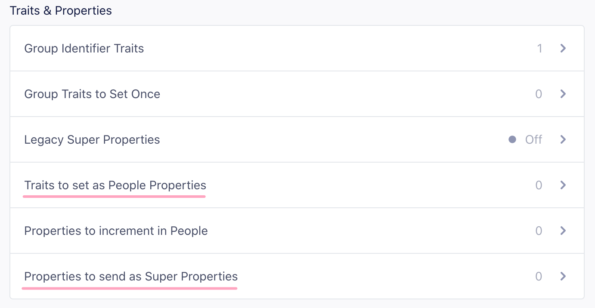

[Mixpanel](https://mixpanel.com/?utm_source=segmentio&utm_medium=docs&utm_campaign=partners) is an event-tracking and segmentation platform for your web and mobile apps. By analyzing the actions your users perform, you can gain a better understanding to drive retention, engagement, and conversion. The client-side Mixpanel Destination code is open-source.

Segment's Mixpanel destination plugin code is open source and available on GitHub. You can view it [here.](https://github.com/segmentio/analytics-react-native/tree/master/packages/plugins/plugin-mixpanel)

## Getting Started



1. From the Segment app Destinations page click on **Add Destination**.
2. Search for Mixpanel in the Destinations Catalog and confirm the Source to connect to.
3. Copy your Mixpanel "API Secret" and "Token", and paste them into the Connection Settings in Segment.
4. Enable the destination to start sending your data to Mixpanel.

### Adding the dependency

You need to install the `@segment/analytics-react-native-plugin-mixpanel` and the `mixpanel-react-native` dependency.

Using NPM:
```bash
npm install --save @segment/analytics-react-native-plugin-mixpanel mixpanel-react-native
```

Using Yarn:
```bash
yarn add @segment/analytics-react-native-plugin-mixpanel mixpanel-react-native
```

Run `pod install` after the installation to autolink the Mixpanel SDK.

See [Mixpanel React Native SDK](https://github.com/mixpanel/mixpanel-react-native) for more details of this dependency.
## Usage

Follow the [instructions for adding plugins](https://github.com/segmentio/analytics-react-native#adding-plugins) on the main Analytics client:

In your code where you initialize the analytics client call the `.add(plugin)` method with an `MixpanelPlugin` instance:

```ts
import { createClient } from '@segment/analytics-react-native';

import { MixpanelPlugin } from '@segment/analytics-react-native-plugin-mixpanel';

const segmentClient = createClient({
  writeKey: 'SEGMENT_KEY'
});

segmentClient.add({ plugin: new MixpanelPlugin() });
```

## Identify

If you're not familiar with the Segment Specs, take a look to understand what the [Identify method](/docs/connections/spec/identify/) does. An example call would look like:

```js
const { identify } = useAnalytics();

identify('user-123', {
  username: 'MisterWhiskers',
  email: 'hello@test.com',
  plan: 'premium',
});
```

The first thing you'll want to do is to identify your users so Mixpanel knows who they are. You'll use the Identify method to accomplish this which takes the unique `userId` of a user and any `traits` you know about them.

> info ""
> **Important:** Mixpanel used to require that you call `alias` in all libraries to connect anonymous visitors to identified users. However, with the release of Mixpanel's new [Identity Merge feature](https://help.mixpanel.com/hc/en-us/articles/360039133851#enable-id-merge){:target="_blank"} this is no longer necessary. To enable ID Merge, go to your Mixpanel Settings Dashboard, navigate to **Project Settings > Identity Merge** and enable the setting from that screen. If you are _not_ using this setting, use the instructions below.

 When you call the Identify method, several things occur: Segment recognizes and translates the [special traits](/docs/connections/spec/identify/#traits) so that they fit the expectations of Mixpanel's API. The table below shows the mappings. Pass the key on the left and Segment transforms it to the key on the right before sending to Mixpanel.

<table>
  <tr>
    <td>`created`</td>
    <td>`$created`</td>
  </tr>
  <tr>
    <td>`email`</td>
    <td>`$email`</td>
  </tr>
  <tr>
    <td>`firstName`</td>
    <td>`$first_name`</td>
  </tr>
  <tr>
    <td>`lastName`</td>
    <td>`$last_name`</td>
  </tr>
  <tr>
    <td>`name`</td>
    <td>`$name`</td>
  </tr>
  <tr>
    <td>`username`</td>
    <td>`$username`</td>
  </tr>
  <tr>
    <td>`phone`</td>
    <td>`$phone`</td>
  </tr>
</table>

### People

Segment doesn't send data to Mixpanel People by default. To enable Mixpanel People, change the "Use Mixpanel People" setting in the Mixpanel Destination settings in Segment.

To add people properties in Mixpanel before you know the user's unique database `userId`, you can identify `traits` without the `userId`.

## Group

Group calls are sent to Mixpanel if, **and only if**,

1. The Group Identifier Traits setting has one or more traits saved in the destination settings for Mixpanel.
   
2. You have created a group key of the same name in your Mixpanel [project settings](https://help.mixpanel.com/hc/en-us/articles/360025333632-Group-Analytics#implementation){:target="_blank"}.
3. A Group trait with the same name as one of the configured Group Identifier Traits is sent with the group call.

```js
const { group } = useAnalytics();

group('some-company', {
  name: 'Segment',
});
```

Mixpanel supports multiple definitions of groups. For more information see [Mixpanel's Group Analytics documentation](https://help.mixpanel.com/hc/en-us/articles/360025333632-Group-Analytics){:target="_blank"}.

If the group call **does not** have a group trait that matches the Group Identifier Traits setting, then the event will be ignored.

### Register Super Properties

By default, each trait (that is, properties in an `identify` call) is registered as a super property. This doesn't require passing a `userId` in the `identify` call. You can pass a `traits` object by itself and it will still register the traits as super properties.

Disable **Set All Traits as Super Properties or People Properties By Default** to disable the default behavior and register super properties explicitly. For more information, see [Explicitly set People Properties and Super Properties](#explicitly-set-people-properties-and-super-properties).

> info ""
> Super properties require a device mode connection.

#### Set People Properties

If you've enabled Mixpanel People in your Segment settings, Segment calls Mixpanel's `people.set` with the same `traits` object. There's no need for an additional API call to populate Mixpanel People.

Disable **Set All Traits as Super Properties or People Properties By Default** to disable the default behavior and register super properties explicitly. Segment automatically includes any trait on an identify that matches one of Mixpanel's special properties, which you can see in the table above. For more information, see [Explicitly set People Properties and Super Properties](#explicitly-set-people-properties-and-super-properties).

## Track

If you're not familiar with the Segment Specs, take a look to understand what the [Track method](/docs/connections/spec/track/) does. An example call would look like:

```ts
const { track } = useAnalytics();

track('View Product', {
  productId: 123,
  productName: 'Striped trousers',
});
```
Because Mixpanel is an event tracking analytics tool, you'll want to [`track`](/docs/connections/spec/track/) your user's actions. The more useful events you [`track`](/docs/connections/spec/track/), the better Mixpanel becomes.

You should use the [`track`](/docs/connections/spec/track/) method to accomplish this. The Segment [`track`](/docs/connections/spec/track/) method maps events and event properties directly to Mixpanel events and event properties.

### Track Charge

If Mixpanel People is enabled in your Segment settings and you include an event property called `revenue`, Segment tracks a charge to the current user.

### Reserved Properties

There are two strings to avoid when naming event properties that will be sent to Mixpanel: `length` and `bucket`. `length` is interpreted as the JavaScript `.length` method, which causes the `mixpanel.track` call to fail silently. `bucket` is a reserved property that was used in the early days of Mixpanel. If you include a property called `bucket` in your events, it will not show up in the UI. However, it will not cause the `mixpanel.track` call to fail.

### Explicitly Set People Properties and Super Properties

Previously, Segment set all traits and properties as both Super Properties and People Properties (If you had Mixpanel People enabled). Now Mixpanel allows you to segment your reports by both People Properties and Super Properties. To give you better precision and control over what property or trait gets set as a Super Property or People Property, you can disable **Set All Traits as Super Properties or People Properties By Default** and pass in the properties or traits that you want to send to Mixpanel as People or Super Properties as shown below. Segment passes through all of Mixpanel's special traits as People Properties so you only need to add the ones that aren't on [this list](#group-using-device-mode).




### Incrementing events

You don't need to add extra code to increment event counts for Mixpanel people, as long as they are "known users". Supply the events that should be incremented.


You can find this in the **Advanced Options** of your Mixpanel settings on your Segment Destinations page.

For each event name listed, Segment calls Mixpanel `increment`, and set a user trait of `Last + {{ event.name }}`.

For example, if you add **Logged In** to the list of increment events, Segment increments a user trait called **Logged In** and set a trait called **Last Logged In** with the current date and time.

If you'd like to add an increment for viewing a specific page or screen, ensure you have the setting "Track Named Pages" selected and use the dynamically generated event name under "Events to Increment in People." For example, `.page('Signup')` would translate to "*Viewed* Signup *Page*" and `.screen('Listing')` would translate to "*Viewed* Listing *Screen*".

Remember, Segment sends one event per `page` call.

> info ""
> Increment works for "known users", so if your track call is being made server-side, you need to pass a `userId`. If your track call is being made client-side, you need to identify the user first.

### Incrementing properties

To increment at the property level, tell Segment which properties you want to increment using the **Properties to increment** setting and Segment calls Mixpanel's `increment` for you when you attach a number to the property (for example, `'items purchased': 5`)

### Screen

When you use the Mixpanel destination in Device-mode, Segment sends Screen events to Mixpanel as follows:

- If you select "Track all Pages to Mixpanel", all `screen` calls regardless of how you have customized it will send a `Loaded A Screen`. Even if you have the other options enabled, Segment sends this call to prevent double counting your pageviews.

- If you select "Track Categorized Pages to Mixpanel", Segment sends a `Viewed [category] Screen` event.

- If you select "Track Named Pages to Mixpanel", Segment sends a `Viewed [name] Screen` event.

In short, Segment sends one event to Mixpanel per `screen` call.

### Sending data to Mixpanel's European Union Endpoint

To implement Mixpanel in the European Union, enable the setting "Enable European Union Endpoint" on the Settings tab of the Mixpanel destination. When this setting is enabled, Segment updates the endpoint for any data sent from server-side libraries, browsers using Analytics.js, or the iOS SDK.
### When Will I See Data from my Mobile App?

If you already have an app deployed with the Segment library, and you just enabled Mixpanel mobile, it can take up to an hour for all your mobile users to refresh their Segment settings cache, and learn about the new service that you want to send to.

After the settings cache refreshes, the library starts to send data to Mixpanel.

Also worth noting, Mixpanel's SDK only submits requests to the Mixpanel servers when the app is backgrounded. That means you may see events in your Segment debugger while testing, but those requests won't actually be forwarded to Mixpanel until the app gets sent to the background.

If you're testing in Xcode remember you must first background the app, then the events will show up in Mixpanel. If you terminate the session without backgrounding those events will be lost.

### I'm seeing events come into Mixpanel but not people.

1. You'll need to make sure you're using [`identify`](/docs/connections/spec/identify/). A Mixpanel track doesn't create users in Mixpanel People.
2. Make sure to turn on the "People" setting so that all of your [`identify`](/docs/connections/spec/identify/) calls will be sent to Mixpanel's People feature.
3. Make sure you disable the default filter in the Mixpanel People Explore tab.

### IP

If an `ip` property is passed to Mixpanel, the value will be interpreted as the IP address of the request and therefore automatically parsed into Mixpanel geolocation properties (City, Country, Region). After that IP address has been parsed, they will throw out the IP address and only hold onto those resulting geolocation properties. As such, if you want to display an IP address as a property within the Mixpanel UI or within raw data, you will simply want to slightly modify the naming convention for that property.

Instead of `ip`, you can use a property name of `user IP` or `IP Address` (whatever is most clear for your implementation). This way, Mixpanel won't automatically interpret the IP address as an IP address, and instead store that value as a property on the event. You can read more [here](https://mixpanel.com/help/reference/http#tracking-events){:target="_blank"}.