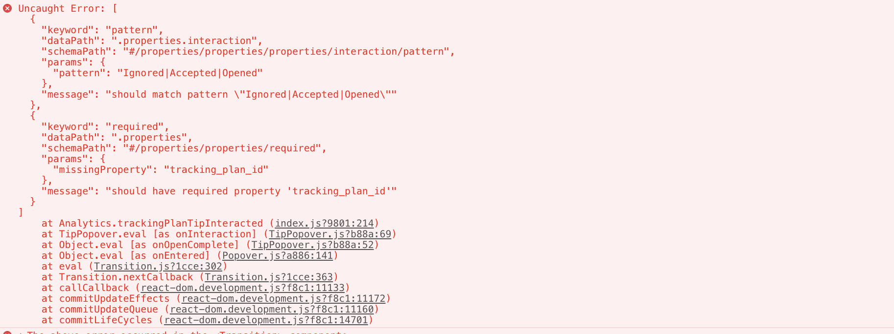
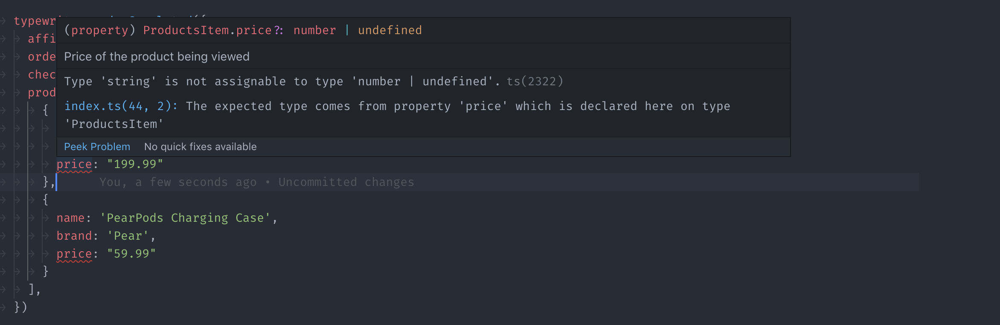

[Typewriter](https://github.com/segmentio/typewriter) is a tool for generating strongly-typed Segment analytics libraries based on your pre-defined [Tracking Plan](/docs/protocols/tracking-plan) spec.

At a high-level, Typewriter can take an event from your Tracking Plan like this `"Order Completed"` event:

Typewriter uses the event to generate a typed analytics call in different languages:

```js
// Example client in your web app
const typewriter = require('./analytics')

typewriter.orderCompleted({
  orderID: 'ck-f306fe0e-cc21-445a-9caa-08245a9aa52c',
  total:   39.99
})
```

```objc
// Example client in your iOS app
SEGTypewriterAnalytics.orderCompleted(
  orderID: "ck-f306fe0e-cc21-445a-9caa-08245a9aa52c",
  total: 39.99
)
```
These generated clients are embedded with metadata from your Tracking Plan, which contextualizes your analytics instrumentation, and reduces or eliminates incorrect instrumentations in your production environments. In your editor, you can access event names, descriptions, property names, types and more:


You can also configure Typewriter to validate analytic events at runtime, which can alert you to instrumentation errors during development and testing. Typewriter can warn you about missing required properties, invalid enum values, regex mismatches, and any other advanced [JSON Schema](https://json-schema.org/understanding-json-schema/) you configure in your Tracking Plan.




You can use this with a test suite to automatically fail your unit tests if the instrumentation generates any violations:


If you use a statically typed language (such as TypeScript, Java, Objective-C, or Swift), you get access to compile-time warnings about your instrumentation:



Typewriter also helps teams adopt [analytics best practices](/docs/protocols/tracking-plan/best-practices/), such as avoiding autogenerated event names, and carefully considering what properties are tracked.

## Prerequisites

Typewriter is built using [Node.js](https://nodejs.org/en/), and requires `node@8.x` or later, and `npm@5.2.x` or later to function.

You can check if you have Node and NPM installed by running the following commands in your command-line window:

```sh
$ node --version
v10.15.3

$ npm --version
6.9.0

$ npx --version
6.9.0
```

If you don't have these, [you'll need to install `node`](https://nodejs.org/en/download/package-manager). Installing `node` also installs `npm` and `npx` for you. If you're on macOS, you can install it with [Homebrew](https://brew.sh/):

```sh
$ brew install node
```

Once you've installed Node and NPM, run the `--version` commands again to verify that they were installed correctly.

## React Native Quickstart

To get started with React Native:
1. Follow the [Getting Started guide for React Native](/docs/connections/sources/catalog/libraries/mobile/react-native/).
2. Add `typewriter` as a dev dependency in your project once you have the library installed in your project.

    ```
    $ npm install --save-dev typewriter
    ```

3. Run `npx typewriter init` to use the Typewriter quickstart wizard that generates a `typewriter.yml` configuration along with your first Typewriter client.

   This command creates a `typewriter.yml` file in your repo. For more information on the format of this file, see the [Typewriter Configuration Reference](#configuration-reference). The command also adds a new Typewriter / Segment client in `./analytics` (or whichever path you configured). You can use this interchangeably as a normal React Native Segment client. It contains additional methods for your tracking plan:

    ```ts
    import {
      createClient,
      AnalyticsProvider,
    } from '../typewriter'; // Remember to import the methods from your typewriter generated file!
    const segmentClient = createClient({
      writeKey: 'SEGMENT_API_KEY'
    });
    const App = () => (
      <AnalyticsProvider client={segmentClient}>
        <Content />
      </AnalyticsProvider>
    );
    ```

    From there you can use it with hooks:

    ```ts
    import React from 'react';
    import { Text, TouchableOpacity } from 'react-native';
    import { useAnalytics } from '../typewriter'; // Important! To
    const Button = () => {
      const { orderCompleted } = useAnalytics();
      return (
        <TouchableOpacity
          style={styles.button}
          onPress={() => {
            orderCompleted({orderID: "111", total: 39.99});
          }}
        >
          <Text style={styles.text}>Press me!</Text>
        </TouchableOpacity>
      );
    };
    ```

    Or directly through the client:

    ```ts
    segmentClient.orderCompleted({orderID: "111", total: 39.99});
    // Remember this is just an extended client with the typewriter methods so all the normal segment methods still work!
    segmentClient.track('Untyped event');
    ```
> info ""
> Run `npx typewriter` to regenerate your Typewriter client. You need to do this each time you update your Tracking Plan.


## Adding Events

To update or add a new event to a Typewriter client, first apply your changes to your Tracking Plan. Then run the following:

```sh
# Run this in the directory with your repo's `typewriter.yml`.
$ npx typewriter
```

## API Token Configuration

Typewriter requires a Segment API token to fetch Tracking Plans from the [Segment Public API](https://docs.segmentapis.com/).


You must be a workspace owner to create Segment API tokens.

To create an API token:
1. Click on the **Tokens** tab on the [Access Management](https://app.segment.com/goto-my-workspace/settings/access-management) page and click **Create Token**.
2. Choose Segment's Public API.
3. Add a description for the token and assign access. If you choose *Workspace Member*, you only need to select **Tracking Plan Read-Only** for the Resource Role, as Typewriter only needs the *Tracking Plan Read-Only* role.
4. Click **Create**.

Typewriter looks for an API token in three ways, in the following order:
1. If a token is piped through, it will use that token. For example, `echo $TW_TOKEN | typewriter build`.
2. Typewriter executes a token script from the `typewriter.yml`. See [Token Script](#token-script) for more information.
3. Typewriter reads the contents of the `~/.typewriter` file.

The quickstart wizard prompts you for an API token and stores it in `~/.typewriter` for you.

Segment recommends you use a [Token Script](#token-script) to share an API token with your team. When you use a token script, you can supply your API token as an environment variable (`echo $TYPEWRITER_TOKEN`), from an `.env.` file (`source .env; echo $TYPEWRITER_TOKEN`) or using any other CLI tool for providing secrets.

Segment also recommends you to pipe through your API Token as this will let you keep your token secret, but it also allows you to share it across your team.

> warning ""
> Segment is keeping the Token Script execution for compatibility purposes only in v8 of Typewriter. Segment might deprecate this feature in the future, and encourages you to execute your script and pipe in the token. For example, `echo $TW_TOKEN | typewriter build`.

## Best Practices

Segment **strongly recommends** that you store your Tracking Plan (`plan.json`) in a version control system. This guarantees that Typewriter will generate the same client, regardless of any changes you make to your Tracking Plan in the Segment app. Otherwise, changes to your Tracking Plan could lead to broken builds.

Segment recommends that you only check in the `plan.json`, and generate your Typewriter client during the application build step (by calling `npx typewriter`). You can do this in `git` with the following `.gitignore`:

```bash
# Make sure to update `analytics` to the full path to your Typewriter client.
analytics/*
!analytics/plan.json
```

If this isn't possible you can also check in the full generated client. Segment, however, doesn't recommend this method.

## Configuration Reference

Typewriter stores its configuration in a `typewriter.yml` file in the root of your repository. A sample configuration might look like this:

```yml
# Segment Typewriter Configuration Reference (https://github.com/segmentio/typewriter)
# Just run `npx typewriter` to re-generate a client with the latest versions of these events.

scripts:
  # You can supply a Segment API token using a `script.token` command. See `Token Script` below.
  token: source .env; echo $TYPEWRITER_TOKEN
  # You can format any of Typewriter's auto-generated files using a `script.after` command.
  # See `Formatting Generated Files` below.
  after: ./node_modules/.bin/prettier --write analytics/plan.json

client:
  # Which Segment SDK you are generating for.
  # Valid values: analytics.js, analytics-node, analytics-react-native, swift, kotlin.
  sdk: analytics-node
  # The target language for your Typewriter client.
  # Valid values: javascript, typescript, kotlin, swift.
  language: typescript

trackingPlans:
  # The Segment Protocols Tracking Plan that you are generating a client for.
  # Provide your workspace slug and Tracking Plan id, both of which can be found
  # in the URL when viewing the Tracking Plan editor. For example:
  # https://app.segment.com/segment-demo/protocols/tracking-plans/rs_QhWHOgp7xg8wkYxilH3scd2uRID
  # You also need to supply a path to a directory to save your Typewriter client.
  - id: rs_QhWHOgp7xg8wkYxilH3scd2uRID
    workspaceSlug: segment-demo
    path: ./analytics
```

At any time, you can regenerate this file by running the Typewriter quickstart wizard:

```bash
$ npx typewriter init
```

## Token Script

> warning ""
> Segment is keeping the Token Script execution for compatibility purposes only in v8 of Typewriter. Segment might deprecate this feature in the future, and encourages you to execute your script and pipe in the token. For example, `echo $TW_TOKEN | typewriter build`.

If your team has a standard way to supply secrets (passwords and tokens) in development environments, whether that's an `.env` file or an AWS-backed secret store, you can configure Typewriter to use it to get a Segment API token.

To configure this, create a token script called `scripts.token` in your `typewriter.yml`. This script is a string that contains a shell command that, when executed, outputs a valid Segment API token. Here's an **insecure**, example:

```yaml
scripts:
  # NOTE: NEVER commit a Segment API token to your version control system.
  token: echo "OIEGO$*hf83hfh034fnosnfiOEfowienfownfnoweunfoiwenf..."
```

To give a real example, Segment stores secrets in [`segmentio/chamber`](http://github.com/segmentio/chamber) which is backed by [AWS Parameter Store](https://aws.amazon.com/blogs/mt/the-right-way-to-store-secrets-using-parameter-store/){:target="_blank"}. Providing access to a token in `chamber` looks like this:

```yaml
scripts:
  token: aws-okta exec dev-privileged -- chamber export typewriter | jq -r .typewriter_token
```

To learn more about the `typewriter.yml` configuration format, see the [Configuration Reference](#configuration-reference).

## Formatting Generated Files

In your `typewriter.yml`, you can configure a script (`scripts.after`) that fires after generating a Typewriter client. You can use this to apply your team's style guide to any of Typewriter's auto-generated files.

For example, if you want to apply your [`prettier`](https://prettier.io/) formatting to `plan.json` (the local snapshot of your Tracking Plan), you can use an `after` script like this:

```yaml
scripts:
  after: ./node_modules/.bin/prettier --write ./analytics/plan.json
```

To learn more about the `typewriter.yml` configuration format, see the [Configuration Reference](#configuration-reference).

## Connecting to CI

As mentioned in the [Best Practices](#best-practices) section above, Segment recommends that you only check in the `plan.json`, and not the generated clients, into your version control. Instead, Segment recommends building these clients as part of the build step for your application.

In your CI environment, this usually involves a step to build the Typewriter client. Make sure to build the production client before deploying the application, as explained in the [Tracking Plan Violation Handling](#tracking-plan-violation-handling) section below.

```yaml
# An example (simplified) CircleCI configuration:
jobs:
  test:
    steps:
      - npx typewriter development
      - yarn run test

  deploy:
    steps:
      - npx typewriter production
      - yarn run deploy
```
## Contributing

If you're interested in contributing, [open an issue on GitHub](https://github.com/segmentio/typewriter/issues/new) and Segment can help provide you pointers to get started.

## Feedback

Segment welcomes feedback you may have on your experience with Typewriter. To contact Segment, [open an issue on GitHub](https://github.com/segmentio/typewriter/issues/new).