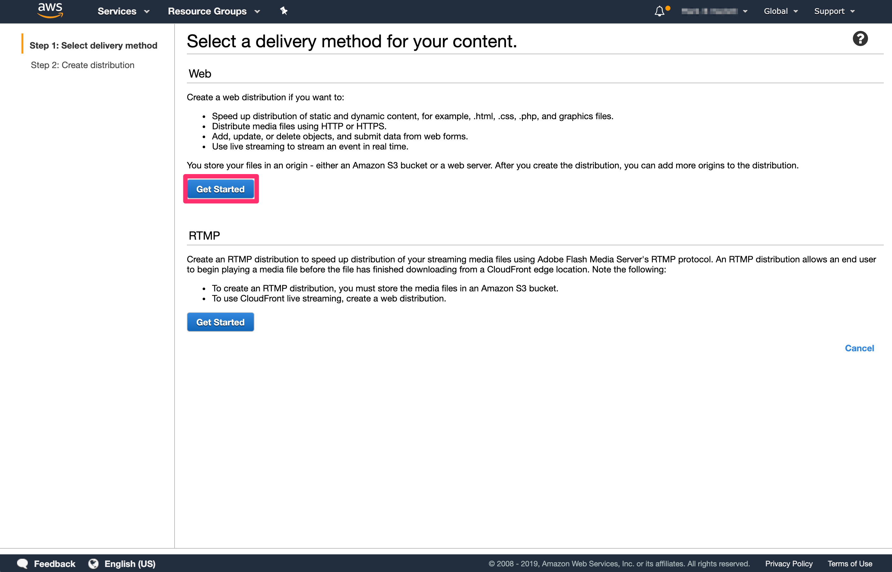
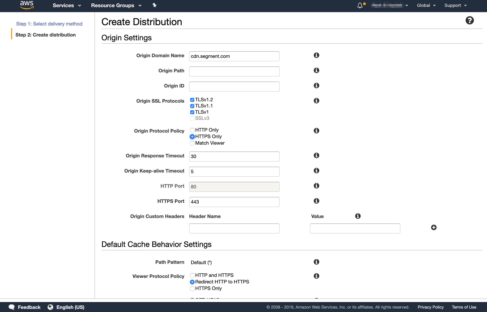

Custom domains allow you to proxy Analytics.js and proxy all tracking event requests through your domain.


## Prerequisites

To set up a custom domain, you need:

1. Access to your site DNS settings
2. A CDN you can serve assets from
3. Access to the CDN settings

This guide explains how to set up a custom domain in CloudFront. The same principles can be applied to almost any modern CDN that supports proxies.

You need to set up two important parts, regardless of the CDN provider you use:
- Proxy to Segment CDN (`cdn.segment.com`)
- Proxy to Segment tracking API (`api.segment.io`)

## Set up

Follow the directions listed for CloudFront or use your own CDN setup. Once you complete those steps and verify that your proxy works for both `cdn.segment.com` and `api.segment.io`, [contact Segment Product Support](https://segment.com/help/contact/) with the following template email:

```text
Hi,

This is {person} from {company}. I would like to request that you add a proxy for the following source(s) to point to the corresponding proxy url:

* Source {link to source in Segment} with source ID {source id} should point to {api host}
* Source {link to source in Segment} with source ID {source id} should point to {api host}
```

Double-check the source link, the Source ID, and the API proxy host to make sure they are correct. A member of our Success team will respond and set up the proxy for you.

## CloudFront

### CDN Proxy

First log in to AWS and navigate to CloudFront.


Click **Create Distribution**.

Select a delivery method for your content. Click **Get Started** in the **Web** section.



Next, configure the distribution settings. Under Origin Settings, update the following values:



<table>
  <tr>
    <td>**Field**</td>
    <td>**Value**</td>
    <td>**Description**</td>
  </tr>
  <tr>
   <td>Origin Domain Name</td>
   <td>`cdn.segment.com`</td>
   <td>The domain name you want the proxy to be served to</td>
  </tr>
  <tr>
   <td>Origin ID (optional)</td>
   <td>The Segment CDN</td>
   <td>A Description of the origin. This can be anything you want that describes the origin domain name.</td>
  </tr>
  <tr>
   <td>Origin Protocol Policy</td>
   <td>Set to `HTTPS Only`</td>
   <td></td>
  </tr>
  <tr>
   <td>Alternate Domain Names (CNAMEs)</td>
   <td>yourdomain.com</td>
   <td>Add the domain you are proxying to Segment here. If you don't do this you will get an error.</td>
  </tr>
</table>

Next, configure the **Default Cache Behavior Settings**.

<table>
  <tr>
    <td>**Field**</td>
    <td>**Value**</td>
    <td>**Description**</td>
  </tr>
  <tr>
   <td>Viewer Protocol Policy</td>
   <td>Redirect HTTP to HTTPS</td>
   <td>Ensure that all traffic goes through HTTPS</td>
  </tr>
  <tr>
   <td>Allowed HTTP Methods</td>
   <td>GET, HEAD, OPTIONS, PUT, POST, PATCH, DELETE</td>
   <td>Select which HTTP methods are allowed to be proxied.</td>
  </tr>
  <tr>
   <td>Forward Cookies</td>
   <td>All</td>
   <td>Ensure that cookies are forwarded.</td>
  </tr>
  <tr>
   <td>Query String Forwarding and Caching</td>
   <td>Forward all, cache based on all</td>
   <td>Ensure that all query string values are forwarded and properly cached.</td>
  </tr>
</table>

Click **Create Distribution** at the bottom of the page. This distribution displays as being "In Progress" until it finishes deploying.

You need the "Domain Name" for the next step, so keep this browser window open.

#### Add CNAME Record to DNS

Next, add a CNAME record to your DNS settings. Go to your domain registrar and add a new record to your DNS of type "CNAME".

<table>
  <tr>
    <td>**Field**</td>
    <td>**Value**</td>
  </tr>
  <tr>
    <td>Name</td>
    <td>{subdomain_name}.yourdomain.com</td>
  </tr>
  <tr>
    <td>Value</td>
    <td>CloudFront Distribution Domain Name</td>
  </tr>
</table>

Save your record. This might take some time to take effect, depending on your TTL settings. Try `curl`ing your domain to check if it is proxying correctly.

### Tracking API Proxy

Next, set up a proxy for the tracking API so that all calls are proxied through your domain. In this step, we set up a CloudFront distribution that's very similar to the previous step, with a few minor changes:

<table>
  <tr>
    <td>**Field**</td>
    <td>**Value**</td>
    <td>**Description**</td>
  </tr>
  <tr>
   <td>Origin Domain Name</td>
   <td>`api.segment.io`</td>
   <td>The domain name you would like the proxy to be served to</td>
  </tr>
</table>

#### Add CNAME Record to DNS

Next, add a CNAME record to your DNS settings. Go to your domain registrar and add a new record to your DNS of type "CNAME". This time use the CloudFront distribution for the tracking API proxy.

<table>
  <tr>
    <td>**Field**</td>
    <td>**Value**</td>
  </tr>
  <tr>
    <td>Name</td>
    <td>{subdomain_name}.yourdomain.com</td>
  </tr>
  <tr>
    <td>Value</td>
    <td>Tracking API CloudFront Distribution Domain Name</td>
  </tr>
</table>

Save your record. This might take some time to take effect, depending on your TTL settings. Try running `curl` on your domain to check if the proxy is working correctly.
