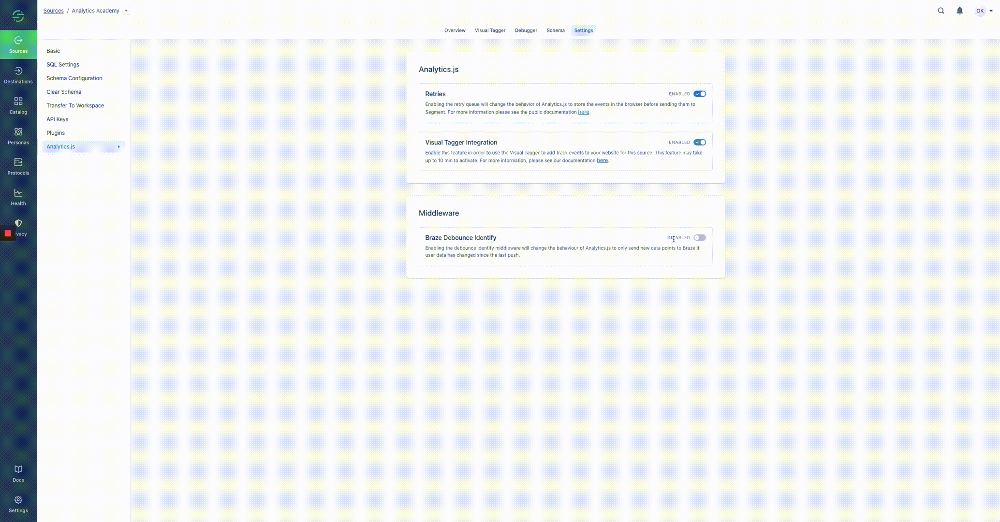

Analytics.js, Segment's Javascript source, makes it simple to send your data to any tool without having to learn, test or implement a new API every time.

## Getting Started

Head over to our [`analytics.js` QuickStart Guide](/docs/connections/sources/catalog/libraries/website/javascript/quickstart/) which walks you through adding Analytics.js to your site in just a few minutes. Once you've installed the library, read on for the detailed API reference!

## Identify

The `identify` method is how you associate your users and their actions to a recognizable `userId` and `traits`. You can see [an `identify` example in the guide](/docs/connections/sources/catalog/libraries/website/javascript/quickstart/#step-2-identify-users) or [find details on the identify method payload](/docs/connections/spec/identify/).

> note ""
> We recommend against using `identify` for anonymous visitors to your site. `analytics.js` automatically retrieves an `anonymousId` from localStorage or assigns one for new visitors. It is attached to all `page` and `track` events both before and after an `identify`.

`identify` method definition:

```js
analytics.identify([userId], [traits], [options], [callback]);
```

The `identify` call has the following fields:

<table>
  <tr>
    <td>`userId`</td>
    <td>optional</td>
    <td>String</td>
    <td>The database ID for the user. If you don't know who the user is yet, you can omit the `userId` and just record `traits`. You can read more about identities in the [identify reference](/docs/connections/spec/identify).</td>
  </tr>
  <tr>
    <td>`traits`</td>
    <td>optional</td>
    <td>Object</td>
    <td>A dictionary of traits you know about the user, like their `email` or `name`. You can read more about traits in the [identify reference](/docs/connections/spec/identify).</td>
  </tr>
  <tr>
    <td>`options`</td>
    <td>optional</td>
    <td>Object</td>
    <td>A dictionary of options. For example, [enable or disable specific destinations](#selecting-destinations) for the call. _Note: If you do not pass a *traits* object, pass an empty object (ie, '{}') before *options*_</td>
  </tr>
  <tr>
    <td>`callback`</td>
    <td>optional</td>
    <td>Function</td>
    <td>A function executed after a short timeout, giving the browser time to make outbound requests first.</td>
  </tr>
</table>


By default, traits are cached in the browser's local storage and attached to each subsequent `identify` call. For example, you might do that when someone signs up for a newsletter but hasn't yet created an account on your site:

Example `identify` with hard-coded information:
```js
analytics.identify({
  nickname: 'Amazing Grace',
  favoriteCompiler: 'A-0',
  industry: 'Computer Science'
});
```

and when the user completes signup:

```js
analytics.identify('12091906-01011992', {
  name: 'Grace Hopper',
  email: 'grace@usnavy.gov'
});
```

The traits object for the second call also includes `nickname`, `favoriteCompiler`, and `industry`.

You may omit both traits and options, and pass the callback as the second argument.

```js
analytics.identify('12091906-01011992', function(){
  // Do something after the identify request has been sent
  // Note: site-critical functionality should not depend on your analytics provider
});
```

## Track

The `track` method lets you record any actions your users perform. You can [see a track example in the guide](/docs/connections/sources/catalog/libraries/website/javascript/quickstart/#step-3-track-actions) or find details on [the track method payload](/docs/connections/spec/track).

`track` method definition:

```js
analytics.track(event, [properties], [options], [callback]);
```

The `track` call has the following fields:

<table>
  <tr>
    <td>`event`</td>
    <td></td>
    <td>String</td>
    <td>The name of the event you're tracking. You can read more about the [track method](/docs/connections/spec/track) and what event names we recommend.</td>
  </tr>
  <tr>
    <td>`properties`</td>
    <td>optional</td>
    <td>Object</td>
    <td>A dictionary of [properties](/docs/connections/spec/track#properties) for the event. If the event was `'Added to Cart'`, it might have properties like `price` and `productType`.</td>
  </tr>
  <tr>
    <td>`options`</td>
    <td>optional</td>
    <td>Object</td>
    <td>A dictionary of options. For example, [enable or disable specific destinations](#selecting-destinations) for the call. _Note: If you do not pass a *properties* object, pass an empty object (ie, '{}') before *options*_</td>
  </tr>
  <tr>
    <td>`callback`</td>
    <td>optional</td>
    <td>Function</td>
    <td>A function that is executed after a short timeout, giving the browser time to make outbound requests first.</td>
  </tr>
</table>

The only required argument to track in `analytics.js` is an event name string. You can read more about [how we recommend naming your events](/docs/connections/spec/track#event).

Example `track` call:

```js
analytics.track('Article Completed', {
  title: 'How to Create a Tracking Plan',
  course: 'Intro to Analytics',
});
```

For more information about choosing which events to track, event naming and more, check out [Analytics Academy](https://segment.com/academy/)

The only required argument to `track` in `analytics.js` is an `event` name string. Read more about how we recommend [naming your events](/docs/connections/spec/track#event).


## Page

The [`page`](/docs/connections/spec/page/) method lets you record page views on your website, along with optional extra information about the page being viewed.

Because some destinations require a `page` call to instantiate their libraries, **you must call `page`** at least once per page load!  You may call it more than once if needed, (eg, on virtual page changes in a single page app).

A `page` call is included by default as the final line in the `analytics.js` [snippet](/docs/connections/sources/catalog/libraries/website/javascript/quickstart/#step-1-copy-the-snippet). You may modify this `page` call within the guidelines below.

`page` method definition:

```js
analytics.page([category], [name], [properties], [options], [callback]);
```

The `page` call has the following fields:

<table>
  <tr>
    <td>`category`</td>
    <td>optional</td>
    <td>String</td>
    <td>The category of the page. Useful for cases like ecommerce where many pages might live under a single category. _Note: if you pass only one string to `page` it is assumed to be `name`. You **must** include a `name` to send a `category`._</td>
  </tr>
  <tr>
    <td>`name`</td>
    <td>optional</td>
    <td> String</td>
    <td>The name of the page.</td>
  </tr>
  <tr>
    <td>`properties`</td>
    <td>optional</td>
    <td> Object </td>
    <td>A dictionary of properties of the page. Note: `url`, `title`, `referrer` and `path` are collected automatically! Additionally this defaults to a `canonical url`, if available, and falls back to `document.location.href`.</td>
  </tr>
  <tr>
    <td>`options`</td>
    <td>optional</td>
    <td>Object</td>
    <td>A dictionary of options. For example, [enable or disable specific destinations](#selecting-destinations) for the call. _Note: If you do not pass a `properties` object, pass an empty object (ie, '{}') before `options`_ </td>
  </tr>
  <tr>
    <td>`callback`</td>
    <td>optional</td>
    <td>Function</td>
    <td>A function that is executed after a short timeout, giving the browser time to make outbound requests first.</td>
  </tr>
</table>


### Default Page Properties

A few properties are automatically added to each `page` call.

```js
analytics.page('Pricing');
```

We translate that to the following without any extra work from you:

```js
analytics.page('Pricing', {
  title: 'Segment Pricing',
  url: 'https://segment.com/pricing',
  path: '/pricing',
  referrer: 'https://segment.com/warehouses'
});
```

You can override these values. For example:

```js
analytics.page('Pricing', {
  title: 'My Overridden Title',
  path: '/pricing/view'
});
```
Translates to:

```js
analytics.page('Pricing', {
  title: 'My Overridden Title',
  url: 'https://segment.com/pricing',
  path: '/pricing/view',
  referrer: 'https://segment.com/warehouses'
});
```

## Group

The `group` method associates an [identified user](/docs/connections/sources/catalog/libraries/website/javascript/#identify) with a company, organization, project, workspace, team, tribe, platoon, assemblage, cluster, troop, gang, party, society or any other name you came up with for the same concept.

This is useful for tools like [Intercom](/docs/connections/destinations/catalog/intercom/), [Preact](/docs/connections/destinations/catalog/preact/) and [Totango](/docs/connections/destinations/catalog/totango/), as it ties the user to a **group** of other users.


`group` method definition:

```js
analytics.group(groupId, [traits], [options], [callback]);
```
The `group` call has the following fields:

<table>
  <tr>
    <td>`groupId`</td>
    <td></td>
    <td>String</td>
    <td>The Group ID to associate with the current user.</td>
  </tr>
  <tr>
    <td>`traits`</td>
    <td>optional</td>
    <td> Object</td>
    <td>A dictionary of [traits](/docs/connections/spec/group#traits) for the group. Example traits for a group include `address`, `website` and `employees`.</td>
  </tr>
  <tr>
    <td>`options`</td>
    <td>optional</td>
    <td>Object</td>
    <td>A dictionary of options. For example, [enable or disable specific destinations](#selecting-destinations) for the call. _Note: If you do not pass a `properties` object, pass an empty object (ie, '{}') before `options`_</td>
  </tr>
  <tr>
    <td>`callback`</td>
    <td>optional</td>
    <td>Function</td>
    <td>A function that is executed after a short timeout, giving the browser time to make outbound requests first.</td>
  </tr>
</table>


Example `group` call:

```js
analytics.group('UNIVAC Working Group', {
  principles: ['Eckert', 'Mauchly'],
  site: 'Eckert–Mauchly Computer Corporation',
  statedGoals: 'Develop the first commercial computer',
  industry: 'Technology'
});
```

By default, group `traits` are cached in the browser's local storage and attached to each subsequent `group` call, similar to `identify` method behavior.

Find more details about `group` including the **`group` payload** in our [Spec](/docs/connections/spec/group/).

## Alias

The `alias` method combines two previously unassociated user identities. Aliasing is generally handled automatically when you `identify` a user. However, some tools require an explicit `alias` call.

This is an advanced method, but it is required to manage user identities successfully in *some* of our destinations. Most notably, alias is necessary for properly implementing [KISSmetrics](/docs/connections/destinations/catalog/kissmetrics/#alias) and [Mixpanel](/docs/connections/destinations/catalog/mixpanel/#alias).

`alias` method definition:

```js
analytics.alias(userId, [previousId], [options], [callback]);
```

The `alias` call has the following fields:

<table>
  <tr>
    <td>`userId`</td>
    <td></td>
    <td>String</td>
    <td>The new user ID you want to associate with the user.</td>
  </tr>
  <tr>
    <td>`previousId`</td>
    <td>optional</td>
    <td>String</td>
    <td>The previous ID that the user was recognized by. This defaults to the currently identified user's ID.</td>
  </tr>
  <tr>
    <td>`options`</td>
    <td>optional</td>
    <td>Object</td>
    <td>A dictionary of options. For example, [enable or disable specific destinations](#selecting-destinations) for the call.</td>
  </tr>
  <tr>
    <td>`callback`</td>
    <td>optional</td>
    <td>Fucntion</td>
    <td>A function that is executed after a short timeout, giving the browser time to make outbound requests first.</td>
  </tr>
</table>

For more details about `alias`, including the **`alias` call payload**, check out our [Spec](/docs/connections/spec/alias/).

## Ready

The `ready` method allows you to pass in a callback that is called once all enabled destinations load, and once `analytics.js` finishes initializing. It's like jQuery's `ready` method, except for destinations.

`ready` is still invoked if a destination throws an error during initialization, such as due to an expired API key or incorrect settings configuration. Doing so prevents blocking code listening for the `ready` callback.

Code inside the `ready` function only executes after `ready` has been emitted.

If you would like to access end-tool library methods that do not match any `analytics.js` methods, like adding an extra setting to Mixpanel, you can use a ready callback so that you're guaranteed to have access to the Mixpanel object, like so:


```js
analytics.ready(function() {
  window.mixpanel.set_config({ verbose: true });
});
```

`ready` method definition:

```js
analytics.ready(callback);
```

The `ready` method has the following fields:

<table>
  <tr>
    <td>`callback` </td>
    <td>Function</td>
    <td>A function to be executed after all enabled destinations have loaded.</td>
  </tr>
</table>

## Querystring API

`analytics.js` can trigger track and identify events based on the URL querystring. This is helpful for tracking email click throughs, social media clicks, and digital advertising.

Here are the query parameters to use:

| param | description | triggers |
| ----- | ----------- | -------- |
|       |             |          |
| `ajs_uid` |  The userId to pass to an identify call. | This triggers an `identify` call. |
| `ajs_event` |The event name to pass to a track call. | This triggers a `track` call.  |
| `ajs_aid` |The anonymousId to set for the user.|This triggers an `analytics.user().anonymousId()` call.|
| `ajs_prop_<property>` | A property to pass to the track call | This won't implicitly trigger an event and is dependent on you also passing `ajs_event` - this property  be included in the resulting `track` call |
| `ajs_trait_<trait>` | A trait to pass to the identify call | This won't implicitly trigger any call and is dependent on you also passing `ajs_uid` - this trait is included in the resulting `identify` call |

So for example, this URL:

```text
http://segment.com/?ajs_uid=123456789abcd&ajs_event=Clicked%20Email&ajs_aid=abc123&ajs_prop_emailCampaign=First+Touch&ajs_trait_name=Karl+Jr.
```

would trigger the following events on the page:

```js
analytics.identify('123456789abcd', { name: 'Karl Jr.' });
analytics.track('Clicked Email', { 'emailCampaign': 'First Touch' });
analytics.user().anonymousId('abc123');
```

You can pass up to **one of each trigger parameter** as shown in the example above.


## Selecting Destinations

An `integrations` object may be passed in the `options` of `alias`, `group`, `identify`, `page` and `track` methods, allowing selective destination filtering. By default all destinations are enabled.

An example showing how to send a single message only to Intercom and Google Analytics:

```js
analytics.identify('user_123', {
  email: 'jane.kim@example.com',
  name: 'Jane Kim'
}, {
  integrations: {
    'All': false,
    'Intercom': true,
    'Google Analytics': true
  }
});
```

`'All': false` tells Segment not to send data to _any_ destinations by default, unless they're explicitly listed as `true` in the next lines.

Conversely, an example how to send a single message to all integrations **except** Intercom and Google Analytics:

```js
analytics.identify('user_123', {
  email: 'jane.kim@example.com',
  name: 'Jane Kim'
}, {
  integrations: {
    'Intercom': false,
    'Google Analytics': false
  }
});
```

It is not necessary to include `'All': true` in this call, as that is the default behavior. Instead, only specify which destinations should be excluded with a `false` flag for each.

Destination flags are **case sensitive** and match [the destination's name in the docs](/docs/connections/destinations/) (i.e. "AdLearn Open Platform", "awe.sm", "MailChimp", etc.).

**NOTE:** Available at the business plan level, filtering `track` calls can be done right from the Segment UI on your source schema page. We recommend using the UI if possible since it's a much simpler way of managing your filters and can be updated with no code changes on your side.

## Load Options

The `.load` method in analytics.js (the second line of the snippet) can also be modified to take a second argument. If you pass an object with an `integrations` dictionary (matching the format [above](#selecting-destinations)), then we only load the integrations in that dictionary that are marked as enabled with the boolean value `true`.

**IMPORTANT:** In order to use this feature, make sure that you have a snippet version 4.1.0 or higher. You can get the latest version of the snippet [here](https://segment.com/docs/connections/sources/catalog/libraries/website/javascript/quickstart/#step-1-copy-the-snippet)

An example:

```js
analytics.load('writekey', { integrations: { All: false, 'Google Analytics': true, 'Segment.io': true } })
```

This way, you can conditionally load integrations based on what customers opt into on your site.

A pseudocode example:

```js
onConsentDialogClosed(function(consentedTools){
  analytics.load('writekey', { integrations: consentedTools })
})
```

## User & Group Information

Once `analytics.js` loads, executing the `user` or `group` method functions returns information about the currently identified user or group.

**Note:** To ensure these methods are available, wrap any reference to `user()` or `group()` in a [ready function block](https://segment.com/docs/libraries/analytics.js/#ready).

Examples:

```js
analytics.ready(function() {

  var user = analytics.user();
  var id = user.id();
  var traits = user.traits();

});
```

```js
analytics.ready(function() {

  var group = analytics.group();
  var id = group.id();
  var traits = group.traits();

});
```


### Clearing Traits

Passing an empty object to the `traits` object clears all cached traits for a User or Group.
Remember, `traits` are cached by default by `identify` and `group` methods. You can clear the `traits` object for the user or group by passing `traits` an empty object:

```js
analytics.user().traits({});
```
```js
analytics.group().traits({});
```


### Reset / Logout

Calling `reset` resets the `id`, including anonymousId, and clear `traits` for the currently identified user and group.

```js
analytics.reset();
```

The `reset` method only clears the cookies and `localStorage` created by Segment. It does not clear data from other integrated tools, as their native libraries might set their own cookies to manage user tracking, sessions, and manage state. To completely clear out the user session, see the documentation provided by those tools.

Segment does not share `localStorage` across subdomains. If you use Segment tracking on multiple subdomains, you must call `analytics.reset()` for each subdomain to completely clear out the user session.


## Cross-Subdomain Analytics

Analytics.js tracks across subdomains out of the box; all of our destinations fully support this feature.


## Anonymous ID

`analytics.js` generates a UUID and sets this as `anonymousId` for all new visitors to your site.

Example:
```js
ajs_anonymous_id=%2239ee7ea5-b6d8-4174-b612-04e1ef3fa952
```


### Retrieving the Anonymous ID

Retrieve the of the current user `anonymousId`:

```js
analytics.user().anonymousId();
```

**NOTE:** If an `anonymousId` is `null`, calling the above function automatically sets the new `anonymousId`.


### Setting the Anonymous ID

Override the assigned `anonymousId` for the current user:

```js
analytics.user().anonymousId('ABC-123-XYZ');
```

Or in the `options` object of [`identify`](/docs/connections/spec/identify), [`page`](/docs/connections/spec/page), or [`track`](/docs/connections/spec/track) calls, like this:

```js
analytics.identify('user_123', {
  name: 'Jane Kim'
}, {
  anonymousId: 'ABC-123-XYZ'
});
```
```js
analytics.page({}, { anonymousId: 'ABC-123-XYZ' });
```
```js
analytics.track('Email Clicked', {
  callToAction: 'Signup'
}, {
  anonymousId: 'ABC-123-XYZ'
});
```

You can also set the `anonymousId` immediately inside your Segment snippet, even before the `ready` method has returned:

 ```js
  analytics.load('writekey');
  analytics.page();
  analytics.setAnonymousId('ABC-123-XYZ');
```

Keep in mind that setting the `anonymousId` in `analytics.js` does not overwrite the anonymous tracking IDs for any destinations you're using.


### Refreshing the Anonymous ID

A user's `anonymousId` refreshes on any of the following conditions:

* A user clears their cache or cookies
* [`analytics.reset()`](/docs/connections/sources/catalog/libraries/website/javascript//#reset-logout) is called during in the user's browser session
* `analytics.identify()` is called with a userId that differs from the current userId


## Debug

Calling the `debug` method turns on debug mode, logging helpful messages to the console. You'll have to refresh the page after invoking `debug` to see the messages.

Enable:
```js
analytics.debug();
```

Disable:
```js
analytics.debug(false);
```


## Emitter

The global `analytics` object emits events whenever you call `alias`, `group`, `identify`, `track` or `page`.
Using the `on` method You can set listeners for these events and run your own custom code. Useful for sending data to a service for which Segment does not have an destination.

```js
analytics.on(method, callback);
```

<table>
  <tr>
    <td>`method` </td>
    <td>String</td>
    <td>Name of the method to listen for</td>
  </tr>
  <tr>
    <td>`callback` </td>
    <td>Function</td>
    <td>A function to execute after each the emitted method, taking three arguments: `event`, `properties`, `options`</td>
  </tr>
</table>

Example:

```js
analytics.on('track', function(event, properties, options) {

  bigdataTool.push(['recordEvent', event]);

});
```

Note that this emits events before they are processed by the Segment integration, and may not include some of the normalization we do on the client before uploading the data to Segment's servers.

> note ""
> **Note:** Page event properties are stored in the `options` object.

### Track Link

`trackLink` is a helper method that attaches the `track` call as a handler to a link.
With `trackLink` a small timeout (300 ms) is inserted to give the `track` call more time. This is useful when a page would redirect before the `track` method could complete all requests.

`trackLink` method definition:

```js
analytics.trackLink(element, event, [properties])
```

<table>
  <tr>
    <td>`element(s)` </td>
    <td>Element or Array</td>
    <td>DOM element to be bound with `track` method. You may pass an array of elements or jQuery objects. _Note: This must be an element, **not** a CSS selector._</td>
  </tr>
  <tr>
    <td>`event` </td>
    <td>String or Function</td>
    <td>The name of the event, passed to the `track` method. Or a **function** that returns a string to be used as the name of the `track` event.</td>
  </tr>
  <tr>
    <td>`properties` optional</td>
    <td>Object or Function</td>
    <td>A dictionary of properties to pass with the track method. Or a **function** that returns an object to be used as the `properties` of the event.</td>
  </tr>
</table>

Example:

```js
var link = document.getElementById('free-trial-link');

analytics.trackLink(link, 'Clicked Free-Trial Link', {
  plan: 'Enterprise'
});
```


### Track Form

`trackForm` is a helper method that binds a `track` call to a form submission.
With `trackForm` a small timeout (300 ms) is inserted to give the `track` call more time. Useful when a page would redirect before the `track` method can complete all requests.

```js
analytics.trackForm(form, event, [properties])
```

<table>
  <tr>
    <td>`form(s)` Element or Array</td>
    <td>Element or Array</td>
    <td>The form element to track or an array of form elements or jQuery objects. _Note: trackForm takes an element, not a CSS selector._</td>
  </tr>
  <tr>
    <td>`event` </td>
    <td>String or Function</td>
    <td>The name of the event, passed to the `track` method. Or a **function** that returns a string to be used as the name of the `track` event.</td>
  </tr>
  <tr>
    <td>`properties` optional</td>
    <td>Object or Function</td>
    <td>A dictionary of properties to pass with the track method. Or a **function** that returns an object to be used as the `properties` of the event.</td>
  </tr>
</table>

Example:

```js
var form = document.getElementById('signup-form');

analytics.trackForm(form, 'Signed Up', {
  plan: 'Premium',
  revenue: 99.00
});
```

## Extending Timeout

The `timeout` method sets the length (in milliseconds) of the callbacks and helper functions:

```js
analytics.timeout(500);
```

Set the timeout to 500ms. This is helpful if you have multiple scripts that need to fire in your callback or `trackLink`, `trackForm` helper function. We recommend extending to 500ms if you're triggering ad network conversion pixels since those are often a bit slower to load.


## Performance

The `analytics.js` library and all of the destination libraries are loaded with the [HTML script `async` tag](https://developer.mozilla.org/en-US/docs/Web/HTML/Element/script#attr-async). This also means that Segment methods are fired asynchronously, so you should adjust your code accordingly if you require that events be sent from the browser in a particular order.

While many tools require access to the DOM or cookies, for our Zendesk, Salesforce, and MailChimp destinations, we do not load a native Javascript library! Instead data is sent from Segment's servers to the end-tools. We aim to expand on this front in the future.

Only the libraries required for your **enabled** destinations are loaded. Whenever an destination is disabled, the custom version of `analytics.js` stops requesting that library.

Using `analytics.js` does not offer a _huge_ performance benefit, but it is more performant than installing each of the destinations individually. And as more destinations move server-side, you'll receive more performance benefits automatically.

One option, if you don't want to use any bundled 3rd-party tools, is to use our browserify'd [analytics-node](https://github.com/segmentio/analytics-node) package.

### Bundle size

Segment's javascript snippet ([Analytics.js](https://segment.com/docs/connections/sources/catalog/libraries/website/javascript/)) has minimal impact on the size of the pages, and only increases the page size by about 1.1KB.

However, the snippet then asynchronously requests and loads a customized javascript bundle (`analytics.min.js`), which contains the code and settings needed to load your device-mode destinations. Because of this, the file size can vary depending on how many and which destinations you enable. Without any destinations, the `analytics.min.js` file is about 62KB. Each time you enable a destination, it can slightly increase the size of this file.

## Retries

When enabled, analytics.js automatically retries network and server errors. With persistent retries, analytics.js can:
* Support offline tracking. analytics.js queues your events and delivers them when the user comes back online.
* Better handle network issues. If there happens to be a time where your application can't connect to Segment's API, we'll continue to store the events on the browser to ensure you don't lose any data.

Analytics.js stores events in localStorage (falling back to in-memory storage when localStorage is unavailable), and retries up to 10 times with an incrementally increasing backoff between each retry. Analytics.js queues up to 100 events at a time to avoid using too much of the device's local storage. You can see more details about the retry logic [here](/docs/connections/destinations/#retries).

## Anonymizing IP

We collect IP address for client-side (iOS, Android, `analytics.js` and Xamarin) events automatically.

Passing a value for `options.context.ip` prevents our server from recording the IP address associated with the request.

Example:

```js
  analytics.track("Order Completed", {}, { context: { ip: "0.0.0.0" }});
```

## Middleware

Middlewares allow developers to extend Analytics.js with custom code which runs on every event. This code has full access to the DOM and Browser API, and helps customers enrich and transform event payloads.

Analytics.js can be extended using two functions:

```js
addSourceMiddleware(middleware)
addDestinationMiddleware(targetIntegration, [middleware1, middleware2, ...])
```

The first function (Source Middleware) allows you to manipulate the payload and filter events on a per-source basis, while the second function (Destination Middleware) allows this on a per destination basis. Middlewares run in the browser.

### Using Source Middlewares

The function signature for creating Source Middleware has three parameters:

```js
function({payload, next, integrations}){};
```

- `payload` represents the event payload sent by Analytics.js. To change the value of the `payload`, mutate the `payload.obj` object. (See the example below.)
- `next` represents the next function to be called in the source middleware chain. If the middleware provided does not call this function, the event is dropped on the client and is not delivered to Segment or any destinations.
- `integrations` is an array of objects representing all the integrations that the payload is sent to. If an integration in this array is set to a ‘falsey’ value then the event is not be sent to the Integration.

```js
var SMW1 = function({ payload, next, integrations }) {
  payload.obj.pageTitle = document.title;
  next(payload);
};
```

### Using Destination Middlewares

The function signature for creating Destination Middleware also has three parameters:

```js
function({payload, next, integration}){}
```

- `payload` represents the event payload sent by Analytics.js. To change the value of the `payload`, mutate the `payload.obj` object. (See the example below.)
- `next` represents the next function to be called in the destination middleware chain. If the middleware provided does not call this function, then the event is dropped completely for the given destination.
- `integration` is a string value representing the integration that this middleware is applied to.

```js
var DMW1 = function({ payload, integration, next }) {
  delete payload.obj.pageTitle;
  next(payload);
};
```

### Adding middlewares to Analytics.js

The above defined Source & Destination Middleware can be added to the Analytics.js execution chain as:

```js
analytics.addSourceMiddleware(SMW1);
analytics.addDestinationMiddleware('integrationA', [DMW1]);
```


You can call the `.addSourceMiddleware(fn)` multiple times, and the order of operations reflects the order in which you register your Source Middleware.

Both `.addSourceMiddleware(fn)` and `.addDestinationMiddleware('integration', [fn, ...])` can be called before [`.load()`](/docs/connections/sources/catalog/libraries/website/javascript/#load-options).

### Braze Middleware

If you use the Braze (Appboy) destination in either [cloud or device mode](/docs/connections/destinations/#connection-modes) you can save Braze costs by "debouncing" duplicate `identify()` calls from Segment by adding our [open-source Middleware tool](https://github.com/segmentio/segment-braze-mobile-middleware) to your implementation.
This optional middleware is disabled by default. When enabled, it ensures that only events where at least one changed trait value are sent to Braze, and events with duplicate traits are not sent.

To enable this Middleware for a Javascript or Project source, go to `Analytics.js` in your source settings.


More information about this tool and how it works [is available in the project's README](https://github.com/segmentio/segment-braze-mobile-middleware/blob/master/README.md#how-does-this-work).

## Proxy

To use a proxy server with analytics.js, you'll first want to update the address in the snippet to use your own host instead of `cdn.segment.com`. Secondly, you'll need to write in to our support to change the endpoint we send events to from `api.segment.io` to your proxy instead. Make sure that your proxy behaves exactly like our real APIs. You can use our [proxy server](https://github.com/segmentio/segment-proxy) as an example of a correctly working proxy.

## Plugins

Segment offers 'plugins' across multiple video players that can quickly get you started collecting video events via analytics.js. Check out the specific links below for more information:

- [Youtube](/docs/connections/sources/catalog/libraries/website/plugins/youtube)
- [Vimeo](/docs/connections/sources/catalog/libraries/website/plugins/vimeo)

## Context & Traits

Within the `options` dictionary, a sub-dictionary, `context`, exists. The context dictionary captures various data automatically depending on the event type and what your source type is. You can read more about the context dictionary [here](https://segment.com/docs/connections/spec/common/#context). Within context is an optional `traits` dictionary that contains traits about the current user. This is useful for associating information about a user from previous identify calls to a track or page event.

Consider this identify event:

```js
analytics.identify('12091906-01011992', {
    plan_id: 'Paid, Tier 2'
    email: 'grace@usnavy.gov'
});
```

The traits on this event are `plan_id`. If you want these traits to appear on a subsequent track or page event that this user triggers, you can get this association by passing those traits into `context.traits` as follows:

```js
analytics.track('Clicked Email', {
  	emailCampaign: 'First Touch'
  },
  {
    traits: {
      plan_id: 'Paid, Tier 2'
    }
  }
);
```

This would append the `plan_id` trait to this track, but not name or email since they do not exist in context. This must be done for every susbequent event you want these traits to appear on.

**Note:** information in `context.traits` does _not_ appear in your downstream tools (eg, Salesforce, Mixpanel, Google Analytics, etc.); however, this data does appear in your warehouses and raw data tools (eg, RedShift, Postgres, Amazon S3, Tray.io, etc).

## Segment ID Persistence
In order to ensure high fidelity, first-party customer data, we persist the Segment ID to local storage and use it as the Segment ID on the cookie whenever possible. Local Storage is meant for storing this type of first-party customer information.

If a user comes back to your site after a cookie has expired, Analytics.js checks localStorage to see if an ID exists, and resets it as the user's ID in the cookie. If a user clears their cookies and localstorage, all of the IDs are removed.

## Troubleshooting

The console reveals all! [Learn how to access the Javascript console in each browser](#how-do-i-open-the-javascript-console-in-your-debugger-).
Any `analytics.js` methods may be executed manually. Use the Network tab to inspect requests.

### Are you loading `analytics.js`?

Open the Javascript console and enter `analytics`. Does it return an object, as seen below?


The object means that you are successfully loading `analytics.js` onto your website. If you get an `undefined` error, `analytics.js` is not loading successfully:


Solution: [Follow the `analytics.js` Quickstart Guide](/docs/libraries/analytics.js/quickstart/)

### Are you loading two instances of `analytics.js`?

Note that you *cannot* load `analytics.js` twice on the same page, even if you're using different write keys. You might encounter `Uncaught RangeError: Maximum call stack size exceeded`. You can conditionally set the write key based on an environment variable.

Example:
```js
var writeKey;
ENV === 'production' ? writeKey = 'A' : writeKey = 'B';
```

### Do you see events appear in your debugger?

When you reload the page, does your debugger show a new [`page`](/docs/connections/spec/page) and an [`identify`](/docs/connections/spec/identify) call? You can also check the Javascript console in the browser and manually fire an `identify` call as such, which would show up in the debugger.


If the call doesn't appear in the debugger, open up the Javascript console and check the Network tab to see if the outbound web services requests are being initiated:


In the above, the `p` is a [`page`](/docs/connections/spec/page) call and the `i` is an [`identify`](/docs/connections/spec/identify) call. If you don't at least see the `p`, then check if you are loading `analytics.js` correctly.


### Is data being transmitted to your third-party destinations?

Some destinations send data directly from the website to their servers. You can check the Network tab in your Javascript console to see the outbound web services requests being initiated.

In the below image, we use Google Analytics as an example. Our `page` call forms an outbound request that looks like this:


If this outbound request is not showing up in the network when you fire an `identify` call, then check the following:

### Do you have any ad blockers enabled in your browser?

Segment and many destination partners use cookies/local storage to store information about users in the browser. Ad blockers prevent cookies and other data these tools rely on to make valid analytics requests. Some portion of your users are probably using ad blockers, which prevent the Segment script from fully executing. Both desktop and mobile browsers are impacted.

One particular issue is Safari private browsing mode which allows analytics.js identify calls to be made, but the traits object is stripped from the call. This results in identify calls missing email address and other traits.

### Internet Explorer Support

We guarantee support for Internet Explorer 9 and higher for analytics.js. Keep in mind that different tools may have different compatibility guarantees for their own products. Refer to the vendor's documents to see what their browser compatibility looks like.

### Is your web site deployed under a domain on the Public Suffix List?

The [Public Suffix List](https://publicsuffix.org/list/) is a catalog of certain Internet effective top-level domains--enumerating all domain suffixes controlled by registrars.

The implications of these domain suffixes is that first party cookies cannot be set on them. Meaning, foo.example.co.uk can share cookie access with bar.example.co.uk, but example.co.uk should be walled off from cookies at example2.co.uk. The latter two domains could be registered by different owners.

Examples of domains on the Public Suffix List that are common in troubleshooting include:

- *.github.io
- *.herokuapp.com
- *.appspot.com


### How do I open the Javascript console in your debugger?

The Javascript console reveals all requests, outbound and inbound, to your browser. Additionally, you may execute valid Javascript.

- **Chrome**: `COMMAND+OPTION+J` (Mac) or `CTRL+SHIFT+J` (Windows).
- **Firefox**: `COMMAND+OPTION+K` (Mac) or `CTRL+SHIFT+K` (Windows) and then click on the **Console** tab.
- **Safari**: `COMMAND+OPTION+I` (Mac) or `CTRL+ALT+I` (Windows) and then click on the **Console** tab.
- **IE**: `F12` and then click on the **Console** tab.

### Is there a size limit on requests?

Yes, 32KB per message.

### If `analytics.js` fails to load, are callbacks not fired?

In the event that `analytics.js` does not load, callbacks passed into your API calls do not fire. This is as designed, because the purpose of callbacks are to provide an estimate that the event was delivered and if the library never loads, the events won't be delivered.

### Why do I see a network request to `/m`?
In May 2018, we're rolling out a change to analytics.js that allows us to collect client side performance metrics in analytics.js. This includes metrics such as:

- When client side integrations are initialized and when they fail
- When messages are sent to client side integrations and when they fail

We added these metrics so that we can proactively identify and resolve issues with individual client-side integrations. These metrics are connected to alerts that notify our on-call engineers so we can take action on these quickly.

There should be no noticeable impact to your data flow. You may notice analytics.js make an extra network request in the network tab to carry the metrics data to our servers. This should be very infrequent since the data is sampled and batched every 30 seconds, and should not have any impact of website performance.

### How are properties with `null` and `undefined` values treated?
We use the [`JSON.stringify()`](https://developer.mozilla.org/en-US/docs/Web/JavaScript/Reference/Global_Objects/JSON/stringify) method under the hood. Property values set to `null` or `undefined` are treated in accordance with the expected behaviour for the standard method:

```js
console.log(JSON.stringify({ x: null, y: 6 }));
// expected output: "{"x":null,"y":6}"

console.log(JSON.stringify({ x: undefined, y: 6 }));
// expected output: "{"y":6}"
```

### Known Issues:

[Review and contribute to these on Github](https://github.com/segmentio/analytics.js/issues)
