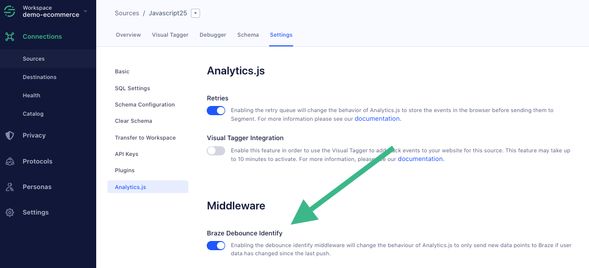

Middlewares allow developers to extend Analytics.js with custom code which runs on every event. This code has full access to the DOM and Browser API, and helps customers enrich and transform event payloads. Source Middlewares and Destination Middlewares are available on the Analytics.js snippet version `4.12.0` and later.

Analytics.js can be extended using two functions:

```js
addSourceMiddleware(middleware)
addDestinationMiddleware(targetIntegration, [middleware1, middleware2, ...])
```

The first function (Source Middleware) allows you to manipulate the payload and filter events on a per-source basis, while the second function (Destination Middleware) allows this on a per destination basis. Middlewares run in the browser.

> info ""
> **Note**: Destination-middleware only act on [data sent to destinations in device-mode](/docs/connections/destinations#connection-modes). Since the destination middleware code exists in your app or project, it cannot transform the data sent from the Segment servers to the destination endpoint.

## Using Source Middlewares

The function signature for creating Source Middleware has three parameters:

```js
function({payload, next, integrations}){};
```

- `payload` represents the event payload sent by Analytics.js. To change the value of the `payload`, mutate the `payload.obj` object. (See the example below.)
- `next` represents the next function to be called in the source middleware chain. If the middleware provided does not call this function, the event is dropped on the client and is not delivered to Segment or any destinations.
- `integrations` is an array of objects representing all the integrations that the payload is sent to. If an integration in this array is set to a ‘falsey' value then the event is not be sent to the Integration.

```js
var SMW1 = function({ payload, next, integrations }) {
  payload.obj.pageTitle = document.title;
  next(payload);
};
```

## Using Destination Middlewares

The function signature for creating Destination Middleware also has three parameters:

```js
function({payload, next, integration}){}
```

- `payload` represents the event payload sent by Analytics.js. To change the value of the `payload`, mutate the `payload.obj` object. (See the example below.)
- `next` represents the next function to be called in the destination middleware chain. If the middleware provided does not call this function, then the event is dropped completely for the given destination.
- `integration` is a string value representing the integration that this middleware is applied to.

```js
var DMW1 = function({ payload, integration, next }) {
  delete payload.obj.pageTitle;
  next(payload);
};
```

> info ""
> **Note**: Destination-middleware only act on [data sent to destinations in device-mode](/docs/connections/destinations#connection-modes). Since the destination middleware code exists in your app or project, it cannot transform the data sent from the Segment servers to the destination endpoint.

## Adding middlewares to Analytics.js

The above defined Source & Destination Middleware can be added to the Analytics.js execution chain as:

```js
analytics.addSourceMiddleware(SMW1);
analytics.addDestinationMiddleware('integrationA', [DMW1]);
```


You can call the `.addSourceMiddleware(fn)` multiple times, and the order of operations reflects the order in which you register your Source Middleware.

Both `.addSourceMiddleware(fn)` and `.addDestinationMiddleware('integration', [fn, ...])` can be called before [`.load()`](/docs/connections/sources/catalog/libraries/website/javascript/#load-options).

## Braze Middleware

If you use the Braze (Appboy) destination in either [cloud or device mode](/docs/connections/destinations/#connection-modes) you can save Braze costs by "debouncing" duplicate `identify()` calls from Segment by adding our [open-source Middleware tool](https://github.com/segmentio/segment-braze-mobile-middleware) to your implementation.
This optional middleware is disabled by default. When enabled, it ensures that only events where at least one changed trait value are sent to Braze, and events with duplicate traits are not sent.

To enable this Middleware for a JavaScript or Project source, go to `Analytics.js` in your source settings.



More information about this tool and how it works [is available in the project's README](https://github.com/segmentio/segment-braze-mobile-middleware/blob/master/README.md#how-does-this-work).
