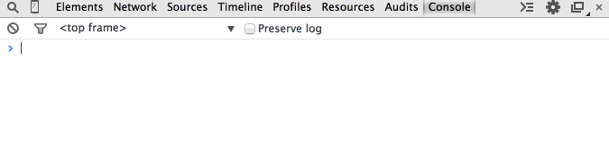
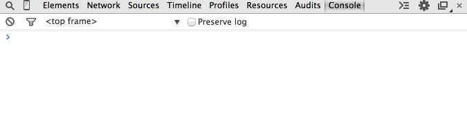
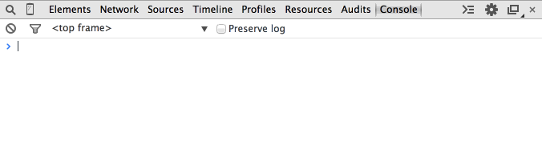
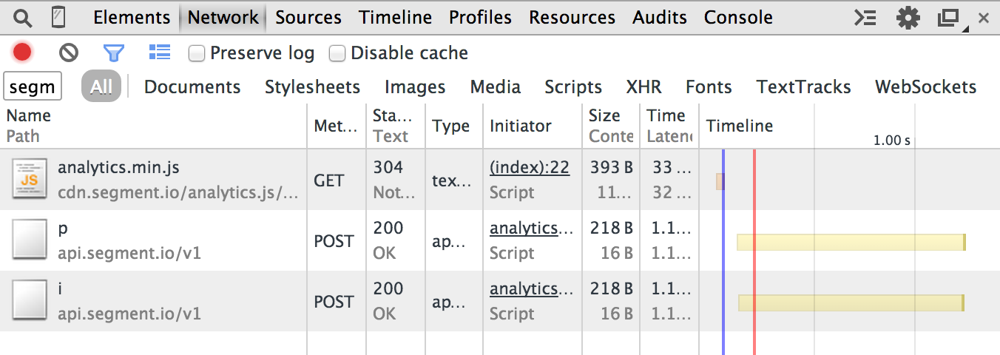
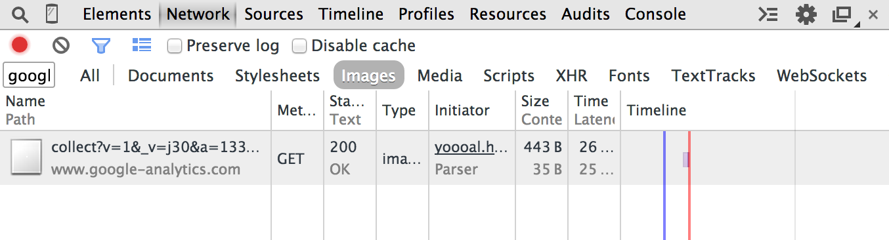

The console reveals all. [Learn how to access the JavaScript console in each browser](#how-do-i-open-the-javascript-console-in-your-debugger).
Any Analytics.js methods may be executed manually. Use the Network tab to inspect requests.

## Are you loading Analytics.js?

Open the JavaScript console and enter `analytics`. Does it return an object, as seen below?



The object means that you are successfully loading Analytics.js onto your website. If you get an `undefined` error, Analytics.js is not loading successfully:



Solution: [Follow the Analytics.js Quickstart Guide](/docs/connections/sources/catalog/libraries/website/javascript/quickstart/)

## Are you loading two instances of Analytics.js?

Note that you *cannot* load Analytics.js twice on the same page, even if you're using different write keys. You might encounter `Uncaught RangeError: Maximum call stack size exceeded`. You can conditionally set the write key based on an environment variable.

Example:
```js
var writeKey;
ENV === 'production' ? writeKey = 'A' : writeKey = 'B';
```

## Do you see events appear in your debugger?

When you reload the page, does your debugger show a new [`page`](/docs/connections/spec/page) and an [`identify`](/docs/connections/spec/identify) call? You can also check the JavaScript console in the browser and manually fire an `identify` call as such, which would show up in the debugger.



If the call doesn't appear in the debugger, open up the JavaScript console and check the Network tab to see if the outbound web services requests are being initiated:



In the above, the `p` is a [`page`](/docs/connections/spec/page) call and the `i` is an [`identify`](/docs/connections/spec/identify) call. If you don't at least see the `p`, then check if you are loading Analytics.js correctly.


## Is data being transmitted to your third-party destinations?

Some destinations send data directly from the website to their servers. You can check the Network tab in your JavaScript console to see the outbound web services requests being initiated.

In the below image, we use Google Analytics as an example. Our `page` call forms an outbound request that looks like this:



If this outbound request is not showing up in the network when you fire an `identify` call, then check the following:


## Is your web site deployed under a domain on the Public Suffix List?

The [Public Suffix List](https://publicsuffix.org/list/) is a catalog of certain Internet effective top-level domains, enumerating all domain suffixes controlled by registrars.

The implications of these domain suffixes is that first party cookies cannot be set on them. Meaning, `foo.example.co.uk` can share cookie access with `bar.example.co.uk`, but `example.co.uk` should be walled off from cookies at `example2.co.uk`. The latter two domains could be registered by different owners.

Examples of domains on the Public Suffix List that are common in troubleshooting include:

- `*.github.io`
- `*.herokuapp.com`
- `*.appspot.com`


## How do I open the JavaScript console in your debugger?

The JavaScript console reveals all requests, outbound and inbound, to your browser. Additionally, you may execute valid JavaScript.

- **Chrome**: `COMMAND+OPTION+J` (Mac) or `CTRL+SHIFT+J` (Windows).
- **Firefox**: `COMMAND+OPTION+K` (Mac) or `CTRL+SHIFT+K` (Windows) and then click on the **Console** tab.
- **Safari**: `COMMAND+OPTION+I` (Mac) or `CTRL+ALT+I` (Windows) and then click on the **Console** tab.
- **IE**: `F12` and then click on the **Console** tab.

## Is there a size limit on requests?

Yes, 32KB per message.

## If Analytics.js fails to load, are callbacks not fired?

In the event that Analytics.js does not load, callbacks passed into your API calls do not fire. This is as designed, because the purpose of callbacks are to provide an estimate that the event was delivered and if the library never loads, the events won't be delivered.

## Why do I see a network request to `/m`?
In May 2018, we rolled out a change to Analytics.js that allows us to collect client side performance metrics in Analytics.js. This includes metrics such as:

- When client side integrations are initialized and when they fail
- When messages are sent to client side integrations and when they fail

We added these metrics so that we can proactively identify and resolve issues with individual client-side integrations. These metrics are connected to alerts that notify our on-call engineers so we can take action on these quickly.

There should be no noticeable impact to your data flow. You may notice Analytics.js make an extra network request in the network tab to carry the metrics data to our servers. This should be very infrequent since the data is sampled and batched every 30 seconds, and should not have any impact of website performance.

## How are properties with `null` and `undefined` values treated?
We use the [`JSON.stringify()`](https://developer.mozilla.org/en-US/docs/Web/JavaScript/Reference/Global_Objects/JSON/stringify) method under the hood. Property values set to `null` or `undefined` are treated in accordance with the expected behaviour for the standard method:

```js
console.log(JSON.stringify({ x: null, y: 6 }));
// expected output: "{"x":null,"y":6}"

console.log(JSON.stringify({ x: undefined, y: 6 }));
// expected output: "{"y":6}"
```

## Why am I seeing a "SameSite" warning?

If you see a warning like the following, it could have one of several causes:
"A cookie associated with a cross-site resource at http://segment.com/ was set without the `SameSite` attribute [...]"

Segment correctly sets cookies with the 'SameSite' attribute with Analytics.js.

If you see this warning, it is because you previously visited http://segment.com, and are getting the warning due to unrelated cookies. To verify that this is the issue, visit your page in Incognito Mode and confirm that the warning no longer occurs. Your users won't see this warning unless they _also_  visited http://segment.com.


### Can I overwrite the context fields?

Yes.  This can be useful if some of these fields contain information you don't want to collect.

For example, imagine that your website allows users to view a receipt for purchases at the URL `https://mywebsite.com/store/purchases`.  Your users click a link that redirects to that specific URL, your app sets a `receiptId` in the query string, and returns the appropriate receipt.  You also send a Track call to Segment from this page.

Since this `receiptId` might contain sensitive information, you can prevent the context field `page.url` from being included in your Track call by overwriting the field in the `options` parameter, as in the example below:

```js
analytics.track("Receipt Viewed", {}, {
    page: {
        url: null
    }
})
```

This works for any [context field](/docs/connections/spec/common/#context) that Segment automatically collects.

## Known Issues:

[Review and contribute to these on GitHub](https://github.com/segmentio/analytics.js/issues)
