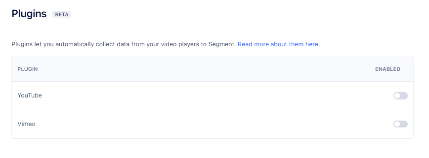

With the analytics.js Vimeo Plugin you can easily collect Vimeo player events into the Segment ecosystem.

## Getting Started
To use the Vimeo plugin:

1. Generate an access token in Vimeo. The plugin uses this token to access metadata about the video content being played. Vimeo provides documentation to generate the access token [here](https://developer.vimeo.com/api/guides/start#generate-access-token).
- **Note:** Make sure to carefully select your access scopes. The plugin only needs to read information about your video(s).

2. Enable a new plugin by navigating to the settings for your Source and clicking **Plugins**. You can enable the Vimeo plugin from this menu:

    

3. Initialize the plugin by entering your Vimeo access token and granting it access to the Vimeo video player instance(s) running on the page. Use this initialize method:

```
<iframe src="https://player.vimeo.com/video/76979871" width="640" height="360" frameborder="0" webkitallowfullscreen mozallowfullscreen allowfullscreen></iframe>
<script src="https://player.vimeo.com/api/player.js"></script>
<script>
    var iframe = document.querySelector('iframe');
    var player = new Vimeo.Player(iframe);
    analytics.ready(function () {
      var VimeoAnalytics = window.analytics.plugins.VimeoAnalytics
      var vimeoAnalytics = new VimeoAnalytics(player, 'XXXXXXXXXXXXXXXXXXXXXXXXXXXX0365')
      vimeoAnalytics.initialize()
    })
</script>
```
That's it! The plugin listens to the Vimeo player for events, and responds by firing the corresponding [Segment Video Spec](https://segment.com/docs/connections/spec/video/) events on Analytics.js.

## Supported Events
The following [Segment Video Spec](https://segment.com/docs/connections/spec/video/) events are tracked by this plugin:
- Video Playback Started
- Video Playback Completed
- Video Playback Paused/Resumed
- Video Content Started/Completed

## Supported Properties
The following [Segment Video Spec](https://segment.com/docs/connections/spec/video/) properties are automatically attached to the above events:

**'Playback' Events**
- Total Length
- Position
- Video Player
- Sound

**'Content' Events**
- Title
- Description
- Publisher
