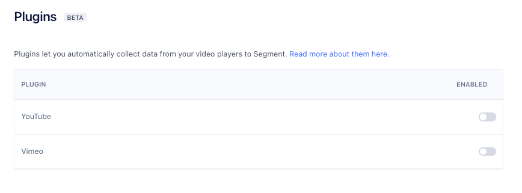

With the analytics.js YouTube Plugin you can collect YouTube player events into the Segment ecosystem.

The Segment YouTube Plugin uses the following Google APIs:
- [YouTube IFrame player API](https://developers.google.com/youtube/iframe_api_reference#Getting_Started){:target="_blank”}: Controls the video (play, pause, stop).
- [Data API](https://developers.google.com/youtube/v3/getting-started){:target="_blank”}: Accesses metadata about the video in the iFrame.

## Prerequisites

To begin, create a new project in the Google Developer Console, then create a new API key in that project. You can read more about this process in the YouTube documentation on [registering an application](https://developers.google.com/youtube/registering_an_application){:target="_blank”}. 

> note "Secure your API keys"
> You can [secure your API keys](https://cloud.google.com/docs/authentication/api-keys#securing){:target="_blank”} by adding API key restrictions, deleting unused API keys, and periodically rotating your keys. 

## Getting Started

After you've generated the API key:

1. Enable a new plugin.
- Navigate to **Connections > Sources** and choose the source you want to connect the YouTube plugin to. Go to the **Settings** tab of your source and select **Plugins**. You can enable the YouTube plugin from this menu:

    

    **Note:** Only JavaScript sources support plugins.

2. Initialize the plugin by giving it access to the YouTube video player instance(s) running on your page. This can be done by adding this script,  <script src="https://www.youtube.com/iframe_api"></script> to the section of the source code where the page loads.
- Use the initialize method in the YouTube `onYouTubeIframeAPIReady()` function to register and initialize the plugin with the player instance and your API key:

```js
var player;
      function onYouTubeIframeAPIReady() {
              player = new YT.Player('player', {
              height: '390',
              width: '640',
              videoId: 'M7lc1UVf-VE'
        });
	      analytics.ready(function () {
    var ytAnalytics = new window.analytics.plugins.YouTubeAnalytics(player, 'XXXXXXXXXXXXXXXXXXXXXXXXXXXX0365')
   ytAnalytics.initialize()
      })}
```

The plugin listens to the YouTube player for events, and fires the corresponding [Segment Video Spec](/docs/connections/spec/video/) events on analytics.js.

## Supported Events
The plugin tracks the following [Segment Video Spec](/docs/connections/spec/video/) events:

Event | Details
----- | -------
Video Playback Started | When a user presses Play; after the last user action required for playback to begin. For example, after user login/authentication. <br><br> - If playing a single video, this fires when the video starts. <br> - If playing a playlist, this fires when the first video in the playlist starts.
Video Playback Completed | When playback is complete and when the session finishes. <br><br>- If playing a single video, this fires when the video finishes. <br>- If playing a playlist, this event fires when the final video in the playlist finishes.
Video Playback Paused/Resumed | When the user resumes playback after pausing.
Video Playback Buffer Started/Completed | When playback starts and finishes buffering content or an ad.
Video Playback Seek Started/Completed | When a user manually seeks a certain position of the content or ad in the playback.
Video Content Started/Completed | When a video content segment starts and completes playing within a playback. <br><br>- If playing a playlist, these events get fired for each individual video.

## Supported Properties
The plugin automatically attaches the following [Segment Video Spec](/docs/connections/spec/video/) to the above events:

**'Playback' Events**
- Total Length
- Position
- Quality
- Video Player
- Sound

**'Content' Events**
- Title
- Description
- Keywords
- Channel
- Airdate
- Duration
