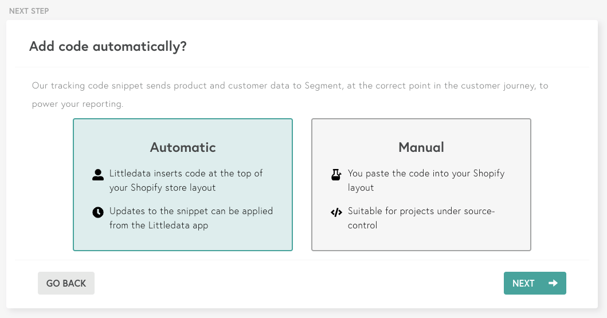

<!-- LR Note: the working copy of the source catalog YML we built on showed this in the `website` source though as of Nov 18 it's labeled cloud-source -->

Littledata is a smart analytics app that automates e-commerce tracking. Littledata's [Shopify-to-Segment connection](https://blog.littledata.io/help/posts/segment-overview/?utm_source=segmentio&utm_medium=docs&utm_campaign=partners) automatically tracks key e-commerce events on a Shopify or Shopify Plus store, so you can use Shopify as a source in your Segment workspace.

Littledata is available as an independent [Shopify App](https://apps.shopify.com/segment-com-by-littledata). When you install the Littledata app on your store, Littledata does two things:

1. It inserts a smart tracking script to your store's front end. You can use this script with any Shopify site, and uses Analytics.js under the hood to send data in a spec-compliant manner to Segment.

2. The app also sets up server-side webhook forwarding to ensure 100% accuracy of important Customer and Order data.

Here's an architecture diagram that shows how the Littledata app mediates data flow between Shopify and Segment.

> warning "Note"
> This integration is maintained by Littledata _and is not supported by Segment directly_. The Littledata app has been reviewed by the Segment team for conformance with Segment's [E-Commerce Spec](/docs/connections/spec/ecommerce/v2/), and is the recommended way of using Segment with Shopify. However, it does require a paid subscription with Littledata, who mediates the connection between Shopify and Segment. [Contact the Littledata Support team](mailto:support@littledata.io) with any questions.

## Getting Started

1. **Login** to your Shopify Store account.
2. Go the [Shopify app store listing](https://apps.shopify.com/segment-com-by-littledata) for **_Segment.com by Littledata_**.
   
3. Click **Add app** to begin the installation process.
4. **Sign up** for a Littledata account using an email address, Google login or Facebook login. _More team members can be added to the subscription after completing the installation process._
5. Add the [**Segment write key**](/docs/connections/find-writekey/) for the source that is going to send data in the **input field**.
   
6. Choose either an **Automatic** or a **Manual** install. _Automatic installs work in most instances, but if you choose to do a manual install, just follow [this guide](https://blog.littledata.io/help/posts/segment-installation-guide/)._
   
7. Segment's **analytics.js** library, Littledata **tracking script** and **webhooks** will be automatically applied to the store and the installation process will then be complete.
   

## Device-mode Events

Below is a table of events that **Shopify by Littledata** sends to Segment through the analytics.js library. These events will show up as tables in your warehouse, and as regular events in your other Destinations supporting device-mode.

| Event Name            | Description                                                         |
| --------------------- | ------------------------------------------------------------------- |
| Cart Viewed           | A user has viewed the /cart page                                    |
| Page Viewed           | A user has viewed any page                                          |
| Product Clicked       | A user has clicked a product within a product list                  |
| Product Image Clicked | A user has clicked a product image                                  |
| Product List Viewed   | A user has viewed a product as they scroll down the collection page |
| Product Shared        | A user has shared a product through social links                    |
| Product Viewed        | A user has viewed a product page                                    |
| Products Searched     | A user has searched for products (with search `query`)              |
| Registration Viewed   | A user has viewed the /account/register page                        |
| Thank you Page Viewed | A user has viewed the thank you page after completing an order \*   |

> info "" \* This is less reliable than the de-duplicated `Order Completed` event sent from the Littledata servers, but you can use it in device-mode destinations to trigger a conversion. The `payment_method` and `shipping_method` properties are not available with this event.

## Cloud-mode Events

Below is a table of events that **Shopify by Littledata** sends to Segment from Littledata's servers. These events appear as tables in your warehouse, and as regular events in your other Destinations that support cloud-mode. They include the `anonymousId` that links them to the device-mode events where the event was part of a previous user session, or associated with a `userId` that was previously linked with an `anonymousId`. See Littledata's [troubleshooting guide on attribution](https://blog.littledata.io/help/posts/troubleshooting-marketing-attribution-for-shopify/) for more details.

| Event Name               | Description                                                                                                                                                                                 |
| ------------------------ | ------------------------------------------------------------------------------------------------------------------------------------------------------------------------------------------- |
| Checkout Started         | A user has started checkout                                                                                                                                                                 |
| Checkout Step Completed  | A user has completed a step in the checkout                                                                                                                                                 |
| Coupon Applied           | Sent with Checkout Step Completed or Order Completed when user has applied a coupon                                                                                                         |
| Customer Created         | User added as a customer                                                                                                                                                                    |
| Customer Enabled (v2)    | A user has confirmed their email address and created a Shopify customer account with verified_email set as true                                                                             |
| Fulfillment Created (v2) | An order fulfillment status has changed (including status, tracking_numbers and tracking_urls where the shipping integration allows)                                                        |
| Fulfillment Updated (v2) | An order fulfillment status has changed (including status, tracking_numbers and tracking_urls where the shipping integration allows)                                                        |
| Order Cancelled (v2)     | An admin has cancelled an order (including the cancel_reason)                                                                                                                               |
| Order Completed          | A prospect has completed an order                                                                                                                                                           |
| Order Refunded           | An order has been refunded                                                                                                                                                                  |
| POS Order Placed (v2)    | A user has placed an order through Shopify POS                                                                                                                                              |
| Payment Failure (v2)     | A user completed checkout step 3 but the payment method failed (for example, the card details were valid but the [charge did not succeed(https://stripe.com/docs/testing#cards-responses)]) |
| Payment Info Entered     | A user has entered payment info                                                                                                                                                             |
| Product Added            | A user has added a product to the cart, and left it in the cart for more than 10 seconds                                                                                                    |
| Product Removed          | A user has removed a product from the cart                                                                                                                                                  |

## User Identity

In the Littledata application you can choose which of the following fields you want to send as the `userId` for known customers:

- **Shopify customer ID** (default) - Recommended if you have a simple Shopify setup with minimal integrations.
- **Hashed email** - The MD5 email hash is useful if you have other marketing platforms sending traffic where you know the email of the visitor (e.g. email marketing like Bronto or Marketo), but not their Shopify customer ID.
- **Email** - The email identifier is recommended when other platforms use the email and can’t hash it, and you are comfortable with the privacy implications.
- **None** (no identifier) - Choose “none” if user identity is already handled by your Segment implementation and you only need the extra events powered by Littledata's Shopify source.

For [Segment Personas](/docs/personas/) we also send `shopify_customer_id` as an [externalID](/docs/personas/identity-resolution/externalids/) for advanced matching.

## Identify Calls

For every event where there is an identifiable Shopify customer (from both the device-mode and cloud-mode) Littledata also sends an Identify call. This happens when the customer logs into the storefront, on the last step of the checkout, with the order, and also after purchase with any customer update in Shopify admin.

The following traits are included with an Identify call:

| Property Name           | Description                                                                                                                | Property Type |
| ----------------------- | -------------------------------------------------------------------------------------------------------------------------- | ------------- |
| `address`               | The customer's primary address                                                                                             | String        |
| `createdAt`             | The date customer record was created                                                                                       | Date          |
| `customerLifetimeValue` | The total spend of customer on the Shopify store                                                                           | Double        |
| `description`           | The customer notes                                                                                                         | String        |
| `email`                 | The customer's email address                                                                                               | String        |
| `firstName`             | The customer's first name                                                                                                  | String        |
| `lastName`              | The customer's email                                                                                                       | String        |
| `marketingOptIn`        | The `marketing_opt_in` field from [Shopify customer](https://shopify.dev/docs/admin-api/rest/reference/customers/customer) | String        |
| `phone`                 | The customer's phone number                                                                                                | String        |
| `purchaseCount`         | The number of orders by this customer                                                                                      | Integer       |
| `state`                 | Whether the customer account is enabled or disabled                                                                        | String        |
| `tags`                  | The custom tags [applied to the customer](https://shopify.dev/docs/admin-api/rest/reference/customers/customer)            | String        |
| `userId`                | Chosen user identifier, defaulting to Shopify Customer ID                                                                  | Double        |
| `verified_email` (v2)   | Whether the customer has verified their email                                                                              | Boolean       |

## Support for Google Analytics destination

All events (device-mode and cloud-mode) contain the Google Analytics `clientId` field where known. This allows the [Google Analytics destination](/docs/connections/destinations/catalog/google-analytics/#supported-sources-and-connection-modes) to be configured in cloud-mode only, so all client side events are relayed via Segment's servers - reducing the scripts needed on your website.

## Support for email marketing destinations

Email marketing platforms such as [Klaviyo](/docs/connections/destinations/catalog/klaviyo/#server-side-track), [Iterable](/docs/connections/destinations/catalog/iterable/#track) and [Hubspot](/docs/connections/destinations/catalog/hubspot/#server) require an email property with any server-side event in order to associate events with a customer (they cannot use an `anonymousId`). Littledata adds that `email` property whenever an email address is set in the user `traits()` object (in device-mode) or from the Shopify customer record (in cloud-mode). Iterable can also [receive cookie values](#cookiesToTrack) with the Order Completed event.

## Alias Calls

To support seamless customer tracking the [Mixpanel](/docs/connections/destinations/catalog/mixpanel/#alias), [Vero](/docs/connections/destinations/catalog/vero/#alias) and [KISSMetrics](/docs/connections/destinations/catalog/kissmetrics/#alias) destinations, Littledata ensures the pre-checkout `anonymousId` is added as an alias of the `userId` (used from checkout step 2 onwards).

## Subscription Events

Additional events available through Littledata's [ReCharge connection](https://www.littledata.io/connections/recharge), and available in cloud-mode destinations.

| Event Name               | Description                                                                                                 |
| ------------------------ | ----------------------------------------------------------------------------------------------------------- |
| Charge Failed            | A recurring charge failed (with `error_type`)                                                               |
| Charge Max Tries Reached | The maximum tries to charge customer is reached                                                             |
| Order Processed          | A recurring order is processed                                                                              |
| Payment Method Updated   | A customer has updated the payment method                                                                   |
| Subscription Cancelled   | A customer has cancelled a subscription (with `cancellation_reason` and `cancellation_reason_comments`)     |
| Subscription Created     | A customer has created a subscription (with `status`, `order_interval_frequency` and `order_interval_unit`) |
| Subscription Updated     | A customer has updated a subscription (with `status`, `order_interval_frequency` and `order_interval_unit`) |

## Event Properties

The list below outlines the properties included in the events listed above.

| Property                               | Description                                                                                        | Property Type |
| -------------------------------------- | -------------------------------------------------------------------------------------------------- | ------------- |
| `affiliation`                          | A comma-seperated list of order tags. Untagged orders use `Shopify`                                | String        |
| `cart_id`                              | The ID of the Shopify cart                                                                         | String        |
| `checkoutId`                           | The ID of the checkout session                                                                     | String        |
| `context.uip`                          | The user's IP address                                                                              | String        |
| `context['Google Analytics'].clientId` | The user's Google Analytics Client ID                                                              | String        |
| `context['Google Analytics'].geoid`    | The user's location                                                                                | String        |
| `coupon`                               | Comma-separated string of discount coupons used, if applicable                                     | String        |
| `currency`                             | The currency of the order                                                                          | String        |
| `discount`                             | The discounted amount                                                                              | Float         |
| `email`                                | Shopify email address, or email submitted on a storefront form                                     | String        |
| `order_id`                             | The ID of the order                                                                                | String        |
| `payment_method`                       | The payment method chosen for checkout                                                             | String        |
| `presentment_currency`                 | The user's local currency                                                                          | String        |
| `presentment_total`                    | The order total in local currency                                                                  | String        |
| `products`                             | A list of all the product at that step of the funnel                                               | Array         |
| `revenue`                              | Product revenue (excluding discounts, shipping and tax) \*                                         | Float         |
| `sent_from`                            | A unique property to identify events sent by Littledata                                            | String        |
| `shipping_method`                      | The shipping method chosen for checkout                                                            | String        |
| `shipping`                             | The shipping cost                                                                                  | Float         |
| `step`                                 | The checkout [step number](https://blog.littledata.io/help/posts/shopify-checkout-funnel-updates/) | Integer       |
| `subscription_revenue`                 | The revenue associated with a [Subscription Event](#subscription-events)                           | Float         |
| `subtotal`                             | Order total after discounts but before taxes and shipping                                          | Float         |
| `tax`                                  | The amount of tax on the order                                                                     | Float         |
| `total`                                | The total value of the order                                                                       | Float         |
| `userId`                               | Chosen user identifier, defaulting to Shopify Customer ID                                          | String        |

\* `revenue` is available only with the Order Completed event, and only if the store opts in via the Littledata application. Revenue is a reserved property in many Segment destinations. Opting in will override the `total` property sent to Google Analytics.

## Product Properties

Each item in the `products` array, or Product Viewed and Product Added events, will have the following properties

| Property             | Description                                                        | Property Type |
| -------------------- | ------------------------------------------------------------------ | ------------- |
| `brand`              | The brand of the product (Shopify `vendor`)                        | String        |
| `category`           | The category of the product (defaults to `all`)                    | String        |
| `compare_at_price`   | The product price before any discount                              | String        |
| `image_url`          | The URL of the first product image                                 | String        |
| `list_id`            | The ID of the product collection (for List Views and Clicks)       | String        |
| `list_position`      | The product position in the collection (for List Views and Clicks) | Integer       |
| `name`               | The product name                                                   | String        |
| `price`              | The product price                                                  | Float         |
| `product_id`         | Shopify product ID                                                 | String        |
| `quantity`           | The quantity of products                                           | Integer       |
| `shopify_product_id` | Also Shopify product ID                                            | String        |
| `shopify_variant_id` | The Shopify variant ID                                             | String        |
| `sku`                | The product SKU                                                    | String        |
| `url`                | The URL of the product page                                        | String        |
| `variant`            | The product variant name                                           | String        |

## Import all orders

With a [Littledata Plus plan](https://www.littledata.io/app/enterprise) you can import all Shopify orders and refunds from before you started using Segment, to sync with destinations that support timestamped events (for example, a data warehouse). This enables you to build a complete customer history in your chosen destination.

## Advanced Device-mode Settings

You can edit the LittledataLayer object in your Shopify theme to manually change these advanced settings. For more information, see the [Shopify tracker GitHub repository](https://github.com/littledata/shopify-tracker#segment-configuration).

### cookiesToTrack

You can send any cookie set on a landing page (for example, a session identifier or marketing campaign name) to Segment with an Identify call. A common use is to pass Iterable `campaignId` and `templateId` through to the [Order Completed event](https://support.iterable.com/hc/en-us/articles/204795719-Sending-Data-from-Segment-to-Iterable-#order-completed).

### CDNForAnalyticsJS

If you have a [proxy CDN setup](/docs/connections/sources/catalog/libraries/website/javascript/custom-proxy/) to load Segment's AnalyticsJS library from your own domain, you can specify it here.
